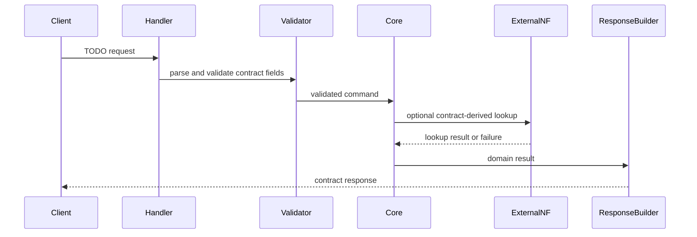

# {{NF}} Request Flow

## Purpose

본 문서는 inbound request 가 module 을 통과하는 정상 sequence 와 실패 sequence 를 정의한다.

## Inputs (contract)

- TODO: contract API matrix 의 method, path, auth scope, request schema, response schema 를 적는다.
- TODO: error-handling contract 의 status code 와 cause mapping 을 적는다.

## Boundaries

- 본 문서는 처리 *순서* 와 module 간 호출 경계만 다룬다.
- module 내부 알고리즘은 `module-decomposition/<Module>.md` 가 다룬다.
- 동시성·격리는 `runtime-model.md` 가 다룬다.

## Decisions

정상 sequence.

실패 sequence.

- TODO: invalid query 또는 schema violation 이 어떤 module 에서 ProblemDetails 로 변환되는지 적는다.
- TODO: external NF failure 가 retry, fallback, terminal error 중 무엇으로 분류되는지 적는다.

## Open Questions

| choice | status | constraint |
| --- | --- | --- |
| sync vs async handler model | TBD | externally visible API semantics 를 바꾸지 않는다. |
| timeout budget split | TBD | contract 의 timeout/retry guidance 와 충돌하지 않는다. |
| serialization library | TBD | OpenAPI schema 와 ProblemDetails shape 를 보존한다. |

## References

- `{{contract_path}}` — contract handoff.
- `module-boundaries.md`, `runtime-model.md`, `error-propagation.md`.
- TODO: 인용 spec clause (procedure stage 2 등) 를 적는다.
