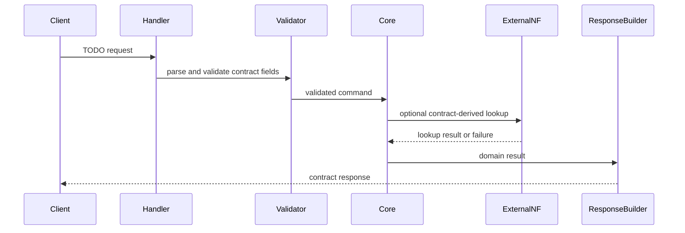

# {{NF}} Request Flow

## Spec-derived constraints

- TODO: contract API matrix 의 method, path, auth scope, request schema, response schema 를 적는다.
- TODO: error-handling contract 의 status code 와 cause mapping 을 적는다.

## Main sequence

## Failure sequence

- TODO: invalid query 또는 schema violation 이 어떤 module 에서 ProblemDetails 로 변환되는지 적는다.
- TODO: external NF failure 가 retry, fallback, or terminal error 중 무엇으로 분류되는지 적는다.

## Implementation choices

| choice | status | constraint |
| --- | --- | --- |
| sync vs async handler model | TBD | externally visible API semantics 를 바꾸지 않는다. |
| timeout budget split | TBD | contract 의 timeout/retry guidance 와 충돌하지 않는다. |
| serialization library | TBD | OpenAPI schema 와 ProblemDetails shape 를 보존한다. |
