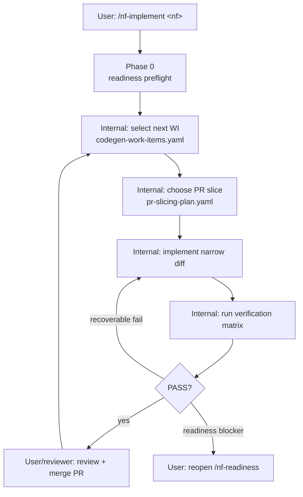

# 5gc-impl-kb onboarding

이 repo 는 3GPP spec 을 NF 구현용 **knowledge base** 로 변환한다. 사람은 원본 spec 을 준비하고, `/nf-readiness <nf>` 로 KB 를 만들고, `/nf-implement <nf>` 로 구현을 시작한다.

## 1. 사람 workflow

```text
specs/ 준비
  ↓
/nf-readiness <nf>
  ↓
readiness_pack_ready PASS
  ↓
/nf-implement <nf>
```

사람이 평소 직접 호출하는 skill 은 두 개다.

| skill | 언제 호출 | 결과 |
|---|---|---|
| `/nf-readiness <nf>` | 새 NF 또는 spec/계약 변경 후 구현 준비성을 만들 때 | NF별 implementation KB/readiness pack + `readiness_pack_ready` 판정 |
| `/nf-implement <nf>` | `readiness_pack_ready PASS` 후 실제 구현을 시작할 때 | Phase 1 tracer-bullet 부터 Phase 5 hardening 까지 구현 진행 |

세부 skill (`/nf-spec-discover`, `/nf-contract-build`, `/nf-arch-design`, `/nf-impl-plan`, `/nf-eng-design` 등) 은 내부 subroutine 이다. 직접 호출은 새 계약이 필요할 때만 허용한다.

## 2. Fresh clone 에서 필요한 필수 입력

clean checkout 에서 사람이 준비해야 하는 것은 원본 spec 뿐이다.

```text
specs/<spec-number>/
  *.docx    # 3GPP normative text
  *.yaml    # OpenAPI YAML, 있으면 contract/data-model 추출 입력
```

NSSF 예시.

```text
specs/29.531/TS29531_Nnssf_NSSelection.yaml
specs/29.531/TS29531_Nnssf_NSSAIAvailability.yaml
specs/29.531/<29.531 docx>
```

필수 source file 과 generated/cache file 구분은 [`docs/artifact-management.md`](./docs/artifact-management.md) 를 따른다.
전체 파일 관계도와 lifecycle diagram 은 [`docs/workflow-diagrams.md`](./docs/workflow-diagrams.md) 를 먼저 보면 빠르게 파악할 수 있다.

## 3. `/nf-readiness` 내부 흐름

`/nf-readiness <nf>` 는 아래 subroutine 을 순차 실행한다. 실패하면 첫 blocking gate 에서 멈추고 `to_pass` 를 보고한다.

| 순서 | 내부 skill/script | 목적 | 주요 산출 | gate |
|---|---|---|---|---|
| 0 | `nf-readiness-resolve.py`, `nf-registry-bootstrap.py` | NF → primary spec resolve | `design/nf-registry.yaml` | confidence high 또는 manual override |
| 1 | `/nf-spec-discover` | manifest/seed 생성 | `design/<nf>/_manifest.yaml`, `_contract_seed.yaml` | specs ready |
| 2 | `/nf-contract-build` | contract topic + handoff 생성 | `design/<nf>/contract/**`, `handoff/<nf>/contract.yaml` | basic extraction |
| 3 | `/nf-contract-check` | contract 구현 가능성 검사 | `design/<nf>/_contract_status.yaml` | `handoff_ready`, `contract_implementable` |
| 4 | `/nf-arch-design` | architecture/module KB 생성 | `design/<nf>/architecture/**`, `module-decomposition/**` | - |
| 5 | `/nf-arch-status` | architecture 정합성 검사 | `design/<nf>/_arch_status.yaml` | `arch_consistent` |
| 6 | `/nf-impl-plan` | implementation readiness pack 생성 | `dev/<nf>/` KB files | - |
| 7 | `/nf-impl-status` | codegen 준비성 검사 | `dev/<nf>/_impl_status.yaml` | `impl_ready_for_codegen` |
| 8 | `/nf-eng-design` | library/DB/runtime/tool 결정 freeze | `engineering/<nf>/engineering-design.md` | - |
| 9 | `/nf-eng-status` | engineering freeze 검사 | `engineering/<nf>/_engineering_status.yaml` | `eng_frozen` |
| 10 | `nf-readiness-status.py` | aggregate readiness 계산 | `dev/<nf>/_readiness_status.yaml` | `readiness_pack_ready` |
| 10.5 | reviewed PR / `/nf-implement` preflight | 자율 구현 제어·dependency/config/codegen/test 준비 | execution-control + autonomous-prep pack | drift/preflight evidence |

`readiness_pack_ready` 가 PASS 해야 `/nf-implement` 가 시작된다.

각 단계의 *파일별 목적·reader·tracking* 상세는 [`docs/lifecycle-artifacts.md`](./docs/lifecycle-artifacts.md) catalog 를 참고한다 (HTML mirror: [`lifecycle-artifacts.html`](./docs/lifecycle-artifacts.html)).

## 4. KB 산출물 독해 순서

### 구현 agent

1. `dev/<nf>/agent-execution-plan.yaml` — agent lane, write scope, resume rule.
2. `dev/<nf>/pr-slicing-plan.yaml` — PR 단위 작업 순서와 review boundary.
3. `dev/<nf>/verification-matrix.yaml` — work item 별 required evidence.
4. `dev/<nf>/codegen-work-items.yaml` — 작업 그래프와 파일 단위 구현 queue.
5. `dev/<nf>/api-implementation-matrix.md` — operation/handler/test/persistence mapping.
6. `dev/<nf>/data-model-implementation-map.md` — generated/wrapper/handwritten classification.
7. `engineering/<nf>/engineering-design.md`, `dependency-decisions.yaml` — library/DB/runtime/tool/operator boundary 결정.
8. `dev/<nf>/cmake-dependencies.yaml`, `conf/*.yaml|*.ini`, `operator-inputs.yaml` — build dependency, runtime config, operator-provided values.
9. `infra/<nf>/codegen/*.yaml`, `src/<nf>/generated/GENERATION_MANIFEST.yaml` — generator config, drift allowlist, generated boundary.
10. `tests/<nf>/fixtures/manifest.yaml`, `tests/<nf>/golden/*.json`, `dev/<nf>/error-cause-catalog.yaml` — test data와 error mapping.
11. `design/<nf>/architecture/**`, `module-decomposition/**` — flow/state/error/module 책임.
12. `dev/<nf>/verification-plan.md`, `failure-recovery.md` — gate 별 evidence 와 실패 복구.
13. `dev/<nf>/open-gaps-and-assumptions.md` — blocker 0 확인, non-blocker 조건 확인.

### 사람 reviewer

1. `dev/<nf>/implementation-readiness-review.md` — executive GO/NO-GO summary.
2. `dev/<nf>/design-adequacy-checklist.md` — 사람이 확인할 설계 적정성 checklist.
3. `dev/<nf>/spec-to-design-coverage.md` — spec→contract→design→task trace, spec reread 금지 확인.
4. `dev/<nf>/open-gaps-and-assumptions.md` — 운영 입력/assumption/deferred/test-gap 분류.
5. Status cache (`_*_status.yaml`) 는 참고용이며 source of truth 가 아니다.

## 5. `/nf-implement` 입력, 내부 cycle, 금지사항

`/nf-implement <nf>` 는 Phase 0 에서 `readiness_pack_ready PASS` 를 다시 확인한다. 이후 `dev/<nf>/codegen-work-items.yaml` 를 기준으로 Phase 1~5 를 진행하되, 실제 자율 코드 작업은 execution-control pack 과 autonomous-prep pack 을 함께 읽어 PR slicing, dependency/config, codegen drift, test fixture, failure recovery 를 결정한다.

`/nf-readiness` 가 내부 lifecycle skill pipeline 이라면, `/nf-implement` 는 **Phase → Work Item(WI) → PR slice → verification evidence** cycle 이다.



대표 Phase/WI 예시.

| Phase | 내부 단위 예시 | 성격 |
|---|---|---|
| Phase 0 | readiness preflight | `readiness_pack_ready` 재확인 |
| Phase 1 | `WI-tracer-bullet-toolchain`, dependency prep, `WI-codegen-bootstrap` | toolchain, generated model, first vertical slice |
| Phase 2 | availability repository/API WIs | NSSAI Availability flow |
| Phase 3 | subscription store/notification WIs | subscription + callback + persistence |
| Phase 4 | TLS/OAuth2/NRF/integration WIs | production-capable integration |
| Phase 5 | observability/perf/hardening WIs | 운영성/품질 강화 |

금지.

- 원본 OpenAPI/spec 을 구현 의미 재발견 용도로 다시 읽기.
- readiness pack 의 blocker 를 무시하고 코드 생성 시작.
- TLS/X.509/JWT primitive 직접 구현.
- local cache/status 를 사람이 source of truth 로 편집.

허용.

- OpenAPI YAML 을 generator input 으로 사용.
- 원본 spec 을 source trace/drift 확인 용도로만 확인.
- operator-provided 값(cert, DSN, JWKS endpoint 등)을 runtime config gap 으로 두고 구현 capability 를 먼저 만들기.

## 6. 파일 관리 핵심

- `specs/` 원본과 tracked KB 산출은 보존한다.
- `design/<nf>/_*.yaml`, `design/<nf>/contract/**`, `handoff/<nf>/contract.yaml`, `_*_status.yaml` 는 재생성 가능한 local cache 다.
- `dev/<nf>/` 의 readiness pack, execution-control pack, autonomous-prep pack 은 NF 구현 KB 이며 git 추적 대상이다.
- `infra/<nf>/codegen/**`, `infra/<nf>/migrations/**`, `src/<nf>/generated/GENERATION_MANIFEST.yaml`, `tests/<nf>/fixtures/**`, `tests/<nf>/golden/**` 는 `/nf-implement` 가 소비하는 tracked prep/implementation-support 산출물이다.
- `docs/plans/**`, `docs/retros/**` 는 history 이며 현재 workflow source of truth 가 아니다.
