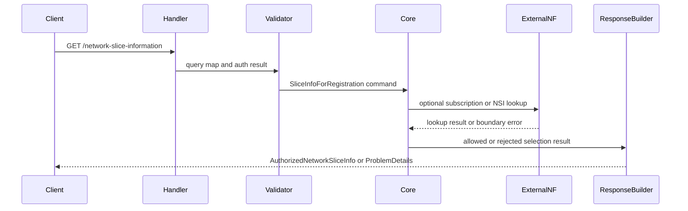

# NSSF Request Flow

## Spec-derived constraints

- Main operation 은 `GET /network-slice-information` 이다.
- Required query 는 `nf-type`, `nf-id`, `tai` 와 registration slice info path 이다.
- 성공 응답은 HTTP 200 과 `AuthorizedNetworkSliceInfo` 이다.
- client-correctable input error 는 HTTP 400 과 `INVALID_QUERY_PARAM` 으로 매핑한다.
- authorization 또는 policy 거부는 HTTP 403 과 `UNAUTHORIZED_NSSAI` 로 매핑한다.
- slice instance 부재는 HTTP 404 와 `NSSAI_NOT_AVAILABLE` 로 매핑한다.

## Main sequence

## Failure sequence

- Query 누락 또는 schema violation 은 Validator 에서 400 ProblemDetails 로 변환한다.
- requested NSSAI 가 subscribed or PLMN policy 와 맞지 않으면 Core 가 403 후보를 반환한다.
- 허용 가능한 slice 는 있지만 NSI instance 가 없으면 Core 가 404 후보를 반환한다.
- 외부 NF lookup 실패는 ExternalNF Gateway 에서 retryable boundary error 로 표준화한 뒤 Response Builder 에서 500 후보로 변환한다.

## Implementation choices

| choice | status | constraint |
| --- | --- | --- |
| sync vs async handler model | TBD | externally visible API semantics 를 바꾸지 않는다. |
| timeout budget split | TBD | server target 과 external NF call budget 을 분리해야 한다. |
| serialization library | TBD | OpenAPI schema 와 ProblemDetails shape 를 보존한다. |
