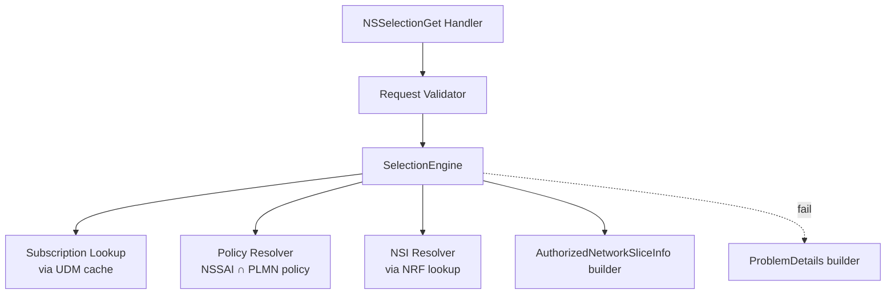

# module-decomposition/SelectionEngine

NSSF NSSelectionGet 처리의 *내부 분해*. spec 강제 아님 — 사람이 정한 분해 의도 (`spec_refs: []`).

## Module Graph

<!-- AUTO:module-graph:start -->

<!-- AUTO:module-graph:end -->

## 책임 분배

<!-- USER:responsibility-prose:start -->
- **Handler** — HTTP 진입, OAuth 검증, query 파싱·역직렬화. 비즈니스 로직 안 함.
- **Request Validator** — 필수 query (nf-type/nf-id/tai/slice-info-request-for-registration) 존재·형식 검증. 위반 시 400.
- **SelectionEngine** — 순수 함수 같은 핵심 — (SliceInfoForRegistration, UE context) → AuthorizedNetworkSliceInfo. 내부적으로 SubscriptionLookup, PolicyResolver, NsiResolver 를 차례로 호출.
- **Subscription Lookup** — UE 의 subscribed NSSAI 캐시 확인, 없으면 UDM 호출. 본 MVP 는 UDM 호출 skeleton 만 (실제 client 는 cross-NF MVP 범위 밖).
- **Policy Resolver** — `requested ∩ subscribed ∩ PLMN policy` 계산. 거부된 항목은 rejectedNssai 로 넘김.
- **NSI Resolver** — 허용된 slice 각각에 NSI instance 조회. 본 MVP 는 stub — 후속 사이클에서 NRF client 실제 호출.
- **Response Builder** — 정상 경로의 AuthorizedNetworkSliceInfo 직렬화 (200).
- **ProblemDetails Builder** — 400/403/404 응답 본문.
<!-- USER:responsibility-prose:end -->

## Implementation Notes

<!-- USER:implementation-notes:start -->
- 본 분해는 *NSSelectionGet 1 API 한정*. NSSelectionPost 등 다른 operation 추가 시 SelectionEngine 의 위치·이름이 바뀔 수 있음 (그 시점에 본 토픽 갱신 + scope 재정의).
- 라이브러리 경계는 dev agent 의 `may_decide`. 본 토픽은 *논리적 책임 분배* 만 기술한다.
- 테스트 — SelectionEngine 은 순수 함수에 가까우므로 unit test 우선. Handler/Validator 는 integration test.
<!-- USER:implementation-notes:end -->
