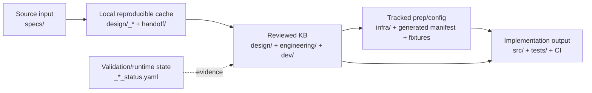

# Artifact management

이 문서는 clean checkout 에서 KB 를 다시 구축할 때 필요한 필수 파일, skill 이 재생성하는 산출물, git 추적 정책을 구분한다.

파일 관계를 그림으로 먼저 보려면 [`workflow-diagrams.md`](./workflow-diagrams.md) 를 참고한다.

## 1. Artifact classes



| class | 정의 | git 정책 | 예시 |
|---|---|---|---|
| Source input | 사람이 외부에서 확보해 넣는 원본 spec/API | 추적 | `specs/29.531/*.docx`, `specs/29.531/TS29531_*.yaml` |
| Tool source | lifecycle script, schema, skill, test | 추적 | `design/scripts/*`, `.claude/skills/*`, `tests/*` |
| Registry | NF routing catalog | 추적 | `design/nf-registry.yaml` |
| Local reproducible artifact | source input + tool 로 재생성 가능한 cache | 비추적 | `design/<nf>/_manifest.yaml`, `design/<nf>/contract/**`, `handoff/<nf>/contract.yaml` |
| Reviewed KB artifact | 다음 단계 source of truth 로 review/ratify 되는 산출 | 추적 | `design/<nf>/architecture/**`, `engineering/<nf>/engineering-design.md`, `dev/<nf>/*` readiness pack |
| Tracked prep/config artifact | `/nf-implement` 가 코드 생성 전후에 소비하는 dependency/config/codegen/test 준비 산출 | 추적 | `engineering/<nf>/dependency-decisions.yaml`, `infra/<nf>/codegen/*.yaml`, `tests/<nf>/golden/*.json` |
| Validation/runtime state | gate 측정 결과, run state, cache | 비추적 | `_*_status.yaml`, `dev/<nf>/_implementation_run_state.yaml`, `.omx/*`, `.pytest_cache/` |
| Decision/policy | 반복 적용되는 프로젝트 결정 | 추적 | `docs/adr/*`, `CONTEXT.md`, `README.md`, `ONBOARDING.md` |
| History | 완료/진행 이력 | 추적 가능, 현재 source of truth 아님 | `docs/plans/**`, `docs/retros/**`, `docs/handover.md` |

핵심: **자동 생성 여부와 git 추적 여부는 다르다.** `dev/<nf>/codegen-work-items.yaml` 은 skill 이 만들지만 reviewed KB 이므로 추적한다. `_manifest.yaml` 은 중요하지만 cache 이므로 비추적한다.

## 2. Clean rebuild minimal inputs

새 NF 를 clean 상태에서 시작할 때 필수 입력은 다음뿐이다.

```text
specs/<primary-spec>/*.yaml   # OpenAPI extraction input
specs/<primary-spec>/*.docx   # normative/source trace input
```

지원 spec 은 OpenAPI `$ref`, common data, cross-NF trace 가 필요할 때 추가한다. 33.501/33.310/33.210 같은 project security/profile 결론은 `ADR-0004` 가 흡수하며 NF별 lifecycle dependency 로 계속 추가하지 않는다.

`design/nf-registry.yaml` 은 git tracked catalog 다. bootstrap tool 이 `generated.nfs` 를 갱신하고, 사람은 `manual_overrides` 만 편집한다.

## 3. Lifecycle 생성 순서와 산출물

| 순서 | public/internal | skill/script | 입력 | 생성 산출 | class | gate |
|---|---|---|---|---|---|---|
| 0 | public wrapper | `/nf-readiness <nf>` Phase 0 | `design/nf-registry.yaml`, `specs/` | effective NF route | Registry/readiness resolve | confidence policy |
| 1 | internal | `/nf-spec-discover` | `specs/` | `design/<nf>/_manifest.yaml`, `_contract_seed.yaml` | Local reproducible | specs ready |
| 2 | internal | `/nf-contract-build` | manifest/seed/specs | `design/<nf>/contract/**`, `handoff/<nf>/contract.yaml` | Local reproducible | extraction basic |
| 3 | internal | `/nf-contract-check` | contract cache | `design/<nf>/_contract_status.yaml` | Validation state | `handoff_ready`, `contract_implementable` |
| 4 | internal | `/nf-arch-design` | handoff + contract | `design/<nf>/architecture/**`, `module-decomposition/**` | Reviewed KB | - |
| 5 | internal | `/nf-arch-status` | architecture KB | `design/<nf>/_arch_status.yaml` | Validation state | `arch_consistent` |
| 6 | internal | `/nf-impl-plan` | architecture + handoff + engineering inputs | `dev/<nf>/` readiness pack | Reviewed KB | - |
| 7 | internal | `/nf-impl-status` | `dev/<nf>/` | `dev/<nf>/_impl_status.yaml` | Validation state | `impl_ready_for_codegen` |
| 8 | internal | `/nf-eng-design` | architecture/dev/human tech decisions | `engineering/<nf>/engineering-design.md` | Reviewed KB | - |
| 9 | internal | `/nf-eng-status` | engineering design | `engineering/<nf>/_engineering_status.yaml` | Validation state | `eng_frozen` |
| 10 | public wrapper | `nf-readiness-status.py` | upstream status caches | `dev/<nf>/_readiness_status.yaml` | Validation state | `readiness_pack_ready` |
| 10.5 | reviewed PR / preflight | `/nf-implement` prep | readiness pack + engineering design | execution-control + autonomous-prep artifacts | Reviewed KB / tracked prep | drift/preflight evidence |
| 11 | public | `/nf-implement <nf>` | readiness pack | `src/`, generated code, SQL, tests, CI/runtime artifacts | Implementation output | `tracer_bullet_passed`, `full_nf_done` |

## 4. `dev/<nf>/` readiness pack

`dev/<nf>/` 는 코드 디렉터리가 아니라 NF 구현 KB 다.

### Legacy implementation-planning files

| 파일 | 역할 |
|---|---|
| `implementation-plan.md` | phase/scope/risk/reference overview |
| `tasks.yaml` | task graph (`impl-plan-v1`) |
| `test-matrix.md` | test inventory |
| `traceability.md` | contract→module→test trace |

### Agent Execution Pack

| 파일 | 역할 |
|---|---|
| `api-implementation-matrix.md` | 8 operation 단위 handler/model/security/persistence/test mapping |
| `data-model-implementation-map.md` | all contract data-model classification: generated/wrapper/handwritten/deferred |
| `codegen-work-items.yaml` | `/nf-implement` work queue, expected files, tests, verification commands |
| `team-execution-plan.md` | orchestrator/code/reviewer/tester/verifier lane 계약 |
| `verification-plan.md` | unit/integration/contract/security/e2e/observability gate |

### Execution Control Pack

`readiness_pack_ready PASS` 이후 `/nf-implement` 또는 team runtime 이 장기 작업을 안전하게 나누기 위해 읽는 tracked 산출물이다.

| 파일 | 생성 시점 | 역할 |
|---|---|---|
| `agent-execution-plan.yaml` | Stage 10.5 | agent lane, write scope, resume/checkpoint policy |
| `verification-matrix.yaml` | Stage 10.5 | work item 별 command/evidence/acceptance mapping |
| `pr-slicing-plan.yaml` | Stage 10.5 | PR 단위 slicing, dependency order, review boundary |

### Autonomous Implementation Prep Pack

실제 코드 작업 전 dependency/config/codegen/test 입력을 고정하는 tracked 보강 산출물이다. readiness gate 의 대체물이 아니라 PASS 된 readiness pack 을 실행 가능한 형태로 좁힌다.

| 파일 | 생성 시점 | 역할 |
|---|---|---|
| `engineering/<nf>/dependency-decisions.yaml` | Stage 10.5 | library stack ratify 의 machine-readable 보강 |
| `dev/<nf>/cmake-dependencies.yaml` | Stage 10.5 | CMake package/vendored dependency wiring |
| `dev/<nf>/conf/<nf>-config.schema.yaml` | Stage 10.5 | runtime config validation schema |
| `dev/<nf>/conf/<nf>.example.ini` | Stage 10.5 | local/dev config example |
| `dev/<nf>/operator-inputs.yaml` | Stage 10.5 | operator-provided values registry |
| `infra/<nf>/codegen/openapi-generator-cli.config.yaml` | Stage 10.5 | openapi-generator bootstrap config |
| `infra/<nf>/codegen/drift-allowlist.yaml` | Stage 10.5 | stub/generator drift allowlist |
| `src/<nf>/generated/GENERATION_MANIFEST.yaml` | Stage 10.5 | generated boundary manifest |
| `tests/<nf>/fixtures/manifest.yaml` | Stage 10.5 | fixture inventory |
| `tests/<nf>/golden/*.json` | Stage 10.5 | golden contract bodies |
| `dev/<nf>/error-cause-catalog.yaml` | Stage 10.5 | ProblemDetails / SBI cause mapping |
| `infra/<nf>/migrations/manifest.yaml` | Stage 10.5 | DB migration inventory |
| `dev/<nf>/failure-recovery.md` | Stage 10.5 | autonomous failure recovery runbook |

### Human Review Pack

| 파일 | 역할 |
|---|---|
| `implementation-readiness-review.md` | executive GO/NO-GO summary and risk |
| `design-adequacy-checklist.md` | reviewer checklist |
| `spec-to-design-coverage.md` | spec→design→task coverage and no-spec-reread audit |
| `open-gaps-and-assumptions.md` | blocker/deferred/operator/library/test/assumption classification |

`impl_ready_for_codegen PASS` 는 위 pack 의 구조와 traceability 를 검사한다. 내용의 사업적 타당성은 Human Review Pack 으로 사람이 확인한다.

## 5. Local cache/status files

다음 파일은 생성되어도 commit 하지 않는다.

```text
design/<nf>/_manifest.yaml
design/<nf>/_contract_seed.yaml
design/<nf>/contract/**
design/<nf>/_contract_status.yaml
design/<nf>/_arch_status.yaml
handoff/<nf>/contract.yaml
dev/<nf>/_impl_status.yaml
dev/<nf>/_readiness_status.yaml
dev/<nf>/_implementation_run_state.yaml
engineering/<nf>/_engineering_status.yaml
```

이 파일들은 gate evidence 또는 재생성 cache 다. 필요하면 해당 skill/script 를 다시 실행한다.

## 6. New file placement rules

| 새 파일 목적 | 위치 |
|---|---|
| 원본 spec/API | `specs/<spec>/` |
| NF routing/manual override | `design/nf-registry.yaml` |
| spec-derived contract cache | `design/<nf>/contract/` 또는 `handoff/<nf>/` |
| architecture/module KB | `design/<nf>/architecture/`, `design/<nf>/module-decomposition/` |
| implementation KB/readiness pack | `dev/<nf>/` |
| implementation execution control/prep | `dev/<nf>/agent-execution-plan.yaml`, `verification-matrix.yaml`, `pr-slicing-plan.yaml`, `cmake-dependencies.yaml`, `conf/`, `operator-inputs.yaml`, `error-cause-catalog.yaml`, `failure-recovery.md` |
| library/DB/runtime/tool decision | `engineering/<nf>/engineering-design.md`, `engineering/<nf>/dependency-decisions.yaml` |
| codegen/drift config | `infra/<nf>/codegen/`, `src/<nf>/generated/GENERATION_MANIFEST.yaml` |
| DB migration manifest | `infra/<nf>/migrations/` |
| test fixtures/golden data | `tests/<nf>/fixtures/`, `tests/<nf>/golden/` |
| project-wide lifecycle/security policy | `docs/adr/` |
| 현재 사용 가이드 | `README.md`, `ONBOARDING.md`, `CONTEXT.md`, `docs/kb/README.md`, `docs/artifact-management.md` |
| 작업 이력 | `docs/plans/`, `docs/retros/` |
| runtime/cache | ignored paths (`.omx/`, `.venv/`, `.pytest_cache/`, `_status.yaml`) |

## 7. NSSF current KB

NSSF 는 `dev/nssf/` readiness pack, execution-control pack, autonomous-prep pack 이 생성되어 `readiness_pack_ready PASS` 상태다. 다음 단계는 `/nf-implement nssf` 로 Phase 1 이후 실제 implementation output 을 확장하는 것이다.
