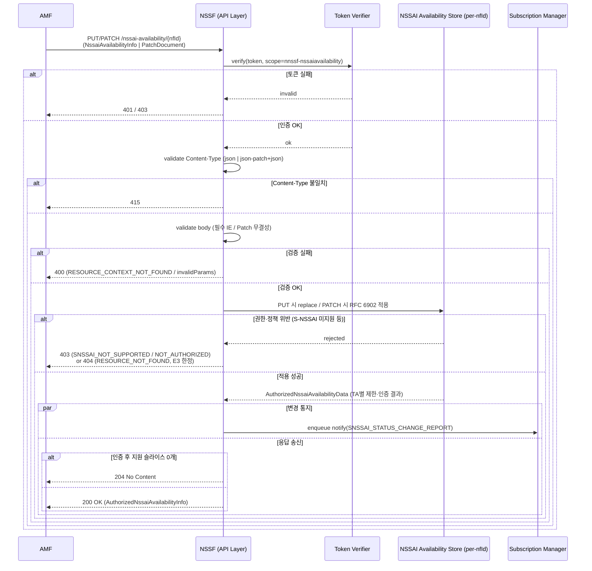
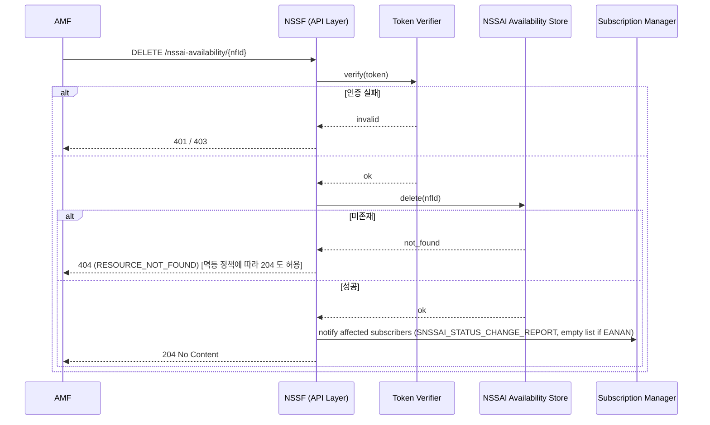
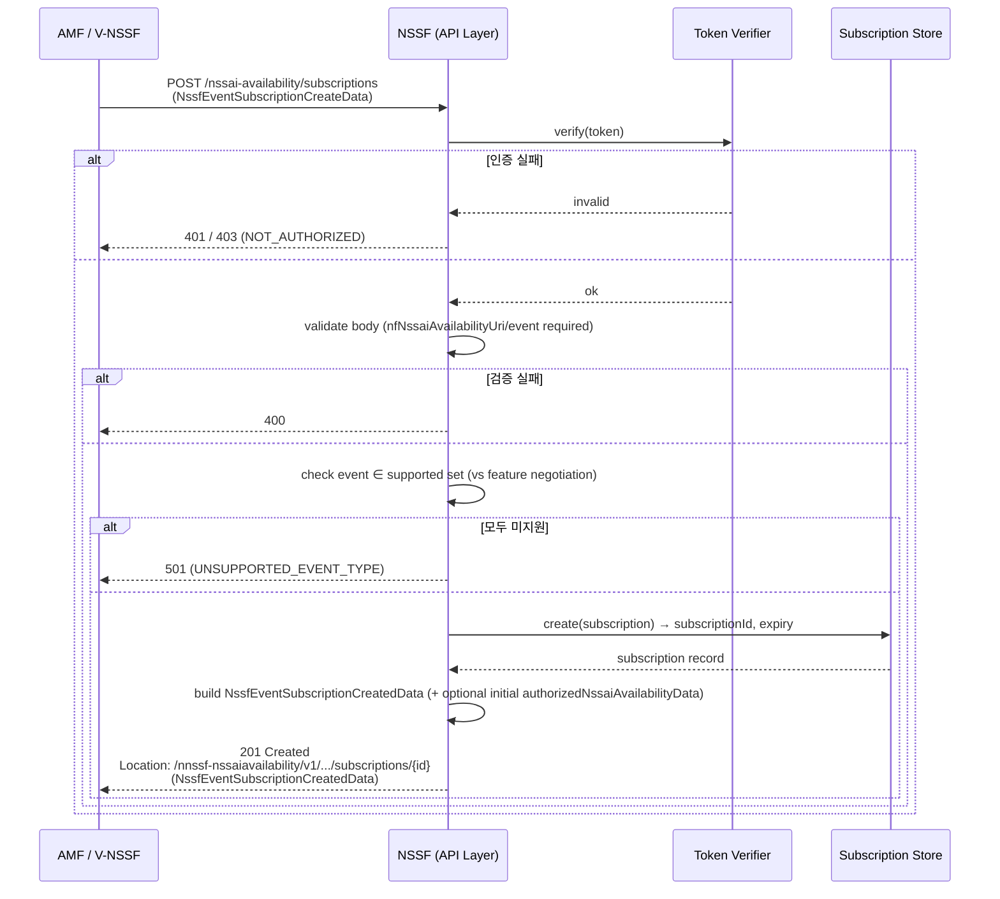
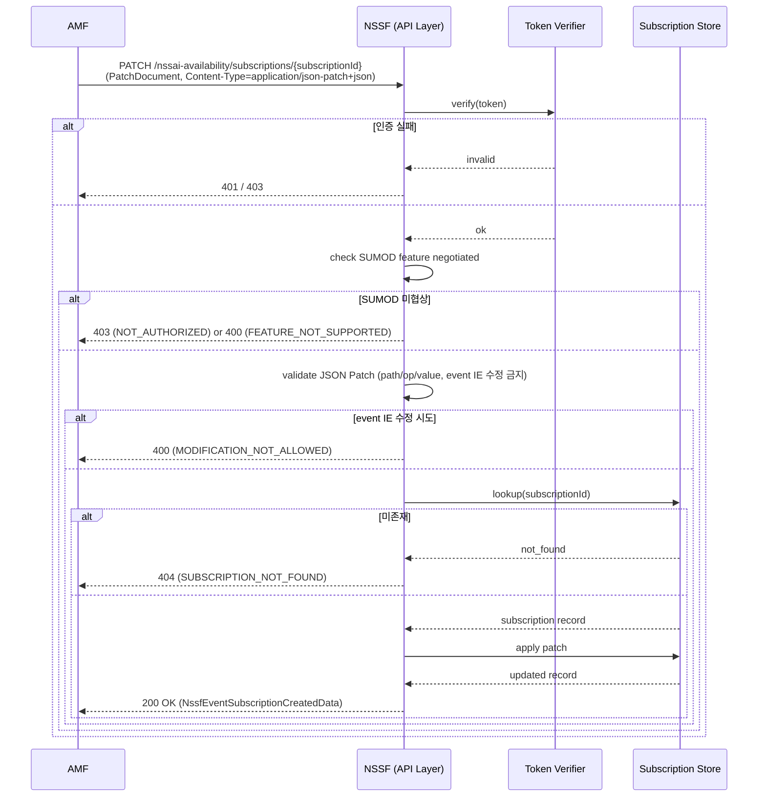
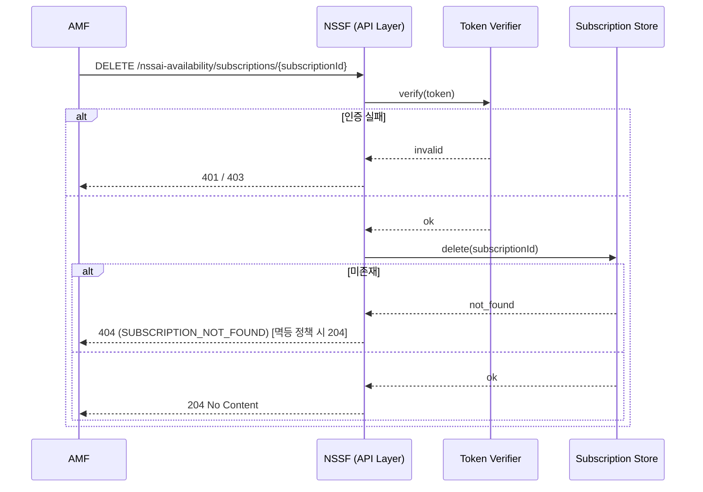
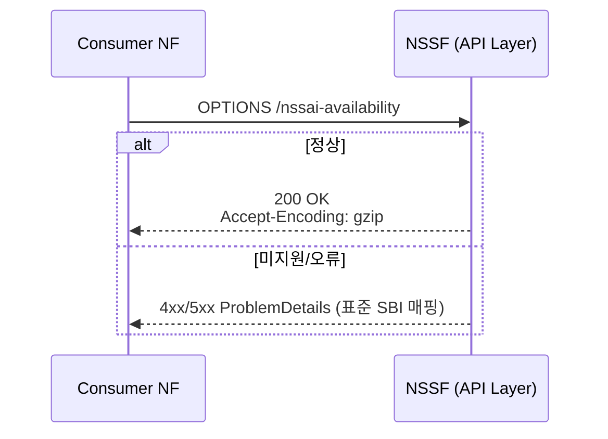
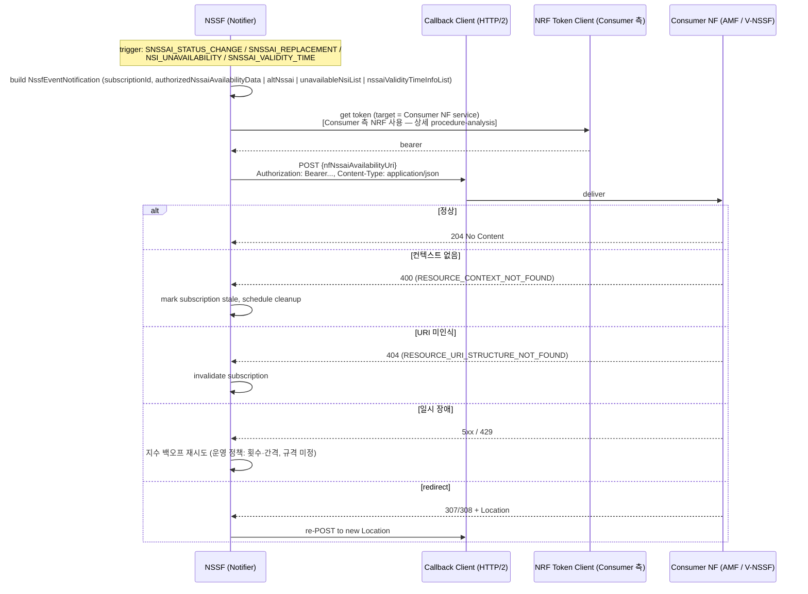

> **위키 편입 정보**
> - 원본: `doc/analysis/impl-specs/NSSF_api_analysis.md`
> - last_updated: 2026-05-26
> - 안정 ID 요약: Endpoints=8 + Callback=1 (Nnssf_NSSelection + Nnssf_NSSAIAvailability)
> - 재 ingest: 깨진 링크 3건 (doc/specs/29531-j60/* → ../../specs/29531-j60/*) 보정 후 재생성

# NSSF API 상세 분석

## 0. 입력 자료 출처

| 항목 | 값 |
|---|---|
| 메인 규격 | [TS 29.531 j60 (Rel-18)](../../specs/29531-j60/29531-j60.md) |
| OpenAPI 산출물 | [TS29531_Nnssf_NSSelection.yaml](../../specs/29531-j60/TS29531_Nnssf_NSSelection.yaml) (v2.4.0), [TS29531_Nnssf_NSSAIAvailability.yaml](../../specs/29531-j60/TS29531_Nnssf_NSSAIAvailability.yaml) (v1.4.0) — 둘 다 존재, 1차 입력 |
| 도메인 힌트 | [doc/analysis/NSSF_hints.md](../sources/NSSF-hints.md) — 적용 (H1·H2·H4·H6·H7·H8) |
| 참조 공통 규격 | TS 29.501 §4.4.1 (URI), TS 29.500 §5.2 (HTTP·error model)·§5.2.3 (3gpp-Sbi 헤더)·§6.6 (feature negotiation)·§6.7 (TLS)·§6.10.9.1 (redirection)·§6.9 (Accept-Encoding), TS 29.571 §5.2.4·§5.4.4 (공통 타입·ProblemDetails), TS 33.501 §13 (OAuth2/SBI 보안), RFC 6749 (OAuth2), RFC 6902 (JSON Patch), RFC 8259 (JSON), RFC 9113 (HTTP/2), RFC 9457 (Problem Details) |
| feature 입력 | [doc/analysis/features/29.531_features.md](../entities-features/29.531-features.md) (107 행) |

> **힌트와의 충돌 보고**: `NSSF_hints.md` H2 표는 `Nnssf_NSSAIAvailability` `apiVersion=v2` 로 기록되어 있으나, OpenAPI YAML(`servers.url=/nnssf-nssaiavailability/v1`)과 메인 규격 §6.2.1("The <apiVersion> shall be \"v1\".")은 **v1**. 본 분석은 규격·YAML을 진실 원천으로 채택. `update-wiki` 단계에서 hints 정정 권장.

## 1. API 루트 및 엔드포인트 목록

### 1-A. API 루트 정보 (서비스별)

#### 서비스 1: Nnssf_NSSelection

| 항목 | 값 | 비고 |
|---|---|---|
| 서비스명 | Nnssf_NSSelection | TS 29.531 §5.2 / Table 5.1-2 |
| apiName | `nnssf-nsselection` | TS 29.531 §6.1.1, TS 29.501 §6.1.1 명명규칙 |
| apiVersion | `v2` | TS 29.531 §6.1.1, OpenAPI `servers.url` |
| apiRoot 형식 | `https://{authority}` (TLS 필수) | TS 29.500 §6.7.1, TS 29.501 §4.4 |
| OpenAPI title/version | NSSF NS Selection / 2.4.0 | YAML `info` |
| Custom Operation | **없음** | §6.1.4 placeholder |
| Notifications | **없음** | §6.1.5 placeholder |

#### 서비스 2: Nnssf_NSSAIAvailability

| 항목 | 값 | 비고 |
|---|---|---|
| 서비스명 | Nnssf_NSSAIAvailability | TS 29.531 §5.3 / Table 5.1-2 |
| apiName | `nnssf-nssaiavailability` | TS 29.531 §6.2.1 |
| apiVersion | `v1` | TS 29.531 §6.2.1, OpenAPI `servers.url` |
| apiRoot 형식 | `https://{authority}` (TLS 필수) | TS 29.500 §6.7.1 |
| OpenAPI title/version | NSSF NSSAI Availability / 1.4.0 | YAML `info` |
| Custom Operation | **없음** | §6.2.4 placeholder |
| Notifications | **있음** (1종) | §6.2.5 — NSSAI Availability Notification (callback) |

### 1-B. 엔드포인트 목록

| # | 서비스 | Resource URI 패턴 | HTTP 메서드 | 목적 (operationId) | 관련 기능 ID | 멱등성 | 비고 |
|---|---|---|---|---|---|---|---|
| E1 | NSSelection | `/network-slice-information` | GET | Retrieve Network Slice Selection Information (`NSSelectionGet`) | SVC-0001~0011, DAT-0001~0012, MGMT-0001, ERR-0001~0009, SVC-0033~0037, DAT-0029, SEC-0003 | Yes | 단일 endpoint, 5가지 SliceInfo 변종(query body), 트리거 절차 10여 종은 `procedure-analysis` 위임 |
| E2 | NSSAIAvailability | `/nssai-availability/{nfId}` | PUT | Update/Replace per-TA NSSAIs (`NSSAIAvailabilityPut`) | SVC-0012, DAT-0013, DAT-0014, ERR-0010, SVC-0038~0040, SVC-0041, SVC-0043, SVC-0044, SEC-0004 | Yes (멱등 교체) | 200 + AuthorizedNssaiAvailabilityInfo / 204 No Content |
| E3 | NSSAIAvailability | `/nssai-availability/{nfId}` | PATCH | Partial update per-TA NSSAIs (`NSSAIAvailabilityPatch`) | SVC-0013, DAT-0015, DAT-0016, ERR-0010, SVC-0042, DAT-0030 | No | RFC 6902 JSON Patch, `application/json-patch+json` |
| E4 | NSSAIAvailability | `/nssai-availability/{nfId}` | DELETE | Delete per-TA NSSAIs (`NSSAIAvailabilityDelete`) | SVC-0030, SVC-0031, ERR-0015, DAT-0031 | Yes | 204 No Content |
| E5 | NSSAIAvailability | `/nssai-availability/subscriptions` | POST | Create event subscription (`NSSAIAvailabilityPost`) | SVC-0014~0017, DAT-0017~0023, ERR-0011, DAT-0032, DAT-0033 | No | 201 Created + `Location` header, callback URI 등록 |
| E6 | NSSAIAvailability | `/nssai-availability/subscriptions/{subscriptionId}` | PATCH | Modify existing subscription (`NSSAIAvailabilitySubModifyPatch`) | SVC-0018, SVC-0019, DAT-0024, SVC-0020, ERR-0012, DAT-0025 | No | JSON Patch; SUMOD feature gated |
| E7 | NSSAIAvailability | `/nssai-availability/subscriptions/{subscriptionId}` | DELETE | Unsubscribe (`NSSAIAvailabilityUnsubscribe`) | SVC-0021, SVC-0022, ERR-0013 | Yes | 204 No Content |
| E8 | NSSAIAvailability | `/nssai-availability` | OPTIONS | Discover communication options (`NSSAIAvailabilityOptions`) | SVC-0032, ERR-0016 | Yes | 200 OK + `Accept-Encoding` 헤더 |
| C1 | NSSAIAvailability (Callback) | `{nfNssaiAvailabilityUri}` (Consumer 측 URI; E5 에서 등록) | POST | NSSAI Availability Notification (`nssaiAvailabilityNotification`) | SVC-0023~0029, DAT-0026~0028, SEC-0001, SEC-0002, PRC-0001~0003, ERR-0014, DAT-0034~0037 | No | NSSF→Consumer 콜백, 204 응답 정상 |

**공통(전 서비스 적용)**: SVC-0033~0035 (NSSelection URI 일반 정의) ↔ E1, SVC-0038~0040 (NSSAIAvailability URI 일반 정의) ↔ E2~E8, SVC-0041 (gzip Accept-Encoding) ↔ E2~E8, DAT-0029 ↔ E1 (simple data types), DAT-0038/0039 ↔ E2~C1 (data model 공통). 즉, 위 표는 *대표* 매핑이며 일부 행은 다중 매핑임을 features.md `매핑 API` 컬럼에 별도 표기.

## 2. 요청/응답 데이터 모델

### 2.1 E1. GET /network-slice-information

- **경로/메서드**: GET {apiRoot}/nnssf-nsselection/v2/network-slice-information
- **Custom Operation 분류**: Document resource standard method (§6.1.3.2)

#### 2-A. 경로/쿼리/헤더 파라미터

| 이름 | 위치 | 타입 | 필수 | 카디널리티 | 제약 | 설명 |
|---|---|---|---|---|---|---|
| `nf-type` | query | NFType (enum) | M | 1 | NRF NFManagement 정의 enum | NF service consumer 의 NF type |
| `nf-id` | query | NfInstanceId (UUID 문자열) | M | 1 | RFC 4122 UUID 패턴 | Consumer NF Instance ID |
| `slice-info-request-for-registration` | query (JSON in query) | SliceInfoForRegistration | C | 0..1 | Registration·EPS→5GS HO 시 | Registration 절차용 슬라이스 요청 |
| `slice-info-request-for-pdu-session` | query | SliceInfoForPDUSession | C | 0..1 | PDU Session 수립 시 | PDU Session용 슬라이스 요청 |
| `slice-info-request-for-ue-cu` | query | SliceInfoForUEConfigurationUpdate | C | 0..1 | UCU 시 | UE Configuration Update용 |
| `slice-info-request-for-pdn-connection` | query | array of Snssai | C | 1..N | PDN Connection(EPC) 수립 시 (RSIPCE feature) | SMF+PGW-C에서 |
| `slice-info-request-for-other-purpose` | query | array of Snssai | C | 1..N | NWDAF analytics 시 (SIOP feature) | 분석 목적 |
| `home-plmn-id` | query | PlmnId | C | 0..1 | Roaming 시 | HPLMN identifier |
| `tai` | query | Tai | C | 0..1 | TAI 컨텍스트 제공 시 | UE 의 현재 TAI |
| `supported-features` | query | SupportedFeatures (hex 문자열) | O | 0..1 | TS 29.571 §5.2.2 | feature negotiation |
| `Authorization` | header | string `Bearer {token}` | C (OAuth2 적용 시) | 0..1 | RFC 6750 | §6.1.9 |
| `Accept` | header | string | M | 1 | `application/json`, `application/problem+json` | Content negotiation |
| `User-Agent` | header | string | O | 0..1 | TS 29.500 §5.2.2 | |
| `3gpp-Sbi-*` | header | string | C | 0..N | TS 29.500 §5.2.3 | 5-B 참조 |

> 5종의 `slice-info-request-for-*` query parameter는 `oneOf` 형태(요청 목적별 1개만 활성). 다중 동시 전달 시 NSSF 정책에 따라 400/처리 결정 — 규격은 트리거 조건으로만 분리.

#### 2-B. 요청 바디 필드

해당 없음 — GET은 요청 바디가 없음(query parameter로 모든 입력 전달).

#### 2-C. 성공 응답 (200)

- 응답 모델: **AuthorizedNetworkSliceInfo**

| 필드 경로 | 타입 | M/O/C | 카디널리티 | 제약 | nullable | default | 설명 | 출처 |
|---|---|---|---|---|---|---|---|---|
| allowedNssaiList | array<AllowedNssai> | O | 0..N (minItems=1) | – | No | – | Allowed NSSAI per access type | §6.1.6, YAML AuthorizedNetworkSliceInfo |
| configuredNssai | array<ConfiguredSnssai> | O | 0..N | – | No | – | Configured NSSAI | 동 |
| targetAmfSet | string | O | 0..1 | `^[0-9]{3}-[0-9]{2,3}-[A-Fa-f0-9]{2}-[0-3][A-Fa-f0-9]{2}$` | No | – | AMF Set 식별자 | 동 |
| candidateAmfList | array<NfInstanceId> | O | 0..N | – | No | – | candidate AMF instance IDs | 동 |
| rejectedNssaiInPlmn | array<Snssai> | O | 0..N | – | No | – | PLMN 거부 S-NSSAI | 동 |
| rejectedNssaiInTa | array<Snssai> | O | 0..N | – | No | – | TA 거부 S-NSSAI | 동 |
| nsiInformation | NsiInformation | O | 0..1 | – | No | – | NRF/NSI 정보 (단일) | 동 |
| supportedFeatures | SupportedFeatures (hex) | O | 0..1 | TS 29.571 §5.2.2 | No | – | 협상된 feature 비트맵 | 동 |
| nrfAmfSet, nrfAmfSetNfMgtUri, nrfAmfSetAccessTokenUri | Uri | O | 0..1 | URI | No | – | AMF Set 후보 발견용 NRF 정보 | 동 |
| nrfOauth2Required | map<string, boolean> | O | 0..1 | minProps=1 | No | – | NRF 서비스별 OAuth2 필요 여부 | 동 |
| targetAmfServiceSet | NfServiceSetId | O | 0..1 | – | No | – | AMF Service Set ID | 동 |
| targetNssai | array<Snssai> | O (TargetNssai feature) | 0..N | – | No | – | Target NSSAI (TS 23.501 §5.3.4.3.3) | 동 |
| nsagInfos | array<NsagInfo> | O (NSAG) | 0..N | – | No | – | NSAG 정보 | 동 |
| mappingOfNssai | array<MappingOfSnssai> | C | 0..N | – | No | – | VPLMN↔HPLMN 매핑 | 동 |
| snssaiInfoRspData | map<Snssai-string, SnssaiInfo> | O | 0..1 | minProps=1 | No | – | NSI ID 응답 데이터 (NWDAF용) | 동 |

#### 2-D. 에러 응답 요약 (자세한 cause 매트릭스는 6.1)

| HTTP 상태 | 모델 | cause 후보 | invalidParams 가능 | retriable |
|---|---|---|---|---|
| 307 / 308 | 헤더 only(`Location`, `3gpp-Sbi-Target-Nf-Id`) | – | No | Yes (redirect 따라감) |
| 400 | ProblemDetails | MANDATORY_IE_MISSING, MANDATORY_QUERY_PARAM_MISSING, INVALID_QUERY_PARAM_VALUE 등 (TS 29.500 §5.2.7.2) | Yes | No (요청 수정 필요) |
| 401 | ProblemDetails | – | No | Yes (토큰 재발급 후) |
| 403 | ProblemDetails | **SNSSAI_NOT_SUPPORTED**, **NOT_AUTHORIZED** (29.531 §6.1.7.3) + 공통 | No | No |
| 404 | ProblemDetails | – | No | No |
| 406 | ProblemDetails | – | No | No |
| 414 | ProblemDetails | – | No | No |
| 429 | ProblemDetails (+ `Retry-After`) | – | No | Yes (백오프) |
| 500 | ProblemDetails | – | No | Yes (제한 횟수) |
| 502 | ProblemDetails | – | No | Yes |
| 503 | ProblemDetails (+ `Retry-After`) | – | No | Yes (백오프) |

#### 컴포지션 규칙

- `RoamingIndication` 은 `anyOf` (enum + open string) → C 매핑 시 enum + 확장 string 필드 양쪽 지원.
- `AllowedSnssai.nsiInformationList` 와 단일 `nsiInformation`(`AuthorizedNetworkSliceInfo.nsiInformation`) 의 중복 표현 — 동시 사용 가능, 의미 동일하지만 다른 위치(전체 응답 / 슬라이스별).
- `slice-info-request-for-*` query 5종 = 논리적 `oneOf` (의미상 다중 동시 전송 비권장).

---

### 2.2 E2. PUT /nssai-availability/{nfId}

- **경로/메서드**: PUT {apiRoot}/nnssf-nssaiavailability/v1/nssai-availability/{nfId}
- **resource archetype**: Document (TS 29.501 Annex C.1)
- **service operation**: NSSAIAvailability_Update (full replace)

#### 2-A. 경로/쿼리/헤더 파라미터

| 이름 | 위치 | 타입 | 필수 | 카디널리티 | 제약 | 설명 |
|---|---|---|---|---|---|---|
| `nfId` | path | NfInstanceId (UUID) | M | 1 | RFC 4122 | AMF 인스턴스 식별자 |
| `Content-Encoding` | header | string | O | 0..1 | gzip 권장 (§6.2.2.2.3) | 요청 본문 인코딩 |
| `Accept-Encoding` | header | string | O | 0..1 | gzip 권장 | 응답 인코딩 협상 |
| `Authorization` | header | `Bearer {token}` | C | 0..1 | OAuth2 적용 시 | – |
| `Content-Type` | header | string | M | 1 | `application/json` | – |
| `3gpp-Sbi-*` | header | string | C | 0..N | – | 5-B 참조 |

#### 2-B. 요청 바디 (NssaiAvailabilityInfo)

| 필드 | 타입 | M/O/C | 카디 | 제약 | 설명 |
|---|---|---|---|---|---|
| supportedNssaiAvailabilityData | array<SupportedNssaiAvailabilityData> | M | 1..N | minItems=1 | TA별 지원 S-NSSAI |
| supportedFeatures | SupportedFeatures | O | 0..1 | – | feature negotiation |
| amfSetId | string | O | 0..1 | `^[0-9]{3}-[0-9]{2,3}-[A-Fa-f0-9]{2}-[0-3][A-Fa-f0-9]{2}$` | AMF Set |

**SupportedNssaiAvailabilityData**:

| 필드 | 타입 | M/O/C | 카디 | 설명 |
|---|---|---|---|---|
| tai | Tai | M | 1 | TAI |
| supportedSnssaiList | array<ExtSnssai> | M | 1..N | 지원 S-NSSAI |
| taiList | array<Tai> | O (ONSSAI feature) | 0..N | 다중 TAI |
| taiRangeList | array<TaiRange> | O (ONSSAI) | 0..N | TAI 범위 |
| nsagInfos | array<NsagInfo> | O (NSAG) | 0..N | NSAG 정보 |

#### 2-C. 성공 응답

| HTTP | 모델 | 헤더 | 의미 |
|---|---|---|---|
| 200 | AuthorizedNssaiAvailabilityInfo | `Accept-Encoding`, `Content-Encoding` | NSSF 가 인증한 결과 반환 |
| 204 | (no body) | – | 인증 후 지원 슬라이스가 0개 |

**AuthorizedNssaiAvailabilityInfo**:

| 필드 | 타입 | M/O/C | 카디 | 설명 |
|---|---|---|---|---|
| authorizedNssaiAvailabilityData | array<AuthorizedNssaiAvailabilityData> | M | 1..N | TA별 인증된 데이터 |
| supportedFeatures | SupportedFeatures | O | 0..1 | 협상 결과 |

#### 2-D. 에러 응답 요약

| HTTP | cause(예) | retriable |
|---|---|---|
| 307/308 | – | Yes (redirect) |
| 400 | RESOURCE_CONTEXT_NOT_FOUND, MANDATORY_IE_MISSING 등 | No |
| 401 | – | Yes (토큰 재발급) |
| 403 | **SNSSAI_NOT_SUPPORTED**, **NOT_AUTHORIZED** | No |
| 404 | **RESOURCE_NOT_FOUND** | No |
| 411 / 413 / 415 | – | No |
| 429 | – | Yes (백오프) |
| 500 / 502 / 503 | – | Yes |

---

### 2.3 E3. PATCH /nssai-availability/{nfId}

- **경로/메서드**: PATCH ... + `Content-Type: application/json-patch+json` (RFC 6902)
- **service operation**: NSSAIAvailability_Update (incremental)

#### 2-A. 파라미터

E2 와 동일 (`nfId` path, 헤더 동일) + `Content-Type` 은 **`application/json-patch+json`** 고정.

#### 2-B. 요청 바디 (PatchDocument)

`array<PatchItem>` (TS 29.571 §5.2.7 PatchItem 정의: `op` ∈ {add, remove, replace, move, copy, test} + `path`(JSON Pointer) + `value`(op 의존) + `from`(move/copy)). minItems=1.

#### 2-C. 성공 응답

E2 와 동일 (200 AuthorizedNssaiAvailabilityInfo / 204 No Content).

#### 2-D. 에러 응답 요약

E2 동일 + **412 Precondition Failed** (관련 feature SUMOD/JSON Patch 무결성). 추가 cause: `MODIFICATION_NOT_ALLOWED`(공통).

---

### 2.4 E4. DELETE /nssai-availability/{nfId}

#### 2-A. 파라미터

| 이름 | 위치 | 타입 | 필수 | 설명 |
|---|---|---|---|---|
| `nfId` | path | NfInstanceId | M | – |
| `Authorization` | header | Bearer | C | – |

#### 2-B. 요청 바디

해당 없음.

#### 2-C. 성공 응답

| HTTP | 모델 | 의미 |
|---|---|---|
| 204 | (no body) | 성공 삭제 |

#### 2-D. 에러 응답 요약

| HTTP | cause | retriable |
|---|---|---|
| 307/308 | – | Yes |
| 400 | RESOURCE_CONTEXT_NOT_FOUND 등 | No |
| 401 | – | Yes (재인증) |
| 403 | NOT_AUTHORIZED | No |
| 404 | RESOURCE_NOT_FOUND | No |
| 429 | – | Yes |
| 500 / 502 / 503 | – | Yes |

---

### 2.5 E5. POST /nssai-availability/subscriptions

- **resource archetype**: Collection (Subscription 생성)
- **service operation**: NSSAIAvailability_Subscribe

#### 2-A. 파라미터

| 이름 | 위치 | 타입 | 필수 | 설명 |
|---|---|---|---|---|
| `Content-Encoding` | header | string | O | gzip |
| `Authorization` | header | Bearer | C | – |
| `Content-Type` | header | string | M | `application/json` |

#### 2-B. 요청 바디 (NssfEventSubscriptionCreateData)

| 필드 | 타입 | M/O/C | 카디 | 설명 |
|---|---|---|---|---|
| nfNssaiAvailabilityUri | Uri | M | 1 | Consumer 콜백 URI |
| event | NssfEventType (enum + open) | M | 1 | 주 이벤트 |
| additionalEvents | array<NssfEventType> | O | 0..N | 추가 이벤트 |
| taiList | array<Tai> | O | 0..N | 관심 TAI |
| taiRangeList | array<TaiRange> | O (ONSSAI feature) | 0..N | TAI 범위 |
| amfSetId | string | O (SATAS feature) | 0..1 | AMF Set 전체 구독 |
| amfId | NfInstanceId | O | 0..1 | AMF 인스턴스 식별자 |
| expiry | DateTime | O | 0..1 | 만료 시각 |
| supportedFeatures | SupportedFeatures | O | 0..1 | 협상 |
| allAmfSetTaiInd | boolean | O (SATAS) | 0..1, default=false | 전체 TAI 구독 indicator |
| nsrpSubscribeInfo | SnssaiReplacementSubscribeInfo | C (NSRP feature) | 0..1 | Slice Replacement 구독 |
| nsiunSubscribeInfo | NsiUnavailabilitySubscribeInfo | C (NSIUN feature) | 0..1 | NSI Unavailability 구독 |
| validityTimeSubList | array<Snssai> | O | 0..N | NSSAI Validity Time 구독 대상 |

**NssfEventType enum**: SNSSAI_STATUS_CHANGE_REPORT, SNSSAI_REPLACEMENT_REPORT, NSI_UNAVAILABILITY_REPORT, SNSSAI_VALIDITY_TIME_REPORT (anyOf with open string).

#### 2-C. 성공 응답 (201)

- 모델: **NssfEventSubscriptionCreatedData**
- 헤더: `Location` **M** (= `{apiRoot}/nnssf-nssaiavailability/v1/nssai-availability/subscriptions/{subscriptionId}`), `Content-Encoding` O

| 필드 | 타입 | M/O/C | 설명 |
|---|---|---|---|
| subscriptionId | string | M | 신규 ID |
| expiry | DateTime | O | NSSF가 설정한 만료시각 |
| authorizedNssaiAvailabilityData | array<AuthorizedNssaiAvailabilityData> | O | 가입 즉시 반환 데이터 |
| supportedFeatures | SupportedFeatures | O | 협상 결과 |
| acceptedEvents | array<NssfEventType> | O | 다중 event 시 수락 목록 |

#### 2-D. 에러 응답 요약

| HTTP | cause | retriable |
|---|---|---|
| 307/308 | – | Yes |
| 400 | RESOURCE_CONTEXT_NOT_FOUND 등 | No |
| 401 | – | Yes |
| 403 | **NOT_AUTHORIZED** | No |
| 404 | – | No |
| 411 / 413 / 415 | – | No |
| 429 | – | Yes |
| 500 | – | Yes |
| **501** | **UNSUPPORTED_EVENT_TYPE** | No |
| 502 / 503 | – | Yes |

---

### 2.6 E6. PATCH /nssai-availability/subscriptions/{subscriptionId}

- **service operation**: NSSAIAvailability_Subscribe Modify (SUMOD feature gated, §5.3.2.3.2)

#### 2-A. 파라미터

| 이름 | 위치 | 타입 | 필수 | 설명 |
|---|---|---|---|---|
| `subscriptionId` | path | string | M | – |
| `Content-Encoding` | header | string | O | – |
| `Content-Type` | header | string | M | **`application/json-patch+json`** |
| `Authorization` | header | Bearer | C | – |

#### 2-B. 요청 바디 (PatchDocument)

`array<PatchItem>`, minItems=1. **`event` IE는 변경 금지** (SVC-0020/SVC-0025 — features.md).

#### 2-C. 성공 응답 (200)

- 모델: **NssfEventSubscriptionCreatedData**

#### 2-D. 에러 응답 요약

E5 동일 + `MODIFICATION_NOT_ALLOWED`(공통, event IE 수정 시도 시).

---

### 2.7 E7. DELETE /nssai-availability/subscriptions/{subscriptionId}

#### 2-A. 파라미터

| 이름 | 위치 | 타입 | 필수 | 설명 |
|---|---|---|---|---|
| `subscriptionId` | path | string | M | – |
| `Authorization` | header | Bearer | C | – |

#### 2-B. 요청 바디

해당 없음.

#### 2-C. 성공 응답

| HTTP | 의미 |
|---|---|
| 204 | 성공 삭제 |

#### 2-D. 에러 응답 요약

| HTTP | cause | retriable |
|---|---|---|
| 307/308 | – | Yes |
| 400 | – | No |
| 401 | – | Yes |
| 403 | – | No |
| 404 | **SUBSCRIPTION_NOT_FOUND** | No |
| 429 | – | Yes |
| 500 / 502 / 503 | – | Yes |

---

### 2.8 E8. OPTIONS /nssai-availability

- **service operation**: NSSAIAvailability_Options
- **목적**: CORS-style preflight 가 아닌 SBI 표준 communication options discovery (TS 29.500 §6.x)

#### 2-A. 파라미터

해당 없음 (헤더 only).

#### 2-C. 성공 응답

| HTTP | 헤더 | 의미 |
|---|---|---|
| 200 | `Accept-Encoding` | 통신 옵션 discovery 성공 |

#### 2-D. 에러 응답 요약

| HTTP | cause | retriable |
|---|---|---|
| 400 / 401 / 403 / 404 / 405 / 429 / 500 / 501 / 502 / 503 | 표준 SBI | retriable 은 5xx/429 |

---

### 2.9 C1. POST {nfNssaiAvailabilityUri} — Callback (Notify)

- **방향**: NSSF (송신) → Consumer (수신)
- **service operation**: NSSAIAvailability_Notify (§6.2.5.2)
- **콜백 URI 등록 위치**: E5 요청 본문의 `nfNssaiAvailabilityUri` 필드

#### 2-A. 파라미터

| 이름 | 위치 | 타입 | 필수 | 설명 |
|---|---|---|---|---|
| `Content-Encoding` | header | string | O | – |
| `Content-Type` | header | string | M | `application/json` |

> NSSF→Consumer 호출이므로 `Authorization` 은 Consumer 측 정책에 따라 옵션. mTLS 권장(§6.7.1).

#### 2-B. 요청 바디 (NssfEventNotification)

| 필드 | 타입 | M/O/C | 카디 | 설명 |
|---|---|---|---|---|
| subscriptionId | string | M | 1 | 매칭 구독 ID |
| authorizedNssaiAvailabilityData | array<AuthorizedNssaiAvailabilityData> | O | 0..N | 변경된 NSSAI 가용성 |
| altNssai | array<SnssaiReplaceInfo> | O (NSRP) | 0..N | Slice Replacement 대안 |
| unavailableNsiList | array<NsiId> | O (NSIUN) | 0..N | 미가용 NSI |
| nssaiValidityTimeInfo | map<Snssai-string, DateTime> | **O (deprecated)** | 0..1 | (Rel-19+ 제거 예정) |
| nssaiValidityTimeInfoList | map<Snssai-string, array<RecurTime>> | O | 0..1 | 신규(권장) |

> EANAN feature: `authorizedNssaiAvailabilityData` 가 빈 배열일 수 있음 (의미: 모든 TA 에 대해 인증된 슬라이스 없음).

#### 2-C. 성공 응답

| HTTP | 의미 |
|---|---|
| 204 | Consumer 가 정상 처리 |

#### 2-D. 에러 응답 요약 (Consumer 가 반환)

| HTTP | cause | retriable (NSSF 입장) |
|---|---|---|
| 307/308 | – | Yes (Consumer 측 SCP redirect) |
| 400 | **RESOURCE_CONTEXT_NOT_FOUND** (Consumer 컨텍스트 없음) | No (구독 정리 권장) |
| 401 / 403 | – | Yes/No |
| 404 | **RESOURCE_URI_STRUCTURE_NOT_FOUND** (콜백 URI 미인식) | No (구독 무효화) |
| 411 / 413 / 415 | – | No |
| 429 | – | Yes (백오프) |
| 500 / 502 / 503 | – | Yes (재시도 정책: 규격 미정 → 운영 결정) |

---

## 3. 공통 데이터 타입 매핑 (C 원칙)

> 본 표는 *언어 자체의 표현* 만 기술. 외부 라이브러리(JSON 파서·HTTP 클라이언트 등) 호출은 `impl-spec-generation` 단계에서 결정.

| 3GPP 타입 | 정의 위치 | C 매핑 원칙 | 카디널리티 처리 | 메모리·소유권 |
|---|---|---|---|---|
| `Snssai` | TS 29.571 §5.4.4.2 | `struct snssai { uint8_t sst; char sd[7]; bool has_sd; }` (sd: "RRGGBB\0", optional) | 단일 = struct, 배열 = `struct snssai *items; size_t n;` | 고정 길이, 동적 할당 불요(struct 내장) |
| `ExtSnssai` | TS 29.571 §5.4.4.2 | `Snssai` 확장. `sdRanges`(array of `SnssaiSdRange`) / `wildcardSd`(bool) 필드 추가 | 동일 | `sdRanges` 는 동적 |
| `Tai` | TS 29.571 §5.4.4.4 | `struct tai { struct plmn_id plmn; char tac[7]; char nid[12]; bool has_nid; }` | – | 고정 길이 |
| `PlmnId` | TS 29.571 §5.4.4.1 | `struct plmn_id { char mcc[4]; char mnc[4]; }` | – | 고정 |
| `PlmnIdNid` | TS 29.571 §5.4.4.x | `PlmnId` + optional `nid[12]` | – | 고정 |
| `NfInstanceId` | TS 29.571 §5.2.x | `char nf_id[37]` (RFC 4122 UUID + NUL) | – | 고정 |
| `Uri` | TS 29.571 §5.2.x | `char *uri` (가변) | 단일 포인터 + 길이 | **동적 할당 필요** |
| `DateTime` | TS 29.571 §5.4.4.x | `time_t` 또는 `struct timespec` + ISO 8601 직렬화는 별도 함수 | – | – |
| `NfServiceSetId` | TS 29.571 §5.x | string pattern 매칭 → `char nf_svc_set_id[N]` | – | 고정 |
| `SupportedFeatures` | TS 29.571 §5.2.2 | hex 문자열 → 내부 `uint64_t bitmap[K]`(언어 표현, 길이 K는 feature 수에 따라). 직렬화는 hex 문자열 ↔ bitmap 변환 함수 한 쌍 | – | bitmap 길이는 정적 |
| `ProblemDetails` | TS 29.571 §5.2.4 / RFC 9457 | `struct problem_details { char *type; char *title; int32_t status; char *detail; char *instance; char *cause; struct invalid_param *invalid_params; size_t invalid_params_len; ... }` | invalidParams = 동적 배열 | 모든 문자열 동적 할당 |
| `PatchItem` (RFC 6902) | TS 29.571 §5.2.7 (3GPP 확장 포함) | `struct patch_item { enum patch_op op; char *path; cjson_node *value; char *from; bool has_value; bool has_from; }` (value는 임의 JSON, opaque 노드로 보관) | array = `struct patch_item *items; size_t n;` | path/from/value 동적 |
| `NsagId` | TS 29.571 §5.x | string `^[A-Fa-f0-9]{2}$` → `uint8_t` | – | 고정 |
| `TaiRange` | TS 29.510 §5.x | `struct tai_range { struct plmn_id plmn; struct tac_range *tacs; size_t n_tacs; ... }` | – | tacs 동적 |
| `NFType` | TS 29.510 §5.x (enum + open) | `enum nf_type { ... NF_TYPE_AMF, ... }` + open string fallback `char *nf_type_extension` | – | extension 동적 |
| `AccessType` | TS 29.571 §5.x (enum) | `enum access_type { THREE_GPP_ACCESS, NON_THREE_GPP_ACCESS }` | – | 고정 |
| `RoamingIndication` | 29.531 §6.1.6.x (enum + open) | `enum + char *` 확장 (anyOf 패턴) | – | 확장 동적 |
| `NssfEventType` | 29.531 §6.2.6.x (enum + open) | 동일 패턴 | – | – |
| `SnssaiInfo`, `NsiInformation`, `AllowedSnssai`, `AllowedNssai`, `ConfiguredSnssai`, `MappingOfSnssai`, `NsagInfo`, `SliceInfoForRegistration`, `SliceInfoForPDUSession`, `SliceInfoForUEConfigurationUpdate`, `AuthorizedNetworkSliceInfo`, `NssaiAvailabilityInfo`, `SupportedNssaiAvailabilityData`, `AuthorizedNssaiAvailabilityData`, `AuthorizedNssaiAvailabilityInfo`, `RestrictedSnssai`, `NssfEventSubscriptionCreateData`, `NssfEventSubscriptionCreatedData`, `NssfEventNotification`, `SnssaiReplacementSubscribeInfo`, `NsiUnavailabilitySubscribeInfo`, `PatchDocument`, `SnssaiReplaceInfo`, `RecurTime` | 29.531 §6.1.6 / §6.2.6 / 29.571 / 29.510 / 29.503 | 위 단순 타입을 조합한 struct + 동적 배열 (`array<T>` → `T *items; size_t n;`) + optional 필드는 `bool has_<field>` 또는 포인터 nullable | – | 모든 가변 길이 필드 동적 |

> **NF-별 도메인 매핑**: H5 (NSSF_hints.md) 의 sketch 와 일치. 본 표가 진실 원천. tech_stack 확정 후 `impl-spec-generation` 이 JSON 라이브러리(cJSON) 호출 코드로 변환.

---

## 4. 인증·보안 분석

| 엔드포인트 | OAuth2 필수 | 요구 scope | Access Token claim 검증 | mTLS 정책 | 비고 |
|---|---|---|---|---|---|
| E1 GET /network-slice-information | Conditional (`MAY`, §6.1.9) | `nnssf-nsselection` (API-level, **resource-level scope 미정의**) | `scope`=`nnssf-nsselection`, `aud`=NSSF NF Instance ID (또는 NF type=`NSSF`), `cnf` = mTLS 인증서 thumbprint (mTLS 적용 시) | M (SBI 전 구간, TS 29.500 §6.7.1) | NRF가 authorization server (TS 29.510 §5.4.2.2), Consumer가 NSSF 발견에 사용한 NRF 와 동일해야 함 |
| E2 PUT /nssai-availability/{nfId} | Conditional (§6.2.9) | `nnssf-nssaiavailability` (API-level) | 위와 동일 | M | – |
| E3 PATCH /nssai-availability/{nfId} | 동 | 동 | 동 | M | – |
| E4 DELETE /nssai-availability/{nfId} | 동 | 동 | 동 | M | – |
| E5 POST /nssai-availability/subscriptions | 동 | 동 | 동 | M | – |
| E6 PATCH /nssai-availability/subscriptions/{subscriptionId} | 동 | 동 | 동 | M | – |
| E7 DELETE /nssai-availability/subscriptions/{subscriptionId} | 동 | 동 | 동 | M | – |
| E8 OPTIONS /nssai-availability | Conditional | 동 (또는 면제 가능 — 운영 정책) | 동 | M | discovery 용도 |
| C1 callback (NSSF→Consumer) | Consumer 측 정책에 의존 | Consumer API 의 scope (NSSF 측에서는 Consumer의 NF Discovery 결과에 따라) | – | M (callback 송신 시) | NSSF는 Consumer 측 NRF 토큰 별도 발급 가능; 통상 inter-NF mTLS 로 처리 |

**추가 사항**:

- **JWS 알고리즘**: 규격 미명시 → TS 33.501 §13 권고 따름 (RS256/ES256 표준). NRF 가 발급 정책 결정.
- **토큰 검증 실패 시 응답 정책**: 401 + ProblemDetails (`cause`=`TOKEN_INVALID`/`TOKEN_EXPIRED` 등 NRF/SBI 공통). scope 부족 시 403 + `cause=NOT_AUTHORIZED` (3GPP 정의, §6.1.7.3 / §6.2.7.3).
- **NRF Access Token Request 흐름 의존성**: **있음** — Consumer가 NSSF 호출 전 NRF의 `Nnrf_AccessToken_Get` 으로 토큰 획득. 상세 시퀀스는 `procedure-analysis` 에 위임 (TS 29.510 §5.4.2.2.2 절차).
- **N32 inter-PLMN**: V-NSSF↔H-NSSF, V-NSSF↔H-NRF 경유 시 SEPP 통과 (TS 33.501 §13 / TS 29.500 §5.10). SEPP가 mutual authentication 처리.
- **HTTP redirection 307/308**: NSSF set 내 인스턴스 간 redirect 시 `3gpp-Sbi-Target-Nf-Id` 헤더 필수 (TS 29.500 §6.10.9.1, §6.1.10 / §6.2.10).

---

## 5. HTTP 헤더 카탈로그

### 5-A. 표준 헤더

| 헤더 | 방향 | 필수 | 적용 엔드포인트 | 처리 의무 | 비고 |
|---|---|---|---|---|---|
| `Content-Type` | both | Yes | 전체 | E1·E2·E5·callback·notify=`application/json`; **E3·E6=`application/json-patch+json` (RFC 6902)**; 모든 에러 응답=`application/problem+json` (RFC 9457) | TS 29.531 §6.1.2.2.2 / §6.2.2.2.2 |
| `Accept` | req | Yes | 전체 | `application/json`, `application/problem+json` 동시 권장 | – |
| `Accept-Encoding` | both | O (M for NSSF as Producer per §6.2.2.2.3 "should support gzip") | E2~E8·C1 | gzip 협상; OPTIONS(E8) 응답에 동적 보고 | RFC 9110 §12.5.3 |
| `Content-Encoding` | both | O | E2~E8·C1 | gzip 사용 시 표시 | RFC 9110 §8.4 |
| `Authorization` | req | C (OAuth2 적용 엔드포인트) | 전체 | `Bearer {token}` | RFC 6750 |
| `Location` | resp | **M (E5 201)** / C (307/308) | E5 (201), E1/E2/E3/E4/E5/E6/E7/E8/C1 (307·308) | E5: 생성된 subscription URI; redirect: 새 NSSF endpoint | – |
| `User-Agent` | req | O | 전체 | 로깅 | – |
| `Retry-After` | resp | C (429·503 시 권장) | 전체 | 백오프 시간 (초 또는 HTTP-date) | RFC 9110 §10.2.3 |
| `If-Match` | req | O | (PUT/PATCH 시 운영 정책) | NSSF 가 ETag 제공하지 않으면 적용 안 함 — 본 규격에 명시적 사용 없음 | TS 29.500 §6.6 |
| `ETag` | resp | – | **해당 없음** (29.531 §6.2 에 ETag 사용 명시 없음) | – | – |
| `Cache-Control` | resp | O | E1 | 정책: `no-store` 권장(슬라이스 선택 결과 임시성) | – |

### 5-B. 3gpp-Sbi-* 헤더 (TS 29.500 §5.2.3)

| 헤더 | 방향 | 필수 | 의미 / 처리 의무 | 적용 |
|---|---|---|---|---|
| `3gpp-Sbi-Sender-Timestamp` | req/resp | O | 송신 시각 — 로깅·지연 측정 | 전체 |
| `3gpp-Sbi-Origination-Timestamp` | req | O | 원천 시각 — 추적 | 전체 |
| `3gpp-Sbi-Max-Rsp-Time` | req | O | Consumer 의 최대 응답 대기 시간 — 서버측 처리 타임아웃 입력 | 전체 |
| `3gpp-Sbi-Routing-Binding` | req/resp | C | NF binding 정보 — NSSF set 내 세션 어피니티 (§6.1.10 / §6.2.10) | 전체 |
| `3gpp-Sbi-Binding` | resp | C | 응답 NF binding 정보 | 전체 |
| `3gpp-Sbi-Producer-Id` | resp | C | NSSF instance ID — redirect(307/308) 시 새 producer 식별 | 307/308 응답 |
| `3gpp-Sbi-Target-Nf-Id` | resp | **M (307/308 시)** | NSSF set 내 새 NSSF 인스턴스 식별 (§6.1.10, §6.2.10) | 307/308 응답 |
| `3gpp-Sbi-Discovery-*` | req | C | Consumer 가 NRF 우회 발견 파라미터 전달 시 (NSSF 측은 통과·로깅) | 전체 |
| `3gpp-Sbi-Message-Priority` | req | C | 우선순위 기반 처리 (혼잡 시 폐기 정책 입력) | 전체 |
| `3gpp-Sbi-Callback` | req | C | callback notification 시 NSSF 가 송신 (Notify 메시지의 의미 식별) | **C1 (callback)** |
| `3gpp-Sbi-Lci` | resp | O | Load control information | 전체 |
| `3gpp-Sbi-Oci` | resp | O | Overload control information | 전체 |

> 위 외 다른 3gpp-Sbi-* 헤더(예 `3gpp-Sbi-Nf-Peer-Info`)는 TS 29.500 §5.2.3 카탈로그 따름. 본 NSSF API 본문 §6.1.2.3.1 / §6.2.2.3.1 명시: **"no custom headers specific to the service are defined"** → 전 헤더는 SBI 공통.

---

## 6. 에러 응답 매트릭스

> **공통 ProblemDetails 구조** (TS 29.571 §5.2.4 / RFC 9457): `type`, `title`, `status`, `detail`, `instance`, **`cause`** (3GPP 확장), **`invalidParams`** (3GPP 확장; array of `InvalidParam{param, reason}`). 모든 4xx/5xx 응답은 `Content-Type: application/problem+json`.

### 6.1 E1. GET /network-slice-information

| HTTP | cause | 발생 조건 | invalidParams 후보 | retriable | 로그 레벨 | 매핑 기능 ID |
|---|---|---|---|---|---|---|
| 307 | – | NSSF set 내 다른 NSSF로 redirect (ES3XX) | – | Yes | INFO | – |
| 308 | – | 영구 redirect | – | Yes | INFO | – |
| 400 | MANDATORY_QUERY_PARAM_MISSING / INVALID_QUERY_PARAM_VALUE / MANDATORY_IE_MISSING / SEMANTIC_ERROR / UNSPECIFIED (TS 29.500 §5.2.7.2) | `nf-type`/`nf-id` 누락, 필수 slice-info-request-* 누락, body 형식 오류 | nf-type, nf-id, slice-info-request-for-* | No | WARN | – (공통 ERR 패턴) |
| 401 | TOKEN_INVALID / TOKEN_EXPIRED | OAuth2 토큰 검증 실패 | – | Yes (재발급 후) | WARN | – |
| 403 | **SNSSAI_NOT_SUPPORTED** | 요청 S-NSSAI 미지원 (29.531 §6.1.7.3) | requestedNssai 등 | No | INFO | ERR-0001~0009 |
| 403 | **NOT_AUTHORIZED** | scope·정책 불일치 | – | No | WARN | ERR-0001~0009 |
| 404 | – | 해당 없음 (단일 리소스) | – | No | WARN | – |
| 406 | – | Accept 협상 실패 | – | No | WARN | – |
| 414 | – | URI 너무 김 (query에 다중 SliceInfo) | – | No | WARN | – |
| 429 | – | 레이트 리밋 (`Retry-After`) | – | Yes (백오프) | WARN | – |
| 500 | – | 내부 오류 | – | Yes (제한) | ERROR | – |
| 502 | – | NRF/타 NF 통신 실패 (indirect comm 시) | – | Yes | ERROR | – |
| 503 | – | 일시 불가 (`Retry-After`) | – | Yes | ERROR | – |

### 6.2 E2 PUT / E3 PATCH /nssai-availability/{nfId}

| HTTP | cause | 발생 조건 | invalidParams 후보 | retriable | 로그 레벨 | 매핑 기능 ID |
|---|---|---|---|---|---|---|
| 307/308 | – | NSSF set redirect | – | Yes | INFO | – |
| 400 | RESOURCE_CONTEXT_NOT_FOUND / MANDATORY_IE_MISSING / SEMANTIC_ERROR / **JSON Patch 무결성 오류** (E3) | nfId 컨텍스트 미존재, NssaiAvailabilityInfo 필수 IE 누락, PATCH path 무효 | nfId, supportedNssaiAvailabilityData, tai, op/path | No | WARN | ERR-0010, SVC-0042 |
| 401 | TOKEN_INVALID / TOKEN_EXPIRED | – | – | Yes | WARN | – |
| 403 | **SNSSAI_NOT_SUPPORTED** / **NOT_AUTHORIZED** | NSSF가 알지 못하는 S-NSSAI / AMF 권한 부족 (§6.2.7.3) | – | No | INFO/WARN | ERR-0010 |
| 404 | **RESOURCE_NOT_FOUND** (E3 PATCH 시: 갱신 대상 nfId 컨텍스트 미존재) | nfId 에 대한 사전 PUT 없음 | – | No | WARN | DAT-0030, ERR-0010 |
| 411 | – | Content-Length 누락 | – | No | WARN | – |
| 412 | – (E3 한정) | If-Match 미일치 (운영 정책) | – | No | INFO | – |
| 413 | – | 페이로드 초과 | – | No | WARN | – |
| 415 | – | Content-Type 불일치 (E3 의 경우 `application/json-patch+json` 아님) | – | No | WARN | – |
| 429 | – | – | – | Yes | WARN | – |
| 500 / 502 / 503 | – | – | – | Yes | ERROR | – |

### 6.3 E4 DELETE /nssai-availability/{nfId}

| HTTP | cause | 발생 조건 | retriable | 로그 레벨 | 매핑 기능 ID |
|---|---|---|---|---|---|
| 307/308 | – | redirect | Yes | INFO | – |
| 400 | RESOURCE_CONTEXT_NOT_FOUND | – | No | WARN | – |
| 401 | – | 토큰 실패 | Yes | WARN | – |
| 403 | NOT_AUTHORIZED | – | No | WARN | – |
| 404 | **RESOURCE_NOT_FOUND** | 삭제 대상 미존재 (멱등 처리 운영 정책: 204 반환도 가능) | No | INFO | DAT-0031, ERR-0015 |
| 429 / 500 / 502 / 503 | – | – | Yes | WARN/ERROR | – |

### 6.4 E5 POST /nssai-availability/subscriptions

| HTTP | cause | 발생 조건 | invalidParams | retriable | 로그 레벨 | 매핑 기능 ID |
|---|---|---|---|---|---|---|
| 307/308 | – | redirect | – | Yes | INFO | – |
| 400 | MANDATORY_IE_MISSING / INVALID_IE / RESOURCE_CONTEXT_NOT_FOUND | nfNssaiAvailabilityUri/event 누락, URI 형식 오류 | nfNssaiAvailabilityUri, event | No | WARN | ERR-0011 |
| 401 / 403 | NOT_AUTHORIZED | – | – | Yes/No | WARN | ERR-0011, DAT-0032 |
| 404 | – | – | – | No | WARN | – |
| 411 / 413 / 415 | – | – | – | No | WARN | – |
| 429 | – | – | – | Yes | WARN | – |
| 500 | – | – | – | Yes | ERROR | – |
| **501** | **UNSUPPORTED_EVENT_TYPE** | 모든 요청 event 가 NSSF 미지원 (§6.2.7.3) | event, additionalEvents | No | INFO | DAT-0033 |
| 502 / 503 | – | – | – | Yes | ERROR | – |

### 6.5 E6 PATCH /nssai-availability/subscriptions/{subscriptionId}

| HTTP | cause | 발생 조건 | retriable | 로그 레벨 | 매핑 기능 ID |
|---|---|---|---|---|---|
| 307/308 | – | redirect | Yes | INFO | – |
| 400 | MODIFICATION_NOT_ALLOWED (event IE 변경 시도) / JSON Patch 무결성 | – | No | WARN | SVC-0020, DAT-0025, ERR-0012 |
| 401 / 403 | – | – | Yes/No | WARN | – |
| 404 | **SUBSCRIPTION_NOT_FOUND** | subscriptionId 미존재 (§6.2.7.3) | – | No | INFO | ERR-0012 |
| 411 / 413 / 415 | – | – | No | WARN | – |
| 429 / 500 / 502 / 503 | – | – | Yes | WARN/ERROR | – |

### 6.6 E7 DELETE /nssai-availability/subscriptions/{subscriptionId}

| HTTP | cause | 발생 조건 | retriable | 로그 레벨 | 매핑 기능 ID |
|---|---|---|---|---|---|
| 307/308 | – | redirect | Yes | INFO | – |
| 400 | RESOURCE_CONTEXT_NOT_FOUND | – | No | WARN | – |
| 401 / 403 | – | – | Yes/No | WARN | – |
| 404 | **SUBSCRIPTION_NOT_FOUND** | 삭제 대상 미존재 (멱등 처리 운영 정책) | No | INFO | ERR-0013 |
| 429 / 500 / 502 / 503 | – | – | Yes | WARN/ERROR | – |

### 6.7 E8 OPTIONS /nssai-availability

| HTTP | cause | 발생 조건 | retriable | 로그 레벨 | 매핑 기능 ID |
|---|---|---|---|---|---|
| 400 / 401 / 403 / 404 / 405 / 429 / 500 / 501 / 502 / 503 | 표준 SBI | 표준 케이스 | retriable=5xx/429 | WARN/ERROR | ERR-0016 |

### 6.8 C1 POST {nfNssaiAvailabilityUri} (Consumer가 NSSF 콜백 응답)

| HTTP | cause | 발생 조건 | retriable (NSSF 입장) | 로그 레벨 | 매핑 기능 ID |
|---|---|---|---|---|---|
| 307/308 | – | Consumer 측 redirect / SCP redirect | Yes | INFO | DAT-0036, DAT-0037 |
| 400 | **RESOURCE_CONTEXT_NOT_FOUND** | Consumer 가 매칭 구독 컨텍스트 없음 (§6.2.7.3) | No (구독 정리 권장) | WARN | DAT-0034, ERR-0014 |
| 401 / 403 | – | – | Yes/No | WARN | – |
| 404 | **RESOURCE_URI_STRUCTURE_NOT_FOUND** | callback URI 미인식 (§6.2.7.3) | No (구독 무효화) | WARN | DAT-0035, ERR-0014 |
| 411 / 413 / 415 / 429 | – | – | No/Yes | WARN | – |
| 500 / 502 / 503 | – | Consumer 일시 장애 | Yes (지수 백오프 + 시도 횟수 제한 — 규격 미정, 운영 정책) | ERROR | – |

---

## 7. 특수 패턴

### 7-A. Subscribe/Notify

| 항목 | 값 |
|---|---|
| Subscription 리소스 URI (수집) | `/nssai-availability/subscriptions` (E5) |
| 개별 리소스 URI | `/nssai-availability/subscriptions/{subscriptionId}` (E6 PATCH 수정 / E7 DELETE 해지) |
| 생성 메서드 | POST → 201 + `Location` 헤더 필수 |
| 수정 메서드 | PATCH (SUMOD feature gated) |
| 해지 메서드 | DELETE → 204 |
| Notify 메시지 모델 | `NssfEventNotification` |
| Callback URI 등록 위치 | E5 요청 body 의 `nfNssaiAvailabilityUri` 필드 (Uri) |
| 이벤트 트리거 | (a) S-NSSAI restricted/avail change per TA (`SNSSAI_STATUS_CHANGE_REPORT`), (b) Slice Replacement (`SNSSAI_REPLACEMENT_REPORT`, NSRP feature), (c) NSI Unavailability (`NSI_UNAVAILABILITY_REPORT`, NSIUN feature), (d) NSSAI Validity Time change (`SNSSAI_VALIDITY_TIME_REPORT`) |
| 인증 | Notify 송신 시: Consumer 측 OAuth2 token (NSSF 가 Consumer 측 NRF에서 발급) + mTLS. Subscribe/Modify/Unsubscribe 시: NSSF 측 OAuth2 token. |
| 재시도 정책 | **규격 미정** — Consumer 5xx 응답 시 NSSF가 지수 백오프 + 최대 횟수 후 구독 폐기 권장 (운영 결정, `tech-stack-selection` 단계에서 확정) |
| 알림 송신자/수신자 | 송신: NSSF, 수신: Consumer NF (AMF/V-NSSF) |
| 만료 처리 | `expiry` 필드 (DateTime) — NSSF가 결정. 만료 전에도 4종 이벤트 발생 시 통지. `SVC-0016 (M-Not)`: NSSF는 같은 expiry 를 많은 구독에 동시 부여 금지 (burst notification 방지). |

### 7-B. PATCH 의미론

| 엔드포인트 | PATCH 종류 | Content-Type | RFC | 영향 필드 |
|---|---|---|---|---|
| **E3** PATCH /nssai-availability/{nfId} | **JSON Patch** | `application/json-patch+json` | RFC 6902 | NssaiAvailabilityInfo 내 모든 path (예 `/supportedNssaiAvailabilityData/0/supportedSnssaiList/-`, `/amfSetId`) |
| **E6** PATCH /nssai-availability/subscriptions/{subscriptionId} | **JSON Patch** | `application/json-patch+json` | RFC 6902 | NssfEventSubscriptionCreateData 내 일부 (단, `event` IE 변경 금지 — SVC-0020/0025) |

**JSON Patch 무결성 검증 의무** (구현 측): (a) `op` enum 검증, (b) `path` JSON Pointer 형식 + 대상 노드 존재 검증, (c) `op=test` 실패 시 412, (d) array 인덱스 범위 검증, (e) 결과 객체가 schema 위배 시 400.

### 7-C. supportedFeatures 비트맵

#### Nnssf_NSSelection (TS 29.531 §6.1.8 Table 6.1.8-1)

| Feature # (비트) | 이름 | M/O | Release | 설명 |
|---|---|---|---|---|
| 1 | **ES3XX** | **M** | Rel-15+ | Extended Support of HTTP 307/308 redirection |
| 2 | TargetNssai | O | Rel-16+ | Target NSSAI (23.501 §5.3.4.3.3) |
| 3 | RSIPCE | O | Rel-17+ | Retrieval of Slice Information during PDN Connection Establishment (SMF+PGW-C 시나리오) |
| 4 | SIOP | O | Rel-17+ | Slice Information for Other Purpose (NWDAF analytics) |

#### Nnssf_NSSAIAvailability (TS 29.531 §6.2.8 Table 6.2.8-1)

| Feature # | 이름 | M/O | Release | 설명 |
|---|---|---|---|---|
| 1 | ONSSAI | O | Rel-16+ | Optimized NSSAI Availability Data encoding (taiList/taiRangeList, RestrictedSnssai homePlmnIdList) |
| 2 | SUMOD | O | Rel-16+ | Subscription Modification (E6 PATCH 활성화) |
| 3 | EANAN | O | Rel-17+ | Empty Authorized NSSAI Availability Notification |
| 4 | **ES3XX** | **M** | Rel-15+ | 307/308 redirection 확장 |
| 5 | SATAS | O | Rel-17+ | Subscribe ALL TAIs for AMF Set |
| 6 | NSIUN | O | Rel-18+ | NSI Unavailability Notification |
| 7 | NSRP | O | Rel-18+ | Network Slice Replacement |

**협상 규칙** (TS 29.500 §6.6.2): Consumer 가 요청 시 `supportedFeatures` 비트마스크 송신 → NSSF 가 자신의 capability 와 `AND` 연산 → 응답에 결과 비트마스크 반환. 양측은 협상된 비트맵만 사용해야 함. `ES3XX` 가 양 서비스에서 M(mandatory)이므로 두 서비스 구현 시 반드시 활성화.

---

## 8. 단일 API 내부 흐름 (Mermaid)

> 본 다이어그램은 *단일 API 호출* 내부 분기에 한정. NF 간 복합 절차(Registration 등 트리거 절차 10여 종)는 `procedure-analysis` 에 위임.

### 8.1 E1. GET /network-slice-information

```mermaid
sequenceDiagram
    participant Client as Consumer NF (AMF / SMF / NWDAF / V-NSSF)
    participant NSSF as NSSF (API Layer)
    participant Auth as Token Verifier (NRF-issued JWT)
    participant Cfg as Slice Config Store
    participant NRF as NRF (NF Discovery — optional)
    Client->>NSSF: GET /network-slice-information?nf-type=...&nf-id=...&slice-info-request-for-*=...&supportedFeatures=...
    NSSF->>Auth: verify(token, scope=nnssf-nsselection, aud=NSSF)
    alt 토큰/권한 실패
        Auth-->>NSSF: invalid
        NSSF-->>Client: 401 ProblemDetails (cause=TOKEN_*)<br/>or 403 (cause=NOT_AUTHORIZED)
    else 인증 OK
        Auth-->>NSSF: ok
        NSSF->>NSSF: validate query (nf-type, nf-id required; slice-info-request-* one-of; URI length)
        alt 검증 실패
            NSSF-->>Client: 400 ProblemDetails (invalidParams=[...])
        else 검증 OK
            NSSF->>Cfg: lookup(Configured NSSAI, Restricted Snssai, AMF Set, NSI ID)
            alt S-NSSAI 미지원
                Cfg-->>NSSF: not_supported
                NSSF-->>Client: 403 ProblemDetails (cause=SNSSAI_NOT_SUPPORTED)
            else 매칭 성공
                Cfg-->>NSSF: slice info
                opt target AMF Set 결정 필요 (MGMT-0001)
                    NSSF->>NRF: Discover AMF (외부 호출 — 상세는 procedure-analysis)
                    NRF-->>NSSF: candidate AMF list
                end
                NSSF->>NSSF: build AuthorizedNetworkSliceInfo (allowedNssai / configuredNssai / targetAmfSet / nsiInformation / supportedFeatures = AND(consumer, NSSF))
                NSSF-->>Client: 200 OK (AuthorizedNetworkSliceInfo)
            end
            opt NSSF set 내 redirect 필요 (ES3XX)
                NSSF-->>Client: 307 / 308 (Location, 3gpp-Sbi-Target-Nf-Id, 3gpp-Sbi-Producer-Id)
            end
        end
    end
```

### 8.2 E2 PUT / E3 PATCH /nssai-availability/{nfId}



### 8.3 E4 DELETE /nssai-availability/{nfId}



### 8.4 E5 POST /nssai-availability/subscriptions



### 8.5 E6 PATCH /nssai-availability/subscriptions/{subscriptionId}



### 8.6 E7 DELETE /nssai-availability/subscriptions/{subscriptionId}



### 8.7 E8 OPTIONS /nssai-availability



### 8.8 C1 Callback POST {nfNssaiAvailabilityUri} (NSSF→Consumer)



---

## 9. 자체 완료 체크리스트

| 점검 항목 | 합격 기준 | 결과 |
|---|---|---|
| 1-B 엔드포인트 ↔ 기능 ID 매핑 | 모든 기능 ID 가 ≥1 endpoint 에 매핑, 모든 endpoint 에 ≥1 기능 ID | ✅ (E1~E8 + C1 모두 매핑됨, 공통 SVC-0033~0040·DAT-0029·DAT-0038·DAT-0039 는 다중 매핑 명기) |
| 2-B/2-C 필드 메타데이터 | 모든 필드에 M/O/C·카디·제약 채움, 제약 없음=`–` | ✅ |
| 3 공통 타입 매핑 | 본 API 에서 사용된 모든 공통 타입이 매핑 표에 1행씩 등재 | ✅ (Snssai/Tai/PlmnId/NfInstanceId/Uri/DateTime/SupportedFeatures/ProblemDetails/PatchItem/NsagId/TaiRange/NFType/AccessType/RoamingIndication/NssfEventType + 구조체 일괄) |
| 3 라이브러리 비의존성 | 외부 라이브러리 호출 코드 없음 | ✅ (C 언어 자체 표현만 — `struct`/`enum`/`uint*_t`/포인터) |
| 4 인증·보안 | 모든 endpoint 에 OAuth2 scope·mTLS 정책 명시 | ✅ (전 endpoint MAY OAuth2, mTLS M, API-level scope 만 정의) |
| 5-A/5-B 헤더 | 표준·SBI 커스텀 헤더 적용 endpoint 분류 (해당 없음 명기) | ✅ (`ETag` 해당 없음 명기, NSSF 전용 custom header 없음 명기) |
| 6 에러 매트릭스 | 모든 4xx/5xx 에 cause·retriable·로그 레벨 명시 | ✅ (8개 endpoint + callback) |
| 7-A Notify | 모든 항목 채움 | ✅ |
| 7-B PATCH | 사용 endpoint(E3·E6) RFC 종류·CT 명기 | ✅ (RFC 6902 JSON Patch) |
| 7-C supportedFeatures | 비트 정의표 존재 | ✅ (NSSelection 4 비트, NSSAIAvailability 7 비트) |
| 8 내부 흐름 | 모든 endpoint(또는 의미 그룹)에 ≥1 Mermaid | ✅ (8.1~8.8) |
| NF 명칭 일관성 | NF·서비스·리소스명이 메인 규격·YAML과 일치 | ✅ (NSSF, Nnssf_NSSelection, Nnssf_NSSAIAvailability, /network-slice-information, /nssai-availability/{nfId}, /nssai-availability/subscriptions[/{subscriptionId}], /nssai-availability) |
| 미치환 템플릿 변수 | `{{...}}` 잔존 0건 (산출물 형식 가이드 라인은 예외) | ✅ |

---

## 부록 A. features.md ↔ 본 산출물 역방향 매핑 요약

> 본 표는 features.md 의 `매핑 API` 컬럼 채움을 위한 진실 원천. features.md 의 각 행 갱신 시 본 표를 인용.

| §섹션 패턴 | 매핑 endpoint(s) | 기능 ID 범위 |
|---|---|---|
| §5.2.1 | E1 (적용 안 함; 서비스 일반 정의) | NSSF-FEAT-SVC-0001 → "해당 없음 (사유: §5.2.1 NSSF discovery 일반 정의, 단일 endpoint 매핑 없음)" |
| §5.2.2.2.1 | E1 | SVC-0002~0005 |
| §5.2.2.2.2 (Registration) | E1 | DAT-0001~0004, MGMT-0001, SVC-0006/0007, ERR-0001 |
| §5.2.2.2.3 (PDU Session) | E1 | DAT-0005, DAT-0006, ERR-0002, ERR-0003 |
| §5.2.2.2.4 (UE Config Update) | E1 | DAT-0007, DAT-0008, SVC-0008, SVC-0009, ERR-0004, ERR-0005 |
| §5.2.2.2.5 (PDN Connection, RSIPCE) | E1 | DAT-0009, DAT-0010, ERR-0006, ERR-0007 |
| §5.2.2.2.6 (other purpose, SIOP) | E1 | SVC-0010, DAT-0011, SVC-0011, DAT-0012, ERR-0008, ERR-0009 |
| §5.3.2.2.1 (Update) | E2 (PUT), E3 (PATCH) | SVC-0012/0013, DAT-0013~0016, ERR-0010 |
| §5.3.2.3.1 (Subscribe) | E5 | SVC-0014~0017, DAT-0017~0023, ERR-0011 |
| §5.3.2.3.2 (Subscribe Modify, SUMOD) | E6 | SVC-0018~0020, DAT-0024/0025, ERR-0012 |
| §5.3.2.4.1 (Unsubscribe) | E7 | SVC-0021/0022, ERR-0013 |
| §5.3.2.5.1 (Notify) | C1 | SVC-0023~0029, DAT-0026~0028, SEC-0001/0002, PRC-0001/0002, ERR-0014 |
| §5.3.2.6.1 (Delete) | E4 | SVC-0030/0031, ERR-0015 |
| §5.3.2.7.1 (Options) | E8 | SVC-0032, ERR-0016 |
| §6.1.1 (NSSelection URI) | E1 | SVC-0033~0035 |
| §6.1.6.3.2 (NSSelection simple data types) | E1 | DAT-0029 |
| §6.1.8 (NSSelection feature negotiation) | E1 | SVC-0036, SVC-0037 |
| §6.1.9 (NSSelection security) | E1 | SEC-0003 |
| §6.2.1 (NSSAIAvailability URI) | E2~E8 (전체) | SVC-0038~0040 |
| §6.2.2.2.3 (gzip) | E2~E8, C1 | SVC-0041 |
| §6.2.3.2.3.2 (PATCH error) | E3 | SVC-0042, DAT-0030 |
| §6.2.3.2.3.3 (DELETE error) | E4 | DAT-0031 |
| §6.2.3.3.3.1 (Subscribe error) | E5 | DAT-0032, DAT-0033 |
| §6.2.5.2.1 (Notify desc) | C1 | PRC-0003 |
| §6.2.5.2.3.1 (Notify resp) | C1 | DAT-0034~0037 |
| §6.2.6.2.10 (data model nssai) | E2~E8, C1 | DAT-0038 |
| §6.2.6.3.2 (NSSAIAvailability simple data types) | E2~E8, C1 | DAT-0039 |
| §6.2.8 (NSSAIAvailability feature negotiation) | E2~E8, C1 | SVC-0043, SVC-0044 |
| §6.2.9 (NSSAIAvailability security) | E2~E8, C1 | SEC-0004 |
