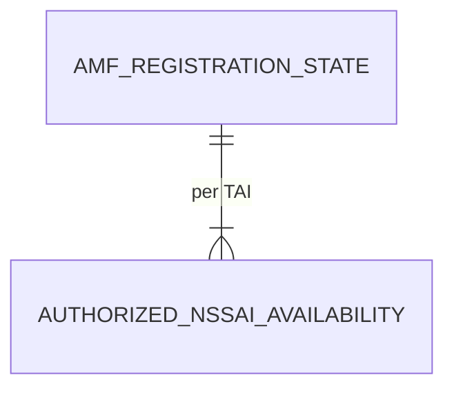

> **위키 편입 정보**
> - 원본: `doc/analysis/impl-specs/NSSF_db_design.md`
> - last_updated: 2026-05-26
> - 안정 ID 요약: ENT=16 (Config=7, Runtime-persistent=5, Runtime-ephemeral=3, Singleton=1)

# NSSF DB 설계

## 0. 메타

| 항목 | 값 |
|---|---|
| 대상 NF | NSSF |
| 메인 규격 | TS 29.531 j60 (Rel-18) |
| 결정된 `tech_stack.db` | **hybrid: in-memory (uthash) + PostgreSQL (libpq)** — 인메모리는 hot subscription·per-TA NSSAI 캐시용 (TTL/짧은 수명 + 빠른 콜백 발송), PostgreSQL은 슬라이스 정책·구독 영속(restart 후 복구)·운영 감사용 (`agent_context.json` notes 인용) |
| 도메인 힌트 | [NSSF_hints.md](../sources/NSSF-hints.md) H4·H8 적용 |
| 입력 산출물 | [NSSF_api_analysis.md](../implementation-specs/NSSF-api-spec.md) (§2 data models, §3 공통 타입, §7-A Subscribe/Notify) / [NSSF_procedure_analysis.md](../entities-features/NSSF-procedure-analysis.md) (§7 상태 전이 표 — PROC-0001/0005/0013~0020) / [29.531_features.md](../entities-features/29.531-features.md) (DAT 39 / CFG 0 / SVC 44 / SEC 4 / PRC 3 / MGMT 1) |
| `target_language` | C |

## 1. 엔티티 식별

| 엔티티 ID | 논리명 | 영역 | 출처 | 1차 설명 | 상태 |
|---|---|---|---|---|---|
| NSSF-ENT-0001 | NSSAI Configuration per TAI | Config | 힌트 H4, 29.531 §6.1.6 / 23.501 §5.15.5 | 운영자가 사전 설정하는 PLMN/TAI별 지원 S-NSSAI 리스트 (Configured/Allowed NSSAI 결정 기반) | active |
| NSSF-ENT-0002 | Restricted S-NSSAI per TAI per PLMN | Config | 힌트 H4, api §2.2 RestrictedSnssai, 29.531 §6.2.6.2.5 | TAI/PLMN 단위 제한 슬라이스; Allowed NSSAI 계산 입력 | active |
| NSSF-ENT-0003 | AMF Set ↔ S-NSSAI 매핑 | Config | 힌트 H4, api §2.1 AuthorizedNetworkSliceInfo.targetAmfSet, 23.501 §5.15.10 | 슬라이스별 서비스 가능한 AMF Set 식별자 / candidate AMF NF Instance ID 풀 | active |
| NSSF-ENT-0004 | NSI ID ↔ S-NSSAI 매핑 | Config | 힌트 H4, api §2.1 NsiInformation·SnssaiInfo, 29.531 §6.1.6 | Network Slice Instance 식별자와 S-NSSAI 매핑 (NWDAF/AMF 반환) | active |
| NSSF-ENT-0005 | NRF address mapping per slice | Config | 힌트 H4, api §2.1 NsiInformation(nrfId/nrfNfMgtUri/nrfAccessTokenUri), 29.531 §6.1.6.2.3 | 슬라이스 내 NF 발견용 NRF / AMF 후보 선택용 NRF 주소 | active |
| NSSF-ENT-0006 | VPLMN↔HPLMN S-NSSAI Mapping | Config | 힌트 H4, api §2.1 MappingOfSnssai, 23.501 §5.15.6 | 로밍 시 슬라이스 ID 변환 테이블 (SMF+PGW-C / vNSSF 사용) | active |
| NSSF-ENT-0007 | NSAG Configuration per TAI | Config | 힌트 H4, api §2.1 NsagInfo, 23.501 §5.15.14 | TAI별 NSAG 구성·Configured NSSAI 매핑 | active |
| NSSF-ENT-0008 | AMF Registration State per nfId | Runtime (persistent) | PROC-0013 §7 상태 전이, api §2.2 NssaiAvailabilityInfo, 29.531 §5.3.2.2 | AMF 가 Update operation 으로 등록한 per-TA 지원 S-NSSAI / NSAG 집합 | active |
| NSSF-ENT-0009 | Authorized NSSAI Availability per AMF | Runtime (persistent) | PROC-0013·PROC-0015 §7, api §2.2 AuthorizedNssaiAvailabilityData, 29.531 §6.2.6 | NSSF 가 인증한 결과 (per-TA, restrictedSnssaiList 포함) | active |
| NSSF-ENT-0010 | NSSAI Availability Subscription | Runtime (persistent) | PROC-0014·PROC-0018·PROC-0020 §7, api §2.5 NssfEventSubscriptionCreate*, 29.531 §6.2.5 | AMF / V-NSSF 가 등록한 변경 통지 구독 (subscriptionId, callbackUri, filter, expiry, events) | active |
| NSSF-ENT-0011 | NSSAI Validity Time entry per S-NSSAI | Runtime (persistent) | PROC-0017 §7, api §2.9 NssfEventNotification.nssaiValidityTimeInfoList, 23.501 §5.15.x | S-NSSAI 유효시간 정책 (`SNSSAI_VALIDITY_TIME_REPORT` 트리거 입력) | active |
| NSSF-ENT-0012 | Slice Replacement Plan/State | Runtime (persistent) | PROC-0016 §7, api §2.5 SnssaiReplacementSubscribeInfo·NsiUnavailabilitySubscribeInfo, 23.501 §5.15.19/§5.15.20 | OAM / NWDAF 트리거 기반 Slice/NSI Replacement 진행 상태 + Alternative S-NSSAI 매핑 | active |
| NSSF-ENT-0013 | OAuth2 Access Token Cache (per target NF) | Runtime (ephemeral) | PROC-0005 §7, api §4 NRF Access Token 의존성 | NSSF→NRF Access Token Request 결과 캐시 (TTL: `expires_in`) | active |
| NSSF-ENT-0014 | HTTP/2 Client Connection Pool | Runtime (ephemeral) | PROC-0001·PROC-0003·PROC-0004·PROC-0005·PROC-0015~0017, libcurl easy/multi handle pool | NRF·Consumer NF 콜백 송신 연결 풀 | active |
| NSSF-ENT-0015 | Notification Queue (pending tasks) | Runtime (ephemeral) | PROC-0013·PROC-0015~0017 §7 알림 큐 | 대기 중 Notify 작업 (subscriptionId, payload, 재시도 카운트, 다음 시도 시각) | active |
| NSSF-ENT-0016 | NSSF NRF Registration State | Runtime (persistent) | PROC-0001~0003 §7, 29.510 §5.2.2 | 본 NSSF 의 NRF 등록 상태 (nfInstanceId, nfStatus, heartBeatTimer, 마지막 heartbeat 시각) — 재시작 후 복구 |  active |

## 2. 5축 분류

| 엔티티 ID | P | V | C | X | L | 결정 근거 |
|---|---|---|---|---|---|---|
| NSSF-ENT-0001 | persistent | read-mostly | bounded(N×TAI 수) | read-write-lock | permanent | 운영자가 사전 설정·드물게 갱신; 모든 NSSelection_Get(PROC-0006~0012) 가 핫 경로에서 조회 → uthash 캐시 필수 |
| NSSF-ENT-0002 | persistent | read-mostly | bounded | read-write-lock | permanent | 동 — PLMN×TAI 차원, 정책 변경 시에만 쓰기 |
| NSSF-ENT-0003 | persistent | read-mostly | bounded | read-write-lock | permanent | 동 — AMF Set 카디널리티 제한적 |
| NSSF-ENT-0004 | persistent | read-mostly | bounded(슬라이스 수) | read-write-lock | permanent | NWDAF / Registration 조회 핫 경로 |
| NSSF-ENT-0005 | persistent | read-mostly | bounded | read-write-lock | permanent | NRF 주소 안정적, 슬라이스당 1개 |
| NSSF-ENT-0006 | persistent | read-mostly | bounded | read-write-lock | permanent | HR roaming PDU Session(PROC-0008) 조회 |
| NSSF-ENT-0007 | persistent | read-mostly | bounded | read-write-lock | permanent | NSAG 구성 변경 드뭄 |
| NSSF-ENT-0008 | persistent | write-heavy | unbounded (AMF 수에 비례) | serializable | session (AMF 라이프사이클) | PROC-0013 PUT/PATCH 가 직접 갱신; 데이터 일관성 중요 (`If-Match` 운영 시 강한 격리) |
| NSSF-ENT-0009 | persistent | write-heavy | unbounded | serializable | session | PROC-0013 응답·PROC-0015 알림 기준 — AMF 등록과 1:1 |
| NSSF-ENT-0010 | persistent | write-heavy | bounded(구독자 수) | serializable | ttl (`expiry`) | PROC-0014 Create/Modify, PROC-0018 Delete, PROC-0020 만료; SVC-0016 (M-Not): 동일 expiry 다중 구독 금지 → 균등 분산 필요 |
| NSSF-ENT-0011 | persistent | read-mostly | bounded | read-write-lock | ttl (정책 수명) | PROC-0017 트리거 입력 |
| NSSF-ENT-0012 | persistent | write-heavy | bounded(동시 활성 replacement 수) | serializable | session (대체 종료 시까지) | PROC-0016 — Replacement 시작/종료 |
| NSSF-ENT-0013 | ephemeral | write-heavy | bounded(target NF 종류) | lock-free (atomic swap) | ttl (`expires_in`) | PROC-0005 — 발급/사용/만료, restart 후 재발급 |
| NSSF-ENT-0014 | ephemeral | write-heavy | bounded | serializable (libuv 단일 스레드 + libcurl multi) | session (NF 연결 수명) | PROC-0001~0003·0015~0017 — connection 재사용 필수 |
| NSSF-ENT-0015 | ephemeral | write-heavy | unbounded (burst 가능, backpressure 필요) | serializable (FIFO + 재시도) | ttl (재시도 한도) | PROC-0013·0015~0017 — 손실 허용 (구독자가 자체 재요청 가능) |
| NSSF-ENT-0016 | persistent | read-mostly | singleton | read-write-lock | permanent | PROC-0001~0003 — restart 후 NRF 재등록 결정 입력 |

## 3. 공통 타입 매핑 (api-analysis §3 상속)

본 산출물은 [NSSF_api_analysis.md §3](../implementation-specs/NSSF-api-spec.md) 의 C 매핑 원칙을 *그대로 상속*하며 추가 변경하지 않습니다. 핵심 매핑 요약 (참조용):

| 3GPP 타입 | C 표현 (api-analysis §3) |
|---|---|
| `Snssai` | `struct snssai { uint8_t sst; char sd[7]; bool has_sd; }` |
| `Tai` | `struct tai { struct plmn_id plmn; char tac[7]; char nid[12]; bool has_nid; }` |
| `PlmnId` | `struct plmn_id { char mcc[4]; char mnc[4]; }` |
| `NfInstanceId` | `char nf_id[37]` (RFC 4122 UUID) |
| `Uri` | `char *uri` (동적) |
| `DateTime` | `time_t` 또는 `struct timespec` (ISO 8601 직렬화 별도) |
| `SupportedFeatures` | hex 문자열 ↔ `uint64_t bitmap[K]` 변환 |
| `ProblemDetails` | api-analysis §3 참조 |

> 신규 공통 타입 매핑 필요 사례 발견되지 않음. drift 방지: api-analysis §3 변경 시 본 절 재인용 갱신 필수.

## 4. 저장소 선택

| 엔티티 ID | 5축 라벨 | 선택 저장소 | 자료구조/스키마 형태 | 검색 키 | 선택 사유 |
|---|---|---|---|---|---|
| NSSF-ENT-0001 | persist+RM+bounded+RWL+perm | **PostgreSQL** (원본) + **uthash** (캐시) | PG: `nssai_config_per_tai` 테이블 / uthash: `(PlmnId, Tai) → struct nssai_config_entry`  | PK=`(plmn_mcc, plmn_mnc, tac, [nid])` | persistent+read-mostly → PG, 핫 경로 조회 → uthash. Restart 시 PG → uthash 로드 |
| NSSF-ENT-0002 | persist+RM+bounded+RWL+perm | **PostgreSQL** + **uthash** | PG: `restricted_snssai_per_tai_plmn` / uthash: `(Tai, HomePlmnId) → list<Snssai>` | PK=`(tac, [nid], mcc_home, mnc_home)` | 동 |
| NSSF-ENT-0003 | persist+RM+bounded+RWL+perm | **PostgreSQL** + **uthash** | PG: `amf_set_snssai_mapping` / uthash: `(AmfSetId or Snssai) → ...` | PK=`amf_set_id` + 보조 인덱스 `(sst,sd)` | NSSelection_Get 핫 경로 — uthash 양방향 인덱스 |
| NSSF-ENT-0004 | persist+RM+bounded+RWL+perm | **PostgreSQL** + **uthash** | PG: `nsi_snssai_mapping` / uthash: `Snssai → list<NsiId>` | PK=`(sst,sd,nsi_id)` | NWDAF (PROC-0011) 핫 경로 |
| NSSF-ENT-0005 | persist+RM+bounded+RWL+perm | **PostgreSQL** + **uthash** | PG: `nrf_per_slice` / uthash: `Snssai → struct nrf_info` | PK=`(sst,sd)` | NsiInformation 응답 구성 시 사용 |
| NSSF-ENT-0006 | persist+RM+bounded+RWL+perm | **PostgreSQL** + **uthash** | PG: `vplmn_hplmn_snssai_mapping` / uthash: `(VPLMN, ServingSnssai) → HomeSnssai` | PK=`(vplmn_mcc, vplmn_mnc, serving_sst, serving_sd)` | HR roaming (PROC-0008/0012) |
| NSSF-ENT-0007 | persist+RM+bounded+RWL+perm | **PostgreSQL** + **uthash** | PG: `nsag_config` / uthash: `Tai → list<NsagInfo>` | PK=`(tac, [nid], nsag_id)` | |
| NSSF-ENT-0008 | persist+WH+unbounded+ser+session | **PostgreSQL** (primary) + **uthash** (hot cache, write-through) | PG: `amf_registration_state` JSONB column 보관 / uthash: `nfId → struct amf_reg_record*` (활성만) | PK=`nf_id (UUID)` | 정합성 우선 → PG가 진실 원천. uthash 는 active AMF 캐시 (TTL 없이, AMF Delete 시 evict). Hybrid 의 영속성·속도 균형 |
| NSSF-ENT-0009 | persist+WH+unbounded+ser+session | **PostgreSQL** + **uthash** | PG: `authorized_nssai_availability` (JSONB) / uthash: 동 ENT-0008 의 record 내 nested | PK=`(nf_id, tac, [nid])` (FK→ENT-0008) | 0008 과 1:N (AMF당 다중 TA) |
| NSSF-ENT-0010 | persist+WH+bounded+ser+ttl | **PostgreSQL** (primary) + **uthash** (hot subscription cache, 콜백 발송 빠른 lookup) | PG: `nssai_availability_subscription` / uthash: `subscriptionId → struct subscription_record*` + 보조 인덱스 `taiList`·`amfSetId`·`event` | PK=`subscription_id` (string UUID 또는 단조 증가 ID); 보조 인덱스 `(event, tac, mcc, mnc)` | Notify 핫 경로 — 변경 이벤트당 매칭 구독자 빠른 조회 필요 → uthash 다중 인덱스. PG 는 만료/감사용 |
| NSSF-ENT-0011 | persist+RM+bounded+RWL+ttl | **PostgreSQL** + **uthash** | PG: `nssai_validity_time` / uthash: `Snssai → list<RecurTime>` | PK=`(sst, sd, valid_from, valid_until)` | PROC-0017 트리거 시 빠른 조회 |
| NSSF-ENT-0012 | persist+WH+bounded+ser+session | **PostgreSQL** | PG: `slice_replacement_state` (JSONB) | PK=`replacement_id` (UUID) + idx `(snssai_to_replace)` | 동시 활성 replacement 수 제한적 + 영속 필요 (restart 후 복구) |
| NSSF-ENT-0013 | ephem+WH+bounded+lock-free+ttl | **uthash** (in-memory only) | `(targetNfType, scope) → struct token_entry { char *token; time_t expires_at; }` | PK=`(targetNfType, scope, [aud])` | restart 후 즉시 재발급 가능 — 영속 불필요 |
| NSSF-ENT-0014 | ephem+WH+bounded+ser+session | **uthash** + libcurl multi handle | `(remoteUrl) → struct conn_entry { CURL *easy_handle; struct connection_state; }` | PK=`(scheme, host, port)` | libcurl multi handle 풀 — libuv 단일 이벤트 루프와 통합 |
| NSSF-ENT-0015 | ephem+WH+unbounded+ser+ttl | **uthash** (FIFO 큐 + 재시도 백오프) | `struct notify_task { subscriptionId, payload, attempts, next_retry_at }` 의 doubly-linked list + uthash index | PK=`task_id` (단조 증가) | restart 시 손실 허용 (구독자가 polling 또는 NSSF 가 보낸 시점 다음 update 시 재포함). 영속화는 운영 결정 — 본 설계는 ephemeral |
| NSSF-ENT-0016 | persist+RM+singleton+RWL+perm | **PostgreSQL** | PG: `nssf_nrf_registration` (singleton 1행) | PK=`id=1` (constant) | restart 후 NRF heartbeat / 재등록 결정 — 영속 필요 |

## 5. 스키마

### 5-A. Config 영역 — 정적 설정 스키마

설정 파일 형식: **JSON** (cJSON 파싱). 위치: `dev/conf/nssfd.conf.json` (project.conf_dir 기반).

#### 5-A.1 최상위 키 구조

| 키 | 타입 | M/O | default | 검증 규칙 |
|---|---|---|---|---|
| `nfInstanceId` | string (UUID) | M | – | RFC 4122 형식 |
| `nfStatus` | enum {`REGISTERED`, `SUSPENDED`} | M | `REGISTERED` | – |
| `plmnList` | array<PlmnId> | M | – | min 1 |
| `httpServer.bindHost` | string | M | `::` | – |
| `httpServer.bindPort` | uint16 | M | 8443 | 1024..65535 |
| `httpServer.tls.certPath` | string (path) | M | – | 파일 존재·읽기 가능 |
| `httpServer.tls.keyPath` | string (path) | M | – | 동 |
| `httpServer.tls.caPath` | string (path) | M | – | mTLS 검증용 |
| `nrf.uri` | Uri | M | – | https:// |
| `nrf.heartBeatHintSec` | int | O | 60 | 10..3600 (NRF 가 최종 결정) |
| `db.connStr` | string (PG conninfo) | M | – | libpq 형식 |
| `policy.nssaiConfig` | array<NssaiConfigEntry> | M | – | min 1 — ENT-0001 시드 |
| `policy.restrictedSnssai` | array<RestrictedEntry> | O | `[]` | ENT-0002 시드 |
| `policy.amfSetMapping` | array<AmfSetMappingEntry> | M | – | ENT-0003 시드 |
| `policy.nsiMapping` | array<NsiMappingEntry> | O | `[]` | ENT-0004 시드 |
| `policy.nrfPerSlice` | array<NrfPerSliceEntry> | O | `[]` | ENT-0005 시드 |
| `policy.vplmnHplmnMapping` | array<VplmnHplmnEntry> | O | `[]` | ENT-0006 시드 |
| `policy.nsagConfig` | array<NsagConfigEntry> | O | `[]` | ENT-0007 시드 |
| `policy.validityTime` | array<ValidityTimeEntry> | O | `[]` | ENT-0011 시드 |
| `subscriptions.defaultExpirySec` | int | O | 86400 | 60..2592000 |
| `notifications.maxRetries` | int | O | 5 | 0..20 |
| `notifications.retryBackoffMs` | int | O | 1000 | 100..60000 |
| `features.nsselection.bitmap` | string (hex) | O | `F` | NSSelection 4 bits (ES3XX=M, others O) |
| `features.nssaiavail.bitmap` | string (hex) | O | `78` | NSSAIAvailability 7 bits |
| `logging.level` | enum {`DEBUG`,`INFO`,`WARN`,`ERROR`} | O | `INFO` | zlog 카테고리별 override 가능 |

> 각 Entry 타입(`NssaiConfigEntry` 등)은 5-B 의 PostgreSQL 행과 1:1 대응. C 표현은 `impl-spec-generation` 이 cJSON 파서 코드로 구체화.

#### 5-A.2 C 표현 원칙

각 Config 엔티티는 `impl-spec-generation` 단계에서 `struct nssf_config { ... struct nssai_config_entry *nssai_configs; size_t n_nssai_configs; ... };` 형태로 통합. 본 설계 단계에서는 *원칙*만 기재 — 라이브러리 호출 없음.

### 5-B. Runtime 영역 — 인메모리/영속 스키마

#### 5-B.1 ENT-0008 AMF Registration State

| 필드 | 타입 | M/O | 카디 | 제약 | 출처 | 설명 |
|---|---|---|---|---|---|---|
| `nfId` | NfInstanceId (UUID) | M | 1 | RFC 4122 | api §2.2 path | PK |
| `amfSetId` | string | O | 0..1 | `^[0-9]{3}-[0-9]{2,3}-[A-Fa-f0-9]{2}-[0-3][A-Fa-f0-9]{2}$` | NssaiAvailabilityInfo.amfSetId | – |
| `supportedFeatures` | hex string | O | 0..1 | – | NssaiAvailabilityInfo.supportedFeatures | 협상된 |
| `supportedNssaiAvailabilityData` | JSONB (array of SupportedNssaiAvailabilityData) | M | 1..N | – | api §2.2 | per-TA NSSAI 지원 정보 |
| `createdAt` | timestamptz | M | 1 | – | – | 최초 PUT 시각 |
| `updatedAt` | timestamptz | M | 1 | – | – | 마지막 PUT/PATCH |
| `version` | int | M | 1 | – | – | 낙관적 락 (PATCH 시 optional `If-Match` 운영) |

#### 5-B.2 ENT-0009 Authorized NSSAI Availability per AMF

| 필드 | 타입 | M/O | 카디 | 제약 | 출처 | 설명 |
|---|---|---|---|---|---|---|
| `nfId` | NfInstanceId | M | 1 | FK→ENT-0008.nfId | api §2.2 | 복합 PK 일부 |
| `tac` | char(7) (hex) | M | 1 | – | api §2.2 Tai.tac | 복합 PK 일부 |
| `mcc` | char(4) | M | 1 | – | – | 복합 PK 일부 |
| `mnc` | char(4) | M | 1 | – | – | 복합 PK 일부 |
| `nid` | char(12) | O | 0..1 | – | – | SNPN 시 |
| `supportedSnssaiList` | JSONB (array of ExtSnssai) | M | 1..N | – | api §2.2 | – |
| `restrictedSnssaiList` | JSONB (array of RestrictedSnssai) | O | 0..N | – | api §2.2 | – |
| `nsagInfos` | JSONB (array of NsagInfo) | O | 0..N | – | api §2.2 | – |
| `updatedAt` | timestamptz | M | 1 | – | – | – |

#### 5-B.3 ENT-0010 NSSAI Availability Subscription

| 필드 | 타입 | M/O | 카디 | 제약 | 출처 | 설명 |
|---|---|---|---|---|---|---|
| `subscriptionId` | string (UUID 또는 단조 증가) | M | 1 | unique | api §2.5 (E5 응답) | PK; URL path 에 노출 |
| `nfNssaiAvailabilityUri` | text (URI) | M | 1 | https:// | api §2.5 | Callback URI |
| `event` | string (enum + open) | M | 1 | NssfEventType 또는 open | – | 주 이벤트 (불변 — SVC-0020 M-Not) |
| `additionalEvents` | JSONB (array of NssfEventType) | O | 0..N | – | – | – |
| `taiList` | JSONB (array of Tai) | O | 0..N | – | – | 관심 TAI |
| `taiRangeList` | JSONB (array of TaiRange) | O | 0..N | ONSSAI feature | – | – |
| `amfSetId` | string | O | 0..1 | – | SATAS feature | – |
| `amfId` | NfInstanceId | O | 0..1 | – | – | – |
| `expiry` | timestamptz | O | 0..1 | – | api §2.5 | SVC-0016: 동일 expiry 다중 구독 금지 → 분산 |
| `supportedFeatures` | hex | O | 0..1 | – | – | 협상된 |
| `nsrpSubscribeInfo` | JSONB | O (NSRP) | 0..1 | – | – | – |
| `nsiunSubscribeInfo` | JSONB | O (NSIUN) | 0..1 | – | – | – |
| `validityTimeSubList` | JSONB (array of Snssai) | O | 0..N | – | – | – |
| `consumerNfId` | NfInstanceId | M | 1 | – | (인증 결과 추출) | 누가 구독했는지 |
| `createdAt` | timestamptz | M | 1 | – | – | – |
| `lastNotifiedAt` | timestamptz | O | 0..1 | – | – | 최근 통지 시각 |
| `notifyFailureCount` | int | M | 1 | default 0 | – | – |
| `status` | enum {`ACTIVE`,`STALE`,`INVALIDATED`} | M | 1 | default `ACTIVE` | – | PROC-0015 6-B 영구 실패 시 상태 변경 |

#### 5-B.4 ENT-0011 NSSAI Validity Time Entry

| 필드 | 타입 | M/O | 카디 | 출처 | 설명 |
|---|---|---|---|---|---|
| `sst` | smallint | M | 1 | – | 복합 PK |
| `sd` | char(7) | O | 0..1 | – | 복합 PK |
| `validityWindow` | JSONB (RecurTime array) | M | 1..N | api §2.9 nssaiValidityTimeInfoList | – |
| `updatedAt` | timestamptz | M | 1 | – | – |

#### 5-B.5 ENT-0012 Slice Replacement State

| 필드 | 타입 | M/O | 카디 | 출처 | 설명 |
|---|---|---|---|---|---|
| `replacementId` | UUID | M | 1 | – | PK |
| `originalSnssai` | JSONB (Snssai) | M | 1 | 23.501 §5.15.19 | 대체 대상 |
| `alternativeSnssai` | JSONB (Snssai) | M | 1 | – | 대체용 |
| `affectedNsiList` | JSONB (array of NsiId) | O | 0..N | 23.501 §5.15.20 | – |
| `plmnId` | JSONB (PlmnId) | O | 0..1 | – | HPLMN 대체 시 |
| `mitigationPercent` | smallint | O | 0..1 | 0..100 | congestion 비율 |
| `state` | enum {`ACTIVE`,`STOPPING`,`TERMINATED`} | M | 1 | – | – |
| `startedAt` | timestamptz | M | 1 | – | – |
| `terminatedAt` | timestamptz | O | 0..1 | – | – |

#### 5-B.6 ENT-0013 OAuth2 Access Token Cache (in-memory only)

```c
struct token_entry {
    char target_nf_type[16];   /* "AMF" | "NRF" | ... */
    char scope[64];            /* "nnrf-nfm" 등 */
    char aud[37];              /* target NF Instance ID, optional */
    char *token;               /* heap, NUL-terminated bearer */
    time_t expires_at;
    UT_hash_handle hh;
};
```

#### 5-B.7 ENT-0014 HTTP/2 Client Connection Pool (in-memory only)

```c
struct conn_entry {
    char remote_url[256];      /* "https://host:port" */
    CURL *easy_handle;         /* libcurl easy handle */
    int state;                 /* IDLE | IN_USE | CLOSING */
    time_t last_used_at;
    UT_hash_handle hh;
};
```

#### 5-B.8 ENT-0015 Notification Queue (in-memory only)

```c
struct notify_task {
    uint64_t task_id;          /* monotonic */
    char subscription_id[64];
    char *payload_json;        /* heap */
    int attempts;
    time_t next_retry_at;
    struct notify_task *prev, *next;  /* FIFO + retry heap */
    UT_hash_handle hh;
};
```

#### 5-B.9 ENT-0016 NSSF NRF Registration State (singleton, persistent)

| 필드 | 타입 | M/O | 출처 | 설명 |
|---|---|---|---|---|
| `id` | int | M | – | constant 1 |
| `nfInstanceId` | UUID | M | – | 본 NSSF id |
| `nfStatus` | enum {`REGISTERED`,`SUSPENDED`,`UNREGISTERED`} | M | – | – |
| `heartBeatTimerSec` | int | O | NRF 응답 | 헬스비트 주기 |
| `lastHeartbeatAt` | timestamptz | O | – | – |
| `lastRegisteredAt` | timestamptz | O | – | – |

## 6. ERD

### 6-A. 전체 ERD

```mermaid
erDiagram
    NSSAI_CONFIG_PER_TAI {
        VARCHAR_4 plmn_mcc PK
        VARCHAR_4 plmn_mnc PK
        VARCHAR_7 tac PK
        VARCHAR_12 nid PK
        JSONB supported_snssai_list
    }
    RESTRICTED_SNSSAI_PER_TAI_PLMN {
        VARCHAR_7 tac PK
        VARCHAR_12 nid PK
        VARCHAR_4 mcc_home PK
        VARCHAR_4 mnc_home PK
        JSONB snssai_list
        BOOLEAN roaming_restriction
    }
    AMF_SET_SNSSAI_MAPPING {
        VARCHAR_15 amf_set_id PK
        JSONB snssai_list
        JSONB candidate_amf_list
    }
    NSI_SNSSAI_MAPPING {
        SMALLINT sst PK
        VARCHAR_7 sd PK
        TEXT nsi_id PK
    }
    NRF_PER_SLICE {
        SMALLINT sst PK
        VARCHAR_7 sd PK
        TEXT nrf_id
        TEXT nrf_nfm_uri
        TEXT nrf_access_token_uri
    }
    VPLMN_HPLMN_SNSSAI_MAPPING {
        VARCHAR_4 vplmn_mcc PK
        VARCHAR_4 vplmn_mnc PK
        SMALLINT serving_sst PK
        VARCHAR_7 serving_sd PK
        JSONB home_snssai
    }
    NSAG_CONFIG {
        VARCHAR_7 tac PK
        VARCHAR_12 nid PK
        VARCHAR_2 nsag_id PK
        JSONB snssai_list
    }
    AMF_REGISTRATION_STATE {
        UUID nf_id PK
        VARCHAR_15 amf_set_id
        VARCHAR_16 supported_features
        JSONB supported_nssai_availability_data
        TIMESTAMPTZ created_at
        TIMESTAMPTZ updated_at
        INTEGER version
    }
    AUTHORIZED_NSSAI_AVAILABILITY {
        UUID nf_id PK,FK
        VARCHAR_7 tac PK
        VARCHAR_4 mcc PK
        VARCHAR_4 mnc PK
        VARCHAR_12 nid PK
        JSONB supported_snssai_list
        JSONB restricted_snssai_list
        JSONB nsag_infos
        TIMESTAMPTZ updated_at
    }
    NSSAI_AVAILABILITY_SUBSCRIPTION {
        TEXT subscription_id PK
        TEXT nf_nssai_availability_uri
        TEXT event
        JSONB additional_events
        JSONB tai_list
        JSONB tai_range_list
        VARCHAR_15 amf_set_id
        UUID amf_id
        TIMESTAMPTZ expiry
        VARCHAR_16 supported_features
        JSONB nsrp_subscribe_info
        JSONB nsiun_subscribe_info
        JSONB validity_time_sub_list
        UUID consumer_nf_id
        TIMESTAMPTZ created_at
        TIMESTAMPTZ last_notified_at
        INTEGER notify_failure_count
        TEXT status
    }
    NSSAI_VALIDITY_TIME {
        SMALLINT sst PK
        VARCHAR_7 sd PK
        JSONB validity_window
        TIMESTAMPTZ updated_at
    }
    SLICE_REPLACEMENT_STATE {
        UUID replacement_id PK
        JSONB original_snssai
        JSONB alternative_snssai
        JSONB affected_nsi_list
        JSONB plmn_id
        SMALLINT mitigation_percent
        TEXT state
        TIMESTAMPTZ started_at
        TIMESTAMPTZ terminated_at
    }
    NSSF_NRF_REGISTRATION {
        INTEGER id PK
        UUID nf_instance_id
        TEXT nf_status
        INTEGER heart_beat_timer_sec
        TIMESTAMPTZ last_heartbeat_at
        TIMESTAMPTZ last_registered_at
    }
    AMF_REGISTRATION_STATE ||--|{ AUTHORIZED_NSSAI_AVAILABILITY : "produces (per TAI)"
```



> **인메모리 전용 엔티티**(ENT-0013/0014/0015)는 ERD에 등장하지 않음 — 영속 스토리지 비사용.

### 6-B. 영역별 정리

#### Config 영역: 영속 테이블 ↔ uthash 캐시 매핑

| 영속 테이블 | uthash 캐시 키 | 캐시 값 (struct) | 갱신 트리거 | 비고 |
|---|---|---|---|---|
| `nssai_config_per_tai` | `(plmn_mcc, plmn_mnc, tac, nid)` 4튜플 | `struct nssai_config_entry` | 기동 시 lazy load, 정책 변경 알람 시 reload | PROC-0006~0012 핫 경로 |
| `restricted_snssai_per_tai_plmn` | `(tac, nid, mcc_home, mnc_home)` | `struct restricted_snssai_entry` | 동 | – |
| `amf_set_snssai_mapping` | `amf_set_id` + 보조 `(sst,sd)` | `struct amf_set_entry` | 동 | NSSelection_Get 핫 경로 |
| `nsi_snssai_mapping` | `(sst,sd)` → list<NsiId> | `struct nsi_entry` | 동 | PROC-0011 NWDAF |
| `nrf_per_slice` | `(sst,sd)` | `struct nrf_info` | 동 | – |
| `vplmn_hplmn_snssai_mapping` | `(vplmn_mcc, vplmn_mnc, serving_sst, serving_sd)` | `struct vplmn_hplmn_entry` | 동 | PROC-0008/0012 |
| `nsag_config` | `(tac, nid, nsag_id)` | `struct nsag_entry` | 동 | – |

#### Runtime 영역: 부분 ERD

**AMF Availability 클러스터** (write-through cache):



uthash 캐시: `amf_id → struct amf_reg_record { struct amf_authorized_per_tai *tais; size_t n_tais; }`. PG 가 SoR (Source of Record).

**Subscription 클러스터** (uthash 다중 인덱스):

| uthash 키 | 값 | 목적 |
|---|---|---|
| `subscription_id` | `struct subscription_record*` | E6/E7 단건 조회 |
| `(event_enum, tai_hash)` | bucketed list of subscription_id | PROC-0015 Notify 대상 빠른 매칭 |
| `amf_set_id` | bucketed list | SATAS feature 매칭 |

### 6-C. 카디널리티 / 무결성 / 인덱스 요약

#### FK 관계

| 부모 테이블 | 자식 테이블 | 카디 | CASCADE 정책 |
|---|---|---|---|
| `amf_registration_state` | `authorized_nssai_availability` | 1..N | `ON DELETE CASCADE` (PROC-0019 AMF Delete 시 인증 데이터 동시 삭제) |

> `nssai_availability_subscription`·`slice_replacement_state` 는 부모 FK 없음(이벤트 발생원이 외부 — AMF/NWDAF/OAM). subscription 의 `consumer_nf_id`는 정보용 컬럼.

#### Unique 제약

| 테이블 | UNIQUE 조합 |
|---|---|
| `nssai_availability_subscription` | `subscription_id` (PK) |
| `nssf_nrf_registration` | `id` (PK, singleton) |
| `slice_replacement_state` | `replacement_id` (PK), 보조 unique `(original_snssai, state=ACTIVE)` 부분 인덱스 (동일 S-NSSAI 중복 active replacement 방지) |

#### 인덱스 (PostgreSQL)

| 인덱스명 | 테이블 | 컬럼 | 가속 목적 |
|---|---|---|---|
| `idx_amf_reg_amf_set` | `amf_registration_state` | `amf_set_id` | SATAS 매칭 |
| `idx_sub_event_status` | `nssai_availability_subscription` | `(event, status)` | 활성 구독 스캔 |
| `idx_sub_expiry` | `nssai_availability_subscription` | `expiry` | PROC-0020 만료 스캐너 |
| `idx_sub_consumer` | `nssai_availability_subscription` | `consumer_nf_id` | Consumer별 구독 조회 |
| `idx_authorized_tac_plmn` | `authorized_nssai_availability` | `(tac, mcc, mnc)` | per-TA Notify 영향 분석 |
| `idx_slice_repl_active` | `slice_replacement_state` | `state` (partial WHERE state=`ACTIVE`) | 활성 replacement 스캔 |

## 7. CRUD 인터페이스

### 7.1 NSSF-ENT-0001 NSSAI Configuration per TAI

| 작업명 | 입력 | 출력 | Side Effects | 에러 시맨틱 | 동시성 |
|---|---|---|---|---|---|
| `LoadFromConfigFile` | path | count loaded | uthash 채움 | 파일 무결성 실패 → NF 기동 거부 | exclusive (기동 시) |
| `ReadByTai` | `(plmn, tac, nid)` | `struct nssai_config_entry` 또는 NULL | – | NULL = 미정의 → caller 가 default 정책 적용 | read-lock |
| `ReloadOnSighup` | path | count reloaded | uthash 원자 교체 | 부분 실패 시 이전 버전 유지 + 알람 | exclusive (lock-swap) |

### 7.2 ENT-0002~0007 (Config 엔티티들)

ENT-0001 와 동일 패턴 (`LoadFromConfigFile` / `ReadBy{key}` / `ReloadOnSighup`). 검색 키만 5-B 참조.

### 7.3 NSSF-ENT-0008 AMF Registration State

| 작업명 | 입력 | 출력 | Side Effects | 에러 시맨틱 | 동시성 |
|---|---|---|---|---|---|
| `UpsertByNfId` (PUT) | `nfId, NssaiAvailabilityInfo` | `AuthorizedNssaiAvailabilityInfo` | uthash write-through, 0009 갱신, 0015 enqueue Notify | 중복 키 X (Upsert), `version` 증가 | serializable (per-nfId row lock) |
| `PatchByNfId` (PATCH) | `nfId, PatchDocument` | `AuthorizedNssaiAvailabilityInfo` | 동, JSON Patch 적용 | nfId 미존재 → 404, Patch 무결성 위반 → 400 | serializable |
| `ReadByNfId` | `nfId` | `struct amf_reg_record` 또는 NULL | – | NULL → 404 | read-lock (또는 lock-free if uthash atomic) |
| `DeleteByNfId` | `nfId` | bool deleted | 0009 CASCADE, 0010 영향 구독 알림 enqueue (PROC-0015), 0015 enqueue | 미존재 → 멱등 처리 (204 또는 404 운영 정책) | serializable |
| `IterAll` | – | iterator | – | – | snapshot (read-only) |

### 7.4 NSSF-ENT-0009 Authorized NSSAI Availability per AMF

| 작업명 | 입력 | 출력 | Side Effects | 에러 시맨틱 | 동시성 |
|---|---|---|---|---|---|
| `UpsertByKey` | `(nfId, tac, mcc, mnc, nid?, data)` | – | 동 0008 트랜잭션 내부 | FK 위반 → 400 | serializable |
| `ReadByNfId` | `nfId` | array of authorized data | – | – | read-lock |
| `ReadByTai` | `(tac, mcc, mnc, nid?)` | array of authorized data (모든 AMF) | – | – | read-lock |
| `DeleteByNfId` | `nfId` | int deleted | – | – | serializable (FK CASCADE) |

### 7.5 NSSF-ENT-0010 NSSAI Availability Subscription

| 작업명 | 입력 | 출력 | Side Effects | 에러 시맨틱 | 동시성 |
|---|---|---|---|---|---|
| `Create` | NssfEventSubscriptionCreateData + consumerNfId | `subscriptionId, expiry, acceptedEvents` | uthash 다중 인덱스 갱신 | 모든 event 미지원 → 501 | serializable |
| `PatchById` (SUMOD) | `subscriptionId, PatchDocument` | NssfEventSubscriptionCreatedData | uthash 인덱스 재계산 | event IE 수정 시도 → 400 (MODIFICATION_NOT_ALLOWED), 미존재 → 404 | serializable |
| `ReadById` | `subscriptionId` | record | – | – | read-lock |
| `DeleteById` | `subscriptionId` | bool | uthash evict, 진행 중 알림 작업 cancel | 미존재 → 멱등 | serializable |
| `FindMatching` | `event, tai, snssai, plmn, amfSetId, nfId` | iterator of subscription_id | – | – | read-lock |
| `ExpireDueAt` | `now` | iterator | DeleteById cascade | – | serializable (per row) |

### 7.6 NSSF-ENT-0011 NSSAI Validity Time

| 작업명 | 입력 | 출력 | Side Effects | 에러 시맨틱 | 동시성 |
|---|---|---|---|---|---|
| `UpsertBySnssai` | `(sst, sd, RecurTime[])` | – | 0015 enqueue Notify(SNSSAI_VALIDITY_TIME_REPORT) | – | RWL |
| `ReadBySnssai` | `(sst, sd)` | RecurTime[] | – | – | read-lock |
| `DeleteBySnssai` | `(sst, sd)` | – | – | – | RWL |

### 7.7 NSSF-ENT-0012 Slice Replacement State

| 작업명 | 입력 | 출력 | Side Effects | 에러 시맨틱 | 동시성 |
|---|---|---|---|---|---|
| `StartReplacement` | originalSnssai, alternativeSnssai, scope | replacementId | 0015 enqueue Notify(SNSSAI_REPLACEMENT_REPORT) | 동일 SNSSAI active 중복 → 409 (UNIQUE constraint) | serializable |
| `StopReplacement` | `replacementId` | – | 0015 enqueue stop-indication notification | 미존재 → 404 | serializable |
| `TerminateReplacement` | `replacementId` | – | 0015 enqueue terminate-indication, move-back 안내 | 미존재 → 404 | serializable |
| `ReadActive` | filter (snssai/plmn) | iterator | – | – | read-lock |

### 7.8 NSSF-ENT-0013 OAuth2 Token Cache

| 작업명 | 입력 | 출력 | Side Effects | 에러 시맨틱 | 동시성 |
|---|---|---|---|---|---|
| `GetOrFetch` | `(targetNfType, scope, aud)` | bearer token | 미스 시 PROC-0005 호출 (NRF), uthash 갱신 | NRF 실패 → caller 가 알람 + 백오프 | lock-free (atomic insert + double-check) |
| `Invalidate` | `(targetNfType, scope, aud)` | – | – | – | lock-free |
| `PurgeExpired` | `now` | int n purged | – | – | timer 콜백 |

### 7.9 NSSF-ENT-0014 HTTP/2 Client Connection Pool

| 작업명 | 입력 | 출력 | Side Effects | 에러 시맨틱 | 동시성 |
|---|---|---|---|---|---|
| `AcquireConn` | `remoteUrl` | CURL easy_handle | uthash 갱신, state=IN_USE | 풀 한계 초과 → caller 대기 또는 거부 | serializable (libuv 단일 스레드) |
| `ReleaseConn` | conn entry | – | state=IDLE, last_used_at 갱신 | – | serializable |
| `PurgeIdle` | `now, idle_timeout` | int n closed | libcurl easy_cleanup | – | timer 콜백 |

### 7.10 NSSF-ENT-0015 Notification Queue

| 작업명 | 입력 | 출력 | Side Effects | 에러 시맨틱 | 동시성 |
|---|---|---|---|---|---|
| `Enqueue` | subscriptionId, payload | task_id | linked list append | 큐 한계 초과 시 backpressure (운영 정책: drop oldest 또는 reject) | serializable |
| `DequeueDue` | `now` | iterator of task | – | – | serializable |
| `MarkSuccess` | task_id | – | uthash evict | – | serializable |
| `MarkRetry` | task_id, backoffMs | – | next_retry_at 갱신, attempts++ | attempts > maxRetries → MarkPermanentFail | serializable |
| `MarkPermanentFail` | task_id | – | uthash evict, 0010 status=`STALE`/`INVALIDATED` | – | serializable |

### 7.11 NSSF-ENT-0016 NSSF NRF Registration State

| 작업명 | 입력 | 출력 | Side Effects | 에러 시맨틱 | 동시성 |
|---|---|---|---|---|---|
| `LoadOnBoot` | – | record (또는 첫 기동이면 NULL) | – | – | exclusive |
| `MarkRegistered` | nfInstanceId, heartBeatTimerSec | – | – | – | serializable |
| `MarkUnregistered` | – | – | – | – | serializable |
| `UpdateHeartbeat` | timestamp | – | – | – | RWL |

## 8. 트랜잭션·재시작·시드

### 8-A. 트랜잭션 경계

| 트랜잭션명 | 포함 작업 | 원자성 필요 사유 | 격리 수준 |
|---|---|---|---|
| `T-AMF-UPSERT` | ENT-0008.Upsert + ENT-0009.Upsert + ENT-0015.Enqueue (in-memory) | PUT 응답 시점에 ENT-0008/0009 일관 + 알림 손실 방지 (PG 트랜잭션 COMMIT 후 enqueue) | `REPEATABLE READ` |
| `T-AMF-PATCH` | ENT-0008.Patch + ENT-0009.Upsert + ENT-0015.Enqueue | 동, JSON Patch 적용 중 동시성 충돌 | `REPEATABLE READ` + 행 락 (`SELECT ... FOR UPDATE`) |
| `T-AMF-DELETE` | ENT-0008.Delete (→ FK CASCADE → ENT-0009) + ENT-0010 영향 구독 통지 enqueue | AMF 컨텍스트 삭제와 후속 통지의 원자성 | `READ COMMITTED` (FK CASCADE 충분) |
| `T-SUB-CREATE` | ENT-0010.Create + uthash 다중 인덱스 갱신 | subscriptionId 유일성 보장 + 인덱스 정합 | `SERIALIZABLE` 또는 unique constraint + retry |
| `T-SUB-MODIFY` | ENT-0010.PatchById + uthash 인덱스 재계산 | event IE 불변 검증 + 일관 | `REPEATABLE READ` |
| `T-SUB-EXPIRE` | ENT-0010.ExpireDueAt (배치) + uthash evict | 배치 단위 원자성 (per row 또는 chunk) | `READ COMMITTED` |
| `T-REPLACE-START` | ENT-0012.Start + ENT-0015.Enqueue | 중복 active replacement 방지 + 알림 enqueue | `SERIALIZABLE` (partial unique index) |
| `T-NRF-REG` | ENT-0016.MarkRegistered | singleton 갱신 | `READ COMMITTED` |

### 8-B. 재시작·복구 정책

| 영역 / 엔티티 | 재시작 시 동작 |
|---|---|
| Config (ENT-0001~0007) | 항상 리로드 (`nssfd.conf.json` → PG `policy.*` 테이블 → uthash). 검증 실패 시 NSSF 기동 거부 |
| ENT-0008 AMF Registration | PG → uthash 로드. **CHALLENGE**: AMF 가 NSSF 재시작을 모르므로 stale entry 가능 — `updated_at` 기반 stale window 정책 (예: 24h 이상이면 알람 또는 자동 폐기, 운영 결정) |
| ENT-0009 Authorized | ENT-0008 와 동시 로드 |
| ENT-0010 Subscription | PG → uthash 로드. **재시작 후 NSSF 가 보유한 구독 활성 유지**. 미처리 변경 이벤트 발생 시 다음 Update 트리거 시 자연 통지 |
| ENT-0011 Validity Time | PG → uthash 로드 |
| ENT-0012 Slice Replacement | PG → 메모리 로드. ACTIVE 상태 replacement 는 그대로 유지 |
| ENT-0013 Token Cache | 빈 상태로 시작 — 사용 시 PROC-0005 재발급 |
| ENT-0014 Connection Pool | 빈 상태로 시작 — 사용 시 새 연결 |
| ENT-0015 Notification Queue | 빈 상태로 시작 — 손실된 통지는 다음 변경 시 자연 포함 (운영 정책: 영속화 시 PostgreSQL `notification_outbox` 추가 필요. 현 설계는 비영속) |
| ENT-0016 NSSF NRF Registration | PG → 로드. 직전 상태가 `REGISTERED` 면 즉시 heartbeat 재개. `UNREGISTERED` 면 PROC-0001 자동 트리거 |

**추가 정책**: NSSF 기동 시 모든 Config 검증 + PG 연결 + NRF 등록(PROC-0001) 성공이 *필수* — 어느 단계 실패하면 기동 거부 (운영 알람).

### 8-C. 시드 데이터

| 엔티티 ID | 시드 필요 | 시드 출처 | 시드 내용 |
|---|---|---|---|
| ENT-0001 | M | `nssfd.conf.json` `policy.nssaiConfig` | PLMN×TAI 별 supportedSnssai 리스트 (POC: 최소 1 PLMN, 3 TAC, 2~5 S-NSSAI) |
| ENT-0002 | O | `policy.restrictedSnssai` | – (POC: roaming 시나리오 시험용 1~2건) |
| ENT-0003 | M | `policy.amfSetMapping` | AMF Set ID 1개 + 후보 NfInstanceId 1~3개 |
| ENT-0004 | O | `policy.nsiMapping` | (POC: NWDAF 시험용 1~2 S-NSSAI ↔ NSI ID) |
| ENT-0005 | O | `policy.nrfPerSlice` | (slice별 NRF 시험용; 미시드 시 default NRF 사용) |
| ENT-0006 | O | `policy.vplmnHplmnMapping` | (HR roaming 시험용) |
| ENT-0007 | O | `policy.nsagConfig` | (NSAG 시험용) |
| ENT-0008/0009/0010/0011/0012 | – | – | 운영 중 동적 생성 |
| ENT-0013/0014/0015 | – | – | 운영 중 동적 |
| ENT-0016 | – | – | PROC-0001 첫 실행 결과로 자동 생성 |

## 9. features.md 추적성 갱신 결과

- DAT 카테고리 기능 수: **39** + CFG 카테고리: **0** = 데이터 모델 매핑 대상 총 **39**.
- 갱신 정책:
  - **DAT 행**: 인용문/기능명에서 직접 인용된 데이터 모델 → 대응 엔티티(들).
  - **DAT 행 중 §5.2.2.x (NSSelection 응답/요청 데이터)**: ENT-0001, ENT-0003, ENT-0004, ENT-0005, ENT-0006 (Config 조회 결과로 응답 구성) — read-only.
  - **DAT 행 중 §5.3.2.2.x (NSSAIAvailability Update body)**: ENT-0008, ENT-0009.
  - **DAT 행 중 §5.3.2.3.x (Subscribe body)**: ENT-0010.
  - **DAT 행 중 §5.3.2.5.x / §6.2.5.x (Notification body)**: ENT-0009, ENT-0010, ENT-0011, ENT-0012.
  - **DAT 행 중 §6.1.6.3.2 / §6.2.6.3.2 (simple data types)**: 모든 엔티티의 필드가 공통 타입(Snssai/Tai/...)에 의존 → "공통 타입 매핑 (api §3 인용)" 으로 명기.
  - **DAT 행 중 §6.2.3.x / §6.2.5.2.3.x (에러 응답 cause)**: ProblemDetails 자체는 엔티티 아님 → "해당 없음 (사유: 에러 모델, 영속 엔티티 없음)".
  - **DAT 행 중 §6.2.6.2.10 (nssai)**: ENT-0008/0009/0010/0011 공통 사용.
- 비-DAT 카테고리(SVC/PRC/ERR/SEC/MGMT) 행은 데이터 모델 매핑이 자연스럽지 않으면 "해당 없음 (사유: ...)" — `db-design` 책임 외 카테고리.
- `매핑 데이터 모델` 컬럼 충전 후 빈 셀 목표: **0** (스크립트로 일괄 갱신).

## 10. 자체 완료 체크리스트

| 점검 항목 | 합격 기준 | 결과 |
|---|---|---|
| `tech_stack.db` 결정 확인 | `agent_context.json`의 `tech_stack.db` 비어 있지 않음 | ✅ ("hybrid: in-memory (uthash) + PostgreSQL (libpq)") |
| 엔티티 ID 형식 | 모든 ID가 `NSSF-ENT-[0-9]{4}` | ✅ (0001~0016) |
| 5축 라벨 완전성 | 모든 엔티티에 (P,V,C,X,L) 부여 | ✅ |
| 5축 결정 근거 | 모든 엔티티에 근거 1줄+ (인용 출처 포함) | ✅ |
| api-analysis §3 매핑 상속 | 본 산출물 데이터 타입이 api §3과 일관 | ✅ (§3 절에 인용 + drift 경고) |
| ERD 작성 | 6-A/6-B/6-C 모두 존재 | ✅ (인메모리 전용 엔티티는 ERD 제외 명기) |
| CRUD 5컬럼 표 | 모든 엔티티에 7단계 표 | ✅ (ENT-0001~0007 은 동일 패턴으로 7.2 에 통합) |
| 트랜잭션 경계 표 | 8-A 존재 | ✅ |
| 재시작 정책 표 | 8-B 존재 | ✅ |
| 시드 데이터 표 | 8-C 존재 | ✅ |
| features.md DAT/CFG 충전 | DAT/CFG 행 `매핑 데이터 모델` 빈 셀 0건 | ✅ (스크립트 갱신 — §9 정책에 따라) |
| 라이브러리 비하드코딩 검증 | 등장 라이브러리 모두 `tech_stack.db` 정의와 일치 | ✅ (uthash, PostgreSQL, libpq, libcurl 모두 tech_stack 에서 인용; libcurl 은 `tech_stack.http_client` 출처) |
| NF-무지 검증 | NF·모델 명칭이 SKILL 본문이 아닌 규격에서 추출 | ✅ |
| 미치환 템플릿 변수 | `{{...}}` 잔존 0건 | ✅ |
