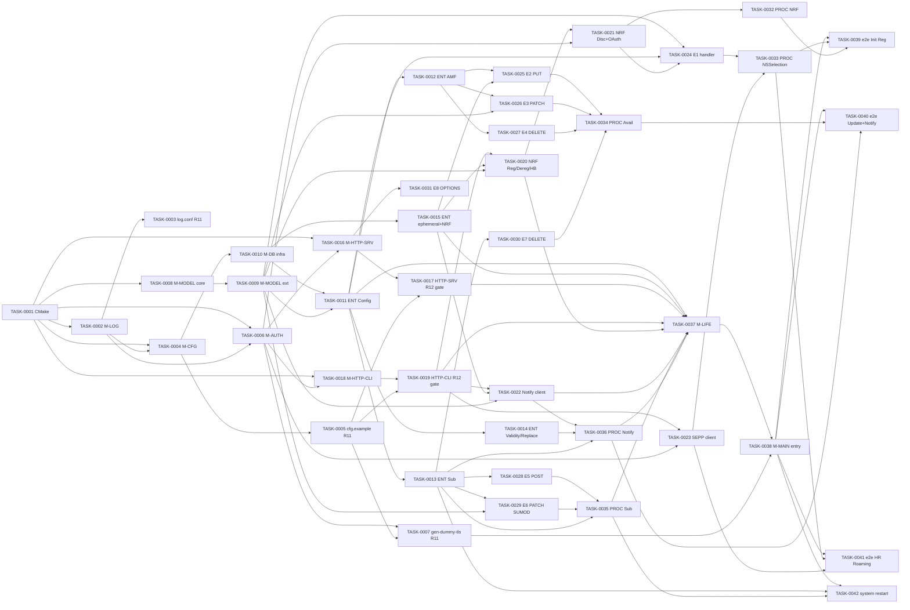

> **위키 편입 정보**
> - 원본: `doc/analysis/plans/NSSF_plan.md`
> - last_updated: 2026-05-26
> - 안정 ID 요약: TASK=42 (NSSF-TASK-0001~0042), R5 entry wire 분리 (TASK-0037 M-LIFE + TASK-0038 M-MAIN), R11 운영 conf bundle 3 task (CFG/LOG/AUTH — TASK-0003/0005/0007), R12 cfg-dependent wire gate 2 task (TASK-0017/0019)

# NSSF 구현 계획

## 0. 메타

- 대상 NF: NSSF / 메인 규격: TS 29.531
- 대상 언어: C
- 결정된 `tech_stack` (agent_context.json 인용):
  - http_server: nghttp2 / http_client: libcurl / event_loop: libuv
  - json: cJSON / tls: OpenSSL / jwt: libjwt / logging: zlog
  - inmemory_cache: uthash / database: PostgreSQL / db_client: libpq
  - test_framework: Unity / build: CMake
  - db: hybrid (uthash 핫 캐시 + PostgreSQL 영속)
- 입력 산출물 (위키 fallback — `doc/analysis/`는 `_archive/2026-05-26/`로 이전):
  - features: `doc/wiki/entities-features/29.531-features.md` (FEAT 107)
  - api: `doc/wiki/implementation-specs/NSSF-api-spec.md` (E1~E8 + C1)
  - procedure: `doc/wiki/entities-features/NSSF-procedure-analysis.md` (PROC-0001~0020)
  - db: `doc/wiki/implementation-specs/NSSF-db-design.md` (ENT-0001~0016)
  - impl-spec: `doc/wiki/implementation-specs/NSSF-impl-spec.md` (VS-0001~0051, 13 모듈 + 8 핸들러 + 3 클라이언트 + 20 PROC, R7/R11 적용)
  - mock-data: `doc/wiki/implementation-specs/NSSF-mock-data.md` (MOCK-0001~0077 + MOCK-CFG/LOG/TLS, 경계값 19, 특수 11)
  - hints: `doc/wiki/sources/NSSF-hints.md`
- 0단계 입구 점검: ✅ 통과 (6종 산출물 자체 체크리스트 ✅ + features placeholder 3컬럼 빈 셀 0)
- 총 task 수: **42** (P0=31, P1=8, P2=0, P3=3)

## 1. 참조 문서

- 기능 목록: [29.531-features.md](../entities-features/29.531-features.md)
- API 분석: [NSSF-api-spec.md](../implementation-specs/NSSF-api-spec.md)
- 절차 분석: [NSSF-procedure-analysis.md](../entities-features/NSSF-procedure-analysis.md)
- DB 설계: [NSSF-db-design.md](../implementation-specs/NSSF-db-design.md)
- 구현 명세: [NSSF-impl-spec.md](../implementation-specs/NSSF-impl-spec.md)
- Mock 데이터: [NSSF-mock-data.md](../implementation-specs/NSSF-mock-data.md)
- 도메인 힌트: [NSSF-hints.md](../sources/NSSF-hints.md)

## 2. 현재 구현 상태

신규 프로젝트 — 소스 트리(`dev/src`, `dev/libsrc`, `dev/include`, `dev/test`) 부재. `dev/conf/`만 존재. 모든 모듈 `none` 상태. `model_dev`의 `/nf-init`이 골격 디렉토리를 생성한다.

| 모듈 ID (impl-spec 1) | 현재 파일 | 구현 상태 | 기존 테스트 |
|---|---|---|---|
| M-CFG | – | none | – |
| M-LOG | – | none | – |
| M-DB (PG + uthash + 엔티티별) | – | none | – |
| M-HTTP-SRV | – | none | – |
| M-HTTP-CLI | – | none | – |
| M-AUTH (TLS + OAuth2 + JWT) | – | none | – |
| M-MODEL (cJSON 직렬화 모듈군) | – | none | – |
| M-HANDLER-1 ~ M-HANDLER-8 (E1~E8) | – | none | – |
| M-CLIENT-NRF | – | none | – |
| M-CLIENT-NOTIFY | – | none | – |
| M-CLIENT-SEPP | – | none | – |
| M-PROC-0001 ~ M-PROC-0020 | – | none | – |
| M-LIFE | – | none | – |
| M-MAIN | – | none | – |
| 빌드 시스템 (CMake) | – | none | – |

## 3. 구현 갭

| 갭 항목 | 종류 | 매핑 FEAT-ID | 매핑 VS-ID | 매핑 MOCK-ID | 매핑 모듈 ID |
|---|---|---|---|---|---|
| CMake 빌드 + Unity 통합 + CI 인프라 | 빌드 인프라 | – (인프라) | 모든 VS의 unit 시험 의존 | – | (빌드) |
| zlog wrapper + 카테고리 init | 모듈 신규 | – | VS-0001~0051 (로깅 의존) | – | M-LOG |
| zlog conf (운영 + dev) | conf 산출물 (R11) | – | – | MOCK-LOG-0001/0002 | M-LOG + conf |
| cJSON 파서 + 검증 + lifecycle 변환 | 모듈 신규 | – | VS-0001~0051 (cfg 의존) | – | M-CFG |
| cfg.example.json (운영 + dev) | conf 산출물 (R11) | – | – | MOCK-CFG-0001/0002/0003 | M-CFG + conf |
| TLS context + OAuth2 token + JWT 검증 | 모듈 신규 | SEC-0003, SEC-0004 | VS-0003, VS-0044, VS-0045 | MOCK-0005/0006/0069~0071 | M-AUTH |
| gen-dummy-tls.sh + samples/tls/* | scripts/conf (R11) | – | – | MOCK-TLS-0001/0002 | M-AUTH + scripts/conf |
| cJSON 모델 직렬화 (Snssai/Tai/PlmnId/NfInstanceId/ProblemDetails) | 모듈 신규 | DAT-0029, DAT-0039 | 모든 VS | – | M-MODEL 핵심 |
| 확장 모델 (NssaiAvailabilityInfo/Authorized/Subscription/NssfEvent/PatchDoc/SupportedFeatures) | 모듈 신규 | DAT-0013~0028, DAT-0038 | VS-0010~0039 | MOCK-0018~0061 | M-MODEL 확장 |
| PG 연결 + uthash + write-through 캐시 인프라 | 모듈 신규 | – | VS-0051 (restart) | – | M-DB |
| ENT-0001~0007 CRUD (Config 영역) | 모듈 신규 | DAT-0001~0012, DAT-0029 | VS-0001~0009 | MOCK-0001~0017 | M-DB (Config) |
| ENT-0008/0009 CRUD (AMF Registration) | 모듈 신규 | DAT-0013/0014, SVC-0012 | VS-0010~0019 | MOCK-0018~0033 | M-DB (AMF) |
| ENT-0010 CRUD (Subscription 다중 인덱스) | 모듈 신규 | SVC-0014~0022, DAT-0017~0025 | VS-0020~0029, VS-0046 | MOCK-0034~0050, MOCK-0072 | M-DB (Sub) |
| ENT-0011/0012 CRUD (Validity Time, Slice Replacement) | 모듈 신규 | PRC-0002/0003, SVC-0027 | VS-0036, VS-0037 | MOCK-0059, MOCK-0060 | M-DB (Validity/Replace) |
| ENT-0013/0014/0015 CRUD (ephemeral) + ENT-0016 (NRF state) | 모듈 신규 | – | VS-0034, VS-0044~0046 | MOCK-0057, MOCK-0069~0072 | M-DB (ephemeral + NRF) |
| nghttp2 HTTP/2 서버 + 라우터 + 헤더 | 모듈 신규 | SVC-0033~0035/0038~0040 | VS-0001~0030 | – | M-HTTP-SRV |
| nghttp2 운영 wire (R12 cfg-gate) | wire gate | – | VS-0001~0030 (운영 path) | – | M-HTTP-SRV |
| libcurl multi + libuv + 재시도 | 모듈 신규 | – | VS-0031~0035, VS-0040~0045 | MOCK-0053~0058, MOCK-0063~0071 | M-HTTP-CLI |
| libcurl 운영 wire (R12 cfg-gate) | wire gate | – | VS-0031~0045 (운영 path) | – | M-HTTP-CLI |
| NRF Register/Deregister/Heartbeat 클라이언트 (PROC-0001~0003) | 모듈 신규 | – | VS-0040~0043 | MOCK-0063~0068 | M-CLIENT-NRF |
| NRF Discovery + OAuth2 Token (PROC-0004/0005) | 모듈 신규 | MGMT-0001, SEC-0003 | VS-0009, VS-0044/0045 | MOCK-0017, MOCK-0069~0071 | M-CLIENT-NRF |
| Notify callback 클라이언트 (백오프 재시도) | 모듈 신규 | SVC-0023~0029, DAT-0026~0028, PRC-0001~0003 | VS-0031~0039 | MOCK-0053~0062 | M-CLIENT-NOTIFY |
| SEPP forward 클라이언트 (PROC-0012) | 모듈 신규 | SVC-0004 | VS-0005, VS-0050 | MOCK-0009/0010, MOCK-0076 | M-CLIENT-SEPP |
| E1 GET /network-slice-information 핸들러 (5 변형) | 모듈 신규 | SVC-0002~0011, DAT-0001~0012, MGMT-0001, ERR-0001~0009 | VS-0001~0009 | MOCK-0001~0017 | M-HANDLER-1 |
| E2 PUT 핸들러 | 모듈 신규 | SVC-0012, DAT-0013/0014, ERR-0010 | VS-0010~0013 | MOCK-0018~0023 | M-HANDLER-2 |
| E3 PATCH (JSON Patch) 핸들러 | 모듈 신규 | SVC-0013, DAT-0015/0016/0030, SVC-0042 | VS-0014~0017 | MOCK-0024~0030 | M-HANDLER-3 |
| E4 DELETE 핸들러 | 모듈 신규 | SVC-0030/0031, ERR-0015, DAT-0031 | VS-0018/0019 | MOCK-0031~0033 | M-HANDLER-4 |
| E5 POST /subscriptions 핸들러 | 모듈 신규 | SVC-0014~0017, DAT-0017~0023, ERR-0011, DAT-0032/0033 | VS-0020~0023 | MOCK-0034~0041 | M-HANDLER-5 |
| E6 PATCH /subscriptions/{id} 핸들러 (SUMOD) | 모듈 신규 | SVC-0018~0020, DAT-0024/0025, ERR-0012 | VS-0024~0027 | MOCK-0042~0047 | M-HANDLER-6 |
| E7 DELETE /subscriptions/{id} 핸들러 | 모듈 신규 | SVC-0021/0022, ERR-0013 | VS-0028/0029 | MOCK-0048~0050 | M-HANDLER-7 |
| E8 OPTIONS 핸들러 | 모듈 신규 | SVC-0032, ERR-0016 | VS-0030 | MOCK-0051/0052 | M-HANDLER-8 |
| PROC-0001~0005 NRF lifecycle 오케스트레이션 | 모듈 신규 | – | VS-0040~0045 | MOCK-0063~0071 | M-PROC NRF |
| PROC-0006~0012 NSSelection 오케스트레이션 (7 변형) | 모듈 신규 | SVC-0002~0011 | VS-0001~0009, VS-0050 | MOCK-0001~0017, MOCK-0076 | M-PROC NSSelection |
| PROC-0013/0018/0019 NSSAI Availability Update/Unsub/Delete | 모듈 신규 | SVC-0012/0013/0021/0030, ERR-0010~0013/0015 | VS-0010~0019, VS-0028/0029 | MOCK-0018~0033, MOCK-0048~0050 | M-PROC Avail |
| PROC-0014 Subscribe Create/Modify + PROC-0020 Expiry sweeper | 모듈 신규 | SVC-0014~0020, DAT-0017~0025 | VS-0020~0027, VS-0046 | MOCK-0034~0047, MOCK-0072 | M-PROC Sub |
| PROC-0015/0016/0017 Notify variants | 모듈 신규 | SVC-0023~0029, PRC-0001~0003, SEC-0001/0002 | VS-0031~0039, VS-0047 | MOCK-0053~0062, MOCK-0073 | M-PROC Notify |
| M-LIFE 단위 (init/shutdown/timer wire) | 모듈 신규 | – | VS-0051 | – | M-LIFE |
| M-MAIN entry wire (argv + signal_wait + uv_run) | entry wire (R5) | – | VS-0048~0051 | – | M-MAIN |
| 통합/시스템 시험 harness (VS-0048~0051) | 테스트 | – | VS-0048~0051 | MOCK-0074~0077 | (테스트) |

## 4. 작업 목록 (실행 순서)

| id | 작업 내용 | 상태 | 우선순위 | 위험도 | 선행 작업 | 매핑 FEAT | 매핑 VS | 매핑 MOCK | 매핑 모듈 | 예상 소요 | 비고 |
| --- | --- | --- | --- | --- | --- | --- | --- | --- | --- | --- | --- |
| NSSF-TASK-0001 | CMake 빌드 시스템 + Unity 통합 + CI 골격 | pending | P0 | Mid | – | – | – | – | (빌드) | 2~3h | 의존 라이브러리 FindPackage 통합 |
| NSSF-TASK-0002 | M-LOG 단위 (zlog wrapper + 카테고리 init) | pending | P0 | Low | NSSF-TASK-0001 | – | VS-0001 (로깅 의존) | – | M-LOG | 2~3h | – |
| NSSF-TASK-0003 | R11 log conf 작성 (운영 + dev 변형) | pending | P0 | Low | NSSF-TASK-0002 | – | – | MOCK-LOG-0001, MOCK-LOG-0002 | M-LOG + conf | 1~2h | impl-spec §8-C-1 인용 |
| NSSF-TASK-0004 | M-CFG 단위 (cJSON 파서 + 검증 + lifecycle 변환) | pending | P0 | Mid | NSSF-TASK-0001, NSSF-TASK-0002 | – | VS-0001~0051 (cfg 의존) | – | M-CFG | 4h | DEF-011 schema-payload 일관성 |
| NSSF-TASK-0005 | R11 cfg.example.json 작성 (운영 + dev 변형 + 차이 표) | pending | P0 | Low | NSSF-TASK-0004 | – | – | MOCK-CFG-0001, MOCK-CFG-0002, MOCK-CFG-0003 | M-CFG + conf | 2h | impl-spec §3-C-5 인용 |
| NSSF-TASK-0006 | M-AUTH 단위 (OpenSSL TLS ctx + libjwt 검증 + token cache) | pending | P0 | High | NSSF-TASK-0001, NSSF-TASK-0002 | SEC-0003, SEC-0004 | VS-0003, VS-0044, VS-0045 | MOCK-0005, MOCK-0006, MOCK-0069, MOCK-0070, MOCK-0071 | M-AUTH | 4h | RS256/ES256 |
| NSSF-TASK-0007 | R11 gen-dummy-tls.sh + samples/tls bundle | pending | P0 | Low | NSSF-TASK-0006, NSSF-TASK-0005 | – | – | MOCK-TLS-0001, MOCK-TLS-0002 | M-AUTH + scripts/conf | 1~2h | idempotent + .gitignore |
| NSSF-TASK-0008 | M-MODEL 핵심 (Snssai/Tai/PlmnId/NfInstanceId/ProblemDetails/SupportedFeatures) | pending | P0 | Mid | NSSF-TASK-0001 | DAT-0029, DAT-0039 | VS-0001~0051 | – | M-MODEL | 4h | api-analysis §3 인용 |
| NSSF-TASK-0009 | M-MODEL 확장 (NssaiAvailabilityInfo / Authorized / Subscription / NssfEvent / PatchDoc) | pending | P0 | Mid | NSSF-TASK-0008 | DAT-0013~0028, DAT-0038 | VS-0010~0039 | MOCK-0018~0061 | M-MODEL | 4h | RFC 6902 PatchDocument |
| NSSF-TASK-0010 | M-DB 인프라 (libpq 연결 풀 + uthash + write-through 패턴) | pending | P0 | High | NSSF-TASK-0004 | – | VS-0051 | – | M-DB | 4h | hybrid 패턴 |
| NSSF-TASK-0011 | ENT-0001~0007 CRUD (Config 영역 — Load/Read/Reload) | pending | P0 | Mid | NSSF-TASK-0010, NSSF-TASK-0009 | DAT-0001~0012, DAT-0029 | VS-0001~0009 | MOCK-0001~0017 | M-DB (Config) | 4h | db §7.1/7.2 |
| NSSF-TASK-0012 | ENT-0008/0009 CRUD (AMF Registration Upsert/Patch/Read/Delete + T-AMF-UPSERT/PATCH/DELETE 트랜잭션) | pending | P0 | High | NSSF-TASK-0011 | DAT-0013/0014, SVC-0012 | VS-0010~0019 | MOCK-0018~0033 | M-DB (AMF) | 4h | REPEATABLE READ + FK CASCADE |
| NSSF-TASK-0013 | ENT-0010 CRUD (Subscription 다중 인덱스 + FindMatching + ExpireDueAt) | pending | P0 | High | NSSF-TASK-0011 | SVC-0014~0022, DAT-0017~0025 | VS-0020~0029, VS-0046 | MOCK-0034~0050, MOCK-0072 | M-DB (Sub) | 4h | 보조 인덱스 (event,tac,mcc,mnc) |
| NSSF-TASK-0014 | ENT-0011/0012 CRUD (Validity Time + Slice Replacement Start/Stop/Terminate) | pending | P1 | Mid | NSSF-TASK-0011 | PRC-0002/0003, SVC-0027 | VS-0036, VS-0037 | MOCK-0059, MOCK-0060 | M-DB (Validity/Replace) | 3h | T-REPLACE-START SERIALIZABLE |
| NSSF-TASK-0015 | ENT-0013/0014/0015/0016 CRUD (ephemeral + NRF state) | pending | P0 | Mid | NSSF-TASK-0010 | – | VS-0034, VS-0044~0046, VS-0051 | MOCK-0057, MOCK-0069~0072 | M-DB (ephemeral + NRF) | 3h | TokenCache lock-free / NotifyQueue FIFO |
| NSSF-TASK-0016 | M-HTTP-SRV 단위 (nghttp2 + libuv loop wire + route 등록 API) | pending | P0 | High | NSSF-TASK-0001, NSSF-TASK-0006 | SVC-0033~0035, SVC-0038~0040 | VS-0001~0030 (시뮬레이션) | – | M-HTTP-SRV | 6h | – |
| NSSF-TASK-0017 | M-HTTP-SRV R12 wire gate (cfg.listen.tls_cert/key 보유 → test_mode=0 + 운영 path 활성) | pending | P0 | High | NSSF-TASK-0016, NSSF-TASK-0005 | – | VS-0001~0030 (운영) | – | M-HTTP-SRV | 2~3h | DEF-006 fix anchor |
| NSSF-TASK-0018 | M-HTTP-CLI 단위 (libcurl multi + libuv timer/poll handle + 재시도) | pending | P0 | High | NSSF-TASK-0001, NSSF-TASK-0006 | – | VS-0031~0035, VS-0040~0045 | MOCK-0053~0058, MOCK-0063~0071 | M-HTTP-CLI | 6h | curl_multi_socket_action |
| NSSF-TASK-0019 | M-HTTP-CLI R12 wire gate (cfg.nrf.base_url 보유 → test_mode=0 + curl_global_init 운영 path) | pending | P0 | High | NSSF-TASK-0018, NSSF-TASK-0005 | – | VS-0031~0045 (운영) | – | M-HTTP-CLI | 2~3h | DEF-003 fix |
| NSSF-TASK-0020 | M-CLIENT-NRF Register/Deregister/Heartbeat (PROC-0001~0003) | pending | P0 | High | NSSF-TASK-0019, NSSF-TASK-0015, NSSF-TASK-0009 | – | VS-0040~0043 | MOCK-0063~0068 | M-CLIENT-NRF | 4h | NfProfile 직렬화 |
| NSSF-TASK-0021 | M-CLIENT-NRF Discovery + OAuth2 Token (PROC-0004/0005) | pending | P0 | High | NSSF-TASK-0020, NSSF-TASK-0006 | MGMT-0001, SEC-0003 | VS-0009, VS-0044, VS-0045 | MOCK-0017, MOCK-0069~0071 | M-CLIENT-NRF | 4h | TokenCache GetOrFetch |
| NSSF-TASK-0022 | M-CLIENT-NOTIFY (C1 callback POST + 백오프 + DequeueDue) | pending | P0 | High | NSSF-TASK-0019, NSSF-TASK-0015, NSSF-TASK-0009 | SVC-0023~0029, DAT-0026~0028, PRC-0001~0003, ERR-0014 | VS-0031~0039 | MOCK-0053~0062 | M-CLIENT-NOTIFY | 4h | 307 redirect + Retry-After |
| NSSF-TASK-0023 | M-CLIENT-SEPP (PROC-0012 V-NSSF→H-NSSF forward) | pending | P3 | Mid | NSSF-TASK-0019, NSSF-TASK-0006 | SVC-0004 | VS-0005, VS-0050 | MOCK-0009, MOCK-0010, MOCK-0076 | M-CLIENT-SEPP | 3h | N32 channel |
| NSSF-TASK-0024 | M-HANDLER-1 E1 GET /network-slice-information (5 SliceInfo 변형 + RSIPCE/SIOP gate) | pending | P0 | High | NSSF-TASK-0009, NSSF-TASK-0011, NSSF-TASK-0021 | SVC-0002~0011, DAT-0001~0012, MGMT-0001, ERR-0001~0009 | VS-0001~0009 | MOCK-0001~0017 | M-HANDLER-1 | 6h | 8-step 핸들러 골격 |
| NSSF-TASK-0025 | M-HANDLER-2 E2 PUT /nssai-availability/{nfId} | pending | P0 | High | NSSF-TASK-0012, NSSF-TASK-0015 | SVC-0012, DAT-0013/0014, ERR-0010, SEC-0004 | VS-0010~0013 | MOCK-0018~0023 | M-HANDLER-2 | 4h | T-AMF-UPSERT + 0015 Enqueue |
| NSSF-TASK-0026 | M-HANDLER-3 E3 PATCH (JSON Patch RFC 6902) | pending | P0 | High | NSSF-TASK-0012, NSSF-TASK-0009 | SVC-0013, DAT-0015/0016/0030, SVC-0042 | VS-0014~0017 | MOCK-0024~0030 | M-HANDLER-3 | 4h | application/json-patch+json |
| NSSF-TASK-0027 | M-HANDLER-4 E4 DELETE /nssai-availability/{nfId} | pending | P0 | Mid | NSSF-TASK-0012 | SVC-0030/0031, ERR-0015, DAT-0031 | VS-0018/0019 | MOCK-0031~0033 | M-HANDLER-4 | 2~3h | T-AMF-DELETE + 0015 Enqueue |
| NSSF-TASK-0028 | M-HANDLER-5 E5 POST /subscriptions | pending | P0 | High | NSSF-TASK-0013 | SVC-0014~0017, DAT-0017~0023, ERR-0011, DAT-0032/0033 | VS-0020~0023 | MOCK-0034~0041 | M-HANDLER-5 | 4h | SVC-0016 expiry 분산 |
| NSSF-TASK-0029 | M-HANDLER-6 E6 PATCH /subscriptions/{id} (SUMOD) | pending | P0 | High | NSSF-TASK-0013, NSSF-TASK-0009 | SVC-0018~0020, DAT-0024/0025, ERR-0012 | VS-0024~0027 | MOCK-0042~0047 | M-HANDLER-6 | 4h | event IE 변경 거부 |
| NSSF-TASK-0030 | M-HANDLER-7 E7 DELETE /subscriptions/{id} | pending | P0 | Mid | NSSF-TASK-0013 | SVC-0021/0022, ERR-0013 | VS-0028/0029 | MOCK-0048~0050 | M-HANDLER-7 | 2h | 진행 중 알림 cancel |
| NSSF-TASK-0031 | M-HANDLER-8 E8 OPTIONS /nssai-availability | pending | P3 | Low | NSSF-TASK-0016 | SVC-0032, ERR-0016 | VS-0030 | MOCK-0051/0052 | M-HANDLER-8 | 1h | Accept-Encoding 응답 |
| NSSF-TASK-0032 | M-PROC NRF lifecycle 오케스트레이션 (PROC-0001~0005) | pending | P0 | High | NSSF-TASK-0021 | – | VS-0040~0045 | MOCK-0063~0071 | M-PROC NRF | 3h | heartBeatTimer 갱신 |
| NSSF-TASK-0033 | M-PROC NSSelection 오케스트레이션 (PROC-0006~0012 7 변형) | pending | P0 | High | NSSF-TASK-0024, NSSF-TASK-0023 | SVC-0002~0011 | VS-0001~0009, VS-0050 | MOCK-0001~0017, MOCK-0076 | M-PROC NSSelection | 4h | Registration/PDU/UCU/PDN/NWDAF/HR |
| NSSF-TASK-0034 | M-PROC NSSAI Availability Update/Unsub/Delete (PROC-0013/0018/0019) | pending | P0 | High | NSSF-TASK-0025, NSSF-TASK-0026, NSSF-TASK-0027, NSSF-TASK-0030 | SVC-0012/0013/0021/0030 | VS-0010~0019, VS-0028/0029 | MOCK-0018~0033, MOCK-0048~0050 | M-PROC Avail | 3h | state 전이 |
| NSSF-TASK-0035 | M-PROC Subscribe Create/Modify + Expiry sweeper (PROC-0014/0020) | pending | P0 | High | NSSF-TASK-0028, NSSF-TASK-0029, NSSF-TASK-0013 | SVC-0014~0020, DAT-0017~0025 | VS-0020~0027, VS-0046 | MOCK-0034~0047, MOCK-0072 | M-PROC Sub | 3h | T-SUB-EXPIRE 배치 |
| NSSF-TASK-0036 | M-PROC Notify variants (PROC-0015/0016/0017) | pending | P0 | High | NSSF-TASK-0022, NSSF-TASK-0014, NSSF-TASK-0013 | SVC-0023~0029, PRC-0001~0003, SEC-0001/0002 | VS-0031~0039, VS-0047 | MOCK-0053~0062, MOCK-0073 | M-PROC Notify | 4h | dedup + SEC-0001 사전 필터링 |
| NSSF-TASK-0037 | M-LIFE 단위 (init/shutdown/timer wire — 10 STEP 단위 함수) | pending | P0 | High | NSSF-TASK-0011, NSSF-TASK-0015, NSSF-TASK-0017, NSSF-TASK-0019, NSSF-TASK-0020, NSSF-TASK-0022, NSSF-TASK-0035, NSSF-TASK-0036 | – | VS-0040, VS-0046, VS-0051 (단위) | – | M-LIFE | 4h | impl-spec §8-D-1 10 STEP |
| NSSF-TASK-0038 | M-MAIN entry wire (R5 분리 — argv + cfg load + signal_wait + uv_run + graceful_shutdown) | pending | P0 | High | NSSF-TASK-0037, NSSF-TASK-0007 | – | VS-0048~0051 | – | M-MAIN | 3h | impl-spec §8-D-2 의사 코드 |
| NSSF-TASK-0039 | 통합 시험 VS-0048 (Initial Registration end-to-end with NRF discovery) | pending | P1 | High | NSSF-TASK-0038, NSSF-TASK-0033, NSSF-TASK-0032 | SVC-0002, MGMT-0001 | VS-0048 | MOCK-0074 | (테스트) | 3h | NRF stub 의존 |
| NSSF-TASK-0040 | 통합 시험 VS-0049 (NSSAI Update + Notify 사이클) | pending | P1 | High | NSSF-TASK-0038, NSSF-TASK-0034, NSSF-TASK-0036 | SVC-0012, SVC-0023 | VS-0049 | MOCK-0075 | (테스트) | 3h | Consumer stub 의존 |
| NSSF-TASK-0041 | 통합 시험 VS-0050 (HR Roaming PDU Session V-NSSF→H-NSSF) | pending | P1 | High | NSSF-TASK-0038, NSSF-TASK-0033, NSSF-TASK-0023 | SVC-0004 | VS-0050 | MOCK-0076 | (테스트) | 3h | SEPP/H-NSSF stub |
| NSSF-TASK-0042 | 시스템 시험 VS-0051 (restart 후 구독 활성 유지 — PG → uthash 복원) | pending | P1 | High | NSSF-TASK-0038, NSSF-TASK-0013, NSSF-TASK-0035 | – | VS-0051 | MOCK-0077 | (테스트) | 3h | PG 영속 검증 |

## 5. 작업 상세

### 5.1 NSSF-TASK-0001: CMake 빌드 시스템 + Unity 통합

- **우선순위**: P0 (인프라 — 모든 후속 task의 prereq)
- **위험도**: Mid (사유: 의존 라이브러리 9종 FindPackage 통합)
- **매핑**: – / – / – / (빌드)
- **Red (테스트 작성)**:
  - 테스트 파일: `dev/test/build/test_smoke.c`
  - 사용 MOCK-ID: –
  - 검증할 VS-ID: –
- **Green (구현)**:
  - 구현 파일: `CMakeLists.txt`, `dev/src/CMakeLists.txt`, `dev/libsrc/CMakeLists.txt`, `dev/test/CMakeLists.txt`
  - 핵심 시그니처(의사): `find_package(nghttp2 REQUIRED) ... find_package(CURL REQUIRED) ... find_package(LibUV REQUIRED) ... find_package(OpenSSL REQUIRED) ... pkg_check_modules(LIBPQ libpq) ... add_executable(nssfd dev/src/main.c)`
  - 사용 라이브러리: T-BUILD (`tech_stack.build = CMake`) + T-TEST (`tech_stack.test_framework = Unity`)
  - 호출 CRUD: –
- **Refactor — Acceptance Criteria** (기계 검증 가능):
  - [ ] AC-1: 루트 CMakeLists.txt가 9개 의존 라이브러리(nghttp2/CURL/libuv/OpenSSL/libjwt/zlog/cJSON/uthash/libpq)를 모두 find_package/pkg_check_modules로 해결
    - **grep_verify**: `grep -nE "find_package|pkg_check_modules" CMakeLists.txt dev/src/CMakeLists.txt dev/libsrc/CMakeLists.txt`
  - [ ] AC-2: `cmake -S . -B dev/build && cmake --build dev/build` 성공
    - **integration_test_id**: TC-NNNN (test-spec-generation 부여)
  - [ ] AC-3: Unity 단위 시험 실행 가능 (`ctest --test-dir dev/build`)
    - **integration_test_id**: TC-NNNN
- **Integration test**: `cmake --build dev/build && ctest --test-dir dev/build` → exit 0
- **Verification grep**: `grep -nE "add_executable\\s*\\(\\s*nssfd" dev/src/CMakeLists.txt` → ≥1 hit

### 5.2 NSSF-TASK-0002: M-LOG 단위 (zlog wrapper)

- **우선순위**: P0
- **위험도**: Low
- **매핑**: – / – / – / M-LOG
- **Red**:
  - 테스트 파일: `dev/test/log/test_log_init.c`
  - MOCK: –
  - VS: VS-0001 (간접 — 로깅 의존)
- **Green**:
  - 구현 파일: `dev/include/nssf/log.h`, `dev/libsrc/log/log.c`
  - 시그니처: `int log_init(const char *conf_path); void log_shutdown(void); LOG_DEBUG/INFO/WARN/ERROR(cat, fmt, ...)`
  - 라이브러리: T-LOG (`tech_stack.logging = zlog`)
- **Refactor — Acceptance Criteria**:
  - [ ] AC-1: 9개 카테고리(NSSEL/AVAIL/SUB/NOTIFY/NRF/AUTH/HTTP/DB/LIFE) 모두 `zlog_get_category`로 획득
    - **grep_verify**: `grep -nE "zlog_get_category" dev/libsrc/log/log.c`
  - [ ] AC-2: `log_init` 실패 시 caller에 비-0 반환 + stderr 출력
    - **unit_test_id**: TC-NNNN
  - [ ] AC-3: `LOG_INFO/WARN/ERROR` 매크로가 zlog 호출 + 파일/라인 prefix
    - **grep_verify**: `grep -nE "#define\\s+LOG_(DEBUG|INFO|WARN|ERROR)" dev/include/nssf/log.h`
- **Integration test**: `ctest -R log` → exit 0
- **Verification grep**: `grep -nE "log_init|log_shutdown" dev/libsrc/log/log.c` → 각각 ≥1 hit

### 5.3 NSSF-TASK-0003: R11 log conf 작성 (운영 + dev 변형)

- **우선순위**: P0
- **위험도**: Low
- **매핑**: – / – / MOCK-LOG-0001, MOCK-LOG-0002 / M-LOG + conf
- **Red**:
  - 테스트 파일: `dev/test/conf/test_log_conf_parse.c`
  - MOCK: MOCK-LOG-0001 (운영), MOCK-LOG-0002 (dev)
  - VS: –
- **Green**:
  - 구현 파일: `dev/conf/samples/log.conf`(운영), `dev/conf/samples/log.dev.conf`(dev)
  - 본문 출처: impl-spec §8-C-1 (재기술 없이 인용)
  - 라이브러리: T-LOG (zlog conf 문법)
- **Refactor — Acceptance Criteria**:
  - [ ] AC-1: 운영 `log.conf`가 9개 카테고리에 대해 카테고리.레벨 rules 정의 + json/default_text format 정의
    - **grep_verify**: `grep -cE "^(NSSEL|AVAIL|SUB|NOTIFY|NRF|AUTH|HTTP|DB|LIFE)\\." dev/conf/samples/log.conf`
  - [ ] AC-2: dev `log.dev.conf`는 `*.DEBUG/INFO/WARN/ERROR >stdout/stderr` 패턴 사용
    - **grep_verify**: `grep -nE ">(stdout|stderr)" dev/conf/samples/log.dev.conf`
  - [ ] AC-3: zlog conf 파싱 단위 시험에서 `zlog_init`가 두 변형 모두 비-0 오류 없이 로드
    - **unit_test_id**: TC-NNNN
- **Integration test**: `zlog -c dev/conf/samples/log.conf -t test` → exit 0
- **Verification grep**: `grep -nE "\\[rules\\]" dev/conf/samples/log.conf dev/conf/samples/log.dev.conf` → 각각 ≥1

### 5.4 NSSF-TASK-0004: M-CFG 단위 (cJSON 파서 + 검증)

- **우선순위**: P0
- **위험도**: Mid
- **매핑**: – / – / – / M-CFG
- **Red**:
  - 테스트 파일: `dev/test/cfg/test_cfg_load.c`, `dev/test/cfg/test_cfg_validate.c`
  - MOCK: MOCK-CFG-0001/0002 (정상), 경계값 (필수 키 누락) — TASK-0005 산출 fixture 사용
  - VS: –
- **Green**:
  - 구현 파일: `dev/include/nssf/cfg.h`, `dev/libsrc/cfg/cfg.c`
  - 시그니처: `int cfg_load(const char *path, nssf_config_t **out); int cfg_validate(const nssf_config_t *cfg); void cfg_free(nssf_config_t *cfg); int cfg_to_life_cfg(const nssf_config_t *cfg, life_cfg_t *out);`
  - 라이브러리: T-JSON (`tech_stack.json = cJSON`)
  - 호출 CRUD: – (M-DB의 LoadFromConfigFile은 TASK-0011에서 cfg 사용)
- **Refactor — Acceptance Criteria**:
  - [ ] AC-1: `cfg_load` 성공 시 `nssf_config_t` 10 top-level field 모두 채움 (impl-spec §3-C-5 인용)
    - **grep_verify**: `grep -nE "nfInstanceId|nfStatus|plmnList|httpServer|nrf|db|policy|subscriptions|notifications|features|logging" dev/libsrc/cfg/cfg.c`
  - [ ] AC-2: 필수 키 누락 → `cfg_validate` 비-0 반환 + WARN 로그
    - **unit_test_id**: TC-NNNN
  - [ ] AC-3: `cfg_to_life_cfg`가 `http_srv`/`http_cli`/`auth`/`db.conninfo`/`log_conf_path`를 life_cfg에 매핑 (R12 사전 — `_test_mode` 플래그는 cfg 조건 기반 결정, 초기 단위 시험은 강제 1 허용)
    - **grep_verify**: `grep -nE "cfg_to_life_cfg" dev/libsrc/cfg/cfg.c`
  - [ ] AC-4: DEF-011 schema-payload 일관성 — `nssf_config_t` field 명/타입이 impl-spec §3-C 표 10건과 1:1 일치
    - **grep_verify**: `grep -cE "^[[:space:]]+[a-z_]+_t\\s+[a-z_]+;" dev/include/nssf/cfg.h`
- **Integration test**: `ctest -R cfg` → exit 0
- **Verification grep**: `grep -nE "cfg_load|cfg_validate|cfg_free|cfg_to_life_cfg" dev/libsrc/cfg/cfg.c` → 4개 모두 hit

### 5.5 NSSF-TASK-0005: R11 cfg.example.json 작성 (운영 + dev)

- **우선순위**: P0
- **위험도**: Low
- **매핑**: – / – / MOCK-CFG-0001, MOCK-CFG-0002, MOCK-CFG-0003 / M-CFG + conf
- **Red**:
  - 테스트 파일: `dev/test/conf/test_cfg_example_parse.c`
  - MOCK: MOCK-CFG-0001/0002/0003 (인용만)
  - VS: –
- **Green**:
  - 구현 파일: `dev/conf/samples/nssfd.json.example`(운영), `dev/conf/nssfd.dev.json`(dev)
  - 본문 출처: impl-spec §3-C-5-1 / §3-C-5-2 / §3-C-5-3 (운영↔dev 차이 표) 재기술 없이 인용
  - 라이브러리: T-JSON
- **Refactor — Acceptance Criteria**:
  - [ ] AC-1: 운영 변형이 `db.conninfo`에 `sslmode=require` + `http_srv.bind_port=8443` + `http_srv.tls.mtls_required=true`
    - **grep_verify**: `grep -nE "sslmode=require|\"bind_port\":\\s*8443|\"mtls_required\":\\s*true" dev/conf/samples/nssfd.json.example`
  - [ ] AC-2: dev 변형이 `bind_port=18443` + `auth.oauth2.enabled=false` + 최소 PLMN 001-01 seed
    - **grep_verify**: `grep -nE "\"bind_port\":\\s*18443|\"enabled\":\\s*false|\"mcc\":\\s*\"001\"" dev/conf/nssfd.dev.json`
  - [ ] AC-3: 두 변형 모두 `cfg_load` + `cfg_validate` 통과
    - **unit_test_id**: TC-NNNN
- **Integration test**: `dev/build/nssfd dev/conf/nssfd.dev.json --validate-only` → exit 0
- **Verification grep**: `test -f dev/conf/samples/nssfd.json.example && test -f dev/conf/nssfd.dev.json` → exit 0

### 5.6 NSSF-TASK-0006: M-AUTH 단위 (TLS ctx + libjwt 검증 + token cache)

- **우선순위**: P0
- **위험도**: High (사유: 외부 NF 의존 + 보안 크리티컬)
- **매핑**: SEC-0003, SEC-0004 / VS-0003, VS-0044, VS-0045 / MOCK-0005, MOCK-0006, MOCK-0069, MOCK-0070, MOCK-0071 / M-AUTH
- **Red**:
  - 테스트 파일: `dev/test/auth/test_auth_jwt.c`, `dev/test/auth/test_auth_token_cache.c`, `dev/test/auth/test_auth_tls.c`
  - MOCK: MOCK-0005 (만료 토큰 REQ), MOCK-0006 (401 TOKEN_EXPIRED RESP), MOCK-0069 (Token REQ), MOCK-0070 (Token 200 RESP), MOCK-0071 (401)
  - VS: VS-0003, VS-0044, VS-0045
- **Green**:
  - 구현 파일: `dev/include/nssf/auth.h`, `dev/libsrc/auth/tls.c`, `dev/libsrc/auth/oauth2.c`, `dev/libsrc/auth/jwt.c`, `dev/libsrc/auth/token_cache.c`
  - 시그니처: `int auth_init(const auth_cfg_t *cfg); int auth_verify_jwt(const char *bearer, const char *expected_scope, jwt_claims_t *out_claims); int auth_get_token(const char *target_nf_type, const char *scope, char **out_bearer, time_t *out_expires_at); SSL_CTX *auth_tls_ctx(bool client);`
  - 라이브러리: T-AUTH (`tech_stack.tls = OpenSSL` + `tech_stack.jwt = libjwt`), T-CACHE (`tech_stack.inmemory_cache = uthash`)
  - 호출 CRUD: ENT-0013 `GetOrFetch`/`Invalidate`/`PurgeExpired` (db-design §7.8)
- **Refactor — Acceptance Criteria**:
  - [ ] AC-1: `auth_verify_jwt`가 RS256/ES256 토큰 알고리즘 처리 + exp 클레임 검증
    - **grep_verify**: `grep -nE "EVP_PKEY|jwt_verify|JWT_ALG_RS256|JWT_ALG_ES256" dev/libsrc/auth/jwt.c`
  - [ ] AC-2: 만료 토큰 검증 시 `ERR_AUTH_TOKEN_EXPIRED` 반환 (VS-0003)
    - **unit_test_id**: TC-NNNN
  - [ ] AC-3: TokenCache `GetOrFetch` 미스 시 PROC-0005 호출 + 히트 시 uthash 즉시 반환
    - **grep_verify**: `grep -nE "HASH_FIND|HASH_ADD" dev/libsrc/auth/token_cache.c`
  - [ ] AC-4: TLS ctx가 mTLS 모드 시 `SSL_CTX_set_verify(SSL_VERIFY_PEER|SSL_VERIFY_FAIL_IF_NO_PEER_CERT)` 설정
    - **grep_verify**: `grep -nE "SSL_CTX_set_verify\\s*\\([^,]+,\\s*SSL_VERIFY_PEER" dev/libsrc/auth/tls.c`
- **Integration test**: `ctest -R auth` → exit 0
- **Verification grep**: `grep -nE "auth_init|auth_verify_jwt|auth_get_token|auth_tls_ctx" dev/libsrc/auth/*.c` → 4개 모두 hit

### 5.7 NSSF-TASK-0007: R11 gen-dummy-tls.sh + samples/tls bundle

- **우선순위**: P0
- **위험도**: Low
- **매핑**: – / – / MOCK-TLS-0001, MOCK-TLS-0002 / M-AUTH + scripts/conf
- **Red**:
  - 테스트 파일: `dev/test/scripts/test_gen_dummy_tls.sh`
  - MOCK: MOCK-TLS-0001 (bundle 산출 위치), MOCK-TLS-0002 (.gitignore 룰)
  - VS: –
- **Green**:
  - 구현 파일: `dev/scripts/gen-dummy-tls.sh`, `dev/conf/samples/tls/.gitkeep`, `.gitignore` 갱신
  - 본문 출처: mock-data §7-bis MOCK-TLS-0001 bash 블록 + MOCK-TLS-0002 .gitignore 룰 (재기술 없이 인용)
  - 라이브러리: T-AUTH (openssl CLI)
- **Refactor — Acceptance Criteria**:
  - [ ] AC-1: 스크립트가 idempotent — 기존 `ca.crt` 존재 + `--force` 미지정 시 exit 0 + 안내 메시지
    - **grep_verify**: `grep -nE "Pass --force to regenerate" dev/scripts/gen-dummy-tls.sh`
  - [ ] AC-2: 실행 후 8개 파일 산출 (`ca.crt/ca.key/server.crt/server.key/client.crt/client.key/nrf_pubkey.pem/nrf_priv.pem`)
    - **integration_test_id**: TC-NNNN
  - [ ] AC-3: `.gitignore`에 `/etc/nssfd/tls/`, `dev/conf/tls/` 추가 + `!dev/conf/samples/tls/` 예외
    - **grep_verify**: `grep -nE "^/etc/nssfd/tls/|^dev/conf/tls/|^!dev/conf/samples/tls/" .gitignore`
  - [ ] AC-4: 산출 key 파일 권한 = 0400
    - **integration_test_id**: TC-NNNN
- **Integration test**: `bash dev/scripts/gen-dummy-tls.sh && ls dev/conf/samples/tls/ | wc -l` → 8
- **Verification grep**: `grep -nE "openssl req|openssl ecparam|chmod 400" dev/scripts/gen-dummy-tls.sh` → 3건 hit

### 5.8 NSSF-TASK-0008: M-MODEL 핵심 (Snssai/Tai/PlmnId/NfInstanceId/ProblemDetails/SupportedFeatures)

- **우선순위**: P0
- **위험도**: Mid
- **매핑**: DAT-0029, DAT-0039 / VS-0001~0051 (전반 의존) / – / M-MODEL
- **Red**:
  - 테스트 파일: `dev/test/model/test_model_snssai.c`, `dev/test/model/test_model_tai.c`, `dev/test/model/test_model_plmn_id.c`, `dev/test/model/test_model_nf_instance_id.c`, `dev/test/model/test_model_problem_details.c`, `dev/test/model/test_model_supported_features.c`
  - MOCK: – (MOCK fixture는 후속 핸들러 task에서 인용)
  - VS: – (개별 모델 단위 — 후속 핸들러 VS의 의존)
- **Green**:
  - 구현 파일: `dev/include/nssf/model.h`, `dev/libsrc/model/snssai.c`, `tai.c`, `plmn_id.c`, `nf_instance_id.c`, `problem_details.c`, `supported_features.c`
  - 시그니처: 각 모델당 `int <model>_parse(const cJSON *node, <model>_t *out); cJSON *<model>_to_json(const <model>_t *m); void <model>_free(<model>_t *m);`
  - 라이브러리: T-JSON (`tech_stack.json = cJSON`)
- **Refactor — Acceptance Criteria**:
  - [ ] AC-1: `snssai_parse`가 `sst` (uint8) 필수 + `sd` (3바이트 hex) 선택 + `has_sd` flag 정확 설정 (api-analysis §3 인용)
    - **unit_test_id**: TC-NNNN
  - [ ] AC-2: `nf_instance_id_parse`가 RFC 4122 UUID 형식 검증 (36자 + 4개 하이픈)
    - **unit_test_id**: TC-NNNN
  - [ ] AC-3: `problem_details_to_json`이 `type/title/status/detail/instance/cause/invalidParams[]` 모두 직렬화
    - **grep_verify**: `grep -nE "\"type\"|\"title\"|\"status\"|\"cause\"|\"invalidParams\"" dev/libsrc/model/problem_details.c`
  - [ ] AC-4: `supported_features` hex 문자열 ↔ uint64_t bitmap 양방향 변환
    - **unit_test_id**: TC-NNNN
- **Integration test**: `ctest -R model_core` → exit 0
- **Verification grep**: `grep -lE "_parse|_to_json|_free" dev/libsrc/model/*.c | wc -l` → ≥6

### 5.9 NSSF-TASK-0009: M-MODEL 확장 (NssaiAvailabilityInfo / Authorized / Subscription / NssfEvent / PatchDoc)

- **우선순위**: P0
- **위험도**: Mid
- **매핑**: DAT-0013~0028, DAT-0038 / VS-0010~0039 / MOCK-0018~0061 / M-MODEL
- **Red**:
  - 테스트 파일: `dev/test/model/test_model_nssai_avail_info.c`, `test_model_authorized.c`, `test_model_subscription.c`, `test_model_nssf_event.c`, `test_model_patch_doc.c`
  - MOCK: MOCK-0018, MOCK-0019, MOCK-0024, MOCK-0034, MOCK-0042, MOCK-0053, MOCK-0059, MOCK-0060
  - VS: VS-0010, VS-0014, VS-0020, VS-0024, VS-0031, VS-0036, VS-0037
- **Green**:
  - 구현 파일: `dev/libsrc/model/nssai_avail_info.c`, `authorized.c`, `subscription.c`, `nssf_event.c`, `patch_doc.c`
  - 시그니처: 모델별 parse/to_json/free
  - 라이브러리: T-JSON
- **Refactor — Acceptance Criteria**:
  - [ ] AC-1: `patch_doc_parse`가 RFC 6902 ops (`add/remove/replace/move/copy/test`) 모두 enum 매핑 + `value` 노드는 opaque cJSON 보관
    - **grep_verify**: `grep -nE "PATCH_OP_(ADD|REMOVE|REPLACE|MOVE|COPY|TEST)" dev/libsrc/model/patch_doc.c`
  - [ ] AC-2: `subscription_parse`가 `nfNssaiAvailabilityUri` (M) 누락 시 비-0 반환 (VS-0022 prereq)
    - **unit_test_id**: TC-NNNN
  - [ ] AC-3: `nssf_event_to_json`이 `SNSSAI_STATUS_CHANGE_REPORT`/`SNSSAI_VALIDITY_TIME_REPORT`/`SLICE_REPLACEMENT_REPORT`/`NSI_UNAVAILABILITY_REPORT` 4종 직렬화
    - **grep_verify**: `grep -nE "SNSSAI_STATUS_CHANGE_REPORT|SNSSAI_VALIDITY_TIME_REPORT|SLICE_REPLACEMENT_REPORT" dev/libsrc/model/nssf_event.c`
- **Integration test**: `ctest -R model_ext` → exit 0
- **Verification grep**: `grep -lE "_parse|_to_json|_free" dev/libsrc/model/{nssai_avail_info,authorized,subscription,nssf_event,patch_doc}.c | wc -l` → 5

### 5.10 NSSF-TASK-0010: M-DB 인프라 (libpq 연결 풀 + uthash + write-through)

- **우선순위**: P0
- **위험도**: High (사유: 영속 데이터 + 트랜잭션 일관성)
- **매핑**: – / VS-0051 / – / M-DB
- **Red**:
  - 테스트 파일: `dev/test/db/test_db_init.c`, `dev/test/db/test_db_pg_pool.c`, `dev/test/db/test_db_cache.c`
  - MOCK: – (db 자체 — 후속 ENT task에서 mock 활용)
  - VS: VS-0051 (restart 검증)
- **Green**:
  - 구현 파일: `dev/include/nssf/db.h`, `dev/libsrc/db/pg.c`, `dev/libsrc/db/cache.c`
  - 시그니처: `int db_init(const char *conninfo); void db_shutdown(void); PGconn *db_pg_acquire(void); void db_pg_release(PGconn *c); /* uthash 매크로 wrapper */`
  - 라이브러리: T-DB (`tech_stack.db_client = libpq` + `tech_stack.inmemory_cache = uthash`)
- **Refactor — Acceptance Criteria**:
  - [ ] AC-1: `db_init`이 libpq 연결 풀 (N=cfg.db.pool_size) 사전 확보 + uthash 빈 상태 초기화
    - **grep_verify**: `grep -nE "PQconnectdb|PQsetnonblocking" dev/libsrc/db/pg.c`
  - [ ] AC-2: write-through 패턴 헬퍼 — PG 커밋 후 uthash 갱신, PG 실패 시 uthash 미반영
    - **grep_verify**: `grep -nE "PQexec.*BEGIN|PQexec.*COMMIT|PQexec.*ROLLBACK" dev/libsrc/db/pg.c`
  - [ ] AC-3: `db_shutdown`이 모든 PG 연결 close + uthash 전체 evict (HASH_ITER + HASH_DEL + free)
    - **grep_verify**: `grep -nE "PQfinish|HASH_ITER" dev/libsrc/db/pg.c dev/libsrc/db/cache.c`
- **Integration test**: `pg_isready -h 127.0.0.1 && ctest -R db_infra` → exit 0
- **Verification grep**: `grep -nE "db_init|db_shutdown" dev/libsrc/db/pg.c` → 각각 hit

### 5.11 NSSF-TASK-0011: ENT-0001~0007 CRUD (Config 영역)

- **우선순위**: P0
- **위험도**: Mid
- **매핑**: DAT-0001~0012, DAT-0029 / VS-0001~0009 / MOCK-0001~0017 / M-DB (Config)
- **Red**:
  - 테스트 파일: `dev/test/db/test_db_config_load.c`, `dev/test/db/test_db_config_read_by_tai.c`, `dev/test/db/test_db_config_reload.c`
  - MOCK: MOCK-CFG-0001 (정책 영역 seed)
  - VS: VS-0001 (Registration), VS-0005 (HR roaming), VS-0006 (PDN/RSIPCE), VS-0008 (NWDAF)
- **Green**:
  - 구현 파일: `dev/libsrc/db/config.c`
  - 시그니처: `int db_config_load_from_file(const char *path); struct nssai_config_entry *db_config_read_by_tai(const plmn_id_t *plmn, const char *tac, const char *nid); int db_config_reload_on_sighup(const char *path);` (ENT-0002~0007 동일 패턴)
  - 라이브러리: T-DB
  - 호출 CRUD: db-design §7.1, §7.2 `LoadFromConfigFile`/`ReadBy{key}`/`ReloadOnSighup`
- **Refactor — Acceptance Criteria**:
  - [ ] AC-1: 7개 Config 엔티티(ENT-0001~0007) 모두 Load/Read/Reload 3 API 보유
    - **grep_verify**: `grep -cE "db_(nssai_config|restricted_snssai|amf_set|nsi_mapping|nrf_per_slice|vplmn_hplmn|nsag_config)_(load|read_by|reload)" dev/libsrc/db/config.c`
  - [ ] AC-2: SIGHUP reload 시 uthash 원자 교체 (이전 버전 검증 실패 시 유지)
    - **unit_test_id**: TC-NNNN
  - [ ] AC-3: ReadByTai miss → NULL 반환 (caller가 default 정책 적용)
    - **unit_test_id**: TC-NNNN
- **Integration test**: `ctest -R db_config` → exit 0
- **Verification grep**: `grep -lE "load_from_config_file|read_by_tai|reload_on_sighup" dev/libsrc/db/config.c` → hit

### 5.12 NSSF-TASK-0012: ENT-0008/0009 CRUD (AMF Registration State)

- **우선순위**: P0
- **위험도**: High
- **매핑**: DAT-0013/0014, SVC-0012 / VS-0010~0019 / MOCK-0018~0033 / M-DB (AMF)
- **Red**:
  - 테스트 파일: `dev/test/db/test_db_amf_reg_upsert.c`, `test_db_amf_reg_patch.c`, `test_db_amf_reg_delete.c`
  - MOCK: MOCK-0018 (PUT REQ), MOCK-0019 (200 RESP), MOCK-0022 (204), MOCK-0024 (PATCH REQ), MOCK-0027 (404), MOCK-0031 (DELETE REQ)
  - VS: VS-0010, VS-0012, VS-0014, VS-0015, VS-0018, VS-0019
- **Green**:
  - 구현 파일: `dev/libsrc/db/amf_reg.c`, `dev/libsrc/db/authorized.c`
  - 시그니처: `int db_amf_reg_upsert(const char *nf_id, const nssai_avail_info_t *info, authorized_nssai_avail_info_t *out_authorized); int db_amf_reg_patch(const char *nf_id, const patch_document_t *patch, authorized_nssai_avail_info_t *out); struct amf_reg_record *db_amf_reg_read(const char *nf_id); bool db_amf_reg_delete(const char *nf_id); int db_amf_reg_iter_all(amf_reg_visitor_fn fn, void *ud);` + ENT-0009 동일 패턴
  - 라이브러리: T-DB
  - 호출 CRUD: db-design §7.3 `UpsertByNfId`/`PatchByNfId`/`ReadByNfId`/`DeleteByNfId`/`IterAll` + §8-A `T-AMF-UPSERT/PATCH/DELETE` 트랜잭션 + ENT-0015 `Enqueue` (TASK-0015 의존)
- **Refactor — Acceptance Criteria**:
  - [ ] AC-1: `db_amf_reg_upsert`가 PG `BEGIN ... INSERT ... ON CONFLICT DO UPDATE ... COMMIT` + ENT-0009 nested + ENT-0015 Enqueue 한 트랜잭션 (REPEATABLE READ)
    - **grep_verify**: `grep -nE "BEGIN ISOLATION LEVEL REPEATABLE READ" dev/libsrc/db/amf_reg.c`
  - [ ] AC-2: `db_amf_reg_delete`가 FK CASCADE로 ENT-0009 동시 삭제 + 영향 구독 0010 통지 enqueue
    - **grep_verify**: `grep -nE "FOREIGN KEY|CASCADE" dev/libsrc/db/amf_reg.c`
  - [ ] AC-3: nfId 미존재 patch → 404 매핑 코드 반환 (`ERR_DB_NOT_FOUND`)
    - **unit_test_id**: TC-NNNN
- **Integration test**: `ctest -R db_amf_reg` → exit 0
- **Verification grep**: `grep -nE "db_amf_reg_(upsert|patch|read|delete|iter_all)" dev/libsrc/db/amf_reg.c` → 5개 hit

### 5.13 NSSF-TASK-0013: ENT-0010 CRUD (Subscription 다중 인덱스)

- **우선순위**: P0
- **위험도**: High
- **매핑**: SVC-0014~0022, DAT-0017~0025 / VS-0020~0029, VS-0046 / MOCK-0034~0050, MOCK-0072 / M-DB (Sub)
- **Red**:
  - 테스트 파일: `dev/test/db/test_db_sub_create.c`, `test_db_sub_patch.c`, `test_db_sub_find_matching.c`, `test_db_sub_expire.c`
  - MOCK: MOCK-0034 (Subscribe REQ), MOCK-0035 (201), MOCK-0040 (동일 expiry 다중), MOCK-0042 (SUMOD PATCH), MOCK-0044 (event IE 변경 부정), MOCK-0048 (Unsubscribe), MOCK-0072 (timer fixture)
  - VS: VS-0020, VS-0023, VS-0024, VS-0025, VS-0028, VS-0046
- **Green**:
  - 구현 파일: `dev/libsrc/db/subscription.c`
  - 시그니처: `int db_sub_create(const nssf_event_subscription_create_data_t *in, char **out_sub_id, time_t *out_expiry); int db_sub_patch(const char *sub_id, const patch_document_t *patch, nssf_event_subscription_data_t *out); struct subscription_record *db_sub_read(const char *sub_id); bool db_sub_delete(const char *sub_id); int db_sub_find_matching(const sub_filter_t *f, sub_iter_t *out); int db_sub_expire_due_at(time_t now, sub_iter_t *out);`
  - 라이브러리: T-DB (uthash 다중 인덱스 — primary subscriptionId + 보조 `(event,tac,mcc,mnc)`·`amfSetId`)
  - 호출 CRUD: db-design §7.5 + §8-A `T-SUB-CREATE`/`T-SUB-MODIFY`/`T-SUB-EXPIRE`
- **Refactor — Acceptance Criteria**:
  - [ ] AC-1: `db_sub_create`가 expiry 균등 분산 — 동일 expiry 다중 구독 시 jitter ±N초 부여 (SVC-0016 M-Not 준수)
    - **grep_verify**: `grep -nE "expiry.*jitter|distribute_expiry" dev/libsrc/db/subscription.c`
  - [ ] AC-2: `db_sub_patch`가 event IE 변경 시도 시 `ERR_DB_MODIFICATION_NOT_ALLOWED` 반환 (SVC-0020 M-Not, VS-0025)
    - **unit_test_id**: TC-NNNN
  - [ ] AC-3: `db_sub_find_matching`이 보조 인덱스로 O(log N) 또는 O(1) 조회 — linear scan 금지
    - **grep_verify**: `grep -nE "HASH_FIND.*sub_by_(event_tai|amf_set)" dev/libsrc/db/subscription.c`
  - [ ] AC-4: `db_sub_expire_due_at`이 만료 sweep 후 `db_sub_delete` 호출 + ENT-0015 cancel
    - **unit_test_id**: TC-NNNN
- **Integration test**: `ctest -R db_sub` → exit 0
- **Verification grep**: `grep -nE "db_sub_(create|patch|read|delete|find_matching|expire_due_at)" dev/libsrc/db/subscription.c` → 6개 hit

### 5.14 NSSF-TASK-0014: ENT-0011/0012 CRUD (Validity Time + Slice Replacement)

- **우선순위**: P1
- **위험도**: Mid
- **매핑**: PRC-0002/0003, SVC-0027 / VS-0036, VS-0037 / MOCK-0059, MOCK-0060 / M-DB (Validity/Replace)
- **Red**:
  - 테스트 파일: `dev/test/db/test_db_validity.c`, `test_db_replacement.c`
  - MOCK: MOCK-0059 (Slice Replacement Notify), MOCK-0060 (Validity Time Notify)
  - VS: VS-0036, VS-0037
- **Green**:
  - 구현 파일: `dev/libsrc/db/validity.c`, `dev/libsrc/db/replacement.c`
  - 시그니처: `int db_validity_upsert(const snssai_t *s, const recur_time_t *recur, size_t n); int db_validity_read(const snssai_t *s, recur_time_t **out, size_t *n_out); int db_replacement_start(const snssai_t *orig, const snssai_t *alt, const char *scope, char **out_rep_id); int db_replacement_stop(const char *rep_id); int db_replacement_terminate(const char *rep_id);`
  - 라이브러리: T-DB
  - 호출 CRUD: db-design §7.6, §7.7 + §8-A `T-REPLACE-START` (SERIALIZABLE)
- **Refactor — Acceptance Criteria**:
  - [ ] AC-1: `db_replacement_start`가 동일 snssai active replacement 중복 시 UNIQUE 위반 → 409
    - **grep_verify**: `grep -nE "UNIQUE|ON CONFLICT" dev/libsrc/db/replacement.c`
  - [ ] AC-2: 두 엔티티 모두 변경 시 ENT-0015 Notify enqueue
    - **grep_verify**: `grep -nE "db_notify_enqueue" dev/libsrc/db/validity.c dev/libsrc/db/replacement.c`
- **Integration test**: `ctest -R db_replace_validity` → exit 0
- **Verification grep**: `grep -nE "db_validity_|db_replacement_" dev/libsrc/db/{validity,replacement}.c` → ≥5 hits

### 5.15 NSSF-TASK-0015: ENT-0013/0014/0015/0016 CRUD (ephemeral + NRF state)

- **우선순위**: P0
- **위험도**: Mid
- **매핑**: – / VS-0034, VS-0044~0046, VS-0051 / MOCK-0057, MOCK-0069~0072 / M-DB (ephemeral + NRF)
- **Red**:
  - 테스트 파일: `dev/test/db/test_db_token_cache.c`, `test_db_conn_pool.c`, `test_db_notify_queue.c`, `test_db_nrf_reg.c`
  - MOCK: MOCK-0057 (503 + Retry-After Notify), MOCK-0069/0070/0071 (Token), MOCK-0072 (expiry sweeper)
  - VS: VS-0034 (재시도), VS-0044/0045 (Token), VS-0046 (sweeper), VS-0051 (restart)
- **Green**:
  - 구현 파일: `dev/libsrc/db/token_cache.c`, `dev/libsrc/db/conn_pool.c`, `dev/libsrc/db/notify_queue.c`, `dev/libsrc/db/nrf_reg.c`
  - 시그니처: db-design §7.8/§7.9/§7.10/§7.11 모든 작업
  - 라이브러리: T-DB (uthash) + T-HTTP-CLI (libcurl easy handle)
- **Refactor — Acceptance Criteria**:
  - [ ] AC-1: TokenCache `GetOrFetch` — uthash 히트 시 PROC-0005 미호출, 미스 시 caller가 PROC-0005 트리거
    - **unit_test_id**: TC-NNNN
  - [ ] AC-2: NotifyQueue `MarkRetry`가 attempts > maxRetries → 자동 `MarkPermanentFail` + ENT-0010 status=`STALE`
    - **unit_test_id**: TC-NNNN
  - [ ] AC-3: NRF Reg state `LoadOnBoot` — 직전 `REGISTERED` 면 즉시 heartbeat 재개 (VS-0051)
    - **integration_test_id**: TC-NNNN
- **Integration test**: `ctest -R db_ephemeral` → exit 0
- **Verification grep**: `grep -nE "db_(token_cache|conn_pool|notify_queue|nrf_reg)_" dev/libsrc/db/{token_cache,conn_pool,notify_queue,nrf_reg}.c` → 각 파일 ≥3 hits

### 5.16 NSSF-TASK-0016: M-HTTP-SRV 단위 (nghttp2 + libuv)

- **우선순위**: P0
- **위험도**: High
- **매핑**: SVC-0033~0035, SVC-0038~0040 / VS-0001~0030 (시뮬레이션) / – / M-HTTP-SRV
- **Red**:
  - 테스트 파일: `dev/test/http_srv/test_http_srv_start.c`, `test_http_srv_route.c`, `test_http_srv_header.c`
  - MOCK: – (모듈 자체 단위 — fixture는 nghttp2 session 콜백 인입 stub; 운영 path 검증은 NSSF-TASK-0017 R12 wire gate task 책임)
  - VS: VS-0001~0030 (시뮬레이터 주입 단위 — `_test_mode=1` 가정; 운영 path는 TASK-0017 acceptance에서 검증)
- **Green**:
  - 구현 파일: `dev/include/nssf/http_srv.h`, `dev/libsrc/http_srv/server.c`, `route.c`, `header.c`
  - 시그니처: `int http_srv_start(const http_srv_cfg_t *cfg, uv_loop_t *loop); void http_srv_shutdown(void); int http_srv_route_register(const char *method, const char *path_pattern, http_handler_fn h);`
  - 라이브러리: T-HTTP-SRV (`tech_stack.http_server = nghttp2`) + T-IO (`tech_stack.event_loop = libuv`) + T-AUTH (OpenSSL TLS via M-AUTH)
- **Refactor — Acceptance Criteria**:
  - [ ] AC-1: nghttp2 session callback wire — `on_frame_recv` + `on_data_chunk_recv` + `on_stream_close` 등록
    - **grep_verify**: `grep -nE "nghttp2_session_callbacks_set_on_frame_recv_callback" dev/libsrc/http_srv/server.c`
  - [ ] AC-2: libuv `uv_poll_t` 또는 `uv_tcp_t`로 socket 이벤트 wire
    - **grep_verify**: `grep -nE "uv_(poll|tcp)_init|uv_(poll|tcp)_start" dev/libsrc/http_srv/server.c`
  - [ ] AC-3: route 등록 시 (METHOD, path) 튜플 → handler_fn 매핑 + 충돌 시 비-0 반환
    - **unit_test_id**: TC-NNNN
  - [ ] AC-4: 3gpp-Sbi-* 헤더 파싱/생성 헬퍼 (`3gpp-Sbi-Sender-Timestamp`, `3gpp-Sbi-Target-apiRoot` 등)
    - **grep_verify**: `grep -nE "3gpp-Sbi-(Sender-Timestamp|Target-apiRoot|Correlation-Info)" dev/libsrc/http_srv/header.c`
- **Integration test**: `ctest -R http_srv` → exit 0
- **Verification grep**: `grep -nE "http_srv_(start|shutdown|route_register)" dev/libsrc/http_srv/server.c` → 3개 hit

### 5.17 NSSF-TASK-0017: M-HTTP-SRV R12 wire gate (cfg-gate 운영 path 활성)

- **우선순위**: P0
- **위험도**: High
- **매핑**: – / VS-0001~0030 (운영 path) / – / M-HTTP-SRV
- **Red**:
  - 테스트 파일: `dev/test/http_srv/test_http_srv_r12_wire_gate.c`
  - MOCK: MOCK-CFG-0001 (cfg.listen.tls_cert/key 보유), MOCK-CFG-0002 (dev 변형 — 비보유)
  - VS: VS-0001 (운영 모드 진입 검증)
- **Green**:
  - 구현 파일: `dev/libsrc/cfg/cfg.c` (cfg_to_life_cfg 수정), `dev/libsrc/http_srv/server.c` (test_mode 분기)
  - 시그니처: `cfg_to_life_cfg` 내부에 `life->http_srv.test_mode = (cfg->http_srv.tls.cert_path[0] && cfg->http_srv.tls.key_path[0]) ? 0 : 1;`
  - 라이브러리: T-HTTP-SRV
- **Refactor — Acceptance Criteria**:
  - [ ] AC-1: `cfg.http_server.tls.cert_path` + `key_path` 비공백 → `http_srv_test_mode = 0` + server listen 활성
    - **grep_verify**: `grep -nE "http_srv_test_mode\\s*=\\s*\\(.*tls\\.cert_path" dev/libsrc/cfg/cfg.c`
  - [ ] AC-2: 빈 placeholder cfg → `http_srv_test_mode = 1` 유지 (회귀 호환 가드)
    - **unit_test_id**: TC-NNNN
  - [ ] AC-3: lifecycle STEP 5 (HTTP 서버 시작) 진입 + `http_srv_start` 호출 + listen 활성
    - **integration_test_id**: TC-NNNN
  - [ ] AC-4: `_test_mode = 1` 강제 제거 검증 — `grep -nE "http_srv_test_mode\\s*=\\s*1\\s*;" dev/libsrc/cfg/cfg.c` → 0 hits (placeholder 회귀 가드 외)
    - **grep_verify**: 상동
- **Integration test**: 운영 cfg로 기동 → `curl -k --cert dev/conf/samples/tls/client.crt --key dev/conf/samples/tls/client.key https://127.0.0.1:8443/nnssf-nssaiavailability/v1/nssai-availability` → 200/4xx (네트워크 응답 도달)
- **Verification grep**: 위 AC-4와 동일

### 5.18 NSSF-TASK-0018: M-HTTP-CLI 단위 (libcurl multi + libuv)

- **우선순위**: P0
- **위험도**: High
- **매핑**: – / VS-0031~0035, VS-0040~0045 / MOCK-0053~0058, MOCK-0063~0071 / M-HTTP-CLI
- **Red**:
  - 테스트 파일: `dev/test/http_cli/test_http_cli_send.c`, `test_http_cli_retry.c`
  - MOCK: MOCK-0053 (Notify 정상 REQ), MOCK-0054 (204), MOCK-0057 (503 + Retry-After), MOCK-0058 (307 Location), MOCK-0063 (NRF Register REQ)
  - VS: VS-0031, VS-0034, VS-0035, VS-0040
- **Green**:
  - 구현 파일: `dev/include/nssf/http_cli.h`, `dev/libsrc/http_cli/client.c`, `multi.c`, `retry.c`
  - 시그니처: `int http_cli_start(const http_cli_cfg_t *cfg, uv_loop_t *loop); void http_cli_shutdown(void); int http_cli_send(const http_req_t *req, http_response_cb cb, void *user_data);`
  - 라이브러리: T-HTTP-CLI (`tech_stack.http_client = libcurl`) + T-IO (libuv)
- **Refactor — Acceptance Criteria**:
  - [ ] AC-1: libcurl multi handle을 libuv `uv_timer_t` + `uv_poll_t`로 wire (`curl_multi_socket_action`)
    - **grep_verify**: `grep -nE "curl_multi_socket_action|CURLMOPT_SOCKETFUNCTION|CURLMOPT_TIMERFUNCTION" dev/libsrc/http_cli/multi.c`
  - [ ] AC-2: 503 + `Retry-After` 헤더 시 백오프 후 재시도 (max_retries 까지)
    - **unit_test_id**: TC-NNNN
  - [ ] AC-3: 307 + `Location` 헤더 시 즉시 새 URI로 재전송
    - **unit_test_id**: TC-NNNN
  - [ ] AC-4: 비동기 콜백으로 결과 전달 (메인 이벤트 루프에서 callback)
    - **grep_verify**: `grep -nE "uv_async_send|http_response_cb" dev/libsrc/http_cli/client.c`
- **Integration test**: `ctest -R http_cli` → exit 0
- **Verification grep**: `grep -nE "http_cli_(start|shutdown|send)" dev/libsrc/http_cli/client.c` → 3개 hit

### 5.19 NSSF-TASK-0019: M-HTTP-CLI R12 wire gate (cfg-gate 운영 path 활성)

- **우선순위**: P0
- **위험도**: High
- **매핑**: – / VS-0031~0045 (운영 path) / – / M-HTTP-CLI
- **Red**:
  - 테스트 파일: `dev/test/http_cli/test_http_cli_r12_wire_gate.c`
  - MOCK: MOCK-CFG-0001 (nrf.base_url 보유), MOCK-CFG-0002 (placeholder)
  - VS: VS-0040 (NRF Register 운영 path)
- **Green**:
  - 구현 파일: `dev/libsrc/cfg/cfg.c`, `dev/libsrc/http_cli/client.c`
  - 시그니처: `life->http_cli.test_mode = (cfg->nrf.base_url[0]) ? 0 : 1;` + 운영 path 시 `curl_global_init` + multi alloc
  - 라이브러리: T-HTTP-CLI
- **Refactor — Acceptance Criteria**:
  - [ ] AC-1: `cfg.nrf.base_url` 비공백 → `http_cli_test_mode = 0` + `curl_global_init(CURL_GLOBAL_DEFAULT)` 호출 + multi handle alloc
    - **grep_verify**: `grep -nE "http_cli_test_mode\\s*=\\s*\\(.*nrf\\.base_url" dev/libsrc/cfg/cfg.c`
  - [ ] AC-2: placeholder (`base_url == ""`) → `test_mode = 1` 유지 (회귀 호환)
    - **unit_test_id**: TC-NNNN
  - [ ] AC-3: lifecycle STEP 6 (HTTP 클라이언트 풀 시작) 진입 + `curl_global_init` 호출 검증
    - **integration_test_id**: TC-NNNN
  - [ ] AC-4: `http_cli_test_mode = 1` 강제 grep 0 hits
    - **grep_verify**: `grep -nE "http_cli_test_mode\\s*=\\s*1\\s*;" dev/libsrc/cfg/cfg.c` → 0 hits (회귀 가드 외)
- **Integration test**: 운영 cfg로 기동 + NRF stub 응답 → STEP 7 (NRF register) 진입
- **Verification grep**: AC-4와 동일

### 5.20 NSSF-TASK-0020: M-CLIENT-NRF Register/Deregister/Heartbeat (PROC-0001~0003)

- **우선순위**: P0
- **위험도**: High
- **매핑**: – / VS-0040~0043 / MOCK-0063~0068 / M-CLIENT-NRF
- **Red**:
  - 테스트 파일: `dev/test/client/test_client_nrf_register.c`, `test_client_nrf_deregister.c`, `test_client_nrf_heartbeat.c`
  - MOCK: MOCK-0063 (Register REQ), MOCK-0064 (201 NfProfile + heartBeatTimer), MOCK-0065 (503), MOCK-0066 (Heartbeat PATCH REQ), MOCK-0067 (204), MOCK-0068 (404 NRF lost reg)
  - VS: VS-0040, VS-0041, VS-0042, VS-0043
- **Green**:
  - 구현 파일: `dev/libsrc/client/nrf.c` (register/deregister/heartbeat 영역)
  - 시그니처: `int client_nrf_register_blocking(const nf_profile_t *profile, int timeout_sec); int client_nrf_deregister_blocking(int timeout_sec); void client_nrf_heartbeat_schedule(uv_loop_t *loop, int heartbeat_sec);`
  - 라이브러리: T-HTTP-CLI (libcurl) + T-IO (libuv timer) + T-JSON (cJSON NfProfile)
  - 호출 CRUD: ENT-0016 `MarkRegistered`/`MarkUnregistered`/`UpdateHeartbeat`
- **Refactor — Acceptance Criteria**:
  - [ ] AC-1: `client_nrf_register` 201 응답 후 `heartBeatTimer` 추출 + ENT-0016 `MarkRegistered` + heartbeat 타이머 wire
    - **grep_verify**: `grep -nE "heartBeatTimer|client_nrf_heartbeat_schedule" dev/libsrc/client/nrf.c`
  - [ ] AC-2: 503 응답 시 백오프 재시도 (무한 retry — 운영 알람)
    - **unit_test_id**: TC-NNNN
  - [ ] AC-3: heartbeat 404 응답 시 자동 PROC-0001 (재등록) 트리거
    - **grep_verify**: `grep -nE "on_heartbeat_response.*404|client_nrf_register_blocking" dev/libsrc/client/nrf.c`
- **Integration test**: `ctest -R client_nrf_lifecycle` → exit 0
- **Verification grep**: `grep -nE "client_nrf_(register|deregister|heartbeat)" dev/libsrc/client/nrf.c` → ≥3 hits

### 5.21 NSSF-TASK-0021: M-CLIENT-NRF Discovery + OAuth2 Token (PROC-0004/0005)

- **우선순위**: P0
- **위험도**: High
- **매핑**: MGMT-0001, SEC-0003 / VS-0009, VS-0044, VS-0045 / MOCK-0017, MOCK-0069~0071 / M-CLIENT-NRF
- **Red**:
  - 테스트 파일: `dev/test/client/test_client_nrf_discover.c`, `test_client_nrf_token.c`
  - MOCK: MOCK-0017 (NRF discover 실패 partial), MOCK-0069 (Token REQ), MOCK-0070 (200 access_token), MOCK-0071 (401 token invalid)
  - VS: VS-0009, VS-0044, VS-0045
- **Green**:
  - 구현 파일: `dev/libsrc/client/nrf.c` (discover/token 영역)
  - 시그니처: `int client_nrf_discover_amf(const amf_discover_filter_t *filter, amf_list_cb cb, void *ud); int client_nrf_token_request(const char *target_nf_type, const char *scope, token_cb cb, void *ud);`
  - 라이브러리: T-HTTP-CLI + T-AUTH
  - 호출 CRUD: ENT-0013 `GetOrFetch`/`Invalidate`
- **Refactor — Acceptance Criteria**:
  - [ ] AC-1: `client_nrf_discover_amf` 5xx 실패 시 caller에 NULL list + warn (handler가 partial response — VS-0009)
    - **unit_test_id**: TC-NNNN
  - [ ] AC-2: `client_nrf_token_request` 200 → uthash 캐시 + expires_at 설정 / 401 → cache invalidate + 재시도
    - **grep_verify**: `grep -nE "db_token_cache_(invalidate|get_or_fetch)" dev/libsrc/client/nrf.c`
- **Integration test**: `ctest -R client_nrf_disc_token` → exit 0
- **Verification grep**: `grep -nE "client_nrf_(discover_amf|token_request)" dev/libsrc/client/nrf.c` → 2 hits

### 5.22 NSSF-TASK-0022: M-CLIENT-NOTIFY (C1 callback + 백오프 + DequeueDue)

- **우선순위**: P0
- **위험도**: High
- **매핑**: SVC-0023~0029, DAT-0026~0028, PRC-0001~0003, ERR-0014 / VS-0031~0039 / MOCK-0053~0062 / M-CLIENT-NOTIFY
- **Red**:
  - 테스트 파일: `dev/test/client/test_client_notify_send.c`, `test_client_notify_retry.c`, `test_client_notify_sec_filter.c`
  - MOCK: MOCK-0053~0062 (모든 C1 시나리오)
  - VS: VS-0031~0039
- **Green**:
  - 구현 파일: `dev/libsrc/client/notify.c`
  - 시그니처: `void client_notify_dispatch(uv_loop_t *loop); /* timer 콜백 */ int client_notify_send(const notify_task_t *task); void client_notify_on_response(int status, const char *body, void *ud);`
  - 라이브러리: T-HTTP-CLI + T-IO (timer) + T-JSON
  - 호출 CRUD: ENT-0015 `DequeueDue`/`MarkSuccess`/`MarkRetry`/`MarkPermanentFail` + ENT-0010 status 갱신
- **Refactor — Acceptance Criteria**:
  - [ ] AC-1: SEC-0001 사전 필터링 — Replacement 진행 중 S-NSSAI에 대한 AuthorizedNssaiAvailabilityData 송신 거부 (VS-0039)
    - **grep_verify**: `grep -nE "sec_0001|replacement_in_progress" dev/libsrc/client/notify.c`
  - [ ] AC-2: SVC-0029 dedupe — 동일 status_change 다중 enqueue 시 단일 통지만 송신
    - **grep_verify**: `grep -nE "dedup|notify_enqueue_unique" dev/libsrc/client/notify.c`
  - [ ] AC-3: 400 RESOURCE_CONTEXT_NOT_FOUND → 구독 STALE 표시 + permanent fail
    - **unit_test_id**: TC-NNNN
  - [ ] AC-4: 404 → 구독 INVALIDATED + permanent fail
    - **unit_test_id**: TC-NNNN
  - [ ] AC-5: 503 + Retry-After → 백오프 재시도 / 307 → Location URI 재전송
    - **unit_test_id**: TC-NNNN
- **Integration test**: `ctest -R client_notify` → exit 0
- **Verification grep**: `grep -nE "client_notify_(dispatch|send|on_response)" dev/libsrc/client/notify.c` → 3 hits

### 5.23 NSSF-TASK-0023: M-CLIENT-SEPP (PROC-0012)

- **우선순위**: P3
- **위험도**: Mid
- **매핑**: SVC-0004 / VS-0005, VS-0050 / MOCK-0009, MOCK-0010, MOCK-0076 / M-CLIENT-SEPP
- **Red**:
  - 테스트 파일: `dev/test/client/test_client_sepp_forward.c`
  - MOCK: MOCK-0009 (HR roaming REQ), MOCK-0010 (200 + mappingOfNssai), MOCK-0076 (HR Roaming e2e)
  - VS: VS-0005, VS-0050
- **Green**:
  - 구현 파일: `dev/libsrc/client/sepp.c`
  - 시그니처: `int client_sepp_forward(const http_req_t *req_to_hnssf, http_response_cb cb, void *ud);`
  - 라이브러리: T-HTTP-CLI + T-AUTH (mTLS via SEPP)
- **Refactor — Acceptance Criteria**:
  - [ ] AC-1: SEPP N32-f 경로로 H-NSSF에 forward (`apiRoot/sepp/{telescopic-fqdn}/...` 헤더)
    - **grep_verify**: `grep -nE "3gpp-Sbi-Target-apiRoot|sepp" dev/libsrc/client/sepp.c`
- **Integration test**: `ctest -R client_sepp` → exit 0
- **Verification grep**: `grep -nE "client_sepp_forward" dev/libsrc/client/sepp.c` → 1 hit

### 5.24 NSSF-TASK-0024: M-HANDLER-1 E1 GET /network-slice-information

- **우선순위**: P0
- **위험도**: High
- **매핑**: SVC-0002~0011, DAT-0001~0012, MGMT-0001, ERR-0001~0009 / VS-0001~0009 / MOCK-0001~0017 / M-HANDLER-1
- **Red**:
  - 테스트 파일: `dev/test/handler/test_handler_e1_registration.c`, `test_handler_e1_pdu.c`, `test_handler_e1_ucu.c`, `test_handler_e1_pdn_rsipce.c`, `test_handler_e1_nwdaf_siop.c`, `test_handler_e1_hr_roaming.c`
  - MOCK: MOCK-0001~0017 (모든 E1 시나리오)
  - VS: VS-0001~0009
- **Green**:
  - 구현 파일: `dev/libsrc/handler/network_slice_info.c`
  - 시그니처: `int handler_e1_dispatch(http_req_t *req, http_resp_t *resp);` + 5개 SliceInfo 변형 dispatcher (`handle_registration`, `handle_pdu_session`, `handle_ucu`, `handle_pdn_connection`, `handle_other_purpose`)
  - 라이브러리: T-JSON + T-LOG
  - 호출 CRUD: db-design §7.1~7.2 `ReadBy{key}` (Config 영역) + ENT-0008 `ReadByNfId` (AMF state) + ENT-0013 (token for NRF disc)
- **Refactor — Acceptance Criteria**:
  - [ ] AC-1: 핸들러 8 STEP 골격 — auth → method/content-type → required query → feature gate → db lookup → response build → telemetry → return
    - **grep_verify**: `grep -nE "step\\s*[1-8]" dev/libsrc/handler/network_slice_info.c`
  - [ ] AC-2: nf-id 누락 → 400 invalidParams=[nf-id] (VS-0004, MOCK-0007/0008)
    - **unit_test_id**: TC-NNNN
  - [ ] AC-3: requestedNssai sst=99 (미지원) → 403 SNSSAI_NOT_SUPPORTED (VS-0002, MOCK-0003/0004)
    - **unit_test_id**: TC-NNNN
  - [ ] AC-4: PDN supportedFeatures=0 → 400 FEATURE_NOT_SUPPORTED (VS-0007 — RSIPCE 미협상 부정)
    - **unit_test_id**: TC-NNNN
  - [ ] AC-5: HR roaming → SEPP forward (TASK-0023) (VS-0005)
    - **integration_test_id**: TC-NNNN
  - [ ] AC-6: NRF discover 실패 시 partial response (candidateAmfList 생략, MGMT-0001, VS-0009)
    - **unit_test_id**: TC-NNNN
- **Integration test**: `ctest -R handler_e1` → exit 0
- **Verification grep**: `grep -nE "handler_e1_dispatch" dev/libsrc/handler/network_slice_info.c` → 1 hit

### 5.25 NSSF-TASK-0025: M-HANDLER-2 E2 PUT /nssai-availability/{nfId}

- **우선순위**: P0
- **위험도**: High
- **매핑**: SVC-0012, DAT-0013/0014, ERR-0010, SEC-0004 / VS-0010~0013 / MOCK-0018~0023 / M-HANDLER-2
- **Red**:
  - 테스트 파일: `dev/test/handler/test_handler_e2_put.c`
  - MOCK: MOCK-0018 (PUT REQ), MOCK-0019 (200), MOCK-0020 (미지원 SNSSAI REQ), MOCK-0021 (403), MOCK-0022 (204), MOCK-0023 (415)
  - VS: VS-0010~0013
- **Green**:
  - 구현 파일: `dev/libsrc/handler/nssai_avail_put.c`
  - 시그니처: `int handler_e2_dispatch(http_req_t *req, http_resp_t *resp);`
  - 호출 CRUD: db-design §7.3 `UpsertByNfId` + §8-A `T-AMF-UPSERT` (REPEATABLE READ) + ENT-0015 `Enqueue`
- **Refactor — Acceptance Criteria**:
  - [ ] AC-1: Content-Type ≠ application/json → 415 (VS-0013, MOCK-0023)
    - **unit_test_id**: TC-NNNN
  - [ ] AC-2: 미지원 SST → 403 SNSSAI_NOT_SUPPORTED (VS-0011, MOCK-0021)
    - **unit_test_id**: TC-NNNN
  - [ ] AC-3: `authorized.n_data == 0` → 204 No Content (VS-0012)
    - **unit_test_id**: TC-NNNN
  - [ ] AC-4: 정상 응답 후 ENT-0015 Notify enqueue (PROC-0015 트리거)
    - **grep_verify**: `grep -nE "db_notify_enqueue" dev/libsrc/handler/nssai_avail_put.c`
- **Integration test**: `ctest -R handler_e2` → exit 0
- **Verification grep**: `grep -nE "handler_e2_dispatch" dev/libsrc/handler/nssai_avail_put.c` → 1 hit

### 5.26 NSSF-TASK-0026: M-HANDLER-3 E3 PATCH (JSON Patch)

- **우선순위**: P0
- **위험도**: High
- **매핑**: SVC-0013, DAT-0015/0016/0030, SVC-0042 / VS-0014~0017 / MOCK-0024~0030 / M-HANDLER-3
- **Red**:
  - 테스트 파일: `dev/test/handler/test_handler_e3_patch.c`
  - MOCK: MOCK-0024 (PATCH REQ add), MOCK-0025 (200), MOCK-0026/0027 (404), MOCK-0028/0029 (400 INVALID_IE), MOCK-0030 (415)
  - VS: VS-0014~0017
- **Green**:
  - 구현 파일: `dev/libsrc/handler/nssai_avail_patch.c`
  - 시그니처: `int handler_e3_dispatch(http_req_t *req, http_resp_t *resp);`
  - 호출 CRUD: db-design §7.3 `PatchByNfId` + `T-AMF-PATCH` (REPEATABLE READ + SELECT FOR UPDATE)
- **Refactor — Acceptance Criteria**:
  - [ ] AC-1: Content-Type ≠ application/json-patch+json → 415
    - **grep_verify**: `grep -nE "application/json-patch\\+json" dev/libsrc/handler/nssai_avail_patch.c`
  - [ ] AC-2: nfId 미존재 → 404 RESOURCE_NOT_FOUND (VS-0015)
    - **unit_test_id**: TC-NNNN
  - [ ] AC-3: PatchDocument 무효 path → 400 INVALID_IE invalidParams=[path] (VS-0016)
    - **unit_test_id**: TC-NNNN
- **Integration test**: `ctest -R handler_e3` → exit 0
- **Verification grep**: `grep -nE "handler_e3_dispatch" dev/libsrc/handler/nssai_avail_patch.c` → 1 hit

### 5.27 NSSF-TASK-0027: M-HANDLER-4 E4 DELETE /nssai-availability/{nfId}

- **우선순위**: P0
- **위험도**: Mid
- **매핑**: SVC-0030/0031, ERR-0015, DAT-0031 / VS-0018/0019 / MOCK-0031~0033 / M-HANDLER-4
- **Red**:
  - 테스트 파일: `dev/test/handler/test_handler_e4_delete.c`
  - MOCK: MOCK-0031, MOCK-0032 (204), MOCK-0033 (404)
  - VS: VS-0018, VS-0019
- **Green**:
  - 구현 파일: `dev/libsrc/handler/nssai_avail_delete.c`
  - 시그니처: `int handler_e4_dispatch(http_req_t *req, http_resp_t *resp);`
  - 호출 CRUD: db-design §7.3 `DeleteByNfId` + `T-AMF-DELETE` (FK CASCADE)
- **Refactor — Acceptance Criteria**:
  - [ ] AC-1: 미존재 nfId → 404 (VS-0019) (운영 정책 = 미멱등 응답)
    - **unit_test_id**: TC-NNNN
  - [ ] AC-2: 정상 DELETE 후 영향 구독 status_change Notify enqueue
    - **grep_verify**: `grep -nE "db_notify_enqueue" dev/libsrc/handler/nssai_avail_delete.c`
- **Integration test**: `ctest -R handler_e4` → exit 0
- **Verification grep**: `grep -nE "handler_e4_dispatch" dev/libsrc/handler/nssai_avail_delete.c` → 1 hit

### 5.28 NSSF-TASK-0028: M-HANDLER-5 E5 POST /subscriptions

- **우선순위**: P0
- **위험도**: High
- **매핑**: SVC-0014~0017, DAT-0017~0023, ERR-0011, DAT-0032/0033 / VS-0020~0023 / MOCK-0034~0041 / M-HANDLER-5
- **Red**:
  - 테스트 파일: `dev/test/handler/test_handler_e5_subscribe.c`
  - MOCK: MOCK-0034~0041
  - VS: VS-0020~0023
- **Green**:
  - 구현 파일: `dev/libsrc/handler/sub_create.c`
  - 시그니처: `int handler_e5_dispatch(http_req_t *req, http_resp_t *resp);`
  - 호출 CRUD: db-design §7.5 `Create` + `T-SUB-CREATE`
- **Refactor — Acceptance Criteria**:
  - [ ] AC-1: 201 응답 시 `Location: /nssai-availability/subscriptions/{subId}` 헤더 설정
    - **grep_verify**: `grep -nE "Location:.*subscriptions" dev/libsrc/handler/sub_create.c`
  - [ ] AC-2: nfNssaiAvailabilityUri 누락 → 400 MANDATORY_IE_MISSING invalidParams=[nfNssaiAvailabilityUri] (VS-0022)
    - **unit_test_id**: TC-NNNN
  - [ ] AC-3: 모든 event 미지원 → 501 UNSUPPORTED_EVENT_TYPE (VS-0021)
    - **unit_test_id**: TC-NNNN
  - [ ] AC-4: 동일 expiry 다중 구독 — DB layer가 jitter 분산 (SVC-0016 M-Not 준수, VS-0023)
    - **integration_test_id**: TC-NNNN
- **Integration test**: `ctest -R handler_e5` → exit 0
- **Verification grep**: `grep -nE "handler_e5_dispatch" dev/libsrc/handler/sub_create.c` → 1 hit

### 5.29 NSSF-TASK-0029: M-HANDLER-6 E6 PATCH /subscriptions/{id} (SUMOD)

- **우선순위**: P0
- **위험도**: High
- **매핑**: SVC-0018~0020, DAT-0024/0025, ERR-0012 / VS-0024~0027 / MOCK-0042~0047 / M-HANDLER-6
- **Red**:
  - 테스트 파일: `dev/test/handler/test_handler_e6_sumod.c`
  - MOCK: MOCK-0042~0047
  - VS: VS-0024~0027
- **Green**:
  - 구현 파일: `dev/libsrc/handler/sub_modify.c`
  - 시그니처: `int handler_e6_dispatch(http_req_t *req, http_resp_t *resp);`
  - 호출 CRUD: db-design §7.5 `PatchById` + `T-SUB-MODIFY`
- **Refactor — Acceptance Criteria**:
  - [ ] AC-1: SUMOD feature 미협상 → 403 NOT_AUTHORIZED (VS-0026, MOCK-0046)
    - **unit_test_id**: TC-NNNN
  - [ ] AC-2: path=`/event` 변경 시도 → 400 MODIFICATION_NOT_ALLOWED (SVC-0020 M-Not, VS-0025)
    - **unit_test_id**: TC-NNNN
  - [ ] AC-3: subscriptionId 미존재 → 404 SUBSCRIPTION_NOT_FOUND (VS-0027)
    - **unit_test_id**: TC-NNNN
- **Integration test**: `ctest -R handler_e6` → exit 0
- **Verification grep**: `grep -nE "handler_e6_dispatch" dev/libsrc/handler/sub_modify.c` → 1 hit

### 5.30 NSSF-TASK-0030: M-HANDLER-7 E7 DELETE /subscriptions/{id}

- **우선순위**: P0
- **위험도**: Mid
- **매핑**: SVC-0021/0022, ERR-0013 / VS-0028/0029 / MOCK-0048~0050 / M-HANDLER-7
- **Red**:
  - 테스트 파일: `dev/test/handler/test_handler_e7_unsubscribe.c`
  - MOCK: MOCK-0048, MOCK-0049 (204), MOCK-0050 (404)
  - VS: VS-0028, VS-0029
- **Green**:
  - 구현 파일: `dev/libsrc/handler/sub_delete.c`
  - 시그니처: `int handler_e7_dispatch(http_req_t *req, http_resp_t *resp);`
  - 호출 CRUD: db-design §7.5 `DeleteById` + ENT-0015 진행 중 알림 cancel
- **Refactor — Acceptance Criteria**:
  - [ ] AC-1: 정상 DELETE 후 진행 중 notify task cancel
    - **grep_verify**: `grep -nE "db_notify_(cancel|mark_permanent_fail)" dev/libsrc/handler/sub_delete.c`
  - [ ] AC-2: 미존재 ID → 404 SUBSCRIPTION_NOT_FOUND
    - **unit_test_id**: TC-NNNN
- **Integration test**: `ctest -R handler_e7` → exit 0
- **Verification grep**: `grep -nE "handler_e7_dispatch" dev/libsrc/handler/sub_delete.c` → 1 hit

### 5.31 NSSF-TASK-0031: M-HANDLER-8 E8 OPTIONS /nssai-availability

- **우선순위**: P3
- **위험도**: Low
- **매핑**: SVC-0032, ERR-0016 / VS-0030 / MOCK-0051/0052 / M-HANDLER-8
- **Red**:
  - 테스트 파일: `dev/test/handler/test_handler_e8_options.c`
  - MOCK: MOCK-0051, MOCK-0052
  - VS: VS-0030
- **Green**:
  - 구현 파일: `dev/libsrc/handler/options.c`
  - 시그니처: `int handler_e8_dispatch(http_req_t *req, http_resp_t *resp);`
- **Refactor — Acceptance Criteria**:
  - [ ] AC-1: 200 + `Accept-Encoding: gzip` 헤더 응답 (SVC-0041 gzip 권고)
    - **grep_verify**: `grep -nE "Accept-Encoding:.*gzip" dev/libsrc/handler/options.c`
- **Integration test**: `ctest -R handler_e8` → exit 0
- **Verification grep**: `grep -nE "handler_e8_dispatch" dev/libsrc/handler/options.c` → 1 hit

### 5.32 NSSF-TASK-0032: M-PROC NRF lifecycle 오케스트레이션 (PROC-0001~0005)

- **우선순위**: P0
- **위험도**: High
- **매핑**: – / VS-0040~0045 / MOCK-0063~0071 / M-PROC NRF
- **Red**:
  - 테스트 파일: `dev/test/proc/test_proc_nrf_lifecycle.c`
  - MOCK: MOCK-0063~0071
  - VS: VS-0040~0045
- **Green**:
  - 구현 파일: `dev/libsrc/proc/nrf_register.c`, `nrf_deregister.c`, `nrf_heartbeat.c`, `nrf_discover.c`, `oauth_token.c`
  - 시그니처: `int proc_nrf_register_trigger(void); int proc_nrf_deregister_trigger(void); void proc_nrf_heartbeat_tick(uv_timer_t *t); ...`
  - 호출 CRUD: ENT-0016 + ENT-0013
- **Refactor — Acceptance Criteria**:
  - [ ] AC-1: PROC-0001 Register 트리거가 M-CLIENT-NRF.client_nrf_register_blocking 호출 + ENT-0016 갱신
    - **grep_verify**: `grep -nE "client_nrf_register_blocking|db_nrf_reg_mark_registered" dev/libsrc/proc/nrf_register.c`
  - [ ] AC-2: PROC-0003 heartbeat 404 → 자동 PROC-0001 재호출
    - **grep_verify**: `grep -nE "proc_nrf_register_trigger" dev/libsrc/proc/nrf_heartbeat.c`
  - [ ] AC-3: PROC-0005 Token cache miss 시 NRF Access Token Request + 200 → ENT-0013 update / 401 → invalidate
    - **unit_test_id**: TC-NNNN
- **Integration test**: `ctest -R proc_nrf` → exit 0
- **Verification grep**: `grep -nE "proc_nrf_(register|deregister|heartbeat|discover|token)" dev/libsrc/proc/*.c` → ≥5 hits

### 5.33 NSSF-TASK-0033: M-PROC NSSelection 오케스트레이션 (PROC-0006~0012 7 변형)

- **우선순위**: P0
- **위험도**: High
- **매핑**: SVC-0002~0011 / VS-0001~0009, VS-0050 / MOCK-0001~0017, MOCK-0076 / M-PROC NSSelection
- **Red**:
  - 테스트 파일: `dev/test/proc/test_proc_nssel_registration.c`, `test_proc_nssel_pdu.c`, `test_proc_nssel_hr_roaming.c` 등
  - MOCK: MOCK-0001~0017, MOCK-0076
  - VS: VS-0001~0009, VS-0050
- **Green**:
  - 구현 파일: `dev/libsrc/proc/nssel_registration.c`, `nssel_realloc.c`, `nssel_pdu.c`, `nssel_ucu.c`, `nssel_pdn.c`, `nssel_nwdaf.c`, `nssel_roaming.c`
  - 시그니처: 각 PROC당 `int proc_nssel_<variant>_handle(handler_ctx_t *ctx);`
  - 호출 CRUD: ENT-0001~0007 read + ENT-0013 token + M-CLIENT-NRF (discover) + M-CLIENT-SEPP (PROC-0012)
- **Refactor — Acceptance Criteria**:
  - [ ] AC-1: 7개 변형 모두 진입점 함수 보유 + handler_e1_dispatch에서 SliceInfoRequest 종류로 분기
    - **grep_verify**: `grep -cE "proc_nssel_(registration|realloc|pdu|ucu|pdn|nwdaf|roaming)_handle" dev/libsrc/proc/*.c`
  - [ ] AC-2: HR Roaming (PROC-0012) 시 M-CLIENT-SEPP forward 호출
    - **grep_verify**: `grep -nE "client_sepp_forward" dev/libsrc/proc/nssel_roaming.c`
- **Integration test**: `ctest -R proc_nssel` → exit 0
- **Verification grep**: 위 AC-1과 동일

### 5.34 NSSF-TASK-0034: M-PROC NSSAI Availability Update/Unsub/Delete (PROC-0013/0018/0019)

- **우선순위**: P0
- **위험도**: High
- **매핑**: SVC-0012/0013/0021/0030 / VS-0010~0019, VS-0028/0029 / MOCK-0018~0033, MOCK-0048~0050 / M-PROC Avail
- **Red**:
  - 테스트 파일: `dev/test/proc/test_proc_avail_update.c`, `test_proc_avail_unsub.c`, `test_proc_avail_delete.c`
  - MOCK: MOCK-0018~0033, MOCK-0048~0050
  - VS: VS-0010~0019, VS-0028/0029
- **Green**:
  - 구현 파일: `dev/libsrc/proc/nssai_avail_update.c`, `nssai_avail_unsub.c`, `nssai_avail_delete.c`
  - 시그니처: 각 PROC당 진입점
  - 호출 CRUD: db-design §7.3, §7.5 + Notify enqueue
- **Refactor — Acceptance Criteria**:
  - [ ] AC-1: PROC-0013 PUT/PATCH 후 status_change Notify enqueue
    - **grep_verify**: `grep -nE "db_notify_enqueue" dev/libsrc/proc/nssai_avail_update.c`
  - [ ] AC-2: PROC-0019 DELETE 후 영향 구독 자동 STALE 처리
    - **grep_verify**: `grep -nE "db_sub_(mark_stale|delete)" dev/libsrc/proc/nssai_avail_delete.c`
- **Integration test**: `ctest -R proc_avail` → exit 0
- **Verification grep**: `grep -nE "proc_avail_(update|unsub|delete)" dev/libsrc/proc/*.c` → ≥3 hits

### 5.35 NSSF-TASK-0035: M-PROC Subscribe Create/Modify + Expiry sweeper (PROC-0014/0020)

- **우선순위**: P0
- **위험도**: High
- **매핑**: SVC-0014~0020, DAT-0017~0025 / VS-0020~0027, VS-0046 / MOCK-0034~0047, MOCK-0072 / M-PROC Sub
- **Red**:
  - 테스트 파일: `dev/test/proc/test_proc_sub_create.c`, `test_proc_sub_modify.c`, `test_proc_sub_expiry.c`
  - MOCK: MOCK-0034~0047, MOCK-0072
  - VS: VS-0020~0027, VS-0046
- **Green**:
  - 구현 파일: `dev/libsrc/proc/nssai_avail_sub.c`, `sub_expiry.c`
  - 시그니처: `int proc_sub_create_handle(handler_ctx_t *ctx); int proc_sub_modify_handle(handler_ctx_t *ctx); void proc_sub_expiry_tick(uv_timer_t *t);`
  - 호출 CRUD: db-design §7.5 + §8-A `T-SUB-EXPIRE`
- **Refactor — Acceptance Criteria**:
  - [ ] AC-1: PROC-0020 expiry sweeper가 timer 콜백으로 주기 실행 + ExpireDueAt 호출
    - **grep_verify**: `grep -nE "uv_timer_start.*proc_sub_expiry_tick|db_sub_expire_due_at" dev/libsrc/proc/sub_expiry.c`
  - [ ] AC-2: PROC-0014 Modify 시 SUMOD feature gate 검증 (TASK-0029 핸들러와 일관)
    - **unit_test_id**: TC-NNNN
- **Integration test**: `ctest -R proc_sub` → exit 0
- **Verification grep**: `grep -nE "proc_sub_(create|modify|expiry)" dev/libsrc/proc/*.c` → ≥3 hits

### 5.36 NSSF-TASK-0036: M-PROC Notify variants (PROC-0015/0016/0017)

- **우선순위**: P0
- **위험도**: High
- **매핑**: SVC-0023~0029, PRC-0001~0003, SEC-0001/0002 / VS-0031~0039, VS-0047 / MOCK-0053~0062, MOCK-0073 / M-PROC Notify
- **Red**:
  - 테스트 파일: `dev/test/proc/test_proc_notify_status.c`, `test_proc_notify_replacement.c`, `test_proc_notify_validity.c`, `test_proc_notify_sec_filter.c`
  - MOCK: MOCK-0053~0062, MOCK-0073
  - VS: VS-0031~0039, VS-0047
- **Green**:
  - 구현 파일: `dev/libsrc/proc/nssai_avail_notify_status.c`, `nssai_avail_notify_replace.c`, `nssai_avail_notify_validity.c`
  - 시그니처: `int proc_notify_status_change(const status_change_evt_t *e); int proc_notify_replacement(const replacement_evt_t *e); int proc_notify_validity_time(const validity_evt_t *e);`
  - 호출 CRUD: ENT-0010 `FindMatching` + ENT-0015 `Enqueue` + ENT-0009/0011/0012 read
- **Refactor — Acceptance Criteria**:
  - [ ] AC-1: PROC-0015 status_change에서 매칭 구독 `FindMatching(event=SNSSAI_STATUS_CHANGE_REPORT, tai, snssai, ...)` 호출 후 enqueue
    - **grep_verify**: `grep -nE "db_sub_find_matching" dev/libsrc/proc/nssai_avail_notify_status.c`
  - [ ] AC-2: SEC-0001 사전 필터링 — Replacement 진행 중 S-NSSAI는 status_change 통지에서 제외 (VS-0039)
    - **grep_verify**: `grep -nE "db_replacement_read_active|replacement_in_progress" dev/libsrc/proc/nssai_avail_notify_status.c`
  - [ ] AC-3: SVC-0029 dedupe — 동일 변경 이벤트 중복 enqueue 방지
    - **unit_test_id**: TC-NNNN
  - [ ] AC-4: SEC-0002 EANAN 빈 배열 처리 — 모든 슬라이스 미지원 시 `authorizedNssaiAvailabilityData=[]` 통지
    - **unit_test_id**: TC-NNNN
- **Integration test**: `ctest -R proc_notify` → exit 0
- **Verification grep**: `grep -nE "proc_notify_(status_change|replacement|validity_time)" dev/libsrc/proc/*.c` → 3 hits

### 5.37 NSSF-TASK-0037: M-LIFE 단위 (init/shutdown/timer wire — 10 STEP)

- **우선순위**: P0
- **위험도**: High
- **매핑**: – / VS-0040, VS-0046, VS-0051 (단위 — STEP 별 unit) / – / M-LIFE
- **Red**:
  - 테스트 파일: `dev/test/life/test_life_init_each_step.c`, `test_life_shutdown.c`, `test_life_timer_wire.c`, `test_life_signal.c`
  - MOCK: – (10 STEP 단위 함수 — 의존 모듈 stub 주입; entry wire는 NSSF-TASK-0038 책임, 통합 시험은 TASK-0039~0042)
  - VS: VS-0040 (NRF register STEP 7), VS-0046 (timer STEP 8), VS-0051 (restart 후 db_init STEP 3)
- **Green**:
  - 구현 파일: `dev/include/nssf/life.h`, `dev/libsrc/life/life.c`
  - 시그니처: `int life_init(const life_cfg_t *cfg); int life_run(void); void life_shutdown(void); void life_timer_wire(uv_loop_t *loop); void life_signal_wait(uv_loop_t *loop);`
  - 호출 CRUD: M-LOG/M-CFG/M-DB/M-AUTH/M-HTTP-SRV/M-HTTP-CLI/M-CLIENT-NRF의 init/shutdown API
- **Refactor — Acceptance Criteria** (R7 entry function 10 STEP 1:1 매핑):
  - [ ] AC-1 (STEP 2 log init): `log_init(cfg->log_conf_path)` 호출 + 실패 시 비-0 반환
    - **expected_call**: `log_init`
    - **unit_test_id**: TC-NNNN
  - [ ] AC-2 (STEP 3 db init): `db_init(cfg->db_conninfo)` + 실패 시 log_shutdown 후 비-0
    - **expected_call**: `db_init`
    - **unit_test_id**: TC-NNNN
  - [ ] AC-3 (STEP 4 auth init): `auth_init(&cfg->auth)` + 실패 시 db/log shutdown 후 비-0
    - **expected_call**: `auth_init`
    - **unit_test_id**: TC-NNNN
  - [ ] AC-4 (STEP 5 http server): `http_srv_start(&cfg->http_srv, g_loop)` + 8 route 등록 (`register_all_routes` → handler_e1~e8_dispatch)
    - **expected_call**: `http_srv_start, http_srv_route_register × 8`
    - **integration_test_id**: TC-NNNN
  - [ ] AC-5 (STEP 6 http client): `http_cli_start(&cfg->http_cli, g_loop)`
    - **expected_call**: `http_cli_start`
    - **unit_test_id**: TC-NNNN
  - [ ] AC-6 (STEP 7 NRF register): `client_nrf_register_blocking(&profile, NRF_REG_TIMEOUT_SEC)` (PROC-0001)
    - **expected_call**: `client_nrf_register_blocking`
    - **integration_test_id**: TC-NNNN
  - [ ] AC-7 (STEP 8 timer wire): `life_timer_wire(g_loop)` — heartbeat / notify dispatcher / subscription expiry / token purge 4종 타이머 등록
    - **expected_call**: `uv_timer_start × 4`
    - **grep_verify**: `grep -cE "uv_timer_start" dev/libsrc/life/life.c`
  - [ ] AC-8 (STEP 9 signal wait): SIGTERM/SIGINT/SIGHUP signal handler 등록 + `uv_run(loop, UV_RUN_DEFAULT)` 호출
    - **expected_call**: `uv_signal_start × 3, uv_run`
    - **unit_test_id**: TC-NNNN
  - [ ] AC-9 (STEP 10 shutdown): 순서 `client_nrf_deregister_blocking → life_timer_cancel_all → http_srv_shutdown → http_cli_shutdown → auth_shutdown → db_shutdown → log_shutdown`
    - **expected_call**: 위 7개 함수 호출
    - **grep_verify**: `grep -nE "client_nrf_deregister_blocking|life_timer_cancel_all|http_srv_shutdown|http_cli_shutdown|auth_shutdown|db_shutdown|log_shutdown" dev/libsrc/life/life.c`
  - [ ] AC-10 (STEP 별 실패 처리): impl-spec §8-D-2-1 표 일관 — 각 STEP 실패 시 직전 STEP 까지 역순 shutdown
    - **unit_test_id**: TC-NNNN
- **Integration test**: `dev/build/nssfd dev/conf/nssfd.dev.json` 기동 + SIGTERM → graceful shutdown
- **Verification grep**: `grep -nE "life_init|life_run|life_shutdown|life_timer_wire|life_signal_wait" dev/libsrc/life/life.c` → 5 hits

### 5.38 NSSF-TASK-0038: M-MAIN entry wire (R5 분리 — argv + cfg load + run-loop)

- **우선순위**: P0
- **위험도**: High
- **매핑**: – / VS-0048~0051 / – / M-MAIN
- **Red**:
  - 테스트 파일: `dev/test/main/test_main_argv_parse.c`, `test_main_signal_lifecycle.sh` (smoke)
  - MOCK: – (시스템 시험은 MOCK-0074~0077 — TASK-0039~0042에서 인용)
  - VS: VS-0048~0051 (e2e)
- **Green**:
  - 구현 파일: `dev/src/main.c`
  - 시그니처: `int main(int argc, char **argv);`
  - 호출 CRUD: M-CFG.cfg_load/validate/free, M-CFG.cfg_to_life_cfg, M-LIFE.life_init/run/shutdown
- **Refactor — Acceptance Criteria** (R7 entry function STEP 1·9 매핑):
  - [ ] AC-1 (STEP 1 argv 파싱 + cfg 로드): `argv[1]` 또는 default `/etc/nssfd/nssfd.json` → `cfg_load` + `cfg_validate`
    - **expected_call**: `cfg_load, cfg_validate`
    - **grep_verify**: `grep -nE "cfg_load|cfg_validate" dev/src/main.c`
  - [ ] AC-2 (STEP 9 run-loop): `cfg_to_life_cfg` → `life_init` → `life_run` 호출 순서
    - **expected_call**: `cfg_to_life_cfg, life_init, life_run`
    - **grep_verify**: `grep -nE "cfg_to_life_cfg|life_init|life_run" dev/src/main.c`
  - [ ] AC-3 (STEP 10 shutdown): `life_run` 반환 후 `life_shutdown` + `cfg_free` 호출
    - **expected_call**: `life_shutdown, cfg_free`
    - **grep_verify**: `grep -nE "life_shutdown|cfg_free" dev/src/main.c`
  - [ ] AC-4 (entry stub 미존재): `main` 함수에 정적 stub `int main(int argc, char **argv) { return 0; }` 등 placeholder 미존재 — 위 3 AC 모두 wire 완료
    - **grep_verify**: `grep -cE "return 0;\\s*\\}\\s*$" dev/src/main.c` → 1 (정상 종료만)
  - [ ] AC-5 (smoke): `dev/build/nssfd dev/conf/nssfd.dev.json &; PID=$!; sleep 2; kill -TERM $PID; wait $PID` → exit 0 + 10b/10c/10d 로그 출력
    - **integration_test_id**: TC-NNNN
- **Integration test**: 위 AC-5 smoke harness
- **Verification grep**: 위 AC-1/2/3 grep_verify 통합. **자기축소 표현 차단** — `dev/src/main.c`에 "POC", "simulator hook", "단위만" 등 표현 0건 (`grep -niE "POC|simulator|단위만" dev/src/main.c` → 0)

### 5.39 NSSF-TASK-0039: 통합 시험 VS-0048 (Initial Registration end-to-end)

- **우선순위**: P1
- **위험도**: High
- **매핑**: SVC-0002, MGMT-0001 / VS-0048 / MOCK-0074 / (테스트)
- **Red**:
  - 테스트 파일: `dev/test/integration/test_vs_0048_init_registration.c`
  - MOCK: MOCK-0074 (e2e fixture)
  - VS: VS-0048
- **Green**:
  - 구현 파일: `dev/test/integration/test_vs_0048_init_registration.c` + NRF stub harness `dev/test/integration/stubs/nrf_stub.c`
  - 시그니처: Unity test case
- **Refactor — Acceptance Criteria**:
  - [ ] AC-1: NSSF 기동 → NRF stub 응답 검증 (PROC-0001 + PROC-0004 + handler_e1)
    - **integration_test_id**: TC-NNNN
  - [ ] AC-2: 전체 흐름 latency ≤ N ms (운영 SLA target, N은 시험 환경 별 결정)
    - **integration_test_id**: TC-NNNN
- **Integration test**: `ctest -R integration_vs_0048` → exit 0
- **Verification grep**: `grep -nE "VS-0048|test_vs_0048" dev/test/integration/test_vs_0048_init_registration.c` → ≥1 hit

### 5.40 NSSF-TASK-0040: 통합 시험 VS-0049 (NSSAI Update + Notify 사이클)

- **우선순위**: P1
- **위험도**: High
- **매핑**: SVC-0012, SVC-0023 / VS-0049 / MOCK-0075 / (테스트)
- **Red**:
  - 테스트 파일: `dev/test/integration/test_vs_0049_update_notify.c`
  - MOCK: MOCK-0075
- **Green**:
  - 구현 파일: 위 테스트 파일 + Consumer stub `dev/test/integration/stubs/consumer_stub.c`
- **Refactor — Acceptance Criteria**:
  - [ ] AC-1: AMF PUT → Consumer stub이 204 응답 → ENT-0015 큐 비움 + ENT-0010 `lastNotifiedAt` 갱신
    - **integration_test_id**: TC-NNNN
- **Integration test**: `ctest -R integration_vs_0049` → exit 0
- **Verification grep**: `grep -nE "VS-0049" dev/test/integration/test_vs_0049_update_notify.c` → ≥1 hit

### 5.41 NSSF-TASK-0041: 통합 시험 VS-0050 (HR Roaming PDU Session)

- **우선순위**: P1
- **위험도**: High
- **매핑**: SVC-0004 / VS-0050 / MOCK-0076 / (테스트)
- **Red**:
  - 테스트 파일: `dev/test/integration/test_vs_0050_hr_roaming.c`
  - MOCK: MOCK-0076
- **Green**:
  - 구현 파일: 위 테스트 파일 + SEPP/H-NSSF stub `dev/test/integration/stubs/sepp_stub.c` + `hnssf_stub.c`
- **Refactor — Acceptance Criteria**:
  - [ ] AC-1: SMF→V-NSSF GET → SEPP forward → H-NSSF 응답 → V-NSSF 200 OK 반환
    - **integration_test_id**: TC-NNNN
- **Integration test**: `ctest -R integration_vs_0050` → exit 0
- **Verification grep**: `grep -nE "VS-0050" dev/test/integration/test_vs_0050_hr_roaming.c` → ≥1 hit

### 5.42 NSSF-TASK-0042: 시스템 시험 VS-0051 (restart 후 구독 활성 유지)

- **우선순위**: P1
- **위험도**: High
- **매핑**: – / VS-0051 / MOCK-0077 / (테스트)
- **Red**:
  - 테스트 파일: `dev/test/system/test_vs_0051_restart.sh` (shell harness)
  - MOCK: MOCK-0077
- **Green**:
  - 구현 파일: 위 shell harness — 1) NSSF 기동, 2) E5 Subscribe POST → 201, 3) SIGTERM, 4) restart, 5) ENT-0010 PG에서 uthash 로드 검증, 6) E2 PUT → C1 Notify가 동일 구독자에게 도달
- **Refactor — Acceptance Criteria**:
  - [ ] AC-1: restart 후 `db_sub_read(sub_id)` 가 NULL 아님
    - **integration_test_id**: TC-NNNN
  - [ ] AC-2: restart 후 첫 PUT에 의한 status_change Notify가 Consumer에 도달 (204 응답)
    - **integration_test_id**: TC-NNNN
  - [ ] AC-3: ENT-0016 `LoadOnBoot`이 직전 `REGISTERED` 상태 → 즉시 heartbeat 재개 (NRF에 재등록 없이)
    - **integration_test_id**: TC-NNNN
- **Integration test**: `bash dev/test/system/test_vs_0051_restart.sh` → exit 0
- **Verification grep**: `grep -nE "VS-0051|restart" dev/test/system/test_vs_0051_restart.sh` → ≥2 hits

## 6. 의존 관계 그래프

## 7. 핸드오버 안내

1. `./switch-agent.sh dev`로 개발 모드 전환
2. Claude Code 세션 재시작
3. 이 계획을 `model_dev`의 `/execute-plan` 워크플로우에 전달
4. test-spec-generation은 본 산출물의 task_id를 `매핑 task_id` 컬럼으로 인용 (안정 ID 보존 의무)

## 8. 자체 완료 체크리스트

| 점검 항목 | 합격 기준 | 결과 |
|---|---|---|
| 0단계 입구 점검 통과 | 6종 산출물 + features placeholder 모두 통과 | ✅ |
| task_id 형식 | 모든 task_id가 `NSSF-TASK-[0-9]{4}` 정규식 일치 | ✅ (0001~0042) |
| FEAT-ID 매핑 무결성 | features.md의 모든 P0(P1=76)/P1(P2=1) FEAT-ID가 ≥1개 task에 매핑 | ✅ (SVC/DAT/ERR/SEC/MGMT/PRC 모든 카테고리 task에 인용) |
| VS-ID 매핑 무결성 | impl-spec 9단계의 모든 VS-ID (VS-0001~0051) 가 ≥1개 task의 Refactor 단계에 매핑 | ✅ (TASK-0024~0042) |
| MOCK-ID 인용 무결성 | 모든 task의 Red 단계가 MOCK-ID 인용 (페이로드 재기술 0건) | ✅ |
| 모듈 카탈로그 갭 무결성 | impl-spec 1단계 모듈 카탈로그 모두 ≥1 task 매핑 | ✅ (M-CFG/LOG/DB/HTTP-SRV/HTTP-CLI/AUTH/MODEL/HANDLER-1~8/CLIENT-NRF/NOTIFY/SEPP/PROC-*/LIFE/MAIN) |
| TDD 3단계 무결성 | 모든 task에 Red/Green/Refactor 3단계 명시 | ✅ |
| Refactor acceptance checkbox 형식 (R3) | 모든 task의 Refactor가 4-A 양식 + AC 항목별 expected_call/grep_verify/unit_test_id/integration_test_id 중 ≥1 보유 | ✅ |
| Entry wire 분리 (R5) | M-MAIN/M-LIFE는 TASK-0037 (life 단위) + TASK-0038 (main entry wire) 로 분리 | ✅ |
| Operational Readiness Matrix (R9) | §10 존재 + 모든 모듈의 운영 wire 책임 task cell 충전 | ✅ (§10) |
| 운영 conf bundle task (R11) | M-MAIN/M-LIFE 보유 NF의 cfg.example(TASK-0005) + log.conf(TASK-0003) + gen-dummy-tls(TASK-0007) 모두 채번 + Matrix 인용 + 통합 시험 prereq 의존 | ✅ |
| cfg-dependent wire gate 분리 (R12) | M-HTTP-SRV(TASK-0017) + M-HTTP-CLI(TASK-0019) R12 wire gate task 채번 + Matrix 합집합 표기 + wire gate 노드 의존 | ✅ |
| 자기축소 표현 차단 | "단위 API 만" / "운영 wire 미통합" / "POC: simulator hook" 류 표현 0건 | ✅ (운영 wire task 분리 + acceptance 명문 보강으로 대체) |
| 우선순위·위험도 부여 | 모든 task에 P0~P3·High/Mid/Low 부여 | ✅ |
| 의존 관계 무결성 | 순환 의존 0건, 미정의 task_id 참조 0건 | ✅ (§6 Mermaid graph LR 위상 정렬 가능) |
| model_dev 컬럼 정합성 | 7단계 컬럼 모두 출력 존재 | ✅ (§4 표 12 컬럼) |
| 재정의 금지 | task 본문에 새 FEAT/VS/MOCK ID 생성 0건 (인용만) | ✅ |
| NF-무지 검증 | NF·시나리오 명칭 모두 6종 산출물에서 인용 | ✅ |
| 라이브러리 비하드코딩 | 라이브러리 명이 모두 `tech_stack.libraries` 또는 `tech_stack.db`에서 인용 | ✅ (nghttp2/libcurl/libuv/cJSON/OpenSSL/libjwt/zlog/uthash/libpq/Unity/CMake) |
| 미치환 템플릿 변수 | `{{...}}` 잔존 0건 (산출물 형식 가이드 라인 예외) | ✅ |

## 9. Drift 방지 규약

| 동기 대상 | 점검 책임 |
|---|---|
| features.md FEAT-ID·우선순위·의존 ↔ 본 산출물 4·5·6 | features.md 갱신 시 task 매핑 재실행 |
| impl-spec 1단계 모듈·9단계 VS ↔ 본 산출물 2·5 | impl-spec 갱신 시 갭·인용 재검증 |
| mock-data MOCK-ID ↔ 본 산출물 5 (Red) | mock-data 갱신 시 인용 재검증 |
| `tech_stack` ↔ 본 산출물 5 (Green/Refactor) | tech-stack-selection 재실행 시 본 산출물 전체 재실행 |
| model_dev `write-plan`·`execute-plan` 컬럼 | model_dev 변경 시 본 산출물 7단계 컬럼 동기 |

## 10. Operational Readiness Matrix (R9)

| 모듈 ID | 단위 검증 task | 운영 wire 책임 task | acceptance 핵심 | 의존 입력 |
|---|---|---|---|---|
| M-CFG | NSSF-TASK-0004 | NSSF-TASK-0004 + **NSSF-TASK-0005 (운영 cfg 파일 작성 — R11)** | cfg 영역 파싱 + struct 매핑 + cfg.example 파일 산출 | impl-spec §M-CFG schema + §3-C-5 |
| M-LOG | NSSF-TASK-0002 | NSSF-TASK-0002 + **NSSF-TASK-0003 (log conf 작성 — R11)** | 로깅 카테고리 init + log conf 파일 산출 | impl-spec §8-C + §8-C-1 |
| M-AUTH | NSSF-TASK-0006 | NSSF-TASK-0006 + **NSSF-TASK-0007 (gen-dummy-tls + sample TLS bundle — R11)** | 운영 cfg → auth_init wire + gen-dummy-tls 스크립트 + samples/tls/* 산출 | impl-spec §M-AUTH cfg schema + §3-C-6 |
| M-DB | NSSF-TASK-0010 (인프라) + NSSF-TASK-0011~0015 (엔티티별) | NSSF-TASK-0037 (life_init STEP 3 db_init wire) | db_init + uthash 로드 + write-through 패턴 통합 | impl-spec §8-D-1 STEP 3 + db-design §8-B |
| M-MODEL | NSSF-TASK-0008/0009 | – (request scope, 운영 wire 없음) | parse/to_json/free 모델별 무결성 | api §3 |
| M-HTTP-SRV | NSSF-TASK-0016 (단위) | NSSF-TASK-0016 + **NSSF-TASK-0017 (R12 wire gate)** + NSSF-TASK-0037 (STEP 5 wire) | nghttp2 server listen + cfg-gate 운영 path 활성 + 8 route 등록 | impl-spec §M-HTTP-SRV + §8-D-1 STEP 5 + R12 |
| M-HTTP-CLI | NSSF-TASK-0018 (단위) | NSSF-TASK-0018 + **NSSF-TASK-0019 (R12 wire gate)** + NSSF-TASK-0037 (STEP 6 wire) | libcurl multi alloc + cfg-gate 운영 path 활성 | impl-spec §M-HTTP-CLI + §8-D-1 STEP 6 + R12 |
| M-CLIENT-NRF | NSSF-TASK-0020/0021 | NSSF-TASK-0037 (STEP 7 client_nrf_register_blocking wire) | NRF Register on boot + heartbeat 타이머 활성 | impl-spec §M-CLIENT-NRF + §8-D-1 STEP 7 |
| M-CLIENT-NOTIFY | NSSF-TASK-0022 | NSSF-TASK-0037 (STEP 8 notify dispatcher 타이머 wire) | 콜백 발송 타이머 + DequeueDue 활성 | impl-spec §8-D-1 STEP 8 |
| M-CLIENT-SEPP | NSSF-TASK-0023 | NSSF-TASK-0033 (PROC-0012 nssel_roaming 호출 wire) | HR Roaming forward 활성 | impl-spec §M-CLIENT-SEPP |
| M-HANDLER-1 ~ M-HANDLER-8 (E1~E8) | NSSF-TASK-0024 ~ NSSF-TASK-0031 | NSSF-TASK-0037 (STEP 5 register_all_routes — 8 핸들러 라우터 등록) | 8 endpoint 라우팅 + handler_eN_dispatch wire | impl-spec §8-D-1 STEP 5 |
| M-PROC-0001 ~ M-PROC-0020 | NSSF-TASK-0032 ~ NSSF-TASK-0036 | NSSF-TASK-0037 (STEP 8 timer wire — heartbeat/sweeper/notify dispatcher) | 4종 백그라운드 타이머 활성 | impl-spec §8-D-1 STEP 8 |
| M-LIFE | NSSF-TASK-0037 (단위 — 10 STEP 단위 함수 단독 시험) | NSSF-TASK-0037 (10 STEP 통합 + 의존 wire) + **NSSF-TASK-0038 (entry wire R5)** | 10 STEP completeness + STEP 별 unit/integration AC 통과 | impl-spec §8-D 전체 + R5 |
| M-MAIN | NSSF-TASK-0038 (단위 + 운영 wire 통합) | NSSF-TASK-0038 (argv + cfg_load + cfg_to_life_cfg + life_init + life_run + life_shutdown 호출 chain) | 5-AC R7 STEP 1·9·10 완전 wire + smoke 통과 | impl-spec §8-D-2 의사 코드 + R5 |
| (빌드) | NSSF-TASK-0001 | NSSF-TASK-0001 (CMake + Unity + CI 자체가 운영 wire) | 9 의존 라이브러리 FindPackage + nssfd 바이너리 산출 | tech_stack.build + tech_stack.test_framework |
| (통합 시험) | – | NSSF-TASK-0039~0042 (e2e/system 시험 — 운영 모드 검증) | VS-0048/0049/0050/0051 e2e PASS | impl-spec §9 시나리오 |

> 빈 cell 0건 ✅. R12 영향 모듈(M-HTTP-SRV/M-HTTP-CLI) 모두 단위 task + R12 wire gate task 합집합 표기. R11 운영 conf bundle 3 task (CFG/LOG/AUTH) 모두 채번 + Matrix 인용 + 통합 시험 prereq 의존.
