> **위키 편입 정보**
> - 원본: `doc/analysis/features/NSSF_procedure_analysis.md`
> - last_updated: 2026-05-26
> - 안정 ID 요약: PROC=20 (NSSF-PROC-0001~0020)

# NSSF 연동 절차 분석

## 0. 메타

| 항목 | 값 |
|---|---|
| 대상 NF | NSSF |
| 메인 규격 | TS 29.531 j60 (Rel-18) |
| 참조 절차 규격 | TS 23.502 j70 (§4.2.2, §4.2.4, §4.3.2, §4.9.1, §4.11.x, §4.17.x, §4.23.x, §5.2.16), TS 23.501 j70 (§5.15.5, §5.15.14, §5.15.19, §5.15.20, §5.18.5, §5.30, §6.2.14), TS 23.288 (§6.3.4 NWDAF analytics), TS 29.510 (NRF services), TS 33.501 §13 (OAuth2), TS 29.500 §5.10 (N32/SEPP) |
| 도메인 힌트 | [NSSF_hints.md](../sources/NSSF-hints.md) H3·H7·H8 적용 |
| api-analysis 입력 | [NSSF_api_analysis.md](../implementation-specs/NSSF-api-spec.md) (1-B 표 — E1~E8 + C1) |
| features.md PRC 행 수 | 3 (NSSF-FEAT-PRC-0001 / 0002 / 0003) |

## 1. 절차 목록

| 절차 ID | 절차명 | 참조 카탈로그 | 출처 § | 본 NF 역할 | 트리거 코드 | 트리거 상세 | 선행 조건 | 매핑 PRC 기능 ID | 상태 |
|---|---|---|---|---|---|---|---|---|---|
| NSSF-PROC-0001 | NF Registration (NSSF→NRF) | C-NRF-REG | 23.502 §4.17.1, 29.510 §5.2.2 | Cons | T-STATE | NSSF 기동 직후 / NF 프로파일 변경 | NRF 가 가용 상태, NSSF 인증서 준비 | – | active |
| NSSF-PROC-0002 | NF Deregistration | C-NRF-DEREG | 23.502 §4.17.1, 29.510 §5.2.2 | Cons | T-STATE | NSSF 정상 종료 | NSSF 가 NRF 에 등록 완료 | – | active |
| NSSF-PROC-0003 | NF Heartbeat (NFStatus Update) | C-NRF-HB | 23.502 §4.17.2, 29.510 §5.2.2.4 | Cons | T-TIME | 주기 타이머 만료 (heartBeatTimer) | NSSF 가 NRF 에 등록 완료 | – | active |
| NSSF-PROC-0004 | NRF NFDiscovery (AMF candidate 조회) | C-NRF-DISC | 23.502 §4.17.4, 29.510 §5.3 | Cons | T-MSG | NSSelection_Get 처리 중 candidate AMF list 필요 (MGMT-0001 §5.2.2.2.2) | NSSF 가 NRF 에 등록·OAuth2 토큰 보유 | – | active |
| NSSF-PROC-0005 | OAuth2 Access Token Acquisition (NSSF→NRF) | C-OAUTH-TOK | 33.501 §13, 29.510 §5.4.2.2 | Cons | T-MSG, T-STATE | (a) Notify 송신 직전 토큰 미보유/만료, (b) NRF 디스커버리 호출 직전 | NSSF↔NRF mTLS 채널 확립 | – | active |
| NSSF-PROC-0006 | NSSelection_Get during Initial Registration | C-MAIN-NSSEL-REG | 29.531 §5.2.2.2.1·§5.2.2.2.2, 23.502 §4.2.2.2.2 step 4a/4b (line 6221), 23.501 §5.15.5.2.1 | Prod | T-MSG | AMF 가 Initial Registration 도중 GET /network-slice-information 송신 | NSSF 정책 DB 로드 완료 | – | active |
| NSSF-PROC-0007 | NSSelection_Get during Registration with AMF Re-allocation | C-MAIN-NSSEL-REALLOC | 23.502 §4.2.2.2.3 | Prod | T-MSG | 초기 AMF 가 적합 target AMF Set 결정 필요 | NSSF 가 AMF Set ↔ S-NSSAI 매핑·NRF 정보 보유 | – | active |
| NSSF-PROC-0008 | NSSelection_Get during PDU Session Establishment | C-MAIN-NSSEL-PDU | 29.531 §5.2.2.2.3, 23.502 §4.3.2.2.3.2/4.3.2.2.3.3 | Prod | T-MSG | SMF 가 PDU Session 수립 시 슬라이스 매핑 조회 (특히 HR roaming) | NSSF 가 VPLMN↔HPLMN 매핑 보유 (roaming 시) | – | active |
| NSSF-PROC-0009 | NSSelection_Get during UE Configuration Update | C-MAIN-NSSEL-UCU | 29.531 §5.2.2.2.4, 23.502 §4.2.4.2 | Prod | T-MSG | AMF 가 UCU 절차에서 Configured NSSAI 갱신 필요 | NSSF 가 Configured NSSAI 정책 보유 | – | active |
| NSSF-PROC-0010 | NSSelection_Get during PDN Connection Establishment (EPS) | C-MAIN-NSSEL-PDN | 29.531 §5.2.2.2.5, 23.502 §4.11.0a.5; feature RSIPCE | Prod | T-MSG | SMF+PGW-C 가 EPC에서 PDN Connection 수립 | RSIPCE feature 협상 완료 | – | active |
| NSSF-PROC-0011 | NSSelection_Get for Other Purpose (NWDAF Analytics) | C-MAIN-NSSEL-NWDAF | 29.531 §5.2.2.2.6, 23.288 §6.3.4; feature SIOP | Prod | T-MSG | NWDAF 가 Network Slice load analytics 시 NSI ID 조회 | SIOP feature 협상 완료 | – | active |
| NSSF-PROC-0012 | Inter-PLMN NSSelection_Get (V-NSSF ↔ H-NSSF via SEPP) | C-MAIN-NSSEL-ROAM | 23.501 §5.30, 23.502 §5.2.16, 29.500 §5.10 | Both | T-MSG | (a) NSSF 가 V-NSSF 일 때: AMF→V-NSSF→SEPP→H-NSSF, (b) H-NSSF 일 때: SEPP→H-NSSF 수신 | N32 채널·PRINS/TLS 설정 | – | active |
| NSSF-PROC-0013 | NSSAIAvailability_Update (PUT/PATCH) | C-MAIN-AVAIL-UPDATE | 29.531 §5.3.2.2, 23.502 §5.2.16.3.2 | Prod | T-MSG | AMF 가 per-TA S-NSSAI 변경을 NSSF 에 등록 (PUT 전체교체 또는 PATCH 부분갱신) | AMF 인증·OAuth2 토큰 검증 | – | active |
| NSSF-PROC-0014 | NSSAIAvailability_Subscribe (Create + Modify) | C-MAIN-AVAIL-SUB / C-SUB-CRT | 29.531 §5.3.2.3.1·§5.3.2.3.2, 23.502 §5.2.16.3.4; feature SUMOD | Prod | T-MSG | Consumer (AMF/V-NSSF) 가 4종 이벤트 구독 또는 SUMOD feature 협상 후 PATCH 수정 | – | – | active |
| NSSF-PROC-0015 | NSSAIAvailability_Notify — SNSSAI Status Change | C-SUB-NTF / C-MAIN-AVAIL-NTF-STATUS | 29.531 §5.3.2.5.1, §6.2.5.2.1, 23.502 §5.2.16.3.3 | Prod (NSSF → Consumer) | T-STATE | NSSF 내부 NSSAI 가용성 변경 (예: AMF Update 누적·OAM 트리거·Restriction 적용) | 매칭 구독 존재, 콜백 URI 활성 | PRC-0001 | active |
| NSSF-PROC-0016 | NSSAIAvailability_Notify — Network Slice / NSI Replacement | C-SUB-NTF / C-MAIN-AVAIL-NTF-REPLACE | 29.531 §5.3.2.5.1, §6.2.5.2.1, 23.501 §5.15.19·§5.15.20, 23.502 §5.2.16.3.3; feature NSRP·NSIUN | Prod | T-EVT, T-STATE | NWDAF analytics 또는 OAM 이 Slice/NSI Replacement 트리거 | NSRP 또는 NSIUN feature 협상, 매칭 구독 존재 | PRC-0003 | active |
| NSSF-PROC-0017 | NSSAIAvailability_Notify — SNSSAI Validity Time Update | C-SUB-NTF / C-MAIN-AVAIL-NTF-VALIDITY | 29.531 §5.3.2.5.1, 23.502 §5.2.16.3.3 | Prod | T-EVT, T-TIME | S-NSSAI 유효시간 변경 (정책 또는 NWDAF) | 매칭 구독에 `SNSSAI_VALIDITY_TIME_REPORT` 포함 | PRC-0002 | active |
| NSSF-PROC-0018 | NSSAIAvailability_Unsubscribe | C-MAIN-AVAIL-UNSUB / C-SUB-DEL | 29.531 §5.3.2.4.1, 23.502 §5.2.16.3.5 | Prod | T-MSG | Consumer 가 구독 해지 요청 송신 | 구독 존재 | – | active |
| NSSF-PROC-0019 | NSSAIAvailability_Delete | C-MAIN-AVAIL-DELETE | 29.531 §5.3.2.6.1, 23.502 §5.2.16.3.6 | Prod | T-MSG | AMF 가 자신의 NSSAI Availability 컨텍스트 삭제 요청 | 컨텍스트 존재 | – | active |
| NSSF-PROC-0020 | Subscription TTL Expiry & Cleanup | (운영) | 29.531 §6.2.5.2 (expiry 의미), §5.3.2.3.1 (SVC-0016 M-Not) | Prod (internal) | T-TIME | 구독 만료 타이머 도달 | – | – | active |

## 2. 절차 상세

### 2.1 NSSF-PROC-0001: NF Registration (NSSF→NRF)

- **출처 인용**: "an NF service consumer, prior to consuming services offered by ... shall obtain a token ... NRF plays the role of the authorization server" (29.531 §6.1.9). 사전 단계로 NSSF 자체가 NRF에 등록되어야 함 (23.502 §4.17.1, 29.510 §5.2.2).
- **본 NF 역할**: Cons (NRF Producer 호출)
- **트리거**: T-STATE — NSSF 프로세스 기동 완료 직후, 또는 NF 프로파일 변경(예: 지원 슬라이스·서비스 endpoint 갱신)
- **선행 조건**: NRF 인스턴스 가용·연결성 검증, NSSF NF Instance ID·NfProfile 구성 로드, TLS 인증서 준비

#### 5-A. 참여 NF 매트릭스

| 참여 NF | 역할 | 비고 |
|---|---|---|
| NSSF | Initiator | NfProfile 송신 |
| NRF | Recipient | 등록 결과 + heartBeatTimer 반환 |

#### 5-B. 메시지 ↔ 엔드포인트 매핑

| # | 송신 → 수신 | METHOD URI | api-analysis # | 비고 |
|---|---|---|---|---|
| 1 | NSSF → NRF | `PUT /nnrf-nfm/v1/nf-instances/{nfInstanceId}` | 비-SBI(타 NF Producer) | Nnrf_NFManagement_NFRegister (TS 29.510) |
| 2 | NRF → NSSF | `201 Created` + NfProfile (`heartBeatTimer`) | – | 응답 |

#### 6-A. 정상 흐름

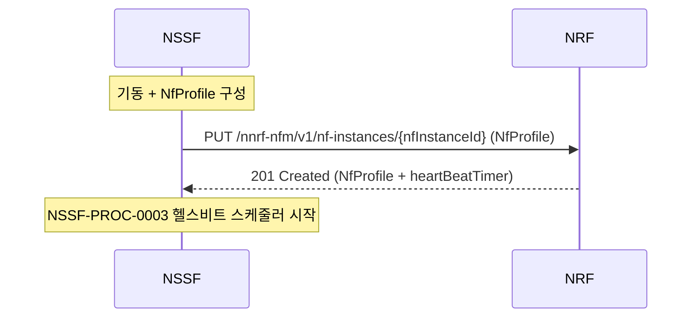
```mermaid
sequenceDiagram
    participant NSSF as NSSF
    participant NRF as NRF
    Note over NSSF: 기동 + NfProfile 구성
    NSSF->>NRF: PUT /nnrf-nfm/v1/nf-instances/{nfInstanceId} (NfProfile)
    NRF-->>NSSF: 201 Created (NfProfile + heartBeatTimer)
    Note over NSSF: NSSF-PROC-0003 헬스비트 스케줄러 시작
```

#### 6-B. 이상 흐름

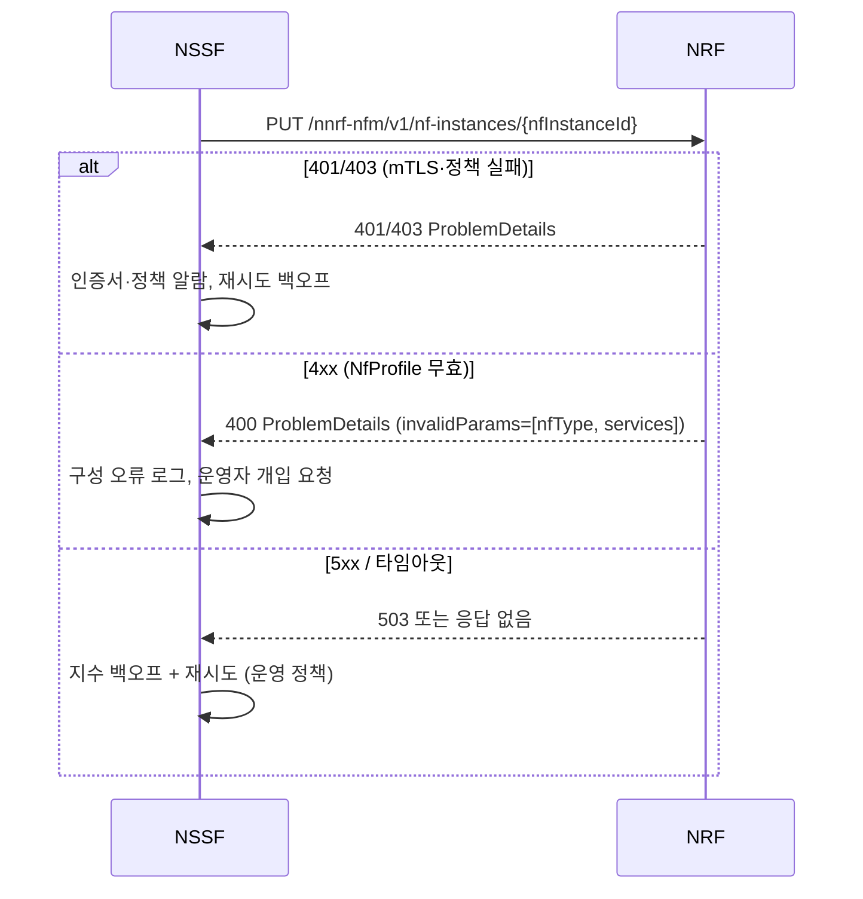
```mermaid
sequenceDiagram
    participant NSSF as NSSF
    participant NRF as NRF
    NSSF->>NRF: PUT /nnrf-nfm/v1/nf-instances/{nfInstanceId}
    alt 401/403 (mTLS·정책 실패)
        NRF-->>NSSF: 401/403 ProblemDetails
        NSSF->>NSSF: 인증서·정책 알람, 재시도 백오프
    else 4xx (NfProfile 무효)
        NRF-->>NSSF: 400 ProblemDetails (invalidParams=[nfType, services])
        NSSF->>NSSF: 구성 오류 로그, 운영자 개입 요청
    else 5xx / 타임아웃
        NRF-->>NSSF: 503 또는 응답 없음
        NSSF->>NSSF: 지수 백오프 + 재시도 (운영 정책)
    end
```

#### 7. 내부 상태 전이

| 시점 | 전이 전 | 트리거 메시지 | 전이 후 | 영향 엔티티 |
|---|---|---|---|---|
| 등록 직전 | `NRF_UNREGISTERED` | PUT 송신 | `NRF_REGISTERING` | NRF 클라이언트 풀 |
| 201 수신 | `NRF_REGISTERING` | 201 Created | `NRF_REGISTERED` + heartBeatTimer 적용 | NRF 클라이언트 풀, 헬스비트 스케줄러 |

---

### 2.2 NSSF-PROC-0002: NF Deregistration

- **출처 인용**: 23.502 §4.17.1, 29.510 §5.2.2
- **본 NF 역할**: Cons
- **트리거**: T-STATE — NSSF 정상 종료(`SIGTERM`) 또는 운영자 명령
- **선행 조건**: NSSF 가 NRF에 등록 상태

#### 5-B. 메시지 ↔ 엔드포인트 매핑

| # | 송신 → 수신 | METHOD URI | 비고 |
|---|---|---|---|
| 1 | NSSF → NRF | `DELETE /nnrf-nfm/v1/nf-instances/{nfInstanceId}` | Nnrf_NFManagement_NFDeregister |
| 2 | NRF → NSSF | `204 No Content` | – |

#### 6-A. 정상 흐름

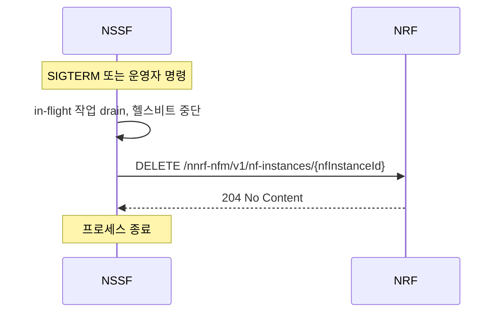
```mermaid
sequenceDiagram
    participant NSSF as NSSF
    participant NRF as NRF
    Note over NSSF: SIGTERM 또는 운영자 명령
    NSSF->>NSSF: in-flight 작업 drain, 헬스비트 중단
    NSSF->>NRF: DELETE /nnrf-nfm/v1/nf-instances/{nfInstanceId}
    NRF-->>NSSF: 204 No Content
    Note over NSSF: 프로세스 종료
```

#### 6-B. 이상 흐름

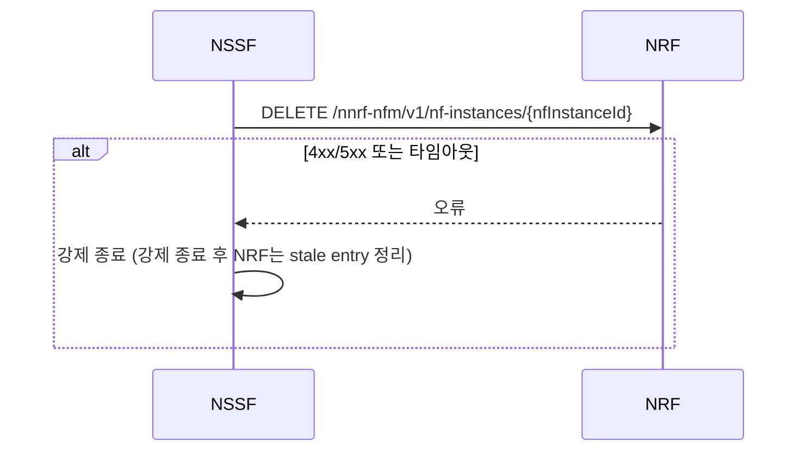
```mermaid
sequenceDiagram
    participant NSSF as NSSF
    participant NRF as NRF
    NSSF->>NRF: DELETE /nnrf-nfm/v1/nf-instances/{nfInstanceId}
    alt 4xx/5xx 또는 타임아웃
        NRF-->>NSSF: 오류
        NSSF->>NSSF: 강제 종료 (강제 종료 후 NRF는 stale entry 정리)
    end
```

#### 7. 내부 상태 전이

| 시점 | 전이 전 | 트리거 메시지 | 전이 후 | 영향 엔티티 |
|---|---|---|---|---|
| 종료 시작 | `NRF_REGISTERED` | DELETE 송신 | `NRF_DEREGISTERING` | NRF 클라이언트 풀 |
| 204 수신 | `NRF_DEREGISTERING` | 204 | `NRF_UNREGISTERED` | – |

---

### 2.3 NSSF-PROC-0003: NF Heartbeat (NFStatus Update)

- **출처 인용**: 23.502 §4.17.2, 29.510 §5.2.2.4
- **본 NF 역할**: Cons
- **트리거**: T-TIME — `heartBeatTimer` 만료 (NRF가 등록 응답 시 부여)
- **선행 조건**: `NRF_REGISTERED`

#### 5-B. 메시지 ↔ 엔드포인트 매핑

| # | 송신 → 수신 | METHOD URI | 비고 |
|---|---|---|---|
| 1 | NSSF → NRF | `PATCH /nnrf-nfm/v1/nf-instances/{nfInstanceId}` (PatchDocument: `{op: replace, path: /nfStatus, value: REGISTERED}`) | Nnrf_NFManagement_NFUpdate |
| 2 | NRF → NSSF | `204 No Content` | – |

#### 6-A. 정상 흐름

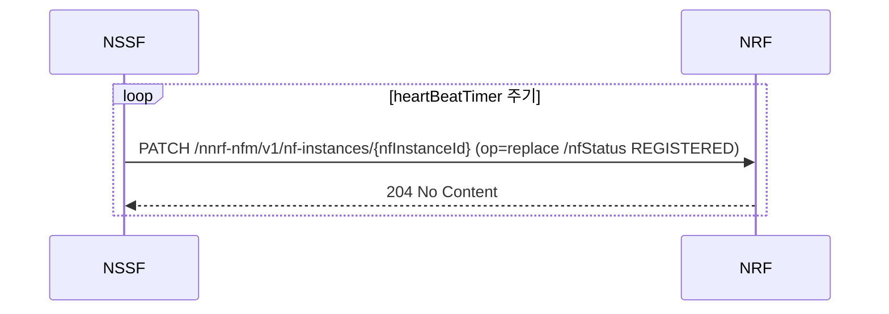
```mermaid
sequenceDiagram
    participant NSSF as NSSF
    participant NRF as NRF
    loop heartBeatTimer 주기
        NSSF->>NRF: PATCH /nnrf-nfm/v1/nf-instances/{nfInstanceId} (op=replace /nfStatus REGISTERED)
        NRF-->>NSSF: 204 No Content
    end
```

#### 6-B. 이상 흐름

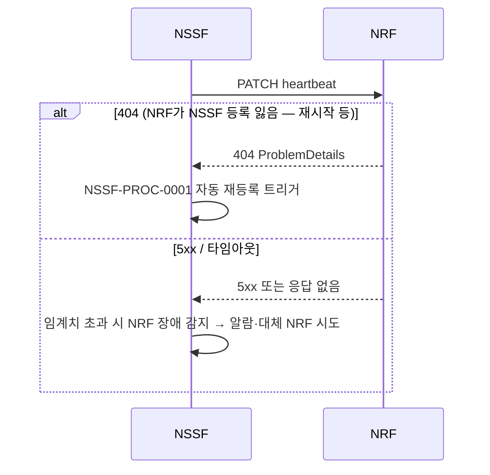
```mermaid
sequenceDiagram
    participant NSSF as NSSF
    participant NRF as NRF
    NSSF->>NRF: PATCH heartbeat
    alt 404 (NRF가 NSSF 등록 잃음 — 재시작 등)
        NRF-->>NSSF: 404 ProblemDetails
        NSSF->>NSSF: NSSF-PROC-0001 자동 재등록 트리거
    else 5xx / 타임아웃
        NRF-->>NSSF: 5xx 또는 응답 없음
        NSSF->>NSSF: 임계치 초과 시 NRF 장애 감지 → 알람·대체 NRF 시도
    end
```

#### 7. 내부 상태 전이

| 시점 | 전이 전 | 트리거 메시지 | 전이 후 | 영향 엔티티 |
|---|---|---|---|---|
| 정상 응답 | `NRF_REGISTERED` | 204 | `NRF_REGISTERED` (heartbeat 카운트 ↑) | NRF 클라이언트 풀 |
| 404 응답 | `NRF_REGISTERED` | 404 | `NRF_UNREGISTERED` → PROC-0001 트리거 | NRF 클라이언트 풀 |

---

### 2.4 NSSF-PROC-0004: NRF NFDiscovery (AMF candidate 조회)

- **출처 인용**: 23.502 §4.17.4, 29.510 §5.3; 29.531 §5.2.2.2.2 NOTE — "NSSF may query NRF to discover target AMF Set" (MGMT-0001)
- **본 NF 역할**: Cons
- **트리거**: T-MSG — PROC-0006/0007 처리 중 candidate AMF list 결정 필요
- **선행 조건**: `NRF_REGISTERED`, OAuth2 토큰 보유 또는 즉시 발급 가능

#### 5-B. 메시지 ↔ 엔드포인트 매핑

| # | 송신 → 수신 | METHOD URI | 비고 |
|---|---|---|---|
| 1 | NSSF → NRF | `GET /nnrf-disc/v1/nf-instances?target-nf-type=AMF&...` | Nnrf_NFDiscovery_NFDiscover |
| 2 | NRF → NSSF | `200 OK` (SearchResult, NfProfile list) | – |

#### 6-A. 정상 흐름

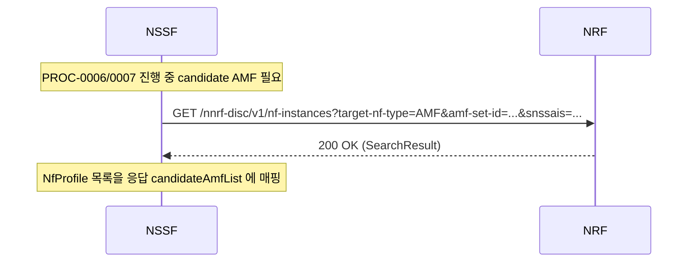
```mermaid
sequenceDiagram
    participant NSSF as NSSF
    participant NRF as NRF
    Note over NSSF: PROC-0006/0007 진행 중 candidate AMF 필요
    NSSF->>NRF: GET /nnrf-disc/v1/nf-instances?target-nf-type=AMF&amf-set-id=...&snssais=...
    NRF-->>NSSF: 200 OK (SearchResult)
    Note over NSSF: NfProfile 목록을 응답 candidateAmfList 에 매핑
```

#### 6-B. 이상 흐름

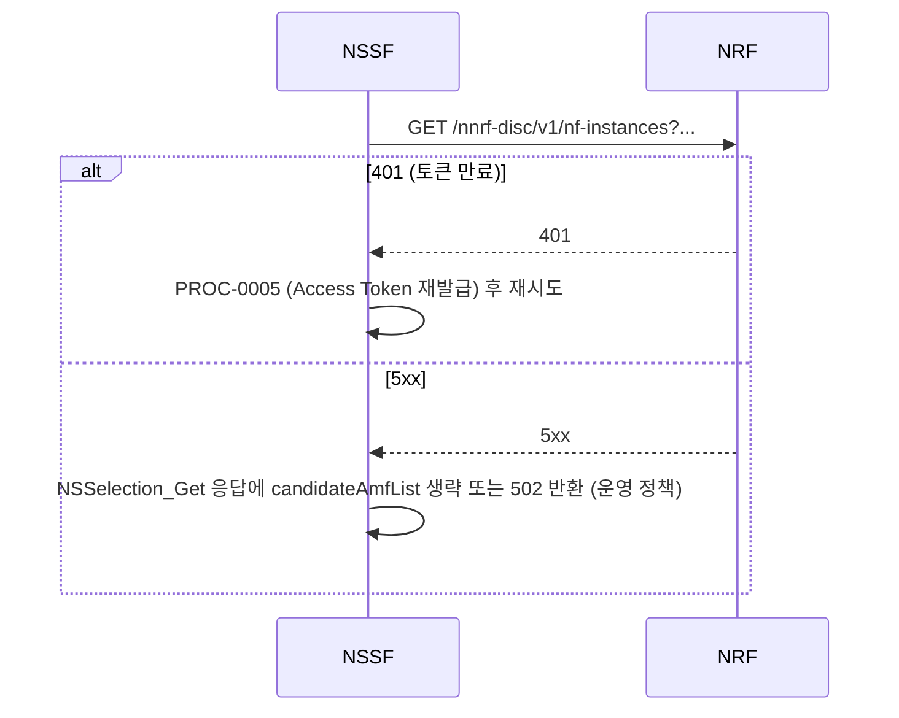
```mermaid
sequenceDiagram
    participant NSSF as NSSF
    participant NRF as NRF
    NSSF->>NRF: GET /nnrf-disc/v1/nf-instances?...
    alt 401 (토큰 만료)
        NRF-->>NSSF: 401
        NSSF->>NSSF: PROC-0005 (Access Token 재발급) 후 재시도
    else 5xx
        NRF-->>NSSF: 5xx
        NSSF->>NSSF: NSSelection_Get 응답에 candidateAmfList 생략 또는 502 반환 (운영 정책)
    end
```

#### 7. 내부 상태 전이

상태 전이 없음 (read-only 조회).

---

### 2.5 NSSF-PROC-0005: OAuth2 Access Token Acquisition

- **출처 인용**: 29.531 §6.1.9 / §6.2.9, 33.501 §13, RFC 6749, 29.510 §5.4.2.2
- **본 NF 역할**: Cons (NRF가 authorization server)
- **트리거**: T-MSG, T-STATE — (a) Notify 송신 직전 캐시 토큰 미보유/만료, (b) NRF Discovery 호출 직전
- **선행 조건**: `NRF_REGISTERED`, mTLS 채널

#### 5-B. 메시지 ↔ 엔드포인트 매핑

| # | 송신 → 수신 | METHOD URI | 비고 |
|---|---|---|---|
| 1 | NSSF → NRF | `POST /oauth2/token` (grant_type=client_credentials, scope=`<target-api>`, nfInstanceId=NSSF id, nfType=NSSF, targetNfType=...) | Nnrf_AccessToken_Get |
| 2 | NRF → NSSF | `200 OK` (`access_token`, `token_type=Bearer`, `expires_in`) | – |

#### 6-A. 정상 흐름

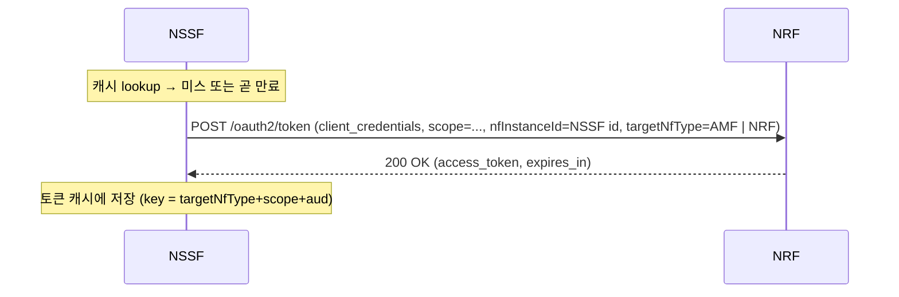
```mermaid
sequenceDiagram
    participant NSSF as NSSF
    participant NRF as NRF
    Note over NSSF: 캐시 lookup → 미스 또는 곧 만료
    NSSF->>NRF: POST /oauth2/token (client_credentials, scope=..., nfInstanceId=NSSF id, targetNfType=AMF | NRF)
    NRF-->>NSSF: 200 OK (access_token, expires_in)
    Note over NSSF: 토큰 캐시에 저장 (key = targetNfType+scope+aud)
```

#### 6-B. 이상 흐름

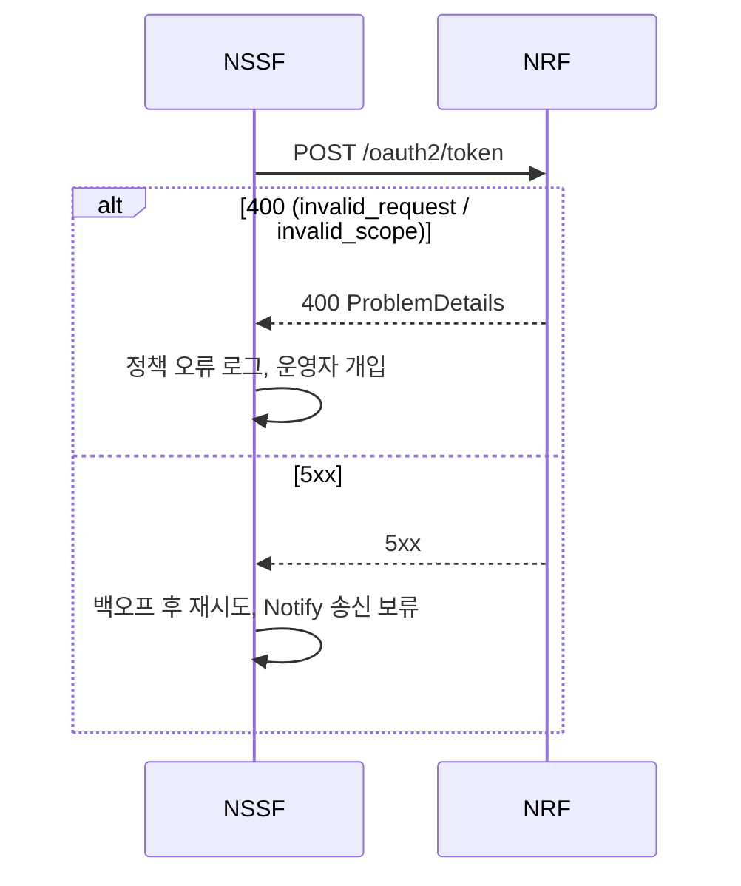
```mermaid
sequenceDiagram
    participant NSSF as NSSF
    participant NRF as NRF
    NSSF->>NRF: POST /oauth2/token
    alt 400 (invalid_request / invalid_scope)
        NRF-->>NSSF: 400 ProblemDetails
        NSSF->>NSSF: 정책 오류 로그, 운영자 개입
    else 5xx
        NRF-->>NSSF: 5xx
        NSSF->>NSSF: 백오프 후 재시도, Notify 송신 보류
    end
```

#### 7. 내부 상태 전이

| 시점 | 전이 전 | 트리거 메시지 | 전이 후 | 영향 엔티티 |
|---|---|---|---|---|
| 발급 성공 | `TOKEN_CACHE_MISS` | 200 | `TOKEN_CACHE_HIT` (with expiry) | OAuth2 토큰 캐시 |

---

### 2.6 NSSF-PROC-0006: NSSelection_Get during Initial Registration

- **출처 인용**: 29.531 §5.2.2.2.1 ("The Get operation shall be invoked by the AMF in the non-roaming or"), §5.2.2.2.2; 23.502 §4.2.2.2.2 step 4a (line 6221): "Conditional Initial AMF to NSSF: Nnssf_NSSelection_Get". 23.501 §5.15.5.2.1 (Network slice selection procedure step (B)).
- **본 NF 역할**: Prod
- **트리거**: T-MSG — Initial AMF 가 Registration 절차 step 4a에서 `slice-info-request-for-registration` 동봉 GET 송신
- **선행 조건**: NSSF 가 Configured NSSAI per TAI / AMF Set ↔ S-NSSAI 매핑 / NSAG / Restriction 데이터 보유

#### 5-A. 참여 NF 매트릭스

| 참여 NF | 역할 | 비고 |
|---|---|---|
| UE | (시퀀스 시작 트리거) | Registration Request 송신 |
| (R)AN | Routing | NAS 전달 |
| Initial AMF | Initiator (NSSF 입장 Consumer) | step 4a |
| NSSF | Recipient (Producer) | – |
| NRF | Routing (선택) | PROC-0004 (AMF Set 후보) |
| target AMF | Recipient (Registration 후속) | NSSF 응답 후 AMF 재할당 시 |

#### 5-B. 메시지 ↔ 엔드포인트 매핑

| # | 송신 → 수신 | METHOD URI | api-analysis # | 비고 |
|---|---|---|---|---|
| 1 | AMF → NSSF | GET /nnssf-nsselection/v2/network-slice-information?nf-type=AMF&nf-id=...&slice-info-request-for-registration=...&tai=... | E1 | – |
| 2 | NSSF → NRF (선택) | GET /nnrf-disc/v1/nf-instances?target-nf-type=AMF&... | PROC-0004 호출 | candidateAmfList 결정 시 |
| 3 | NSSF → AMF | 200 OK (AuthorizedNetworkSliceInfo: allowedNssai / configuredNssai / targetAmfSet 또는 candidateAmfList / nsiInformation / mappingOfNssai 등) | E1 | – |

#### 6-A. 정상 흐름

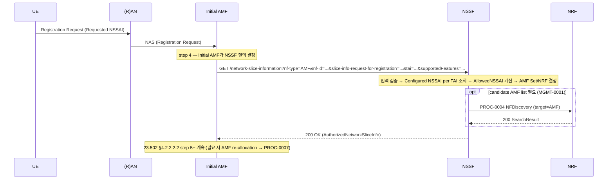
```mermaid
sequenceDiagram
    participant UE as UE
    participant RAN as (R)AN
    participant AMF as Initial AMF
    participant NSSF as NSSF
    participant NRF as NRF
    UE->>RAN: Registration Request (Requested NSSAI)
    RAN->>AMF: NAS (Registration Request)
    Note over AMF: step 4 — initial AMF가 NSSF 질의 결정
    AMF->>NSSF: GET /network-slice-information?nf-type=AMF&nf-id=...&slice-info-request-for-registration=...&tai=...&supportedFeatures=...
    Note over NSSF: 입력 검증 → Configured NSSAI per TAI 조회 → AllowedNSSAI 계산 → AMF Set/NRF 결정
    opt candidate AMF list 필요 (MGMT-0001)
        NSSF->>NRF: PROC-0004 NFDiscovery (target=AMF)
        NRF-->>NSSF: 200 SearchResult
    end
    NSSF-->>AMF: 200 OK (AuthorizedNetworkSliceInfo)
    Note over AMF: 23.502 §4.2.2.2.2 step 5+ 계속 (필요 시 AMF re-allocation → PROC-0007)
```

#### 6-B. 이상 흐름

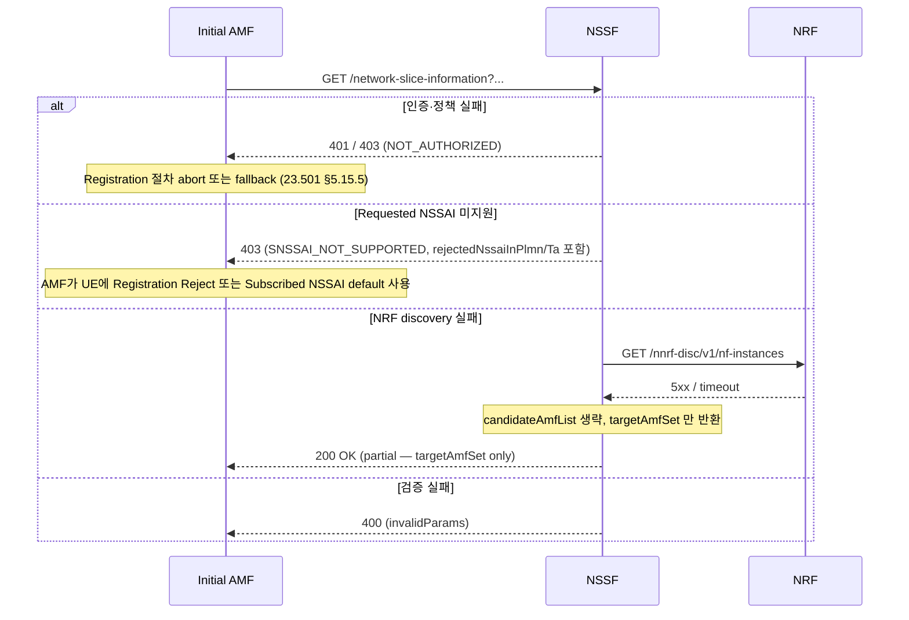
```mermaid
sequenceDiagram
    participant AMF as Initial AMF
    participant NSSF as NSSF
    participant NRF as NRF
    AMF->>NSSF: GET /network-slice-information?...
    alt 인증·정책 실패
        NSSF-->>AMF: 401 / 403 (NOT_AUTHORIZED)
        Note over AMF: Registration 절차 abort 또는 fallback (23.501 §5.15.5)
    else Requested NSSAI 미지원
        NSSF-->>AMF: 403 (SNSSAI_NOT_SUPPORTED, rejectedNssaiInPlmn/Ta 포함)
        Note over AMF: AMF가 UE에 Registration Reject 또는 Subscribed NSSAI default 사용
    else NRF discovery 실패
        NSSF->>NRF: GET /nnrf-disc/v1/nf-instances
        NRF-->>NSSF: 5xx / timeout
        Note over NSSF: candidateAmfList 생략, targetAmfSet 만 반환
        NSSF-->>AMF: 200 OK (partial — targetAmfSet only)
    else 검증 실패
        NSSF-->>AMF: 400 (invalidParams)
    end
```

#### 7. 내부 상태 전이

상태 전이 없음 (정책 데이터 read-only 조회 + 일시 계산).

---

### 2.7 NSSF-PROC-0007: NSSelection_Get during Registration with AMF Re-allocation

- **출처 인용**: 23.502 §4.2.2.2.3 (Initial AMF가 적합 X → NSSF에 재질의 또는 NSSF가 target AMF Set 반환).
- **본 NF 역할**: Prod
- **트리거**: T-MSG — PROC-0006 응답의 `targetAmfSet`이 초기 AMF와 다름 → AMF re-allocation 발생, NSSF가 candidateAmfList 추가 제공 가능
- **선행 조건**: 동 PROC-0006

#### 5-A. 참여 NF 매트릭스

| 참여 NF | 역할 |
|---|---|
| Initial AMF | Initiator |
| NSSF | Recipient |
| NRF | Routing (선택) |
| Target AMF | (후속 Registration 재전송 수신) |

#### 5-B. 메시지 ↔ 엔드포인트 매핑

PROC-0006 동일. 단, 응답에 `targetAmfSet` + `candidateAmfList` 모두 채워질 수 있음.

#### 6-A. 정상 흐름

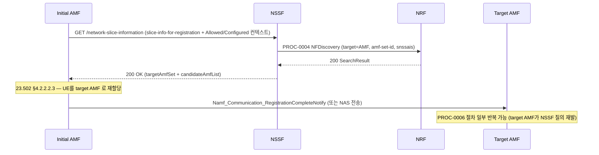
```mermaid
sequenceDiagram
    participant AMFa as Initial AMF
    participant NSSF as NSSF
    participant NRF as NRF
    participant AMFb as Target AMF
    AMFa->>NSSF: GET /network-slice-information (slice-info-for-registration + Allowed/Configured 컨텍스트)
    NSSF->>NRF: PROC-0004 NFDiscovery (target=AMF, amf-set-id, snssais)
    NRF-->>NSSF: 200 SearchResult
    NSSF-->>AMFa: 200 OK (targetAmfSet + candidateAmfList)
    Note over AMFa: 23.502 §4.2.2.2.3 — UE를 target AMF 로 재할당
    AMFa->>AMFb: Namf_Communication_RegistrationCompleteNotify (또는 NAS 전송)
    Note over AMFb: PROC-0006 절차 일부 반복 가능 (target AMF가 NSSF 질의 재발)
```

#### 6-B. 이상 흐름

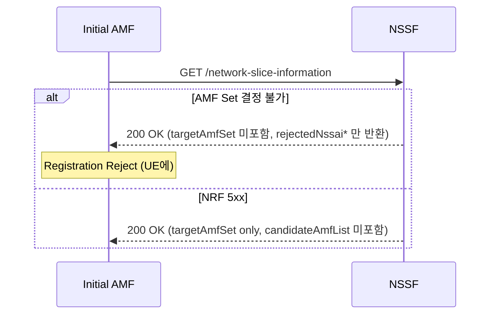
```mermaid
sequenceDiagram
    participant AMFa as Initial AMF
    participant NSSF as NSSF
    AMFa->>NSSF: GET /network-slice-information
    alt AMF Set 결정 불가
        NSSF-->>AMFa: 200 OK (targetAmfSet 미포함, rejectedNssai* 만 반환)
        Note over AMFa: Registration Reject (UE에)
    else NRF 5xx
        NSSF-->>AMFa: 200 OK (targetAmfSet only, candidateAmfList 미포함)
    end
```

#### 7. 내부 상태 전이

상태 전이 없음.

---

### 2.8 NSSF-PROC-0008: NSSelection_Get during PDU Session Establishment

- **출처 인용**: 29.531 §5.2.2.2.3, 23.502 §4.3.2.2.3.2/.3 (LBO·HR roaming 슬라이스 매핑)
- **본 NF 역할**: Prod
- **트리거**: T-MSG — SMF (또는 SMF+PGW-C in EPS 시 PROC-0010) 가 PDU Session 수립 중 슬라이스 매핑 조회

#### 5-A. 참여 NF 매트릭스

| 참여 NF | 역할 |
|---|---|
| SMF | Initiator |
| NSSF | Recipient |
| H-NSSF (HR roaming 시) | Recipient (V-NSSF가 H-NSSF에 추가 질의 — PROC-0012) |

#### 5-B. 메시지 ↔ 엔드포인트 매핑

| # | 송신 → 수신 | METHOD URI | api-analysis # |
|---|---|---|---|
| 1 | SMF → NSSF | GET /network-slice-information?nf-type=SMF&nf-id=...&slice-info-request-for-pdu-session=...&tai=...&home-plmn-id=... | E1 |
| 2 (선택, HR roaming) | V-NSSF → H-NSSF (via SEPP) | GET /network-slice-information?... (PROC-0012) | E1 |
| 3 | NSSF → SMF | 200 OK (AuthorizedNetworkSliceInfo: nsiInformation + mappingOfNssai for HR) | E1 |

#### 6-A. 정상 흐름

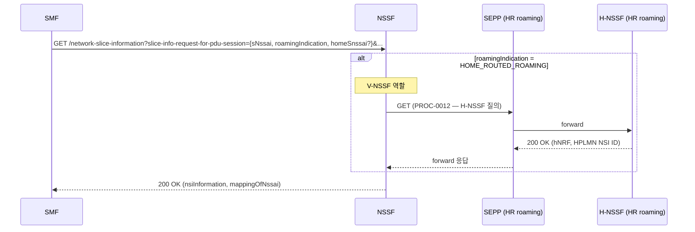
```mermaid
sequenceDiagram
    participant SMF as SMF
    participant NSSF as NSSF
    participant SEPP as SEPP (HR roaming)
    participant HNSSF as H-NSSF (HR roaming)
    SMF->>NSSF: GET /network-slice-information?slice-info-request-for-pdu-session={sNssai, roamingIndication, homeSnssai?}&...
    alt roamingIndication = HOME_ROUTED_ROAMING
        Note over NSSF: V-NSSF 역할
        NSSF->>SEPP: GET (PROC-0012 — H-NSSF 질의)
        SEPP->>HNSSF: forward
        HNSSF-->>SEPP: 200 OK (hNRF, HPLMN NSI ID)
        SEPP-->>NSSF: forward 응답
    end
    NSSF-->>SMF: 200 OK (nsiInformation, mappingOfNssai)
```

#### 6-B. 이상 흐름

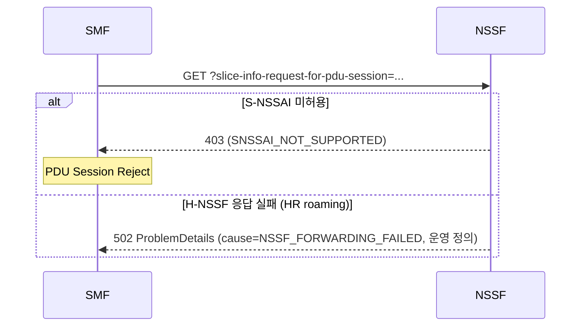
```mermaid
sequenceDiagram
    participant SMF as SMF
    participant NSSF as NSSF
    SMF->>NSSF: GET ?slice-info-request-for-pdu-session=...
    alt S-NSSAI 미허용
        NSSF-->>SMF: 403 (SNSSAI_NOT_SUPPORTED)
        Note over SMF: PDU Session Reject
    else H-NSSF 응답 실패 (HR roaming)
        NSSF-->>SMF: 502 ProblemDetails (cause=NSSF_FORWARDING_FAILED, 운영 정의)
    end
```

#### 7. 내부 상태 전이

상태 전이 없음.

---

### 2.9 NSSF-PROC-0009: NSSelection_Get during UE Configuration Update

- **출처 인용**: 29.531 §5.2.2.2.4, 23.502 §4.2.4.2
- **본 NF 역할**: Prod
- **트리거**: T-MSG — AMF가 UCU 절차에서 Configured NSSAI 갱신 필요

#### 5-A. 참여 NF 매트릭스

AMF (Initiator) ↔ NSSF (Recipient)

#### 5-B. 메시지 ↔ 엔드포인트 매핑

| # | 송신 → 수신 | METHOD URI |
|---|---|---|
| 1 | AMF → NSSF | GET /network-slice-information?slice-info-request-for-ue-cu=...&tai=...&supportedFeatures=... |
| 2 | NSSF → AMF | 200 OK (AuthorizedNetworkSliceInfo, configuredNssai 강조) |

#### 6-A. 정상 흐름

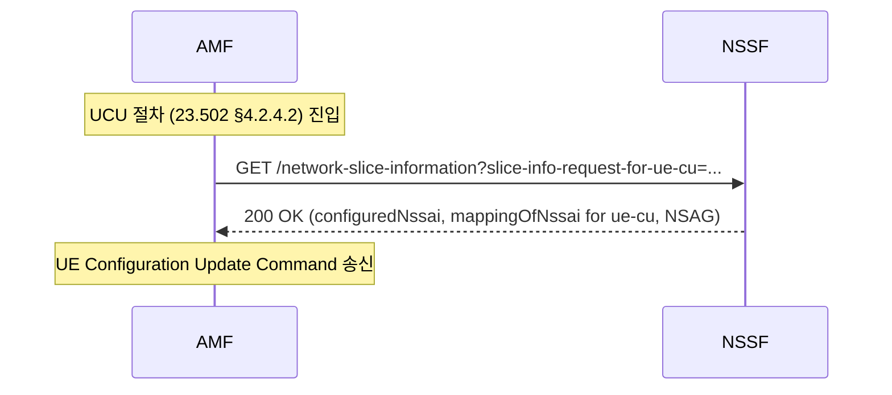
```mermaid
sequenceDiagram
    participant AMF as AMF
    participant NSSF as NSSF
    Note over AMF: UCU 절차 (23.502 §4.2.4.2) 진입
    AMF->>NSSF: GET /network-slice-information?slice-info-request-for-ue-cu=...
    NSSF-->>AMF: 200 OK (configuredNssai, mappingOfNssai for ue-cu, NSAG)
    Note over AMF: UE Configuration Update Command 송신
```

#### 6-B. 이상 흐름

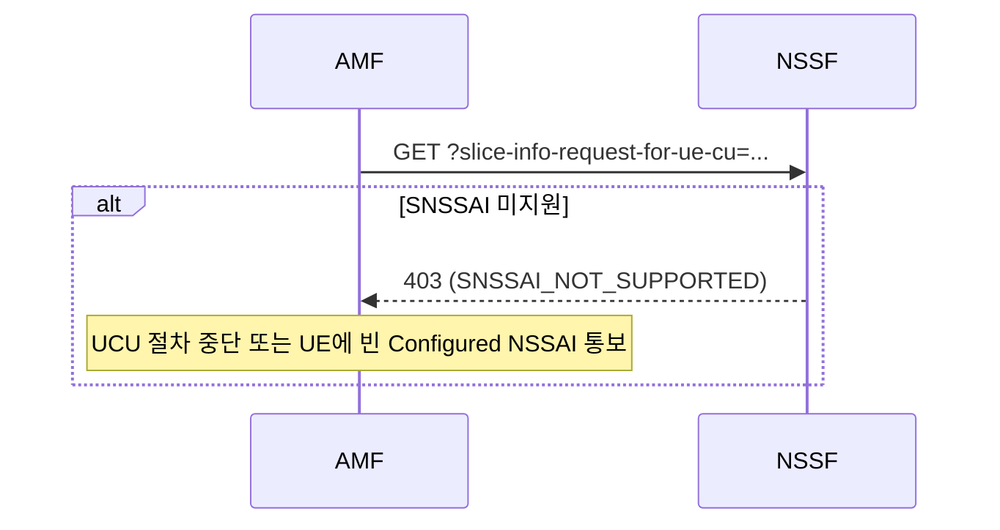
```mermaid
sequenceDiagram
    participant AMF as AMF
    participant NSSF as NSSF
    AMF->>NSSF: GET ?slice-info-request-for-ue-cu=...
    alt SNSSAI 미지원
        NSSF-->>AMF: 403 (SNSSAI_NOT_SUPPORTED)
        Note over AMF: UCU 절차 중단 또는 UE에 빈 Configured NSSAI 통보
    end
```

#### 7. 내부 상태 전이

상태 전이 없음.

---

### 2.10 NSSF-PROC-0010: NSSelection_Get during PDN Connection Establishment (EPS, RSIPCE)

- **출처 인용**: 29.531 §5.2.2.2.5, 23.502 §4.11.0a.5; feature negotiation: RSIPCE (F#3) MUST be agreed.
- **본 NF 역할**: Prod
- **트리거**: T-MSG — SMF+PGW-C 가 EPS PDN Connection 수립 시 슬라이스 매핑 조회

#### 5-B. 메시지 ↔ 엔드포인트 매핑

| # | 송신 → 수신 | METHOD URI |
|---|---|---|
| 1 | SMF+PGW-C → NSSF | GET /network-slice-information?slice-info-request-for-pdn-connection=[Snssai, ...]&home-plmn-id=...&supportedFeatures=...(RSIPCE) |
| 2 | NSSF → SMF+PGW-C | 200 OK (mappingOfNssai for PDN Connection) |

#### 6-A. 정상 흐름

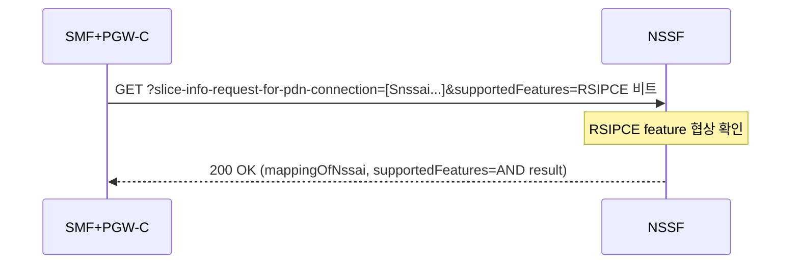
```mermaid
sequenceDiagram
    participant SP as SMF+PGW-C
    participant NSSF as NSSF
    SP->>NSSF: GET ?slice-info-request-for-pdn-connection=[Snssai...]&supportedFeatures=RSIPCE 비트
    Note over NSSF: RSIPCE feature 협상 확인
    NSSF-->>SP: 200 OK (mappingOfNssai, supportedFeatures=AND result)
```

#### 6-B. 이상 흐름

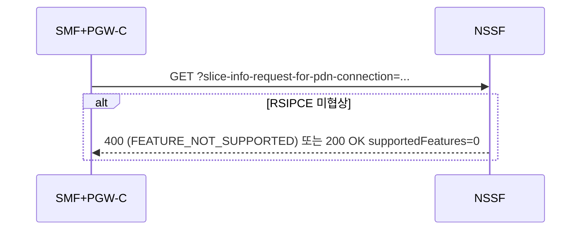
```mermaid
sequenceDiagram
    participant SP as SMF+PGW-C
    participant NSSF as NSSF
    SP->>NSSF: GET ?slice-info-request-for-pdn-connection=...
    alt RSIPCE 미협상
        NSSF-->>SP: 400 (FEATURE_NOT_SUPPORTED) 또는 200 OK supportedFeatures=0
    end
```

#### 7. 내부 상태 전이

상태 전이 없음.

---

### 2.11 NSSF-PROC-0011: NSSelection_Get for Other Purpose (NWDAF Analytics, SIOP)

- **출처 인용**: 29.531 §5.2.2.2.6, 23.288 §6.3.4; feature SIOP (F#4)
- **본 NF 역할**: Prod
- **트리거**: T-MSG — NWDAF가 Network Slice load analytics 수행 시 NSI ID 조회

#### 5-B. 메시지 ↔ 엔드포인트 매핑

| # | 송신 → 수신 | METHOD URI |
|---|---|---|
| 1 | NWDAF → NSSF | GET /network-slice-information?slice-info-request-for-other-purpose=[Snssai...]&supportedFeatures=SIOP |
| 2 | NSSF → NWDAF | 200 OK (snssaiInfoRspData = map<Snssai, SnssaiInfo{nsiIds}>) |

#### 6-A. 정상 흐름

```mermaid
sequenceDiagram
    participant NWDAF as NWDAF
    participant NSSF as NSSF
    NWDAF->>NSSF: GET ?slice-info-request-for-other-purpose=[s1,s2,...]&supportedFeatures=SIOP
    NSSF-->>NWDAF: 200 OK (snssaiInfoRspData = {s1: {nsiIds:[n1,n2]}, ...})
```

#### 6-B. 이상 흐름

```mermaid
sequenceDiagram
    participant NWDAF as NWDAF
    participant NSSF as NSSF
    NWDAF->>NSSF: GET ?slice-info-request-for-other-purpose=...
    alt SIOP 미협상
        NSSF-->>NWDAF: 400 (FEATURE_NOT_SUPPORTED)
    else 부분 매칭
        NSSF-->>NWDAF: 200 OK (요청 NSSAI 중 매칭된 NSI ID만 반환)
    end
```

#### 7. 내부 상태 전이

상태 전이 없음.

---

### 2.12 NSSF-PROC-0012: Inter-PLMN NSSelection_Get (V-NSSF ↔ H-NSSF via SEPP)

- **출처 인용**: 23.501 §5.30, 23.502 §5.2.16.2, 29.500 §5.10 (N32-f)
- **본 NF 역할**: **Both** — V-NSSF 시 Consumer, H-NSSF 시 Producer
- **트리거**: T-MSG — HR roaming PDU Session 또는 inter-PLMN registration 에서 V-NSSF가 H-NSSF에 HPLMN 슬라이스 정보 요청
- **선행 조건**: N32-c 경유 SA association 확립 (SEPP), PRINS 또는 TLS 채널

#### 5-A. 참여 NF 매트릭스

| 참여 NF | 역할 |
|---|---|
| AMF (V-PLMN) | Initiator |
| V-NSSF (본 NF, 일부 시나리오) | Both (Recipient from AMF + Initiator to SEPP) |
| V-SEPP | Routing |
| H-SEPP | Routing |
| H-NSSF (본 NF, 일부 시나리오) | Recipient (Producer) |

#### 5-B. 메시지 ↔ 엔드포인트 매핑

| # | 송신 → 수신 | METHOD URI | 메시지별 역할 (Both 분리) |
|---|---|---|---|
| 1 | AMF (V) → V-NSSF | GET /network-slice-information (E1) | V-NSSF = Producer |
| 2 | V-NSSF → V-SEPP | GET (forward, N32-f) | V-NSSF = Consumer |
| 3 | V-SEPP → H-SEPP | N32-f over PRINS/TLS | 라우팅 |
| 4 | H-SEPP → H-NSSF | GET /network-slice-information (E1) | H-NSSF = Producer |
| 5 | H-NSSF → H-SEPP → V-SEPP → V-NSSF | 200 OK chain (역방향) | – |
| 6 | V-NSSF → AMF (V) | 200 OK (V-PLMN 슬라이스 + H-PLMN 매핑 통합) | V-NSSF = Producer |

#### 6-A. 정상 흐름

```mermaid
sequenceDiagram
    participant AMF as AMF (V-PLMN)
    participant VN as V-NSSF (본 NF, Both)
    participant VS as V-SEPP
    participant HS as H-SEPP
    participant HN as H-NSSF (본 NF, Both)
    AMF->>VN: GET /network-slice-information?...&home-plmn-id=HPLMN
    Note over VN: roaming indication → H-NSSF 질의 필요
    VN->>VS: GET (N32-f routing)
    VS->>HS: N32-f forward
    HS->>HN: GET /network-slice-information?...
    HN-->>HS: 200 OK (HPLMN slice info)
    HS-->>VS: N32-f response
    VS-->>VN: 200 OK
    Note over VN: VPLMN↔HPLMN 매핑 통합
    VN-->>AMF: 200 OK (AuthorizedNetworkSliceInfo)
```

#### 6-B. 이상 흐름

```mermaid
sequenceDiagram
    participant VN as V-NSSF
    participant VS as V-SEPP
    participant HS as H-SEPP
    participant HN as H-NSSF
    VN->>VS: GET (N32-f forward)
    alt SEPP 인증/PRINS 실패
        VS-->>VN: 502/403 ProblemDetails
        VN->>VN: 운영 알람, 로그
    else H-NSSF 미지원 S-NSSAI
        HN-->>HS: 403 (SNSSAI_NOT_SUPPORTED)
        HS-->>VS: forward
        VS-->>VN: 403
        VN-->>VN: AMF 응답에 rejectedNssaiInPlmn 포함
    else N32-f 타임아웃
        VN->>VN: 5xx 또는 502 SNSSAI 매핑 누락 응답
    end
```

#### 7. 내부 상태 전이

상태 전이 없음 (캐시 갱신은 운영 옵션).

---

### 2.13 NSSF-PROC-0013: NSSAIAvailability_Update (PUT/PATCH)

- **출처 인용**: 29.531 §5.3.2.2.1·§5.3.2.2.2, 23.502 §5.2.16.3.2
- **본 NF 역할**: Prod
- **트리거**: T-MSG — AMF 가 per-TA S-NSSAI 변경을 NSSF에 보고 (PUT 전체교체 또는 PATCH 부분갱신)

#### 5-A. 참여 NF 매트릭스

| 참여 NF | 역할 |
|---|---|
| AMF | Initiator |
| NSSF | Recipient |
| (구독 중인 Consumer N개) | (간접 영향 — PROC-0015 트리거) |

#### 5-B. 메시지 ↔ 엔드포인트 매핑

| # | 송신 → 수신 | METHOD URI | api-analysis # |
|---|---|---|---|
| 1 | AMF → NSSF | PUT /nssai-availability/{nfId} (NssaiAvailabilityInfo) **또는** PATCH /nssai-availability/{nfId} (PatchDocument, json-patch+json) | E2 / E3 |
| 2 | NSSF → AMF | 200 OK (AuthorizedNssaiAvailabilityInfo) 또는 204 No Content | E2 / E3 |

#### 6-A. 정상 흐름

```mermaid
sequenceDiagram
    participant AMF as AMF
    participant NSSF as NSSF
    participant SubMgr as Subscription Manager (내부)
    AMF->>NSSF: PUT /nssai-availability/{nfId} (NssaiAvailabilityInfo)
    Note over NSSF: 입력 검증 → SNSSAI 인증 → RestrictedSnssai 산출 → 변경 분석
    NSSF-->>AMF: 200 OK (AuthorizedNssaiAvailabilityInfo)
    Note over NSSF: PROC-0015 큐잉 (변경된 TAI/SNSSAI 구독자에게)
    NSSF->>SubMgr: enqueue notify (SNSSAI_STATUS_CHANGE)
```

#### 6-B. 이상 흐름

```mermaid
sequenceDiagram
    participant AMF as AMF
    participant NSSF as NSSF
    AMF->>NSSF: PUT /nssai-availability/{nfId}
    alt nfId 미존재 (PATCH 한정)
        NSSF-->>AMF: 404 (RESOURCE_NOT_FOUND)
    else S-NSSAI 미지원
        NSSF-->>AMF: 403 (SNSSAI_NOT_SUPPORTED)
    else PATCH JSON Patch 무결성 위반
        NSSF-->>AMF: 400 (invalidParams)
    else
        NSSF-->>AMF: 204 (인증 후 가용 슬라이스 0개)
    end
```

#### 7. 내부 상태 전이

| 시점 | 전이 전 | 트리거 메시지 | 전이 후 | 영향 엔티티 |
|---|---|---|---|---|
| PUT 적용 | (없거나) AMF Registration 상태 vN | PUT (NssaiAvailabilityInfo) | AMF Registration 상태 vN+1 (per-TA S-NSSAI 교체) | AMF 등록 상태 (per nfId), AuthorizedNssaiAvailability per AMF |
| PATCH 적용 | AMF Registration 상태 vN | PATCH (PatchItem...) | AMF Registration 상태 vN+1 (필드 일부 변경) | 동 |
| 변경 알림 큐 | – | NSSF 내부 enqueue | Notification 큐에 SNSSAI_STATUS_CHANGE 작업 추가 | 알림 큐 |

---

### 2.14 NSSF-PROC-0014: NSSAIAvailability_Subscribe (Create + Modify)

- **출처 인용**: 29.531 §5.3.2.3.1·§5.3.2.3.2, 23.502 §5.2.16.3.4; feature SUMOD (F#2)
- **본 NF 역할**: Prod
- **트리거**: T-MSG — Consumer (AMF 또는 V-NSSF) 가 4종 event 구독 또는 SUMOD 협상 후 PATCH 수정

#### 5-A. 참여 NF 매트릭스

| 참여 NF | 역할 |
|---|---|
| Consumer (AMF / V-NSSF) | Initiator |
| NSSF | Recipient |

#### 5-B. 메시지 ↔ 엔드포인트 매핑

| # | 송신 → 수신 | METHOD URI | api-analysis # |
|---|---|---|---|
| 1 (Create) | Consumer → NSSF | POST /nssai-availability/subscriptions (NssfEventSubscriptionCreateData) | E5 |
| 2 (Create resp) | NSSF → Consumer | 201 Created + `Location: .../subscriptions/{subscriptionId}` + body | E5 |
| 3 (Modify, SUMOD) | Consumer → NSSF | PATCH /nssai-availability/subscriptions/{subscriptionId} (PatchDocument) | E6 |
| 4 (Modify resp) | NSSF → Consumer | 200 OK (NssfEventSubscriptionCreatedData) | E6 |

#### 6-A. 정상 흐름

```mermaid
sequenceDiagram
    participant Cons as Consumer (AMF / V-NSSF)
    participant NSSF as NSSF
    Cons->>NSSF: POST /nssai-availability/subscriptions (nfNssaiAvailabilityUri, event, taiList/amfSetId/...)
    Note over NSSF: 이벤트 enum 검증 (SNSSAI_STATUS_CHANGE_REPORT | SNSSAI_REPLACEMENT_REPORT | NSI_UNAVAILABILITY_REPORT | SNSSAI_VALIDITY_TIME_REPORT) → 모두 미지원 시 501
    NSSF-->>Cons: 201 Created (subscriptionId, expiry, acceptedEvents)
    opt SUMOD 협상 + Consumer 수정 필요
        Cons->>NSSF: PATCH /nssai-availability/subscriptions/{subscriptionId} (PatchDocument, event IE 제외)
        NSSF-->>Cons: 200 OK
    end
```

#### 6-B. 이상 흐름

```mermaid
sequenceDiagram
    participant Cons as Consumer
    participant NSSF as NSSF
    Cons->>NSSF: POST /nssai-availability/subscriptions
    alt 모든 event 미지원
        NSSF-->>Cons: 501 (UNSUPPORTED_EVENT_TYPE)
    else nfNssaiAvailabilityUri 누락/형식 오류
        NSSF-->>Cons: 400 (invalidParams=[nfNssaiAvailabilityUri])
    else SUMOD 미협상 후 PATCH 시도
        Cons->>NSSF: PATCH .../{subscriptionId}
        NSSF-->>Cons: 403 (NOT_AUTHORIZED) or 400 (FEATURE_NOT_SUPPORTED)
    else event IE 변경 시도 (SVC-0020/0025 M-Not)
        Cons->>NSSF: PATCH (op=replace /event ...)
        NSSF-->>Cons: 400 (MODIFICATION_NOT_ALLOWED)
    else subscriptionId 미존재
        Cons->>NSSF: PATCH .../{id}
        NSSF-->>Cons: 404 (SUBSCRIPTION_NOT_FOUND)
    end
```

#### 7. 내부 상태 전이

| 시점 | 전이 전 | 트리거 메시지 | 전이 후 | 영향 엔티티 |
|---|---|---|---|---|
| Create | 구독 미존재 | POST 201 | `{subscriptionId, expiry, callbackUri, filter, events}` 신규 row | NSSAI Availability Subscription |
| Modify | 구독 존재 | PATCH 200 | filter/expiry 갱신 (event 불변) | 동 |
| Expiry 도달 | 구독 존재 | (PROC-0020 timer) | 구독 삭제 | 동 |

---

### 2.15 NSSF-PROC-0015: NSSAIAvailability_Notify — SNSSAI Status Change

- **출처 인용**: 29.531 §5.3.2.5.1 ("The NSSF shall notify the NF service consumer when the S-NSSAI..." — PRC-0001), §6.2.5.2.1, 23.502 §5.2.16.3.3
- **본 NF 역할**: Prod (NSSF → Consumer)
- **트리거**: T-STATE — PROC-0013 적용 결과 SNSSAI 가용성 변경, 또는 OAM/내부 정책 변경

#### 5-A. 참여 NF 매트릭스

| 참여 NF | 역할 |
|---|---|
| NSSF | Initiator (Producer of Notify) |
| Consumer (AMF / V-NSSF) | Recipient |
| NRF (선택) | Routing (PROC-0005 token 발급) |

#### 5-B. 메시지 ↔ 엔드포인트 매핑

| # | 송신 → 수신 | METHOD URI | api-analysis # |
|---|---|---|---|
| 0 | NSSF → NRF | POST /oauth2/token (PROC-0005, target = Consumer service) | – |
| 1 | NSSF → Consumer | POST {nfNssaiAvailabilityUri} (NssfEventNotification: subscriptionId, authorizedNssaiAvailabilityData) | C1 |
| 2 | Consumer → NSSF | 204 No Content | C1 |

#### 6-A. 정상 흐름

```mermaid
sequenceDiagram
    participant NSSF as NSSF
    participant NRF as NRF
    participant Cons as Consumer (AMF)
    Note over NSSF: NSSAI 상태 변경 감지 (PROC-0013 결과 등)
    NSSF->>NSSF: 구독 매칭 (taiList/amfSetId/event=SNSSAI_STATUS_CHANGE_REPORT)
    opt OAuth2 토큰 캐시 미스
        NSSF->>NRF: PROC-0005 token 발급
        NRF-->>NSSF: access_token
    end
    NSSF->>Cons: POST {nfNssaiAvailabilityUri} (NssfEventNotification, authorizedNssaiAvailabilityData)
    Cons-->>NSSF: 204 No Content
    Note over NSSF: 통지 로그·통계 갱신
```

#### 6-B. 이상 흐름

```mermaid
sequenceDiagram
    participant NSSF as NSSF
    participant Cons as Consumer
    NSSF->>Cons: POST {nfNssaiAvailabilityUri}
    alt Consumer 컨텍스트 없음
        Cons-->>NSSF: 400 (RESOURCE_CONTEXT_NOT_FOUND)
        NSSF->>NSSF: 구독 stale 마킹, 일정 기간 후 자동 삭제
    else 콜백 URI 미인식
        Cons-->>NSSF: 404 (RESOURCE_URI_STRUCTURE_NOT_FOUND)
        NSSF->>NSSF: 구독 즉시 무효화
    else 일시 장애
        Cons-->>NSSF: 5xx / 429
        NSSF->>NSSF: 지수 백오프 재시도 (최대 N회), 실패 시 알람
    else Consumer redirect
        Cons-->>NSSF: 307 (Location)
        NSSF->>Cons: POST 새 Location
    end
```

#### 7. 내부 상태 전이

| 시점 | 전이 전 | 트리거 | 전이 후 | 영향 엔티티 |
|---|---|---|---|---|
| 큐에서 dequeue | 알림 작업 대기 | T-STATE 변화 | 송신 시도 중 | 알림 큐, 구독 record |
| 204 수신 | 송신 중 | 204 | 완료, 최근 통지 시각 갱신 | 구독 record (lastNotifiedAt) |
| 4xx 영구 실패 | 송신 중 | 400/404 | 구독 stale/invalidated | 구독 record |
| 5xx/429 일시 실패 | 송신 중 | 5xx/429 | 재시도 카운트 ↑, 다음 시도 예약 | 알림 큐 |

---

### 2.16 NSSF-PROC-0016: NSSAIAvailability_Notify — Network Slice / NSI Replacement

- **출처 인용**: 29.531 §5.3.2.5.1 + §6.2.5.2.1 (PRC-0003), 23.501 §5.15.19/§5.15.20, 23.502 §5.2.16.3.3; features NSRP (F#7), NSIUN (F#6)
- **본 NF 역할**: Prod
- **트리거**: T-EVT, T-STATE — NWDAF analytics 또는 OAM이 Slice/NSI Replacement 결정

#### 5-A. 참여 NF 매트릭스

NSSF (Initiator), Consumer (AMF / V-NSSF) (Recipient), NWDAF/OAM (외부 트리거 소스 — 직접 메시지 X)

#### 5-B. 메시지 ↔ 엔드포인트 매핑

| # | 송신 → 수신 | METHOD URI |
|---|---|---|
| 1 | NSSF → Consumer | POST {nfNssaiAvailabilityUri} (NssfEventNotification: altNssai 또는 unavailableNsiList) |
| 2 | Consumer → NSSF | 204 |

#### 6-A. 정상 흐름

```mermaid
sequenceDiagram
    participant NWDAF as NWDAF / OAM
    participant NSSF as NSSF
    participant Cons as Consumer (AMF / V-NSSF)
    NWDAF->>NSSF: Slice Replacement trigger (analytics or OAM event)
    Note over NSSF: 영향 받는 S-NSSAI(s)·NSI(s)와 Alternative 결정
    NSSF->>NSSF: 매칭 구독 (NSRP/NSIUN feature 협상 완료된 것)
    NSSF->>Cons: POST {nfNssaiAvailabilityUri} (NssfEventNotification: altNssai=[{snssai, alternativeSnssai, ...}], unavailableNsiList=[...])
    Cons-->>NSSF: 204
    Note over NSSF: 종료 시: NSSF가 Cons에 "stop replacement" 또는 "terminate replacement" 후속 Notify (재호출)
```

#### 6-B. 이상 흐름

PROC-0015 와 동일 패턴 (콜백 응답 4xx/5xx 처리).

#### 7. 내부 상태 전이

| 시점 | 전이 전 | 트리거 | 전이 후 | 영향 엔티티 |
|---|---|---|---|---|
| Replacement 시작 | `SLICE_NORMAL` | NWDAF/OAM 이벤트 | `SLICE_REPLACING` (영향 S-NSSAI 별) | Slice Replacement Plan/State |
| Replacement 종료 | `SLICE_REPLACING` | 종료 결정 | `SLICE_NORMAL` (move-back 또는 영구 대체) | 동 |

---

### 2.17 NSSF-PROC-0017: NSSAIAvailability_Notify — SNSSAI Validity Time Update

- **출처 인용**: 29.531 §5.3.2.5.1 (PRC-0002 "the NSSF shall notify the NF service consumer when the validity timer..."), 23.502 §5.2.16.3.3
- **본 NF 역할**: Prod
- **트리거**: T-EVT, T-TIME — S-NSSAI 유효시간 변경 (정책 트리거 또는 NWDAF 분석 결과)

#### 5-B. 메시지 ↔ 엔드포인트 매핑

PROC-0015 동일 구조. body 는 `nssaiValidityTimeInfoList` (또는 deprecated `nssaiValidityTimeInfo`) 가 채워짐.

#### 6-A. 정상 흐름

```mermaid
sequenceDiagram
    participant Cfg as Config / NWDAF
    participant NSSF as NSSF
    participant Cons as Consumer (AMF)
    Cfg->>NSSF: validity time update event (S-NSSAI별 만료/갱신)
    NSSF->>NSSF: 구독 매칭 (event=SNSSAI_VALIDITY_TIME_REPORT, validityTimeSubList ∩ 영향 SNSSAI)
    NSSF->>Cons: POST {nfNssaiAvailabilityUri} (nssaiValidityTimeInfoList = {snssai: [RecurTime,...]})
    Cons-->>NSSF: 204
```

#### 6-B. 이상 흐름

PROC-0015 동일.

#### 7. 내부 상태 전이

| 시점 | 전이 전 | 트리거 | 전이 후 | 영향 엔티티 |
|---|---|---|---|---|
| validity time update | 기존 validity entry | 정책 변경 | 신규 validity entry, 큐잉된 통지 | NSSAI Validity Time, 알림 큐 |

---

### 2.18 NSSF-PROC-0018: NSSAIAvailability_Unsubscribe

- **출처 인용**: 29.531 §5.3.2.4.1, 23.502 §5.2.16.3.5
- **본 NF 역할**: Prod
- **트리거**: T-MSG — Consumer 가 구독 해지

#### 5-B. 메시지 ↔ 엔드포인트 매핑

| # | 송신 → 수신 | METHOD URI |
|---|---|---|
| 1 | Consumer → NSSF | DELETE /nssai-availability/subscriptions/{subscriptionId} |
| 2 | NSSF → Consumer | 204 |

#### 6-A. 정상 흐름

```mermaid
sequenceDiagram
    participant Cons as Consumer
    participant NSSF as NSSF
    Cons->>NSSF: DELETE /nssai-availability/subscriptions/{subscriptionId}
    NSSF->>NSSF: 구독 record 삭제, 대기 중 알림 작업 cancel
    NSSF-->>Cons: 204
```

#### 6-B. 이상 흐름

```mermaid
sequenceDiagram
    participant Cons as Consumer
    participant NSSF as NSSF
    Cons->>NSSF: DELETE .../{id}
    alt 미존재
        NSSF-->>Cons: 404 (SUBSCRIPTION_NOT_FOUND) [멱등 정책 시 204]
    end
```

#### 7. 내부 상태 전이

| 시점 | 전이 전 | 트리거 | 전이 후 | 영향 엔티티 |
|---|---|---|---|---|
| 해지 | 구독 존재 | DELETE | 구독 삭제 | NSSAI Availability Subscription, 알림 큐 |

---

### 2.19 NSSF-PROC-0019: NSSAIAvailability_Delete

- **출처 인용**: 29.531 §5.3.2.6.1, 23.502 §5.2.16.3.6
- **본 NF 역할**: Prod
- **트리거**: T-MSG — AMF 가 자신의 NSSAI Availability 컨텍스트 삭제

#### 5-B. 메시지 ↔ 엔드포인트 매핑

| # | 송신 → 수신 | METHOD URI |
|---|---|---|
| 1 | AMF → NSSF | DELETE /nssai-availability/{nfId} |
| 2 | NSSF → AMF | 204 |

#### 6-A. 정상 흐름

```mermaid
sequenceDiagram
    participant AMF as AMF
    participant NSSF as NSSF
    participant SubMgr as Subscription Manager
    AMF->>NSSF: DELETE /nssai-availability/{nfId}
    NSSF->>NSSF: AMF 등록 record 삭제, 영향 받는 TAI 계산
    NSSF->>SubMgr: enqueue Notify (status change, 영향 받는 구독자)
    NSSF-->>AMF: 204
```

#### 6-B. 이상 흐름

```mermaid
sequenceDiagram
    participant AMF as AMF
    participant NSSF as NSSF
    AMF->>NSSF: DELETE /nssai-availability/{nfId}
    alt 미존재
        NSSF-->>AMF: 404 (RESOURCE_NOT_FOUND) [멱등 정책 시 204]
    end
```

#### 7. 내부 상태 전이

| 시점 | 전이 전 | 트리거 | 전이 후 | 영향 엔티티 |
|---|---|---|---|---|
| 삭제 | AMF 등록 존재 | DELETE | AMF 등록 삭제 (per nfId) | AMF 등록 상태 (per nfId), Authorized NSSAI Availability per AMF |

---

### 2.20 NSSF-PROC-0020: Subscription TTL Expiry & Cleanup

- **출처 인용**: 29.531 §6.2.5.2 (expiry 의미), §5.3.2.3.1 (SVC-0016 "The NSSF shall not provide the same expiry time for many subscriptions")
- **본 NF 역할**: Prod (internal — outbound 메시지 없음, 단 상태 정리·알람)
- **트리거**: T-TIME — 구독의 `expiry` 도달
- **선행 조건**: 구독 존재 + expiry 설정

#### 5-B. 메시지 ↔ 엔드포인트 매핑

비-SBI (내부 타이머).

#### 6-A. 정상 흐름

```mermaid
sequenceDiagram
    participant Timer as Subscription Timer
    participant SubStore as Subscription Store
    participant NSSF as NSSF (Notification Pool)
    Timer->>NSSF: expiry 도달 (subscriptionId)
    NSSF->>SubStore: delete(subscriptionId)
    NSSF->>NSSF: 큐에 잔존 작업 cancel
    Note over NSSF: 통계·로그 기록 — Consumer에 별도 통지 없음 (Consumer가 자체 만료 관리)
```

#### 6-B. 이상 흐름

```mermaid
sequenceDiagram
    participant Timer as Timer
    participant SubStore as Subscription Store
    Timer->>SubStore: delete(id)
    alt 이미 해지됨 (race with PROC-0018)
        SubStore-->>Timer: not_found
        Timer->>Timer: 정상 — 중복 정리 무시
    end
```

#### 7. 내부 상태 전이

| 시점 | 전이 전 | 트리거 | 전이 후 | 영향 엔티티 |
|---|---|---|---|---|
| 만료 도달 | 구독 활성 | T-TIME | 구독 삭제, 알림 큐 정리 | NSSAI Availability Subscription, 알림 큐 |

---

## 3. features.md 추적성 갱신 결과

- PRC 카테고리 기능 수: **3**
  - NSSF-FEAT-PRC-0001 (§5.3.2.5.1 SNSSAI status change) → **NSSF-PROC-0015**
  - NSSF-FEAT-PRC-0002 (§5.3.2.5.1 validity timer) → **NSSF-PROC-0017**
  - NSSF-FEAT-PRC-0003 (§6.2.5.2.1 Replacement) → **NSSF-PROC-0016**
- `매핑 절차` 컬럼 충전 후 빈 셀: 0 (PRC 행은 직접 매핑, 비-PRC 행은 절차 ID 또는 "해당 없음" 기재)
- 갱신 정책: 본 절차 분석은 NF-간 시퀀스 단위이므로, features.md 의 각 행은 (a) PRC 카테고리는 직접 매핑된 절차 ID, (b) §5.2.2.2.x / §5.3.2.x 본문에서 인용된 SVC/DAT/ERR 행은 그 섹션이 정의하는 절차 ID 매핑, (c) §6.1.x / §6.2.x 본문에서 인용된 단일 API 의미·data model·feature negotiation·security 행은 **"해당 없음 (사유: §6.x 단일 API 정의 — NF 간 시퀀스 무관)"** 기재 — `procedure-analysis` 와 `api-analysis` 의 스코프 분리 원칙 준수.

## 부록 A. 표준 카탈로그 미적용 항목

| 카탈로그 ID | 미적용 사유 |
|---|---|
| (없음) | 9개 카탈로그 항목(C-NRF-REG/DEREG/HB/DISC, C-OAUTH-TOK, C-SUB-CRT/NTF/DEL, C-MAIN-*) 모두 적용됨 |

## 부록 B. PRC 기능 ↔ 절차 미매핑 항목 (사용자 확인 필요)

| 기능 ID | 사유 |
|---|---|
| (없음) | 3개 PRC 모두 절차 매핑됨 |

## 4. 자체 완료 체크리스트

| 점검 항목 | 합격 기준 | 결과 |
|---|---|---|
| 표준 카탈로그 점검 흔적 | 9개 항목 모두 적용/미적용 결정 명기 | ✅ (모두 적용; PROC-0001/0002/0003/0004/0005 + PROC-0006~0020 의 C-MAIN-* / C-SUB-*) |
| 절차 ID 형식 | 모든 ID 가 `NSSF-PROC-[0-9]{4}` 일치 | ✅ (20개 ID, 0001~0020) |
| 역할 분류 완전성 | 모든 절차에 Prod/Cons/Both/Obsv 중 1개 (Both는 메시지별 분리) | ✅ (PROC-0012 Both 메시지별 분리 5-B 에 명기) |
| 트리거 코드 | T-EVT/T-MSG/T-TIME/T-STATE 중 ≥1 부여 | ✅ |
| 메시지 ↔ 엔드포인트 매핑 | SBI 매핑 ≥ 90%, 비-SBI 명기 | ✅ (NRF·SEPP·내부 타이머는 비-SBI 명기) |
| 이상 흐름 ≥ 1건 | 모든 절차에 alt 분기 1개 이상 | ✅ |
| 내부 상태 전이 표 | 상태 있는 절차에 7단계 표 존재 | ✅ |
| features.md PRC 행 충전 | PRC 카테고리 `매핑 절차` 빈 셀 0건 | ✅ (PRC-0001/0002/0003 모두 매핑) |
| 출처 인용 무결성 | 모든 절차 행에 출처 § + 인용 발췌 | ✅ |
| Mermaid 액터 규약 | 본 NF=`NSSF`, 외부 NF=규격 명칭 (AMF/SMF/NRF/NWDAF/UE/SEPP/V-NSSF/H-NSSF) | ✅ |
| api-analysis 영역 침범 부재 | 단일 API 내부 분기 미작성 (전 시퀀스에 ≥2 NF 참여) | ✅ (PROC-0020 만 internal — 내부 타이머라 NF 1개이지만 메시지 흐름 없음으로 명기) |
| NF-무지 검증 | 본 SKILL 본문에 직접 등장하지 않는 NF·메시지명만 사용 (규격에서만 추출) | ✅ |
| 미치환 템플릿 변수 | `{{...}}` 잔존 0건 | ✅ |
