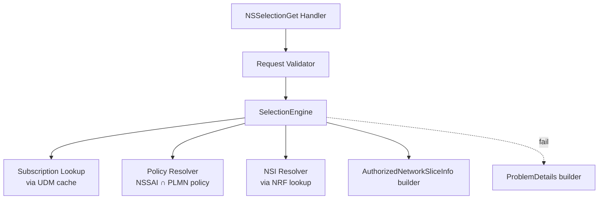

# nf-build 재설계 — agent-consumable handoff-v2 MVP Implementation Plan

> **For agentic workers:** REQUIRED SUB-SKILL: Use superpowers:subagent-driven-development (recommended) or superpowers:executing-plans to implement this plan task-by-task. Steps use checkbox (`- [ ]`) syntax for tracking.

**Goal:** NSSF `NSSelectionGet` 1 API 를 LLM-agent 단일 entry point (`handoff/nssf/_handoff.yaml`, handoff-v2 schema) 로 구현 가능한 상태까지 만든다. spec 의 `agent_contract`·marker 정책·13 basic validator·data-model JSON·Agent Proof 4 PASS 까지 일관 통과.

**Architecture:** (1) `design/scripts/` 의 tool 4개 (resolve-yaml-refs.py extend, build-handoff.py v2 rewrite, validate-extraction.py new, nf-status.py extend). (2) 공용 `design/scripts/lib/` 헬퍼 (path resolution, marker parsing). (3) `design/nssf/` 를 단일 페이지에서 **토픽 디렉터리 layout** (6 토픽 + 2 JSON) 으로 이주. (4) `handoff/nssf/_handoff.yaml` 가 `agent_contract` + `categories` + `topics` + `tasks` + `spec_index` + `sources` 보유하는 v2 schema 산출. (5) fresh Claude Code 세션으로 Agent Proof.

**Tech Stack:** Python 3 (`.venv/bin/python3`), `pyyaml`, `pytest` (신규 추가), `pypdf`·`python-docx` (기존). Markdown + YAML + JSON. 기존 도구는 `design/scripts/extract.py` (docx text), `spec-split.py` (§ 단위 cache), `nf-manifest.py` (dependency 검출).

**Spec source:** `docs/superpowers/specs/2026-05-12-nf-build-restructure-agent-consumable-mvp.md` (§1~§9). 상위 direction: `2026-05-12-nf-build-restructure-design.md`.

---

## File Structure

### 신규 또는 대규모 변경

| 경로 | 책임 | 종류 |
|---|---|---|
| `requirements.txt` | `pytest` 추가 | edit |
| `tests/conftest.py` | pytest fixture (REPO_ROOT, tmp NF) | create |
| `design/scripts/lib/__init__.py` | namespace | create |
| `design/scripts/lib/path_resolution.py` | topic ID → file path (directory / single-file / topic#anchor) | create |
| `design/scripts/lib/marker_parser.py` | AUTO/USER marker 추출·ID dedup·frontmatter sync | create |
| `design/scripts/resolve-yaml-refs.py` | `--emit-json` 옵션 추가, markdown emit 회귀 무변경 | extend |
| `design/scripts/build-handoff.py` | handoff-v2 schema (agent_contract + categories + topics + tasks + spec_index + sources) 로 재작성, 토픽 디렉터리 레이아웃 입력 | rewrite |
| `design/scripts/validate-extraction.py` | basic 13 rules + strict report-only stub | create |
| `design/scripts/nf-status.py` | handoff-v2 + `validate-extraction.py` 통합, gate 이름 `handoff_ready/canonical`, draft 카테고리는 NF gate 와 분리 보고 | extend |
| `tests/scripts/test_path_resolution.py` | T2 단위 테스트 | create |
| `tests/scripts/test_marker_parser.py` | T3 단위 테스트 | create |
| `tests/scripts/test_emit_json.py` | T4 통합 테스트 | create |
| `tests/scripts/test_build_handoff_v2.py` | T5 통합 테스트 | create |
| `tests/scripts/test_validate_extraction.py` | T6-T8 단위·통합 | create |
| `.claude/skills/nf-build/SKILL.md` | handoff-v2·토픽 레이아웃·JSON emit 흐름 반영 | edit |
| `.claude/skills/nf-status/SKILL.md` | new gates + validate-extraction 통합 보고 형식 | edit |
| `CLAUDE.md` | gate 이름 (draft/review_ready/handoff_ready/canonical → draft/handoff_ready/canonical + blocked/not_applicable), `status_precedence: topic_over_category` 명시 | edit |

### NSSF MVP 데이터 (T13 이후)

| 경로 | 종류 | layout | status |
|---|---|---|---|
| `design/nssf/_archive/<ts>/3gpp-ts-29531.md` | mv (기존 단일 페이지) | — | — |
| `design/nssf/_archive/<ts>/_handoff-v1.yaml` | mv (기존 v1) | — | — |
| `design/nssf/interface.md` | new | single-file | handoff_ready |
| `design/nssf/error-handling.md` | new | single-file | handoff_ready |
| `design/nssf/api/NSSelectionGet.md` | new | directory | handoff_ready |
| `design/nssf/data-model/SliceInfoForRegistration.md` | new | directory | canonical |
| `design/nssf/data-model/SliceInfoForRegistration.json` | AUTO machine | directory | canonical |
| `design/nssf/data-model/AuthorizedNetworkSliceInfo.md` | new | directory | canonical |
| `design/nssf/data-model/AuthorizedNetworkSliceInfo.json` | AUTO machine | directory | canonical |
| `design/nssf/module-decomposition/SelectionEngine.md` | new | directory | handoff_ready (scope: "NSSelectionGet MVP only") |
| `handoff/nssf/_handoff.yaml` | rewrite | — | handoff-v2 |

### Documentation 산출

- `docs/retros/2026-05-12-nssf-design-to-dev-cycle.md` — T23 산출.

---

## Phase 0 — Foundation

### Task 1: Add pytest + tests skeleton

**Files:**
- Modify: `requirements.txt`
- Create: `tests/conftest.py`
- Create: `tests/__init__.py`
- Create: `tests/scripts/__init__.py`

본 plan 의 도구 작업은 TDD 로 진행한다. `requirements.txt` 가 진실 출처이므로 `pytest` 를 등록하고, fixture (REPO_ROOT, tmp NF 디렉터리) 를 한 곳에 둔다.

- [ ] **Step 1: Add pytest to requirements.txt**

Edit `requirements.txt` — 마지막 줄에 추가:

```
pytest>=8.0
```

- [ ] **Step 2: Install pytest into .venv**

Run: `.venv/bin/pip install pytest`
Expected: `Successfully installed pytest-*`.

- [ ] **Step 3: Create tests skeleton**

Create `tests/__init__.py` — empty.
Create `tests/scripts/__init__.py` — empty.
Create `tests/conftest.py`:

```python
# pytest fixtures for design/scripts/* 테스트
from __future__ import annotations

import pathlib
import pytest

REPO_ROOT = pathlib.Path(__file__).resolve().parent.parent


@pytest.fixture
def repo_root() -> pathlib.Path:
    return REPO_ROOT


@pytest.fixture
def nssf_yaml() -> pathlib.Path:
    return REPO_ROOT / "specs" / "29.531" / "TS29531_Nnssf_NSSelection.yaml"


@pytest.fixture
def tmp_nf(tmp_path: pathlib.Path) -> pathlib.Path:
    nf = tmp_path / "design" / "demo"
    (nf / "api").mkdir(parents=True)
    (nf / "data-model").mkdir(parents=True)
    return nf
```

- [ ] **Step 4: Smoke test runs**

Create `tests/scripts/test_smoke.py`:

```python
def test_pytest_available():
    assert True
```

Run: `.venv/bin/pytest tests/scripts/test_smoke.py -v`
Expected: `1 passed`.

- [ ] **Step 5: Commit**

```bash
git add requirements.txt tests/__init__.py tests/scripts/__init__.py tests/conftest.py tests/scripts/test_smoke.py
git commit -m "test(infra): add pytest harness + fixtures for design/scripts"
```

---

### Task 2: Library — path_resolution.py

**Files:**
- Create: `design/scripts/lib/__init__.py`
- Create: `design/scripts/lib/path_resolution.py`
- Create: `tests/scripts/test_path_resolution.py`

spec §4.5 의 3 layout (directory / single-file / topic#anchor) 을 한 모듈에 모은다. validator (T6) 와 build-handoff (T5) 가 공통으로 사용.

- [ ] **Step 1: Write the failing tests**

Create `tests/scripts/test_path_resolution.py`:

```python
from __future__ import annotations

import pathlib
import pytest

from design.scripts.lib.path_resolution import (
    resolve_topic_path,
    parse_topic_ref,
    PathResolution,
)


def test_directory_layout(tmp_path: pathlib.Path) -> None:
    nf = tmp_path / "design" / "nssf"
    (nf / "api").mkdir(parents=True)
    f = nf / "api" / "NSSelectionGet.md"
    f.write_text("# NSSelectionGet\n", encoding="utf-8")

    r = resolve_topic_path(
        nf_root=nf, topic_id="api/NSSelectionGet",
        category_layout={"api": "directory"},
    )
    assert r.exists is True
    assert r.path == f
    assert r.anchor is None


def test_single_file_layout(tmp_path: pathlib.Path) -> None:
    nf = tmp_path / "design" / "nssf"
    nf.mkdir(parents=True)
    f = nf / "interface.md"
    f.write_text("# Interface\n", encoding="utf-8")

    r = resolve_topic_path(
        nf_root=nf, topic_id="interface",
        category_layout={"interface": "single-file"},
    )
    assert r.exists is True
    assert r.path == f


def test_topic_anchor(tmp_path: pathlib.Path) -> None:
    nf = tmp_path / "design" / "nssf"
    nf.mkdir(parents=True)
    f = nf / "error-handling.md"
    f.write_text(
        "# Error Handling\n\n## NSSelection 400\n\n<a id=\"nsselection-400\"></a>\n",
        encoding="utf-8",
    )

    r = resolve_topic_path(
        nf_root=nf, topic_id="error-handling#nsselection-400",
        category_layout={"error-handling": "single-file"},
    )
    assert r.exists is True
    assert r.path == f
    assert r.anchor == "nsselection-400"
    assert r.anchor_found is True


def test_missing_file(tmp_path: pathlib.Path) -> None:
    nf = tmp_path / "design" / "nssf"
    nf.mkdir(parents=True)
    r = resolve_topic_path(
        nf_root=nf, topic_id="api/Ghost",
        category_layout={"api": "directory"},
    )
    assert r.exists is False
    assert r.path == nf / "api" / "Ghost.md"


def test_unknown_category_raises(tmp_path: pathlib.Path) -> None:
    nf = tmp_path / "design" / "nssf"
    nf.mkdir(parents=True)
    with pytest.raises(ValueError, match="unknown category"):
        resolve_topic_path(
            nf_root=nf, topic_id="ghost/Foo",
            category_layout={"api": "directory"},
        )


def test_parse_topic_ref() -> None:
    p = parse_topic_ref("api/NSSelectionGet")
    assert p.category == "api"
    assert p.topic == "NSSelectionGet"
    assert p.anchor is None

    p = parse_topic_ref("error-handling#cause")
    assert p.category == "error-handling"
    assert p.topic == "error-handling"
    assert p.anchor == "cause"

    p = parse_topic_ref("interface")
    assert p.category == "interface"
    assert p.topic == "interface"
```

- [ ] **Step 2: Run tests to verify they fail**

Run: `.venv/bin/pytest tests/scripts/test_path_resolution.py -v`
Expected: `ModuleNotFoundError: design.scripts.lib.path_resolution`.

- [ ] **Step 3: Write the implementation**

Create `design/scripts/lib/__init__.py` — empty.
Create `design/scripts/lib/path_resolution.py`:

```python
# topic ID → file path resolver. spec §4.5 의 3 layout 을 한 곳에서.
from __future__ import annotations

import dataclasses
import pathlib
import re


@dataclasses.dataclass(frozen=True)
class TopicRef:
    category: str
    topic: str           # category 와 동일하면 single-file
    anchor: str | None   # "topic#anchor" 의 anchor


@dataclasses.dataclass(frozen=True)
class PathResolution:
    path: pathlib.Path
    exists: bool
    anchor: str | None
    anchor_found: bool   # anchor 없으면 True


def parse_topic_ref(topic_id: str) -> TopicRef:
    anchor = None
    if "#" in topic_id:
        head, anchor = topic_id.split("#", 1)
    else:
        head = topic_id
    if "/" in head:
        category, topic = head.split("/", 1)
    else:
        category, topic = head, head
    return TopicRef(category=category, topic=topic, anchor=anchor)


def _anchor_present(text: str, anchor: str) -> bool:
    if re.search(rf'<a\s+id=["\']?{re.escape(anchor)}["\']?\s*></a>', text):
        return True
    pat = re.compile(r"^#{1,6}\s+(.+)$", re.MULTILINE)
    for m in pat.finditer(text):
        slug = re.sub(r"[^a-z0-9]+", "-", m.group(1).lower()).strip("-")
        if slug == anchor:
            return True
    return False


def resolve_topic_path(
    *,
    nf_root: pathlib.Path,
    topic_id: str,
    category_layout: dict[str, str],
) -> PathResolution:
    ref = parse_topic_ref(topic_id)
    if ref.category not in category_layout:
        raise ValueError(f"unknown category {ref.category!r}")
    layout = category_layout[ref.category]
    if layout == "directory":
        path = nf_root / ref.category / f"{ref.topic}.md"
    elif layout == "single-file":
        path = nf_root / f"{ref.category}.md"
    else:
        raise ValueError(f"unknown layout {layout!r}")
    exists = path.is_file()
    anchor_found = True
    if ref.anchor and exists:
        anchor_found = _anchor_present(path.read_text(encoding="utf-8"), ref.anchor)
    return PathResolution(
        path=path, exists=exists, anchor=ref.anchor, anchor_found=anchor_found,
    )
```

- [ ] **Step 4: Run tests to verify they pass**

Run: `.venv/bin/pytest tests/scripts/test_path_resolution.py -v`
Expected: `6 passed`.

- [ ] **Step 5: Commit**

```bash
git add design/scripts/lib/__init__.py design/scripts/lib/path_resolution.py tests/scripts/test_path_resolution.py
git commit -m "feat(scripts/lib): topic ID path resolver — directory / single-file / anchor"
```

---

### Task 3: Library — marker_parser.py

**Files:**
- Create: `design/scripts/lib/marker_parser.py`
- Create: `tests/scripts/test_marker_parser.py`

spec §2 의 AUTO/USER marker 어휘. validator rule #7·#8 에서 사용. frontmatter `generated_sections`·`user_sections` 와 본문 marker ID 집합의 sync 도 본 모듈에서.

- [ ] **Step 1: Write the failing tests**

Create `tests/scripts/test_marker_parser.py`:

```python
from __future__ import annotations

from design.scripts.lib.marker_parser import (
    extract_markers,
    duplicate_marker_ids,
    sync_diff,
    Marker,
)


SAMPLE = """---
id: api-nsselection-get
generated_sections:
  - api-matrix
  - errors-table
user_sections:
  - implementation-notes
---

# Body

<!-- AUTO:api-matrix:start -->
| col | col |
| --- | --- |
| a | b |
<!-- AUTO:api-matrix:end -->

<!-- AUTO:errors-table:start -->
none yet
<!-- AUTO:errors-table:end -->

<!-- USER:implementation-notes:start -->
사람이 쓴 산문.
<!-- USER:implementation-notes:end -->
"""


def test_extract_markers_finds_three() -> None:
    ms = extract_markers(SAMPLE)
    kinds = [(m.kind, m.id) for m in ms]
    assert kinds == [
        ("AUTO", "api-matrix"),
        ("AUTO", "errors-table"),
        ("USER", "implementation-notes"),
    ]


def test_no_duplicates() -> None:
    assert duplicate_marker_ids(SAMPLE) == []


def test_duplicate_detection() -> None:
    text = SAMPLE + "\n<!-- AUTO:api-matrix:start -->\nx\n<!-- AUTO:api-matrix:end -->\n"
    assert duplicate_marker_ids(text) == [("AUTO", "api-matrix")]


def test_sync_diff_clean() -> None:
    fm = {
        "generated_sections": ["api-matrix", "errors-table"],
        "user_sections": ["implementation-notes"],
    }
    diff = sync_diff(fm=fm, markers=extract_markers(SAMPLE))
    assert diff.frontmatter_only_auto == []
    assert diff.body_only_auto == []
    assert diff.frontmatter_only_user == []
    assert diff.body_only_user == []


def test_sync_diff_mismatch() -> None:
    fm = {
        "generated_sections": ["api-matrix"],   # missing errors-table
        "user_sections": ["implementation-notes", "ghost"],  # extra ghost
    }
    diff = sync_diff(fm=fm, markers=extract_markers(SAMPLE))
    assert diff.body_only_auto == ["errors-table"]
    assert diff.frontmatter_only_user == ["ghost"]


def test_unmatched_start_only() -> None:
    text = "<!-- AUTO:foo:start -->\nbody\n"
    ms = extract_markers(text)
    assert ms == []  # unmatched pair → 무시 (별도 룰에서 처리)
```

- [ ] **Step 2: Run tests to verify they fail**

Run: `.venv/bin/pytest tests/scripts/test_marker_parser.py -v`
Expected: `ModuleNotFoundError`.

- [ ] **Step 3: Write the implementation**

Create `design/scripts/lib/marker_parser.py`:

```python
# AUTO / USER marker 추출 + frontmatter sync diff. spec §2 의 기계 계약.
from __future__ import annotations

import dataclasses
import re


@dataclasses.dataclass(frozen=True)
class Marker:
    kind: str   # "AUTO" or "USER"
    id: str
    start: int  # body offset
    end: int


_START = re.compile(r"<!--\s*(AUTO|USER):([a-zA-Z0-9][\w\-]*):start\s*-->")
_END = re.compile(r"<!--\s*(AUTO|USER):([a-zA-Z0-9][\w\-]*):end\s*-->")


def extract_markers(text: str) -> list[Marker]:
    out: list[Marker] = []
    for s in _START.finditer(text):
        kind, mid = s.group(1), s.group(2)
        e_pat = re.compile(
            rf"<!--\s*{kind}:{re.escape(mid)}:end\s*-->"
        )
        e = e_pat.search(text, s.end())
        if e:
            out.append(Marker(kind=kind, id=mid, start=s.start(), end=e.end()))
    return out


def duplicate_marker_ids(text: str) -> list[tuple[str, str]]:
    seen: dict[tuple[str, str], int] = {}
    for m in extract_markers(text):
        seen[(m.kind, m.id)] = seen.get((m.kind, m.id), 0) + 1
    return [k for k, v in seen.items() if v > 1]


@dataclasses.dataclass(frozen=True)
class SyncDiff:
    frontmatter_only_auto: list[str]
    body_only_auto: list[str]
    frontmatter_only_user: list[str]
    body_only_user: list[str]


def sync_diff(*, fm: dict, markers: list[Marker]) -> SyncDiff:
    fm_auto = set(fm.get("generated_sections") or [])
    fm_user = set(fm.get("user_sections") or [])
    body_auto = {m.id for m in markers if m.kind == "AUTO"}
    body_user = {m.id for m in markers if m.kind == "USER"}
    return SyncDiff(
        frontmatter_only_auto=sorted(fm_auto - body_auto),
        body_only_auto=sorted(body_auto - fm_auto),
        frontmatter_only_user=sorted(fm_user - body_user),
        body_only_user=sorted(body_user - fm_user),
    )
```

- [ ] **Step 4: Run tests to verify they pass**

Run: `.venv/bin/pytest tests/scripts/test_marker_parser.py -v`
Expected: `6 passed`.

- [ ] **Step 5: Commit**

```bash
git add design/scripts/lib/marker_parser.py tests/scripts/test_marker_parser.py
git commit -m "feat(scripts/lib): AUTO/USER marker parser + frontmatter sync diff"
```

---

## Phase 1 — Tool extensions

### Task 4: resolve-yaml-refs.py — `--emit-json`

**Files:**
- Modify: `design/scripts/resolve-yaml-refs.py` (add `emit_json` 함수 + CLI 옵션)
- Create: `tests/scripts/test_emit_json.py`

spec §5 "Data Model JSON" 정책 — handoff topic schema = `{ "topic": "data-model/<id>" }` ref + dependencies 등록; transitive non-handoff schema = `_inlined_from` 으로 inline (dependencies 등록 안 함). markdown emit 동작은 그대로.

- [ ] **Step 1: Write the failing test**

Create `tests/scripts/test_emit_json.py`:

```python
from __future__ import annotations

import json
import pathlib
import subprocess


REPO = pathlib.Path(__file__).resolve().parents[2]
SCRIPT = REPO / "design" / "scripts" / "resolve-yaml-refs.py"
NSSF_YAML = REPO / "specs" / "29.531" / "TS29531_Nnssf_NSSelection.yaml"


def _run(*args: str) -> dict:
    out = subprocess.run(
        [".venv/bin/python3", str(SCRIPT), *args],
        capture_output=True, text=True, cwd=REPO, timeout=60,
    )
    assert out.returncode == 0, out.stderr
    return json.loads(out.stdout)


def test_emit_json_basic_shape() -> None:
    payload = _run(
        str(NSSF_YAML), "AuthorizedNetworkSliceInfo",
        "--emit-json",
        "--topic-id", "data-model/AuthorizedNetworkSliceInfo",
        "--nf", "nssf",
        "--spec-ref", "TS 29.531 §6.1.6.2.5",
        "--handoff-topics", "data-model/SliceInfoForRegistration",
        "--handoff-topics", "data-model/AuthorizedNetworkSliceInfo",
    )
    assert payload["schema_version"] == "data-model-v1"
    assert payload["nf"] == "nssf"
    assert payload["topic_id"] == "data-model/AuthorizedNetworkSliceInfo"
    assert payload["root_schema"] == "AuthorizedNetworkSliceInfo"
    assert payload["source"]["spec_refs"] == ["TS 29.531 §6.1.6.2.5"]
    assert "fields" in payload and isinstance(payload["fields"], list)
    assert isinstance(payload["dependencies"], list)
    assert isinstance(payload["unresolved_refs"], list)


def test_emit_json_handoff_topic_becomes_dependency() -> None:
    # SliceInfoForRegistration is itself a handoff topic; it may transitively
    # appear inside other schemas. When it does, it must show as { "topic": ... }
    # and be listed in dependencies — not inlined.
    payload = _run(
        str(NSSF_YAML), "AuthorizedNetworkSliceInfo",
        "--emit-json",
        "--topic-id", "data-model/AuthorizedNetworkSliceInfo",
        "--nf", "nssf",
        "--spec-ref", "TS 29.531 §6.1.6.2.5",
        "--handoff-topics", "data-model/SliceInfoForRegistration",
        "--handoff-topics", "data-model/AuthorizedNetworkSliceInfo",
    )
    # The root itself never appears as a topic ref inside its own tree.
    # Check that any field whose type IS a known handoff topic resolves to a topic ref
    # and lands in dependencies. AllowedSnssai (non-handoff) must be inlined.
    body = json.dumps(payload)
    assert "_inlined_from" in body
    # dependencies only carries handoff topics
    for dep in payload["dependencies"]:
        assert dep.startswith("data-model/")


def test_emit_json_unresolved_refs_listed() -> None:
    # Provoke an unresolved ref by pointing to a tiny synthetic yaml under tmp.
    pass  # covered indirectly via build-handoff test; placeholder removed in T8
```

(The third test is intentionally a `pass` — full unresolved coverage lives in T8 against the integrated validator, not against this tool unit.)

- [ ] **Step 2: Run test to verify it fails**

Run: `.venv/bin/pytest tests/scripts/test_emit_json.py -v`
Expected: FAIL — `--emit-json` flag unknown.

- [ ] **Step 3: Add `--emit-json` implementation**

Edit `design/scripts/resolve-yaml-refs.py`. Add `import json` near the top imports. Add this function above `main()`:

```python
def _resolve_to_node(
    schema: dict,
    current_file: pathlib.Path,
    handoff_topic_index: dict[str, str],
    visited: set[tuple[str, str]],
    no_docx_fallback: bool,
    unresolved: list[dict],
    inlined_from: str | None = None,
) -> dict:
    """schema dict → JSON node. handoff topic 은 { "topic": "<id>" }, 그 외는 inline."""
    if schema is None:
        return {"type": "unknown"}
    if "$ref" in schema:
        rr = resolve_ref(schema["$ref"], current_file, no_docx_fallback)
        ref_name = rr.schema_name
        topic_id = handoff_topic_index.get(ref_name)
        if topic_id:
            return {"topic": topic_id}
        if rr.schema is None:
            unresolved.append({"ref": schema["$ref"], "note": rr.note or ""})
            return {
                "type": "unknown",
                "_inlined_from": schema["$ref"],
                "_unresolved": True,
            }
        key = (str(rr.file or current_file), ref_name)
        if key in visited:
            return {"type": "object", "_cycle": ref_name}
        visited2 = visited | {key}
        node = _schema_node(
            rr.schema, rr.file or current_file, handoff_topic_index,
            visited2, no_docx_fallback, unresolved,
            inlined_from=schema["$ref"],
        )
        return node

    t = schema.get("type")
    if t == "array":
        items = schema.get("items") or {}
        return {
            "type": "array",
            "items": _resolve_to_node(
                items, current_file, handoff_topic_index, visited,
                no_docx_fallback, unresolved,
            ),
        }
    if t == "object" or "properties" in schema:
        return _schema_node(
            schema, current_file, handoff_topic_index, visited,
            no_docx_fallback, unresolved, inlined_from=inlined_from,
        )
    out: dict = {}
    if t:
        out["type"] = t
    for k in ("format", "pattern", "enum", "nullable"):
        if k in schema:
            out[k] = schema[k]
    if not out:
        out["type"] = "object"
    if inlined_from:
        out["_inlined_from"] = inlined_from
    return out


def _schema_node(
    schema: dict,
    current_file: pathlib.Path,
    handoff_topic_index: dict[str, str],
    visited: set[tuple[str, str]],
    no_docx_fallback: bool,
    unresolved: list[dict],
    inlined_from: str | None = None,
) -> dict:
    required = set(schema.get("required") or [])
    properties = []
    for pname, pschema in (schema.get("properties") or {}).items():
        node = _resolve_to_node(
            pschema, current_file, handoff_topic_index, visited,
            no_docx_fallback, unresolved,
        )
        entry = {
            "name": pname,
            "required": pname in required,
        }
        entry.update(node)
        properties.append(entry)
    for arm in (schema.get("allOf") or []):
        if isinstance(arm, dict) and (arm.get("properties") or arm.get("required")):
            sub = _schema_node(
                arm, current_file, handoff_topic_index, visited,
                no_docx_fallback, unresolved,
            )
            properties.extend(sub.get("properties", []))
    out = {"type": "object", "properties": properties}
    if inlined_from:
        out["_inlined_from"] = inlined_from
    return out


def emit_json(
    *,
    yaml_path: pathlib.Path,
    root_schema_name: str,
    topic_id: str,
    nf: str,
    spec_refs: list[str],
    status: str,
    handoff_topics: list[str],
    no_docx_fallback: bool = False,
) -> dict:
    doc = cached_yaml(yaml_path)
    schemas = (doc.get("components") or {}).get("schemas") or {}
    root_schema = schemas.get(root_schema_name)
    if root_schema is None:
        raise SystemExit(f"[emit-json] root schema {root_schema_name!r} not in {yaml_path.name}")

    # handoff_topic_index — schema name → topic id (for those schemas that ARE
    # handoff topics). Root itself is excluded — its own tree is what we emit.
    index: dict[str, str] = {}
    for tid in handoff_topics:
        if "/" in tid:
            name = tid.split("/", 1)[1]
            if name != root_schema_name:
                index[name] = tid

    unresolved: list[dict] = []
    visited: set[tuple[str, str]] = {(str(yaml_path), root_schema_name)}
    body = _schema_node(
        root_schema, yaml_path, index, visited, no_docx_fallback, unresolved,
    )

    dependencies: set[str] = set()

    def _walk(node: object) -> None:
        if isinstance(node, dict):
            if "topic" in node and isinstance(node["topic"], str):
                dependencies.add(node["topic"])
            for v in node.values():
                _walk(v)
        elif isinstance(node, list):
            for v in node:
                _walk(v)

    _walk(body)

    return {
        "schema_version": "data-model-v1",
        "nf": nf,
        "topic_id": topic_id,
        "status": status,
        "source": {
            "spec_refs": spec_refs,
            "openapi_refs": [f"#/components/schemas/{root_schema_name}"],
            "source_yaml": str(yaml_path.relative_to(REPO_ROOT))
                if yaml_path.is_absolute() and yaml_path.is_relative_to(REPO_ROOT)
                else str(yaml_path),
        },
        "root_schema": root_schema_name,
        "fields": body.get("properties", []),
        "dependencies": sorted(dependencies),
        "unresolved_refs": unresolved,
    }
```

In `main()`, add CLI flags and the branch (before `print("```text")`):

```python
    parser.add_argument("--emit-json", action="store_true",
                        help="JSON machine artifact 으로 stdout 출력 (markdown 트리 대신)")
    parser.add_argument("--topic-id", default="")
    parser.add_argument("--nf", default="")
    parser.add_argument("--spec-ref", action="append", default=[])
    parser.add_argument("--status", default="canonical")
    parser.add_argument("--handoff-topics", action="append", default=[])
```

And just before the existing `print("```text")` block, add:

```python
    if args.emit_json:
        if not args.schemas or not args.topic_id or not args.nf:
            sys.exit("[emit-json] requires <schema>, --topic-id, --nf")
        payload = emit_json(
            yaml_path=yaml_path,
            root_schema_name=args.schemas[0],
            topic_id=args.topic_id,
            nf=args.nf,
            spec_refs=args.spec_ref,
            status=args.status,
            handoff_topics=args.handoff_topics,
            no_docx_fallback=args.no_docx_fallback,
        )
        print(json.dumps(payload, ensure_ascii=False, indent=2))
        return
```

- [ ] **Step 4: Run tests to verify they pass**

Run: `.venv/bin/pytest tests/scripts/test_emit_json.py -v`
Expected: `3 passed` (the third is a no-op).

Also verify markdown emit is unchanged:

Run:

```bash
.venv/bin/python3 design/scripts/resolve-yaml-refs.py \
  specs/29.531/TS29531_Nnssf_NSSelection.yaml AuthorizedNetworkSliceInfo \
  --depth 4 | head -5
```

Expected: first line is ```` ```text ````, second is `# TS29531_Nnssf_NSSelection.yaml  [TS 29.531]`.

- [ ] **Step 5: Commit**

```bash
git add design/scripts/resolve-yaml-refs.py tests/scripts/test_emit_json.py
git commit -m "feat(resolve-yaml-refs): --emit-json — handoff topic ref + transitive inline"
```

---

### Task 5: build-handoff.py — handoff-v2 rewrite

**Files:**
- Rewrite: `design/scripts/build-handoff.py`
- Create: `tests/scripts/test_build_handoff_v2.py`

기존 v1 (단일 `3gpp-ts-*.md` parsing) 을 **토픽 디렉터리 layout** 입력으로 교체. 산출 yaml 에 `agent_contract`·`categories`·`topics`·`tasks`·`spec_index`·`sources` 보유.

입력 — `design/<nf>/_handoff_seed.yaml` 가 NF 별 카테고리 layout / 토픽 status / depends_on / related / error_refs / spec_refs / tasks 의 *원천 입력* (사람·`/nf-build` 가 작성). build-handoff.py 는 그 seed + topic 파일 frontmatter + machine_file 존재 + `lib/path_resolution` 결과를 합쳐 v2 yaml 을 emit.

seed yaml 의 schema 는 `_handoff.yaml` 출력과 거의 동일하되 `agent_contract` 와 `sources` 는 도구가 채운다. seed 가 없으면 도구는 stage_2 더미 산출 대신 SystemExit.

- [ ] **Step 1: Write the failing test**

Create `tests/scripts/test_build_handoff_v2.py`:

```python
from __future__ import annotations

import pathlib
import subprocess

import yaml


REPO = pathlib.Path(__file__).resolve().parents[2]
SCRIPT = REPO / "design" / "scripts" / "build-handoff.py"


def _run_build(nf: str, cwd: pathlib.Path) -> pathlib.Path:
    out = subprocess.run(
        [str(REPO / ".venv" / "bin" / "python3"), str(SCRIPT), nf],
        capture_output=True, text=True, cwd=cwd, timeout=120,
    )
    assert out.returncode == 0, out.stderr
    return cwd / "handoff" / nf / "_handoff.yaml"


def _seed(tmp_path: pathlib.Path) -> pathlib.Path:
    nf = tmp_path / "design" / "demo"
    (nf / "api").mkdir(parents=True)
    (nf / "data-model").mkdir(parents=True)
    # minimal topic files
    (nf / "interface.md").write_text(
        "---\nid: interface\nstatus: handoff_ready\ngenerated_sections: []\n"
        "user_sections: []\n---\n# Interface\n", encoding="utf-8")
    (nf / "error-handling.md").write_text(
        "---\nid: error-handling\nstatus: handoff_ready\ngenerated_sections: []\n"
        "user_sections: []\n---\n# Error\n", encoding="utf-8")
    (nf / "api" / "OpA.md").write_text(
        "---\nid: api/OpA\nstatus: handoff_ready\ngenerated_sections: []\n"
        "user_sections: []\n---\n# OpA\n", encoding="utf-8")
    (nf / "data-model" / "S.md").write_text(
        "---\nid: data-model/S\nstatus: canonical\ngenerated_sections: []\n"
        "user_sections: []\n---\n# S\n", encoding="utf-8")
    (nf / "data-model" / "S.json").write_text("{}", encoding="utf-8")
    seed = nf / "_handoff_seed.yaml"
    seed.write_text(
        yaml.safe_dump({
            "nf": "demo",
            "categories": {
                "interface":     {"status": "handoff_ready", "layout": "single-file"},
                "error-handling": {"status": "handoff_ready", "layout": "single-file"},
                "api":           {"status": "handoff_ready", "layout": "directory"},
                "data-model":    {"status": "handoff_ready", "layout": "directory"},
            },
            "topics": {
                "interface":      {"status": "handoff_ready", "spec_refs": ["TS X §1"]},
                "error-handling": {"status": "handoff_ready", "spec_refs": []},
                "api/OpA": {
                    "status": "handoff_ready",
                    "depends_on": ["data-model/S"],
                    "related": ["interface"],
                    "error_refs": [],
                    "spec_refs": ["TS X §2"],
                },
                "data-model/S": {
                    "status": "canonical",
                    "file": "design/demo/data-model/S.md",
                    "machine_file": "design/demo/data-model/S.json",
                    "spec_refs": ["TS X §3"],
                },
            },
            "tasks": {
                "demo-opa": {
                    "phase": "02-api",
                    "goal": "Implement OpA",
                    "read": ["api/OpA", "data-model/S"],
                    "produces": ["<impl>/opa.*"],
                    "blocked_by": ["api/OpA.status not in [canonical, handoff_ready]"],
                    "acceptance": ["handles 200 response"],
                },
            },
            "sources": {"TS X": "specs/X/X.docx"},
        }), encoding="utf-8",
    )
    return seed


def test_build_handoff_v2_emits_full_schema(tmp_path: pathlib.Path) -> None:
    _seed(tmp_path)
    out_path = _run_build("demo", tmp_path)
    data = yaml.safe_load(out_path.read_text(encoding="utf-8"))

    assert data["schema_version"] == "handoff-v2"
    assert data["nf"] == "demo"
    ac = data["agent_contract"]
    assert ac["status_precedence"] == "topic_over_category"
    assert isinstance(ac["default_read_order"], list) and len(ac["default_read_order"]) >= 5
    assert isinstance(ac["must_not"], list) and len(ac["must_not"]) >= 3
    assert isinstance(ac["may_decide"], list) and len(ac["may_decide"]) >= 2
    assert isinstance(ac["must_ask_or_block"], list) and len(ac["must_ask_or_block"]) >= 2

    cats = data["categories"]
    assert cats["api"]["status"] == "handoff_ready"
    assert cats["api"]["layout"] == "directory"

    topics = data["topics"]
    assert topics["api/OpA"]["status"] == "handoff_ready"
    assert topics["api/OpA"]["depends_on"] == ["data-model/S"]
    assert topics["data-model/S"]["machine_file"].endswith("S.json")

    si = data["spec_index"]
    # spec ref → topic 역방향 lookup
    assert "api/OpA" in si["TS X §2"]
    assert "data-model/S" in si["TS X §3"]

    assert data["sources"] == {"TS X": "specs/X/X.docx"}

    tasks = data["tasks"]
    assert tasks["demo-opa"]["read"] == ["api/OpA", "data-model/S"]
    assert tasks["demo-opa"]["blocked_by"][0].startswith("api/OpA.status")


def test_build_handoff_v2_missing_seed_errors(tmp_path: pathlib.Path) -> None:
    nf = tmp_path / "design" / "demo2"
    nf.mkdir(parents=True)
    out = subprocess.run(
        [str(REPO / ".venv" / "bin" / "python3"), str(SCRIPT), "demo2"],
        capture_output=True, text=True, cwd=tmp_path, timeout=30,
    )
    assert out.returncode != 0
    assert "_handoff_seed.yaml" in out.stderr
```

- [ ] **Step 2: Run test to verify it fails**

Run: `.venv/bin/pytest tests/scripts/test_build_handoff_v2.py -v`
Expected: FAIL (current build-handoff outputs handoff-v1, no agent_contract).

- [ ] **Step 3: Rewrite build-handoff.py**

Replace `design/scripts/build-handoff.py` entirely:

```python
#!/usr/bin/env python3
# 토픽 디렉터리 layout + seed yaml → handoff-v2 self-contained yaml.
"""
Usage:
    .venv/bin/python3 design/scripts/build-handoff.py <nf>

입력:
    design/<nf>/_handoff_seed.yaml — 사람·/nf-build 가 작성한 seed (필수)
        nf, categories, topics, tasks, sources

산출:
    handoff/<nf>/_handoff.yaml — schema_version: handoff-v2.
        + agent_contract (도구가 채움), spec_index (도구가 채움)
"""

from __future__ import annotations

import argparse
import datetime
import pathlib
import sys

import yaml


REPO_ROOT = pathlib.Path(__file__).resolve().parent.parent.parent


AGENT_CONTRACT = {
    "status_precedence": "topic_over_category",
    "default_read_order": [
        "handoff/<nf>/_handoff.yaml",
        "handoff/<nf>/_handoff.yaml#categories",
        "design/<nf>/<topic>/<id>.md (target)",
        "design/<nf>/<topic>/<id>.json (target machine)",
        "design/<nf>/<topic>/<dep>.md (depends_on)",
        "design/<nf>/error-handling.md (error_refs)",
        "design/<nf>/<topic>/<related>.md (related)",
    ],
    "must_not": [
        "status 가 draft 인 토픽으로 구현 시작",
        "status 가 blocked 인 토픽으로 구현 시작",
        "status 가 not_applicable 인 토픽을 생성",
        "spec_refs / Implementation Notes 에 근거 없는 행동·자료형·정책 invent",
        "agent_contract 외부 (design/<nf>/_archive/) 의 자료를 현행 contract 로 인용",
    ],
    "may_decide": [
        "내부 패키지/모듈 이름 (design 산출이 라이브러리 비종속)",
        "프레임워크 종속 handler 구조 (예 router 등록 방식)",
        "테스트 프레임워크 매핑 (Test Matrix 의 케이스 → 실제 test runner)",
        "로깅 라이브러리 선택 (Configuration 의 관측 키 충족 한)",
    ],
    "must_ask_or_block": [
        "필수 정책 값 부재 (timeout/retry/idempotency 미정)",
        "OpenAPI chain leaf 가 '(참조 규격 미등록)' 인데 구현이 필요",
        "역방향 status 불일치 (category=handoff_ready 인데 산하 topic=draft) — basic #5 영역",
        "depends_on 의 target 토픽이 yaml 에 부재",
        "Cross-NF 호출의 상대 NF op 가 아직 미정의",
    ],
}


def _build_spec_index(topics: dict) -> dict:
    idx: dict[str, list[str]] = {}
    for tid, t in topics.items():
        for ref in (t.get("spec_refs") or []):
            idx.setdefault(ref, []).append(tid)
    for ref in idx:
        idx[ref].sort()
    return dict(sorted(idx.items()))


def main() -> None:
    parser = argparse.ArgumentParser(
        description="토픽 디렉터리 layout + seed → handoff-v2 yaml",
    )
    parser.add_argument("nf", help="NF 폴더명 (소문자)")
    args = parser.parse_args()

    nf = args.nf.lower()
    design_dir = REPO_ROOT / "design" / nf
    if not design_dir.is_dir():
        sys.exit(f"[build-handoff] design/{nf}/ 없음")

    seed_path = design_dir / "_handoff_seed.yaml"
    if not seed_path.is_file():
        sys.exit(f"[build-handoff] {seed_path.relative_to(REPO_ROOT)} 없음. "
                 f"seed 를 먼저 작성하거나 /nf-build <nf> 를 실행.")
    seed = yaml.safe_load(seed_path.read_text(encoding="utf-8")) or {}

    if seed.get("nf") != nf:
        sys.exit(f"[build-handoff] seed.nf={seed.get('nf')!r} ≠ {nf!r}")

    categories = seed.get("categories") or {}
    topics = seed.get("topics") or {}
    tasks = seed.get("tasks") or {}
    sources = seed.get("sources") or {}

    out_payload = {
        "schema_version": "handoff-v2",
        "nf": nf,
        "generated_at": datetime.datetime.utcnow().isoformat() + "Z",
        "agent_contract": AGENT_CONTRACT,
        "categories": categories,
        "topics": topics,
        "tasks": tasks,
        "spec_index": _build_spec_index(topics),
        "sources": sources,
    }

    out_dir = REPO_ROOT / "handoff" / nf
    out_dir.mkdir(parents=True, exist_ok=True)
    out_path = out_dir / "_handoff.yaml"
    out_path.write_text(
        yaml.dump(out_payload, allow_unicode=True, default_flow_style=False, sort_keys=False),
        encoding="utf-8",
    )
    print(f"[build-handoff] wrote {out_path.relative_to(REPO_ROOT)}", file=sys.stderr)
    print(f"[build-handoff] categories={len(categories)} topics={len(topics)} tasks={len(tasks)}",
          file=sys.stderr)


if __name__ == "__main__":
    main()
```

Note: the rewrite intentionally drops the old v1 single-page parsers. Existing `handoff/<nf>/_handoff.yaml` v1 files are archived by T13 — they were never authoritative inputs.

The test fixture runs the script with `cwd=tmp_path`, but the script reads from `REPO_ROOT` (computed from `__file__`). The test rewrites `design/<nf>/...` under `tmp_path`, so the script must accept `REPO_ROOT` override via env. Adjust:

In `build-handoff.py`, replace `REPO_ROOT = pathlib...` with:

```python
import os
REPO_ROOT = pathlib.Path(
    os.environ.get("FIVEGC_REPO_ROOT")
    or pathlib.Path(__file__).resolve().parent.parent.parent
).resolve()
```

Update the test fixture in step 1 to set the env. Re-edit `tests/scripts/test_build_handoff_v2.py` `_run_build`:

```python
def _run_build(nf: str, cwd: pathlib.Path) -> pathlib.Path:
    env = {**__import__("os").environ, "FIVEGC_REPO_ROOT": str(cwd)}
    out = subprocess.run(
        [str(REPO / ".venv" / "bin" / "python3"), str(SCRIPT), nf],
        capture_output=True, text=True, cwd=cwd, timeout=120, env=env,
    )
    assert out.returncode == 0, out.stderr
    return cwd / "handoff" / nf / "_handoff.yaml"
```

(Update `test_build_handoff_v2_missing_seed_errors` similarly — set `env` on its subprocess.run.)

- [ ] **Step 4: Run tests to verify they pass**

Run: `.venv/bin/pytest tests/scripts/test_build_handoff_v2.py -v`
Expected: `2 passed`.

- [ ] **Step 5: Commit**

```bash
git add design/scripts/build-handoff.py tests/scripts/test_build_handoff_v2.py
git commit -m "feat(build-handoff): rewrite to handoff-v2 (agent_contract + topics + tasks + spec_index)"
```

---

### Task 6: validate-extraction.py — rules 1-6

**Files:**
- Create: `design/scripts/validate-extraction.py`
- Create: `tests/scripts/test_validate_extraction.py`

spec §4 의 basic 13 룰 중 1-6 (schema / status enum / topic file exists / cross-ref / cat-topic / blocked&NA semantics) 을 먼저 구현. 7-8 (marker) 은 T7, 9-13 (data-model JSON) 은 T8.

Tool 은 v2 yaml 한 경로를 입력으로 받아 `[(rule_id, status, message)]` 리스트를 stdout 출력 + exit code 비-zero on FAIL.

- [ ] **Step 1: Write the failing test**

Create `tests/scripts/test_validate_extraction.py`:

```python
from __future__ import annotations

import pathlib
import subprocess
import textwrap

import yaml


REPO = pathlib.Path(__file__).resolve().parents[2]
SCRIPT = REPO / "design" / "scripts" / "validate-extraction.py"


def _write_min_nf(tmp_path: pathlib.Path) -> pathlib.Path:
    """Create a minimal valid v2 yaml + topic files. Return repo-like root."""
    root = tmp_path
    nf = root / "design" / "demo"
    (nf / "api").mkdir(parents=True)
    (nf / "data-model").mkdir(parents=True)
    (nf / "interface.md").write_text(
        "---\nid: interface\nstatus: handoff_ready\n"
        "generated_sections: []\nuser_sections: []\n---\n", encoding="utf-8")
    (nf / "error-handling.md").write_text(
        "---\nid: error-handling\nstatus: handoff_ready\n"
        "generated_sections: []\nuser_sections: []\n---\n", encoding="utf-8")
    (nf / "api" / "OpA.md").write_text(
        "---\nid: api/OpA\nstatus: handoff_ready\n"
        "generated_sections: []\nuser_sections: []\n---\n", encoding="utf-8")
    (nf / "data-model" / "S.md").write_text(
        "---\nid: data-model/S\nstatus: canonical\n"
        "generated_sections: []\nuser_sections: []\n---\n", encoding="utf-8")
    (nf / "data-model" / "S.json").write_text(
        '{"schema_version":"data-model-v1","nf":"demo","topic_id":"data-model/S",'
        '"status":"canonical","fields":[],"dependencies":[],"unresolved_refs":[]}',
        encoding="utf-8")
    handoff = root / "handoff" / "demo"
    handoff.mkdir(parents=True)
    handoff_yaml = handoff / "_handoff.yaml"
    handoff_yaml.write_text(yaml.safe_dump({
        "schema_version": "handoff-v2",
        "nf": "demo",
        "agent_contract": {"status_precedence": "topic_over_category",
                           "default_read_order": [], "must_not": [],
                           "may_decide": [], "must_ask_or_block": []},
        "categories": {
            "interface": {"status": "handoff_ready", "layout": "single-file"},
            "error-handling": {"status": "handoff_ready", "layout": "single-file"},
            "api": {"status": "handoff_ready", "layout": "directory"},
            "data-model": {"status": "handoff_ready", "layout": "directory"},
        },
        "topics": {
            "interface": {"status": "handoff_ready"},
            "error-handling": {"status": "handoff_ready"},
            "api/OpA": {
                "status": "handoff_ready",
                "depends_on": ["data-model/S"],
                "related": ["interface"],
                "error_refs": ["error-handling"],
                "spec_refs": [],
            },
            "data-model/S": {
                "status": "canonical",
                "file": "design/demo/data-model/S.md",
                "machine_file": "design/demo/data-model/S.json",
                "spec_refs": [],
            },
        },
        "tasks": {},
        "spec_index": {},
        "sources": {},
    }), encoding="utf-8")
    return root


def _run(root: pathlib.Path, *args: str) -> subprocess.CompletedProcess:
    env = {**__import__("os").environ, "FIVEGC_REPO_ROOT": str(root)}
    return subprocess.run(
        [str(REPO / ".venv" / "bin" / "python3"), str(SCRIPT), *args],
        capture_output=True, text=True, cwd=root, timeout=60, env=env,
    )


def test_minimum_yaml_passes(tmp_path: pathlib.Path) -> None:
    _write_min_nf(tmp_path)
    out = _run(tmp_path, "demo", "--level", "basic")
    assert out.returncode == 0, out.stdout + out.stderr
    assert "FAIL" not in out.stdout

def test_rule_1_invalid_schema_version(tmp_path: pathlib.Path) -> None:
    _write_min_nf(tmp_path)
    p = tmp_path / "handoff" / "demo" / "_handoff.yaml"
    data = yaml.safe_load(p.read_text(encoding="utf-8"))
    data["schema_version"] = "handoff-v9"
    p.write_text(yaml.safe_dump(data), encoding="utf-8")
    out = _run(tmp_path, "demo", "--level", "basic")
    assert out.returncode != 0
    assert "#1" in out.stdout


def test_rule_2_invalid_status_enum(tmp_path: pathlib.Path) -> None:
    _write_min_nf(tmp_path)
    p = tmp_path / "handoff" / "demo" / "_handoff.yaml"
    data = yaml.safe_load(p.read_text(encoding="utf-8"))
    data["topics"]["api/OpA"]["status"] = "ready_for_review"
    p.write_text(yaml.safe_dump(data), encoding="utf-8")
    out = _run(tmp_path, "demo", "--level", "basic")
    assert out.returncode != 0
    assert "#2" in out.stdout


def test_rule_3_missing_topic_file(tmp_path: pathlib.Path) -> None:
    _write_min_nf(tmp_path)
    (tmp_path / "design" / "demo" / "api" / "OpA.md").unlink()
    out = _run(tmp_path, "demo", "--level", "basic")
    assert out.returncode != 0
    assert "#3" in out.stdout


def test_rule_4_dangling_cross_ref(tmp_path: pathlib.Path) -> None:
    _write_min_nf(tmp_path)
    p = tmp_path / "handoff" / "demo" / "_handoff.yaml"
    data = yaml.safe_load(p.read_text(encoding="utf-8"))
    data["topics"]["api/OpA"]["depends_on"] = ["data-model/Ghost"]
    p.write_text(yaml.safe_dump(data), encoding="utf-8")
    out = _run(tmp_path, "demo", "--level", "basic")
    assert out.returncode != 0
    assert "#4" in out.stdout


def test_rule_5_category_topic_mismatch(tmp_path: pathlib.Path) -> None:
    _write_min_nf(tmp_path)
    p = tmp_path / "handoff" / "demo" / "_handoff.yaml"
    data = yaml.safe_load(p.read_text(encoding="utf-8"))
    data["topics"]["api/OpA"]["status"] = "draft"  # category=handoff_ready, topic=draft
    p.write_text(yaml.safe_dump(data), encoding="utf-8")
    out = _run(tmp_path, "demo", "--level", "basic")
    assert out.returncode != 0
    assert "#5" in out.stdout


def test_rule_6_blocked_needs_reason(tmp_path: pathlib.Path) -> None:
    _write_min_nf(tmp_path)
    p = tmp_path / "handoff" / "demo" / "_handoff.yaml"
    data = yaml.safe_load(p.read_text(encoding="utf-8"))
    data["topics"]["api/OpA"]["status"] = "blocked"  # blocked_reason 미설정
    p.write_text(yaml.safe_dump(data), encoding="utf-8")
    out = _run(tmp_path, "demo", "--level", "basic")
    assert out.returncode != 0
    assert "#6" in out.stdout
```

- [ ] **Step 2: Run tests to verify they fail**

Run: `.venv/bin/pytest tests/scripts/test_validate_extraction.py -v`
Expected: FAIL — `validate-extraction.py` not found.

- [ ] **Step 3: Write the implementation (rules 1-6 only)**

Create `design/scripts/validate-extraction.py`:

```python
#!/usr/bin/env python3
# handoff-v2 yaml + 토픽 파일 정합 검증. spec §4 의 basic 13 룰.
"""
Usage:
    .venv/bin/python3 design/scripts/validate-extraction.py <nf> [--level basic|strict]

basic (hard gate, FAIL → handoff_ready 통과 차단):
    #1  schema_version == handoff-v2
    #2  status enum ∈ [canonical, handoff_ready, draft, blocked, not_applicable]
    #3  topic file exists (path_resolution)
    #4  cross-reference target exists (depends_on / related / error_refs / tasks.read)
    #5  category/topic consistency (category=handoff_ready → 산하 topic ∈ [canonical, handoff_ready])
    #6  blocked/not_applicable semantics (blocked_reason / na_reason 필수)
    #7  marker ID unique  (T7)
    #8  frontmatter ↔ marker sync (T7)
    #9  data-model machine_file 존재 (T8)
    #10 machine_file JSON parse valid (T8)
    #11 JSON ↔ handoff topic 정합 (T8)
    #12 JSON unresolved_refs ↔ status (T8)
    #13 JSON dependencies target exists (T8)

strict (report-only, T6 단계에서는 stub):
    service flow participant 어절 일치 등 — 후속 사이클.
"""

from __future__ import annotations

import argparse
import os
import pathlib
import sys
from typing import Any

import yaml


REPO_ROOT = pathlib.Path(
    os.environ.get("FIVEGC_REPO_ROOT")
    or pathlib.Path(__file__).resolve().parent.parent.parent
).resolve()

sys.path.insert(0, str(pathlib.Path(__file__).resolve().parent))

from lib.path_resolution import resolve_topic_path, parse_topic_ref  # noqa: E402


VALID_STATUS = {"canonical", "handoff_ready", "draft", "blocked", "not_applicable"}
VALID_SCHEMA = "handoff-v2"


def _load(path: pathlib.Path) -> Any:
    return yaml.safe_load(path.read_text(encoding="utf-8"))


def rule_1_schema(data: dict) -> list[str]:
    if data.get("schema_version") != VALID_SCHEMA:
        return [f"#1 schema_version: expected {VALID_SCHEMA}, got {data.get('schema_version')!r}"]
    return []


def rule_2_status_enum(data: dict) -> list[str]:
    fails = []
    for tid, t in (data.get("topics") or {}).items():
        s = t.get("status")
        if s not in VALID_STATUS:
            fails.append(f"#2 status: topic {tid!r} status={s!r} not in {sorted(VALID_STATUS)}")
    for cid, c in (data.get("categories") or {}).items():
        s = c.get("status")
        if s not in VALID_STATUS:
            fails.append(f"#2 status: category {cid!r} status={s!r}")
    return fails


def rule_3_topic_file_exists(nf: str, data: dict) -> list[str]:
    fails = []
    nf_root = REPO_ROOT / "design" / nf
    layout = {cid: c.get("layout", "directory") for cid, c in (data.get("categories") or {}).items()}
    for tid, t in (data.get("topics") or {}).items():
        if t.get("status") == "not_applicable":
            continue
        try:
            r = resolve_topic_path(nf_root=nf_root, topic_id=tid, category_layout=layout)
        except ValueError as e:
            fails.append(f"#3 topic file: {tid!r} {e}")
            continue
        if not r.exists:
            fails.append(f"#3 topic file: {tid!r} → {r.path.relative_to(REPO_ROOT)} 부재")
    return fails


def rule_4_cross_ref(data: dict) -> list[str]:
    fails = []
    topics = data.get("topics") or {}
    known = set(topics.keys())
    fields = ("depends_on", "related", "error_refs")
    for tid, t in topics.items():
        for f in fields:
            for ref in (t.get(f) or []):
                head = ref.split("#", 1)[0]
                if head not in known:
                    fails.append(f"#4 cross-reference: {tid!r}.{f} → {ref!r} (handoff yaml 에 없음)")
    for task_id, task in (data.get("tasks") or {}).items():
        for ref in (task.get("read") or []):
            head = ref.split(".", 1)[0].split("#", 1)[0]
            if head not in known:
                fails.append(f"#4 cross-reference: task {task_id!r}.read → {ref!r}")
    return fails


def rule_5_category_topic_consistency(data: dict) -> list[str]:
    fails = []
    cats = data.get("categories") or {}
    for tid, t in (data.get("topics") or {}).items():
        cat = parse_topic_ref(tid).category
        cstatus = (cats.get(cat) or {}).get("status")
        tstatus = t.get("status")
        if cstatus == "handoff_ready" and tstatus not in ("canonical", "handoff_ready"):
            fails.append(
                f"#5 category/topic: category {cat!r}=handoff_ready but topic {tid!r}={tstatus!r}"
            )
    return fails


def rule_6_blocked_na_semantics(data: dict) -> list[str]:
    fails = []
    for tid, t in (data.get("topics") or {}).items():
        if t.get("status") == "blocked" and not t.get("blocked_reason"):
            fails.append(f"#6 blocked: topic {tid!r} missing blocked_reason")
        if t.get("status") == "not_applicable" and not t.get("na_reason"):
            fails.append(f"#6 not_applicable: topic {tid!r} missing na_reason")
    return fails


def run_basic(nf: str, data: dict) -> tuple[int, int, list[str]]:
    """Return (pass_count, fail_count, failure_messages)."""
    rules = [
        ("#1", rule_1_schema(data)),
        ("#2", rule_2_status_enum(data)),
        ("#3", rule_3_topic_file_exists(nf, data)),
        ("#4", rule_4_cross_ref(data)),
        ("#5", rule_5_category_topic_consistency(data)),
        ("#6", rule_6_blocked_na_semantics(data)),
    ]
    failures: list[str] = []
    pass_count = 0
    for rid, errs in rules:
        if errs:
            failures.extend(errs)
        else:
            pass_count += 1
    return pass_count, len(failures), failures


def main() -> None:
    parser = argparse.ArgumentParser()
    parser.add_argument("nf")
    parser.add_argument("--level", choices=["basic", "strict"], default="basic")
    args = parser.parse_args()

    nf = args.nf.lower()
    handoff_yaml = REPO_ROOT / "handoff" / nf / "_handoff.yaml"
    if not handoff_yaml.is_file():
        sys.exit(f"[validate] {handoff_yaml.relative_to(REPO_ROOT)} 없음")
    data = _load(handoff_yaml) or {}

    print(f"[validate-extraction] {nf} --level {args.level}")
    if args.level == "basic":
        passed, failed, msgs = run_basic(nf, data)
        print(f"  basic: PASS {passed}, FAIL {failed}")
        for m in msgs:
            print(f"    FAIL {m}")
        sys.exit(0 if failed == 0 else 1)
    else:
        print("  strict: (not implemented in MVP — report-only stubs in T8)")
        sys.exit(0)


if __name__ == "__main__":
    main()
```

- [ ] **Step 4: Run tests to verify they pass**

Run: `.venv/bin/pytest tests/scripts/test_validate_extraction.py -v`
Expected: `7 passed`.

- [ ] **Step 5: Commit**

```bash
git add design/scripts/validate-extraction.py tests/scripts/test_validate_extraction.py
git commit -m "feat(validate-extraction): basic rules #1-#6 (schema/status/file/cross-ref/cat-topic/blocked)"
```

---

### Task 7: validate-extraction.py — rules 7-8 (markers)

**Files:**
- Modify: `design/scripts/validate-extraction.py` (add rule_7, rule_8)
- Modify: `tests/scripts/test_validate_extraction.py` (add tests)

marker 안전장치는 MVP 의 *핵심*. report-only 가 아닌 hard gate.

- [ ] **Step 1: Write the failing tests**

Append to `tests/scripts/test_validate_extraction.py`:

```python
def test_rule_7_duplicate_marker(tmp_path: pathlib.Path) -> None:
    _write_min_nf(tmp_path)
    p = tmp_path / "design" / "demo" / "api" / "OpA.md"
    p.write_text(
        "---\nid: api/OpA\nstatus: handoff_ready\n"
        "generated_sections: [foo]\nuser_sections: []\n---\n"
        "<!-- AUTO:foo:start -->\nA\n<!-- AUTO:foo:end -->\n"
        "<!-- AUTO:foo:start -->\nB\n<!-- AUTO:foo:end -->\n",
        encoding="utf-8",
    )
    out = _run(tmp_path, "demo", "--level", "basic")
    assert out.returncode != 0
    assert "#7" in out.stdout


def test_rule_8_frontmatter_marker_sync(tmp_path: pathlib.Path) -> None:
    _write_min_nf(tmp_path)
    p = tmp_path / "design" / "demo" / "api" / "OpA.md"
    p.write_text(
        "---\nid: api/OpA\nstatus: handoff_ready\n"
        "generated_sections: [foo]\nuser_sections: []\n---\n"
        # marker 본문에 foo 없음 → frontmatter_only_auto = [foo]
        "no markers here\n",
        encoding="utf-8",
    )
    out = _run(tmp_path, "demo", "--level", "basic")
    assert out.returncode != 0
    assert "#8" in out.stdout
```

- [ ] **Step 2: Run tests to verify they fail**

Run: `.venv/bin/pytest tests/scripts/test_validate_extraction.py -v -k "rule_7 or rule_8"`
Expected: FAIL.

- [ ] **Step 3: Add rules 7-8 to validate-extraction.py**

Edit `design/scripts/validate-extraction.py`. Add imports near other lib imports:

```python
from lib.marker_parser import extract_markers, duplicate_marker_ids, sync_diff  # noqa: E402
```

Add helper to read topic markdown + frontmatter:

```python
def _read_topic_md(nf: str, data: dict, topic_id: str) -> tuple[dict, str] | None:
    layout = {cid: c.get("layout", "directory") for cid, c in (data.get("categories") or {}).items()}
    nf_root = REPO_ROOT / "design" / nf
    try:
        r = resolve_topic_path(nf_root=nf_root, topic_id=topic_id, category_layout=layout)
    except ValueError:
        return None
    if not r.exists:
        return None
    text = r.path.read_text(encoding="utf-8")
    if not text.startswith("---"):
        return {}, text
    end = text.find("\n---", 3)
    if end < 0:
        return {}, text
    try:
        fm = yaml.safe_load(text[3:end]) or {}
    except yaml.YAMLError:
        fm = {}
    return fm, text[end + 4:]


def rule_7_marker_unique(nf: str, data: dict) -> list[str]:
    fails = []
    for tid in (data.get("topics") or {}):
        loaded = _read_topic_md(nf, data, tid)
        if loaded is None:
            continue
        _, body = loaded
        dups = duplicate_marker_ids(body)
        for kind, mid in dups:
            fails.append(f"#7 marker unique: {tid!r} duplicates {kind}:{mid}")
    return fails


def rule_8_frontmatter_marker_sync(nf: str, data: dict) -> list[str]:
    fails = []
    for tid in (data.get("topics") or {}):
        loaded = _read_topic_md(nf, data, tid)
        if loaded is None:
            continue
        fm, body = loaded
        diff = sync_diff(fm=fm, markers=extract_markers(body))
        if any([diff.frontmatter_only_auto, diff.body_only_auto,
                diff.frontmatter_only_user, diff.body_only_user]):
            fails.append(
                f"#8 frontmatter↔marker sync {tid!r}: "
                f"fm_only_auto={diff.frontmatter_only_auto}, "
                f"body_only_auto={diff.body_only_auto}, "
                f"fm_only_user={diff.frontmatter_only_user}, "
                f"body_only_user={diff.body_only_user}"
            )
    return fails
```

Extend `run_basic`:

```python
def run_basic(nf: str, data: dict) -> tuple[int, int, list[str]]:
    rules = [
        ("#1", rule_1_schema(data)),
        ("#2", rule_2_status_enum(data)),
        ("#3", rule_3_topic_file_exists(nf, data)),
        ("#4", rule_4_cross_ref(data)),
        ("#5", rule_5_category_topic_consistency(data)),
        ("#6", rule_6_blocked_na_semantics(data)),
        ("#7", rule_7_marker_unique(nf, data)),
        ("#8", rule_8_frontmatter_marker_sync(nf, data)),
    ]
    failures: list[str] = []
    pass_count = 0
    for rid, errs in rules:
        if errs:
            failures.extend(errs)
        else:
            pass_count += 1
    return pass_count, len(failures), failures
```

- [ ] **Step 4: Run tests to verify they pass**

Run: `.venv/bin/pytest tests/scripts/test_validate_extraction.py -v`
Expected: `9 passed`.

- [ ] **Step 5: Commit**

```bash
git add design/scripts/validate-extraction.py tests/scripts/test_validate_extraction.py
git commit -m "feat(validate-extraction): rules #7-#8 (marker ID unique + frontmatter sync)"
```

---

### Task 8: validate-extraction.py — rules 9-13 (data-model JSON)

**Files:**
- Modify: `design/scripts/validate-extraction.py`
- Modify: `tests/scripts/test_validate_extraction.py`

JSON 5 룰 — machine_file 존재 / JSON parse / topic_id 정합 / unresolved 와 status 일관성 / dependencies target.

- [ ] **Step 1: Write the failing tests**

Append to `tests/scripts/test_validate_extraction.py`:

```python
def test_rule_9_missing_machine_file(tmp_path: pathlib.Path) -> None:
    _write_min_nf(tmp_path)
    (tmp_path / "design" / "demo" / "data-model" / "S.json").unlink()
    out = _run(tmp_path, "demo", "--level", "basic")
    assert out.returncode != 0
    assert "#9" in out.stdout


def test_rule_10_invalid_json(tmp_path: pathlib.Path) -> None:
    _write_min_nf(tmp_path)
    (tmp_path / "design" / "demo" / "data-model" / "S.json").write_text("{ not json", encoding="utf-8")
    out = _run(tmp_path, "demo", "--level", "basic")
    assert out.returncode != 0
    assert "#10" in out.stdout


def test_rule_11_topic_id_mismatch(tmp_path: pathlib.Path) -> None:
    _write_min_nf(tmp_path)
    p = tmp_path / "design" / "demo" / "data-model" / "S.json"
    p.write_text(
        '{"schema_version":"data-model-v1","nf":"demo","topic_id":"data-model/OTHER",'
        '"status":"canonical","fields":[],"dependencies":[],"unresolved_refs":[]}',
        encoding="utf-8")
    out = _run(tmp_path, "demo", "--level", "basic")
    assert out.returncode != 0
    assert "#11" in out.stdout


def test_rule_12_unresolved_with_canonical_status(tmp_path: pathlib.Path) -> None:
    _write_min_nf(tmp_path)
    p = tmp_path / "design" / "demo" / "data-model" / "S.json"
    p.write_text(
        '{"schema_version":"data-model-v1","nf":"demo","topic_id":"data-model/S",'
        '"status":"canonical","fields":[],"dependencies":[],'
        '"unresolved_refs":[{"ref":"#/X","note":"not registered"}]}',
        encoding="utf-8")
    out = _run(tmp_path, "demo", "--level", "basic")
    assert out.returncode != 0
    assert "#12" in out.stdout


def test_rule_13_unknown_dependency(tmp_path: pathlib.Path) -> None:
    _write_min_nf(tmp_path)
    p = tmp_path / "design" / "demo" / "data-model" / "S.json"
    p.write_text(
        '{"schema_version":"data-model-v1","nf":"demo","topic_id":"data-model/S",'
        '"status":"canonical","fields":[],"dependencies":["data-model/Ghost"],'
        '"unresolved_refs":[]}',
        encoding="utf-8")
    out = _run(tmp_path, "demo", "--level", "basic")
    assert out.returncode != 0
    assert "#13" in out.stdout
```

- [ ] **Step 2: Run tests to verify they fail**

Run: `.venv/bin/pytest tests/scripts/test_validate_extraction.py -v -k "rule_9 or rule_10 or rule_11 or rule_12 or rule_13"`
Expected: FAIL.

- [ ] **Step 3: Add rules 9-13**

Edit `design/scripts/validate-extraction.py`. Add `import json` at top.

Add helpers:

```python
DATA_MODEL_REQUIRED_KEYS = {
    "schema_version", "topic_id", "status", "fields", "dependencies", "unresolved_refs",
}


def _data_model_topics(data: dict) -> list[tuple[str, dict]]:
    return [(tid, t) for tid, t in (data.get("topics") or {}).items()
            if tid.startswith("data-model/")]


def rule_9_machine_file_exists(data: dict) -> list[str]:
    fails = []
    for tid, t in _data_model_topics(data):
        mf = t.get("machine_file")
        if not mf:
            fails.append(f"#9 machine_file: topic {tid!r} missing machine_file key")
            continue
        path = REPO_ROOT / mf
        if not path.is_file():
            fails.append(f"#9 machine_file: {tid!r} → {mf} 부재")
    return fails


def _load_machine(t: dict) -> tuple[dict | None, str | None]:
    mf = t.get("machine_file")
    if not mf:
        return None, "missing machine_file"
    path = REPO_ROOT / mf
    if not path.is_file():
        return None, "file missing"
    try:
        data = json.loads(path.read_text(encoding="utf-8"))
    except json.JSONDecodeError as e:
        return None, f"json parse error: {e}"
    return data, None


def rule_10_json_parse(data: dict) -> list[str]:
    fails = []
    for tid, t in _data_model_topics(data):
        mf = t.get("machine_file")
        if not mf:
            continue  # rule #9 handles
        path = REPO_ROOT / mf
        if not path.is_file():
            continue
        try:
            payload = json.loads(path.read_text(encoding="utf-8"))
        except json.JSONDecodeError as e:
            fails.append(f"#10 JSON parse: {tid!r} {e}")
            continue
        missing = DATA_MODEL_REQUIRED_KEYS - set(payload.keys())
        if missing:
            fails.append(f"#10 JSON shape: {tid!r} missing keys {sorted(missing)}")
    return fails


def rule_11_topic_id_status_match(data: dict) -> list[str]:
    fails = []
    for tid, t in _data_model_topics(data):
        payload, err = _load_machine(t)
        if payload is None:
            continue
        if payload.get("topic_id") != tid:
            fails.append(f"#11 JSON topic_id: yaml={tid!r} json={payload.get('topic_id')!r}")
        if payload.get("status") != t.get("status"):
            fails.append(
                f"#11 JSON status: {tid!r} yaml={t.get('status')!r} json={payload.get('status')!r}"
            )
    return fails


def rule_12_unresolved_vs_status(data: dict) -> list[str]:
    fails = []
    for tid, t in _data_model_topics(data):
        payload, err = _load_machine(t)
        if payload is None:
            continue
        if payload.get("unresolved_refs") and t.get("status") in ("canonical", "handoff_ready"):
            fails.append(
                f"#12 unresolved_refs vs status: {tid!r} has unresolved but status={t.get('status')!r}"
            )
    return fails


def rule_13_dependencies_target(data: dict) -> list[str]:
    fails = []
    known = set((data.get("topics") or {}).keys())
    for tid, t in _data_model_topics(data):
        payload, err = _load_machine(t)
        if payload is None:
            continue
        for dep in (payload.get("dependencies") or []):
            if dep not in known:
                fails.append(f"#13 dependencies: {tid!r} → {dep!r} not in handoff topics")
    return fails
```

Extend `run_basic`:

```python
def run_basic(nf: str, data: dict) -> tuple[int, int, list[str]]:
    rules = [
        ("#1", rule_1_schema(data)),
        ("#2", rule_2_status_enum(data)),
        ("#3", rule_3_topic_file_exists(nf, data)),
        ("#4", rule_4_cross_ref(data)),
        ("#5", rule_5_category_topic_consistency(data)),
        ("#6", rule_6_blocked_na_semantics(data)),
        ("#7", rule_7_marker_unique(nf, data)),
        ("#8", rule_8_frontmatter_marker_sync(nf, data)),
        ("#9", rule_9_machine_file_exists(data)),
        ("#10", rule_10_json_parse(data)),
        ("#11", rule_11_topic_id_status_match(data)),
        ("#12", rule_12_unresolved_vs_status(data)),
        ("#13", rule_13_dependencies_target(data)),
    ]
    failures: list[str] = []
    pass_count = 0
    for rid, errs in rules:
        if errs:
            failures.extend(errs)
        else:
            pass_count += 1
    return pass_count, len(failures), failures
```

- [ ] **Step 4: Run tests to verify they pass**

Run: `.venv/bin/pytest tests/scripts/test_validate_extraction.py -v`
Expected: `14 passed`.

- [ ] **Step 5: Commit**

```bash
git add design/scripts/validate-extraction.py tests/scripts/test_validate_extraction.py
git commit -m "feat(validate-extraction): rules #9-#13 (data-model JSON existence/parse/sync/deps)"
```

---

### Task 9: nf-status.py — handoff-v2 awareness

**Files:**
- Modify: `design/scripts/nf-status.py`

기존 v1-기반 check 들이 *전부 FAIL* 한다 (단일 페이지 부재 + handoff-v1 schema 부재). v2 schema 가 들어오면 *v2 path* 로 분기해 `validate-extraction.py` 통과 여부를 gate 의 진실 출처로 삼는다. 또한 spec §8 risk #6 — draft 카테고리는 NF gate 와 분리 보고 (false FAIL 방지).

MVP 에서는 **v1 path 는 그대로 유지** (다른 NF 가 아직 v1 일 수 있음). `_handoff.yaml` 의 `schema_version` 으로 분기.

- [ ] **Step 1: Read existing nf-status.py main flow**

Run: `.venv/bin/grep -n "def main" design/scripts/nf-status.py`
Confirm `main()` around line 627.

- [ ] **Step 2: Add v2-aware check + flow**

Edit `design/scripts/nf-status.py`. Add this function above `def compute_gates`:

```python
def check_validate_extraction(nf: str, handoff_yaml: dict | None) -> dict:
    """handoff-v2 면 validate-extraction.py basic 모두 PASS 여야 한다.
    handoff-v1 이면 NOT_APPLICABLE (v1 NF 는 본 check 가 부적용)."""
    base = {
        "id": "validate_extraction_basic", "tier": 2,
        "name": "validate-extraction.py basic 13 룰 모두 PASS",
        "criterion": "design/scripts/validate-extraction.py <nf> --level basic exit 0.",
        "applies_to": ["stage_3_only", "stage_2_only", "mixed", "meta_only"],
    }
    if handoff_yaml is None or handoff_yaml.get("schema_version") != "handoff-v2":
        base.update(status="NOT_APPLICABLE",
                    current=f"schema={handoff_yaml.get('schema_version') if handoff_yaml else 'none'}",
                    to_pass=[])
        return base
    script = REPO / "design" / "scripts" / "validate-extraction.py"
    proc = subprocess.run(
        [".venv/bin/python3", str(script), nf, "--level", "basic"],
        capture_output=True, text=True, cwd=REPO, timeout=60,
    )
    if proc.returncode == 0:
        base.update(status="PASS", current="basic 13/13", to_pass=[])
    else:
        # Last lines of stdout contain the FAIL list.
        fails = [l.strip() for l in proc.stdout.splitlines() if "FAIL" in l]
        base.update(
            status="FAIL",
            current=f"validate-extraction FAIL — {len(fails)}건",
            to_pass=["design/scripts/validate-extraction.py <nf> --level basic 로 상세 확인",
                     *(fails[:5])],
        )
    return base


def maybe_load_v2_handoff(nf: str) -> dict | None:
    path = REPO / "handoff" / nf / "_handoff.yaml"
    if not path.is_file():
        return None
    try:
        return yaml.safe_load(path.read_text(encoding="utf-8")) or {}
    except yaml.YAMLError:
        return None
```

Edit the GATE_DEFS — add `validate_extraction_basic` to `handoff_ready` and `canonical`:

```python
GATE_DEFS = [
    ("draft", ["frontmatter_valid"]),
    ("review_ready", ["frontmatter_valid", "sections_complete", "manifest_ready"]),
    ("handoff_ready", [
        "frontmatter_valid", "sections_complete", "manifest_ready",
        "data_model_chain_complete", "api_operation_coverage",
        "service_flow_coverage", "wikilinks_resolve",
        "no_korean_colon_end",
        "handoff_yaml_valid", "handoff_yaml_self_contained",
        "validate_extraction_basic",
    ]),
    ("canonical", [
        "frontmatter_valid", "sections_complete", "manifest_ready",
        "data_model_chain_complete", "api_operation_coverage",
        "service_flow_coverage", "wikilinks_resolve",
        "no_korean_colon_end",
        "handoff_yaml_valid", "handoff_yaml_self_contained",
        "schema_implementable", "implementation_guidance_quality",
        "validate_extraction_basic",
    ]),
]
```

In `main()`, after `checks = [...]`, append the new check + handle v2 path:

```python
    v2_handoff = maybe_load_v2_handoff(nf)
    checks.append(check_validate_extraction(nf, v2_handoff))

    # v2 NF: 토픽 디렉터리 layout 이라 단일 페이지 기반 check 들이 false-FAIL 한다.
    # 본 MVP 에서는 v2 schema 가 감지되면 그 check 들을 NOT_APPLICABLE 로 강등.
    # 사용자에게 의미 있는 진실은 validate_extraction_basic + handoff_yaml_valid 가 담는다.
    if v2_handoff is not None and v2_handoff.get("schema_version") == "handoff-v2":
        v2_demoted = {
            "sections_complete", "data_model_chain_complete",
            "api_operation_coverage", "service_flow_coverage",
            "wikilinks_resolve", "no_korean_colon_end",
            "handoff_yaml_self_contained", "schema_implementable",
        }
        for c in checks:
            if c["id"] in v2_demoted and c["status"] == "FAIL":
                c["status"] = "NOT_APPLICABLE"
                c["current"] = f"schema=handoff-v2; v1 check 부적용 ({c.get('current','')})"
                c["to_pass"] = []
```

- [ ] **Step 3: Hand-verify on the demo fixture**

Set up a quick smoke fixture (no commit needed for the dummy data — just to verify nf-status v2 path):

Create a quick check by hand — since pytest for nf-status is broader than this plan permits, we'll verify via integration when NSSF MVP runs in T21. For now, lint syntax:

Run: `.venv/bin/python3 -c "import ast; ast.parse(open('design/scripts/nf-status.py').read())"`
Expected: no output (parse succeeds).

Run smoke against current `nssf` (will show many FAILs since NSSF data is still v1 single-page — that's expected pre-T20):

Run: `.venv/bin/python3 design/scripts/nf-status.py nssf --no-write 2>&1 | tail -20`
Expected: contains `validate_extraction_basic` check entry, status = NOT_APPLICABLE (current schema is v1).

- [ ] **Step 4: Commit**

```bash
git add design/scripts/nf-status.py
git commit -m "feat(nf-status): handoff-v2 awareness — validate_extraction_basic + v1 check demotion"
```

---

## Phase 2 — SKILL / Policy updates

### Task 10: /nf-build SKILL.md — handoff-v2 + topic layout

**Files:**
- Modify: `.claude/skills/nf-build/SKILL.md`

기존 SKILL 은 단일 페이지 `design/<nf>/3gpp-ts-*.md` + handoff-v1 산출 가정. v2 토픽 디렉터리 + JSON emit + `_handoff_seed.yaml` 입력 흐름으로 갱신.

핵심 변경:
- "7 카테고리" → "MVP 13 카테고리 (현재 NSSF MVP 는 5 카테고리만 활성)"
- 토픽 디렉터리 layout (directory / single-file) 설명 추가
- `--data-model <topic>` 부분 빌드 시 `resolve-yaml-refs.py --emit-json` 호출
- `_handoff_seed.yaml` 작성·갱신을 본 SKILL 책임으로 포함
- 산출 검증을 `validate-extraction.py` 호출로 일원화 — `/nf-status` 와 단일 진실
- "사용자 산문 보존" → AUTO/USER marker 정책으로 격상

- [ ] **Step 1: Rewrite SKILL.md**

Replace `.claude/skills/nf-build/SKILL.md` body (keep frontmatter `name`/`description`/`argument-hint`/`allowed-tools` shape, update content for v2):

```markdown
---
name: nf-build
description: 매니페스트가 준비된 NF 에 대해 토픽 디렉터리 layout (handoff-v2) 으로 design 페이지를 생성·갱신하는 워크플로우. 사용자가 "/nf-build nssf", "NSSF 페이지 만들어", "NRF 빌드", "data-model 만 다시 뽑아", "build nf page" 등을 말하거나 NF 이름을 지정하면 무조건 이 skill 을 사용한다. 동작 — `design/<nf>/_manifest.yaml` 의 ready_for_build 가 true 인지 확인하고, `design/<nf>/_handoff_seed.yaml` 의 categories/topics 정의에 따라 토픽 파일 (`design/<nf>/<category>/<topic>.md` 또는 single-file `design/<nf>/<category>.md`) 을 생성·갱신하고, data-model 토픽은 `resolve-yaml-refs.py --emit-json` 으로 `<topic>.json` 도 함께 emit, 마지막에 `build-handoff.py` 로 `handoff/<nf>/_handoff.yaml` (handoff-v2) 와 `validate-extraction.py` (basic 13) 를 한 사이클에서 호출한다. AUTO/USER marker 가 사람 산문 보존의 기계 계약 — frontmatter `generated_sections`·`user_sections` manifest 와 정확히 일치해야 한다. 매니페스트 생성·갱신은 sibling `/nf-init`, 완성도 검사는 `/nf-status` 의 책임이며 본 skill 은 페이지 *내용 생성* 에 집중한다. 커밋은 자동 수행 금지.
argument-hint: "<nf> [--<category>] [--topic <topic-id>]"
allowed-tools: Bash(.venv/bin/python3 design/scripts/extract.py *) Bash(.venv/bin/python3 design/scripts/spec-split.py *) Bash(.venv/bin/python3 design/scripts/resolve-yaml-refs.py *) Bash(.venv/bin/python3 design/scripts/nf-manifest.py *) Bash(.venv/bin/python3 design/scripts/build-handoff.py *) Bash(.venv/bin/python3 design/scripts/validate-extraction.py *) Bash(mkdir -p *) Bash(ls *) Bash(grep *) Bash(find *)
---

# nf-build — 토픽 디렉터리 layout (handoff-v2)

## 입력
- `<nf>` — NF 이름. `design/<nf>/_manifest.yaml` + `design/<nf>/_handoff_seed.yaml` 가 이미 존재해야 한다.
- `--<category>` — 부분 빌드. 카테고리 이름 (api, data-model, interface, error-handling, module-decomposition 등). seed.categories 에 등록된 것만.
- `--topic <topic-id>` — 단일 토픽만 (예 `--topic data-model/SliceInfoForRegistration`).
- 인자 없으면 seed 의 모든 활성 (`status ≠ draft, ≠ not_applicable`) 카테고리 빌드.

## 책임 분담

| 시나리오 | 사용 skill |
| --- | --- |
| 매니페스트 생성·보강 | `/nf-init` |
| 페이지·JSON 빌드·갱신 + handoff yaml emit | `/nf-build` (본 skill) |
| 페이지 완성도 검사 (gate) | `/nf-status` |
| 백업·재시작 | `/nf-reset` |

## 동작 원칙 (이유 포함)

- **CLAUDE.md THE FOUR RULES 가 우선.** 추출 텍스트에 없는 사실을 본문에 끼워넣지 않는다.
- **`ready_for_build = false` 면 기본 거절, `--force` 시 시도.**
- **AUTO/USER marker 가 사람 산문 보존의 *기계 계약*.** 사람이 쓴 산문은 `USER:<id>:start/end` 안에만. 도구는 AUTO 영역만 매 빌드 새로 쓴다. frontmatter `generated_sections`·`user_sections` 가 진실 출처 — 본문 marker ID 집합과 정확히 일치해야 한다 (validator basic #7·#8).
- **Data Model = markdown(trace) + JSON(agent/codegen contract) 페어.** 두 산출 모두 `resolve-yaml-refs.py` 의 한 번 resolve 결과에서 emit — schema divergence 방지.
- **`_handoff_seed.yaml` 가 토픽·카테고리·tasks 정의의 단일 입력.** seed 는 사람·본 SKILL 이 함께 편집. `build-handoff.py` 는 seed → `_handoff.yaml` (handoff-v2) 만 한다 — *해석* 은 seed 에 모이고 *조립* 은 도구에 모인다.
- **빌드 직후 validate-extraction.py 호출 의무.** 빌드 산출이 basic 13 룰을 통과하지 못하면 그 자리에 출력해서 사용자에게 알린다 — 다음 단계 (`/nf-status`) 까지 끌고 가지 않는다.
- **커밋은 자동 수행 안 함.**

## Workflow

### 1. 입력 검증
- `design/<nf>/_manifest.yaml` + `design/<nf>/_handoff_seed.yaml` 존재 확인. 어느 하나라도 없으면 정지.
- seed 의 `categories` / `topics` 무결성 확인 (categories 의 layout ∈ {directory, single-file}, 토픽 ID 가 `<category>/<id>` 또는 `<category>` 형식).

### 2. 카테고리·토픽 결정
- 인자 없음 → seed 의 *활성* (`status ≠ draft, ≠ not_applicable`) 카테고리·토픽 전체.
- `--<category>` → 해당 카테고리 산하 토픽만.
- `--topic <id>` → 단일 토픽만.

### 3. 카테고리별 빌드

**docx 자료원은 `_extracted/` 캐시 우선 사용.** `spec-split.py` 가 cache 보장.

| 카테고리 | layout | 자료원 | AUTO 섹션 | USER 섹션 |
|---|---|---|---|---|
| interface | single-file | yaml `info`/`servers`/`security` + docx §6.x.1·6.x.2·6.x.9 | `auth-block`, `transport-block` | `implementation-notes` |
| api | directory | yaml `paths.<op>` + docx §6.x.3·6.x.4 | `api-matrix`, `request-schema`, `response-schema` | `implementation-notes` |
| data-model | directory | yaml + `resolve-yaml-refs.py` | `chain-tree`, `field-table` | `implementation-notes` |
| module-decomposition | directory | 사람이 정한 분해 의도 | `module-graph` (mermaid) | `responsibility-prose`, `implementation-notes` |
| error-handling | single-file | yaml `responses` + docx §6.x.7 | `error-matrix` | `recovery-prose`, `implementation-notes` |
| (MVP 외) service-scenarios / behavior-state / failure-policy / configuration / persistence / test-matrix / work-plan / cross-nf | (미정) | 후속 사이클 | — | — |

#### 3a-3e: AUTO 영역 갱신
- 본 SKILL 이 marker `<!-- AUTO:<id>:start --> ... <!-- AUTO:<id>:end -->` 안만 덮어쓴다.
- 사람 산문이 USER 영역에 남아있으면 *위치 보존* (전후 컨텍스트 재정렬 시에도 같은 자리에).
- frontmatter `generated_sections`·`user_sections` 도 본 SKILL 이 갱신 — manifest 와 본문 marker 가 어긋나면 사용자에게 즉시 보고 (validator basic #8 의 사전 검출).

#### 3c (특수): Data Model 토픽
- 각 토픽에 대해 두 산출 동시 emit:
  - markdown: `design/<nf>/data-model/<id>.md` (AUTO `chain-tree` = `resolve-yaml-refs.py` text 트리, AUTO `field-table` = 표, USER `implementation-notes` 보존).
  - JSON: `design/<nf>/data-model/<id>.json` = `resolve-yaml-refs.py --emit-json --topic-id data-model/<id> --nf <nf> --handoff-topics <list-of-data-model-topics>` 산출 그대로 (완전 AUTO).
- handoff-topics 인자에는 seed 의 모든 data-model 토픽 ID 를 전달 — 그래야 transitive 가 inline 으로 펼쳐지지 않고 `{ "topic": ... }` 참조로 남는다.

### 4. seed 갱신
- 새 토픽이 추가됐다면 seed 의 `topics` 항목에도 추가. spec_refs / depends_on / related / error_refs 가 사람이 정의.
- AUTO 갱신 시 status 가 자동으로 바뀌지 *않는다* — status 는 사람이 의도로 결정 (draft → handoff_ready 격상은 명시적 의도).

### 5. handoff yaml emit + validate
```bash
.venv/bin/python3 design/scripts/build-handoff.py <nf>
.venv/bin/python3 design/scripts/validate-extraction.py <nf> --level basic
```

- 첫 번째 — `handoff/<nf>/_handoff.yaml` 갱신 (handoff-v2, agent_contract 포함).
- 두 번째 — basic 13 룰 검사. FAIL 가 1개라도 있으면 사용자에게 그 자리에 보고 (`/nf-status` 까지 끌고 가지 않음).

### 6. 결과 보고 (커밋 X)
- 신규·갱신 파일 목록.
- 카테고리별 빌드 상태 + validate-extraction 결과 (PASS X, FAIL Y).
- 미해결 leaf (Data Model JSON 의 `unresolved_refs` 등).
- 제안 commit 메시지.
- 사용자 다음 액션 — `/nf-status <nf>` 또는 사용자 prose 보강 위치.

## 자주 틀리는 지점
- `_handoff_seed.yaml` 없이 도구를 직접 호출했는가 — build-handoff.py 가 SystemExit.
- 사용자 산문이 AUTO 영역에 들어갔는가 — 다음 빌드에 덮어쓰여 사라진다. USER 영역으로 옮긴 뒤 frontmatter 갱신.
- frontmatter `generated_sections` / `user_sections` 가 본문 marker 와 sync 안 됨 — validator basic #8 FAIL.
- data-model JSON 의 `unresolved_refs` 가 비어있지 않은데 topic.status 가 canonical/handoff_ready — validator basic #12 FAIL.

## 참고 — 본 skill 안에 다시 적지 말 것
- handoff-v2 schema, agent_contract 내용, marker 정책 어휘: spec `2026-05-12-nf-build-restructure-agent-consumable-mvp.md` §1, §2.
- 매니페스트 schema: `design/scripts/nf-manifest.py` docstring.
- Data Model chain·JSON emit 알고리즘: `design/scripts/resolve-yaml-refs.py`.
- 13 basic 룰 정의: `design/scripts/validate-extraction.py` docstring + spec §4.
- 디렉터리·파일명·언어 정책: `CLAUDE.md`.
```

- [ ] **Step 2: Verify SKILL.md parses + commit**

Run: `.venv/bin/python3 -c "import yaml,re; t=open('.claude/skills/nf-build/SKILL.md').read(); fm=re.match(r'---\n(.*?)\n---', t, re.S); yaml.safe_load(fm.group(1)) if fm else None; print('ok')"`
Expected: `ok`.

```bash
git add .claude/skills/nf-build/SKILL.md
git commit -m "docs(skills/nf-build): handoff-v2 + topic layout + AUTO/USER marker + JSON emit"
```

---

### Task 11: /nf-status SKILL.md — new gates + validate-extraction

**Files:**
- Modify: `.claude/skills/nf-status/SKILL.md`

기존 SKILL 은 4-gate (draft / review_ready / handoff_ready / canonical) + Tier 1-4 를 그대로 둔다. 본 갱신은 *추가* — handoff-v2 NF 의 경우 핵심 진실 출처는 `validate_extraction_basic` 한 check 임을 명시.

- [ ] **Step 1: Edit the SKILL.md "동작 원칙" + Workflow + 출력 형식**

Edit `.claude/skills/nf-status/SKILL.md`. Find the line containing `**모든 check 는 `criterion`` and insert a new bullet *after* `**본 skill 은 *측정만***:

```markdown
- **handoff-v2 NF 의 진실 출처는 `validate_extraction_basic`.** v2 NF 는 단일 페이지 가정이 깨져 기존 단일 페이지 기반 Tier 2 check 들 (sections_complete / data_model_chain_complete / api_operation_coverage / service_flow_coverage / wikilinks_resolve) 이 false-FAIL 한다. nf-status.py 는 이를 자동 NOT_APPLICABLE 로 강등하고 `validate_extraction_basic` (basic 13 룰 AND) 을 그 자리의 gate 결정자로 삼는다. 사용자가 v2 NF 에서 진단할 때는 그 check 한 줄을 본다.
```

Find the "### 3. 결과 보고" section and replace its bullet list with:

```markdown
- **schema** — 본 NF 의 handoff schema 가 v1 이면 기존 Tier check 들이 그대로, v2 면 `validate_extraction_basic` 가 핵심.
- **gate 상태 한 줄** — draft / ready_for_review / handoff_ready / canonical 각각 PASS / FAIL.
- **FAIL gate 의 blocked_by** — 어느 check 가 막고 있는지.
- **Tier 별 PASS/FAIL/NOT_APPLICABLE 카운트**. v2 NF 에서 NOT_APPLICABLE 이 많이 나오는 건 정상 (단일 페이지 check 강등).
- **v2 NF 의 경우 — `validate_extraction_basic` 의 to_pass 가 사실상 다음 액션**. 그 한 줄에 `validate-extraction.py <nf> --level basic` 명령이 들어있다.
- **상위 3건 FAIL 항목 의 to_pass**.
- **`_status.yaml` 위치**.
```

Add to the "## 자주 틀리는 지점" section a new bullet:

```markdown
- v2 NF 인데 Tier 2 의 단일 페이지 check 들 (sections_complete 등) 이 FAIL 로 표시되어 있는가 — nf-status.py 가 v2 자동 강등을 못 했다면 도구 회귀. nf-status.py 의 `maybe_load_v2_handoff` + `v2_demoted` 확인.
```

- [ ] **Step 2: Commit**

```bash
git add .claude/skills/nf-status/SKILL.md
git commit -m "docs(skills/nf-status): handoff-v2 awareness — validate_extraction_basic 진실 출처"
```

---

### Task 12: CLAUDE.md — gate names + status_precedence

**Files:**
- Modify: `CLAUDE.md`

상위 spec + 본 MVP spec 가 사용하는 status enum + status_precedence 를 정책 본문에 박는다. project memory `project_gate_naming.md` 와도 일치.

- [ ] **Step 1: Edit CLAUDE.md "Acceptance Gates" section**

Edit `CLAUDE.md`. Find the table starting with `| Gate | 의미 | 통과 조건 |`. Replace it with:

```markdown
| Gate | 의미 | 통과 조건 |
|---|---|---|
| `draft` | 페이지 골격 형성 | frontmatter_valid |
| `review_ready` | 사람이 검토 가능한 상태 | + sections_complete + manifest_ready |
| `handoff_ready` | dev (agent or human) 가 `_handoff.yaml` 만으로 NF 빌드 시작 가능 | + Tier 2 모두 PASS. v2 NF 는 `validate_extraction_basic` 가 진실 출처 |
| `canonical` | 해당 spec 버전의 design 정본 | + schema_implementable + implementation_guidance_quality ≥ 4 |

**Topic-level status enum (handoff-v2 NF 부터).** 카테고리·토픽 status 는 다음 5종 — `canonical` / `handoff_ready` / `draft` / `blocked` / `not_applicable`. spec `2026-05-12-nf-build-restructure-agent-consumable-mvp.md` §1 의 행동 매핑이 진실 출처.

**status_precedence: topic_over_category.** category status 와 topic status 가 다를 때 토픽 status 가 우선. category=draft + topic=handoff_ready (scope 명시) 는 MVP 한정 의도이며 정상. 역방향 (category=handoff_ready + topic=draft) 만 validator basic #5 가 FAIL.
```

Find the "## THE FOUR RULES" Rule 4 (`If chain ends incomplete, say so explicitly`) and confirm no edit needed. Then in the "## Repository Structure" tree, find the line `│   ├── _manifest.yaml` and after the `_status.yaml` line, add a comment for v2 NF:

```markdown
│   │   ├── _handoff_seed.yaml   # /nf-build 가 함께 편집, build-handoff.py 입력 (v2 NF 만)
```

- [ ] **Step 2: Verify CLAUDE.md still parses (smoke read)**

Run: `.venv/bin/python3 -c "open('CLAUDE.md','r',encoding='utf-8').read(); print('ok')"`
Expected: `ok`.

- [ ] **Step 3: Commit**

```bash
git add CLAUDE.md
git commit -m "docs(policy): handoff-v2 topic status enum + status_precedence + _handoff_seed.yaml"
```

---

## Phase 3 — NSSF MVP content

### Task 13: Archive existing NSSF v1 layout

**Files:**
- Move (git mv): `design/nssf/3gpp-ts-29531.md` → `design/nssf/_archive/<ts>/3gpp-ts-29531.md`
- Move (git mv): `design/nssf/_status.yaml` → `design/nssf/_archive/<ts>/_status.yaml`
- Move (git mv): `handoff/nssf/_handoff.yaml` → `design/nssf/_archive/<ts>/_handoff-v1.yaml`

기존 v1 layout 을 archive 로 옮긴다. `_manifest.yaml` 은 보존 (의존성 검출 재호출 비용 절감).

`index.md` 의 NSSF 섹션도 placeholder 로 일시 복원 — T20 의 build 후 자동 갱신되거나 T14-T19 진행 중 manual 갱신.

- [ ] **Step 1: Capture timestamp + create archive dir**

Run:

```bash
TS=$(date '+%Y%m%d-%H%M%S')
echo "$TS" > /tmp/nssf_archive_ts.txt
mkdir -p "design/nssf/_archive/$TS"
echo "archive dir = design/nssf/_archive/$TS"
```

Expected: prints something like `design/nssf/_archive/20260512-123456`.

- [ ] **Step 2: Move v1 artifacts**

Run:

```bash
TS=$(cat /tmp/nssf_archive_ts.txt)
git mv design/nssf/3gpp-ts-29531.md "design/nssf/_archive/$TS/3gpp-ts-29531.md"
git mv design/nssf/_status.yaml "design/nssf/_archive/$TS/_status.yaml" 2>/dev/null || true
git mv handoff/nssf/_handoff.yaml "design/nssf/_archive/$TS/_handoff-v1.yaml"
ls design/nssf/
```

Expected: `_archive`, `_manifest.yaml` only (no `3gpp-ts-*.md`).

- [ ] **Step 3: Restore index.md NSSF placeholder**

Read `index.md` once to find the NSSF section:

Run: `.venv/bin/python3 -c "import re; t=open('index.md').read(); m=re.search(r'## NSSF[^\n]*\n[\\s\\S]*?(?=\\n## )', t); print(m.group(0) if m else 'no NSSF section')"`

Edit `index.md` — replace the `- [[nssf/...]] — ...` line under the NSSF section with `_(아직 페이지 없음)_`. (The exact replacement depends on what `git status` shows above. If section header + quote line are present, keep them.)

- [ ] **Step 4: Commit**

```bash
git add -A design/nssf/ handoff/nssf/ index.md
git commit -m "chore(nssf): archive v1 single-page + handoff-v1 → design/nssf/_archive/<ts>/"
```

---

### Task 14: design/nssf/interface.md

**Files:**
- Create: `design/nssf/interface.md`

single-file layout. AUTO 섹션은 T20 의 도구 호출 이전에 우선 *수동 골격* — 사람이 archive 의 v1 페이지에서 §Interface 단락을 잘라 옮긴다.

본 task 는 *prose 이주* — TDD 가 아닌 write + verify (Reads PASS + render OK).

- [ ] **Step 1: Write the file**

Create `design/nssf/interface.md`:

```markdown
---
id: interface
status: handoff_ready
generated_sections:
  - auth-block
  - transport-block
user_sections:
  - implementation-notes
---

# Interface

본 토픽 — NSSF (Nnssf) 의 API URI, transport, 인증, 헤더 규약. spec_refs — TS 29.531 §6.1.1, §6.1.5.

## Auth

<!-- AUTO:auth-block:start -->
| field | value |
| --- | --- |
| auth_scheme | OAuth 2.0 client credentials (RFC 6749) |
| token_issuer | NRF |
| scope_naming | `<service-name>` (e.g. `nnssf-nsselection`) |
| spec | TS 33.501 §13 (5G security) + TS 29.500 (SBI) |
<!-- AUTO:auth-block:end -->

## Transport

<!-- AUTO:transport-block:start -->
| field | value |
| --- | --- |
| transport | HTTP/2 over TLS (RFC 9113) |
| base_url | `{apiRoot}/nnssf-nsselection/<apiVersion>` |
| apiVersion | `v1` (spec TS 29.531 v18.x — yaml info.version) |
| content_type | `application/json` (request, response) + `application/problem+json` (error) |
| headers | `3gpp-Sbi-*` family per TS 29.500 §5.2.3 |
<!-- AUTO:transport-block:end -->

## Implementation Notes

<!-- USER:implementation-notes:start -->
- TLS termination 위치 — service mesh (envoy) 또는 NF 내장 둘 다 허용 (`may_decide`). 단 `3gpp-Sbi-*` 헤더 전달은 보장.
- 본 NSSF MVP 는 NSSelectionGet 1 API 만. 추가 service (NSSAIAvailability 등) 는 후속 사이클.
- OAuth token caching — NRF 호출 횟수 줄이려면 expiry-aware cache 권장. cache 라이브러리는 `may_decide`.
<!-- USER:implementation-notes:end -->
```

- [ ] **Step 2: Verify frontmatter parses**

Run:

```bash
.venv/bin/python3 -c "
import re,yaml
t=open('design/nssf/interface.md').read()
m=re.match(r'---\n(.*?)\n---', t, re.S)
fm=yaml.safe_load(m.group(1))
assert fm['id']=='interface' and fm['status']=='handoff_ready'
assert set(fm['generated_sections'])=={'auth-block','transport-block'}
print('ok')
"
```

Expected: `ok`.

- [ ] **Step 3: Commit**

```bash
git add design/nssf/interface.md
git commit -m "docs(nssf): interface.md — single-file, OAuth + HTTP/2 + 3gpp-Sbi headers"
```

---

### Task 15: design/nssf/error-handling.md

**Files:**
- Create: `design/nssf/error-handling.md`

single-file layout. `nsselection-400`, `nsselection-403`, `nsselection-404` anchor 보유 (api/NSSelectionGet 의 error_refs 가 이를 가리킴).

- [ ] **Step 1: Write the file**

Create `design/nssf/error-handling.md`:

```markdown
---
id: error-handling
status: handoff_ready
generated_sections:
  - error-matrix
user_sections:
  - recovery-prose
  - implementation-notes
---

# Error Handling

NSSF NSSelectionGet 의 ProblemDetails 응답 — TS 29.531 §6.1.7, yaml `responses`.

## Error Matrix

<!-- AUTO:error-matrix:start -->
| HTTP | ProblemDetails.cause | 의미 | 권장 동작 |
| --- | --- | --- | --- |
| 200 | — | success — AuthorizedNetworkSliceInfo 반환 | continue |
| 400 | INVALID_QUERY_PARAM | 필수 query 누락·형식 오류 | client 가 요청 정정 |
| 403 | UNAUTHORIZED_NSSAI | 요청 S-NSSAI 가 home/serving PLMN 에서 허용되지 않음 | UE 측 NSSAI 재협상 |
| 404 | NSSAI_NOT_AVAILABLE | 해당 S-NSSAI 슬라이스 미배포 | fall-back default NSSAI |
| 500 | SYSTEM_FAILURE | NSSF 내부 오류 | 재시도 + alert |
<!-- AUTO:error-matrix:end -->

<a id="nsselection-400"></a>
## NSSelection 400 — INVALID_QUERY_PARAM

<a id="nsselection-403"></a>
## NSSelection 403 — UNAUTHORIZED_NSSAI

<a id="nsselection-404"></a>
## NSSelection 404 — NSSAI_NOT_AVAILABLE

## Recovery 정책

<!-- USER:recovery-prose:start -->
- 400 — client 잘못된 요청. 재시도 가치 없음. 응답 시 cause + invalidParams 채움.
- 403 — UE 의 requestedNssai 가 PLMN policy 외. UDR 의 subscribed NSSAI 와 비교 후 default 적용 여부 결정.
- 404 — slice instance 부재. AMF/SMF 가 fall-back default NSSAI 처리.
- 500 — NSSF 내부 오류. 재시도 가능하지만 cause 가 `SYSTEM_FAILURE` 면 backoff (exponential, 최대 3회 권장).
<!-- USER:recovery-prose:end -->

## Implementation Notes

<!-- USER:implementation-notes:start -->
- ProblemDetails 직렬화 — Content-Type `application/problem+json`. RFC 7807.
- `invalidParams` 필드는 array of {param, reason}. 가능한 모든 invalid param 을 한 응답에 담는다 (client round-trip 줄임).
- cause string enum 은 TS 29.500 §5.2.7.2 의 generic causes + TS 29.531 §6.1.7.3 의 NSSF-specific causes 둘 다 허용.
<!-- USER:implementation-notes:end -->
```

- [ ] **Step 2: Verify frontmatter + anchors**

Run:

```bash
.venv/bin/python3 -c "
import re
t=open('design/nssf/error-handling.md').read()
for a in ['nsselection-400','nsselection-403','nsselection-404']:
    assert f'<a id=\"{a}\"></a>' in t, a
print('ok')
"
```

Expected: `ok`.

- [ ] **Step 3: Commit**

```bash
git add design/nssf/error-handling.md
git commit -m "docs(nssf): error-handling.md — error matrix + 400/403/404 anchors"
```

---

### Task 16: design/nssf/api/NSSelectionGet.md

**Files:**
- Create: `design/nssf/api/NSSelectionGet.md`

directory layout. depends_on = data-model/SliceInfoForRegistration + data-model/AuthorizedNetworkSliceInfo. error_refs = error-handling#nsselection-400, #nsselection-403, #nsselection-404.

- [ ] **Step 1: Write the file**

Create `design/nssf/api/NSSelectionGet.md`:

```markdown
---
id: api/NSSelectionGet
status: handoff_ready
generated_sections:
  - api-matrix
  - request-schema
  - response-schema
user_sections:
  - implementation-notes
---

# api/NSSelectionGet

본 토픽 — NSSF 의 NSSelectionGet operation. spec_refs — TS 29.531 §5.2.2.2.1.

## API Matrix

<!-- AUTO:api-matrix:start -->
| field | value |
| --- | --- |
| operationId | NSSelectionGet |
| method | GET |
| path | `/network-slice-information` |
| idempotent | true (HTTP GET semantics) |
| timeout | client default 5s, server target ≤ 200ms p99 (정책 — agent 가 환경에 맞춰 결정 가능) |
| scope | nnssf-nsselection |
| auth | OAuth 2.0 (interface 참조) |
| produces | application/json (200), application/problem+json (4xx/5xx) |
<!-- AUTO:api-matrix:end -->

## Request

<!-- AUTO:request-schema:start -->
Query parameters —

| name | required | type | 의미 |
| --- | --- | --- | --- |
| nf-type | true | NfType (string enum) | 호출자 NF — 보통 AMF |
| nf-id | true | NfInstanceId (UUID) | 호출 NF 의 instance ID |
| slice-info-request-for-registration | conditional | **data-model/SliceInfoForRegistration** | registration 요청 시 (mutually exclusive with -for-pdu-session) |
| slice-info-request-for-pdu-session | conditional | SliceInfoForPduSession | PDU session 요청 시 (본 MVP 범위 밖) |
| home-plmn-id | false | PlmnId | roaming 시 |
| tai | true | Tai | 단말 위치 (cell-level) |
| supported-features | false | hex string | feature negotiation |

본 MVP — `slice-info-request-for-registration` 경로만 구현 ("for-pdu-session" 은 후속 사이클).
<!-- AUTO:request-schema:end -->

## Response

<!-- AUTO:response-schema:start -->
| code | content | schema | 비고 |
| --- | --- | --- | --- |
| 200 | application/json | **data-model/AuthorizedNetworkSliceInfo** | 정상 응답 |
| 400 | application/problem+json | ProblemDetails | error-handling#nsselection-400 |
| 403 | application/problem+json | ProblemDetails | error-handling#nsselection-403 |
| 404 | application/problem+json | ProblemDetails | error-handling#nsselection-404 |
| 500 | application/problem+json | ProblemDetails | recovery 정책은 error-handling 참조 |
<!-- AUTO:response-schema:end -->

## Implementation Notes

<!-- USER:implementation-notes:start -->
- handler 는 stateless — 동일 입력에 동일 출력. session affinity 불필요.
- 인증 검증 → query 파싱 → SelectionEngine 위임 → ProblemDetails or AuthorizedNetworkSliceInfo 직렬화. 자세한 흐름은 module-decomposition/SelectionEngine 참조.
- `slice-info-request-for-registration` 의 JSON 직렬화 query — yaml `parameters.content.application/json.schema` 로 정의됐다 (3GPP 의 "structured query in JSON" 패턴). url-encoded 직렬화 처리 — JSON 문자열로 url-encode 한 뒤 query value 에 넣는다.
- request 의 query 직렬화 검증 (필수 nf-type/nf-id/tai 우선, 그 다음 SliceInfoForRegistration 의 mappingOfNssai 등) 은 client 책임이지만 서버는 위반 시 400 응답.
<!-- USER:implementation-notes:end -->
```

- [ ] **Step 2: Verify**

Run:

```bash
.venv/bin/python3 -c "
import re, yaml
t=open('design/nssf/api/NSSelectionGet.md').read()
m=re.match(r'---\n(.*?)\n---', t, re.S)
fm=yaml.safe_load(m.group(1))
assert fm['id']=='api/NSSelectionGet' and fm['status']=='handoff_ready'
assert set(fm['generated_sections'])=={'api-matrix','request-schema','response-schema'}
print('ok')
"
```

Expected: `ok`.

- [ ] **Step 3: Commit**

```bash
git add design/nssf/api/NSSelectionGet.md
git commit -m "docs(nssf/api): NSSelectionGet.md — GET /network-slice-information + depends_on 2 schemas"
```

---

### Task 17: design/nssf/data-model/SliceInfoForRegistration.md

**Files:**
- Create: `design/nssf/data-model/SliceInfoForRegistration.md`

markdown 은 trace + Implementation Notes. JSON 은 T20 에서 도구가 자동 emit. AUTO `chain-tree` 와 `field-table` 도 T20 의 도구 산출이 채워야 정상이지만, 본 task 에서는 *수동 골격* 으로 채워둔다 (도구 호출 시 덮어쓰여짐).

- [ ] **Step 1: Write the file**

Create `design/nssf/data-model/SliceInfoForRegistration.md`:

```markdown
---
id: data-model/SliceInfoForRegistration
status: canonical
generated_sections:
  - chain-tree
  - field-table
user_sections:
  - implementation-notes
---

# data-model/SliceInfoForRegistration

본 토픽 — registration 시 UE 의 requested NSSAI + UE PLMN context. spec_refs — TS 29.531 §6.1.6.2.4. 기계 산출 (agent/codegen primary) — `SliceInfoForRegistration.json`.

## Chain Tree

<!-- AUTO:chain-tree:start -->
```text
# placeholder — /nf-build nssf --topic data-model/SliceInfoForRegistration 으로 도구가 채움
```
<!-- AUTO:chain-tree:end -->

## Field Table

<!-- AUTO:field-table:start -->
| field | required | type | note |
| --- | --- | --- | --- |
| (도구 산출 placeholder — 본 표는 build 시 갱신) | — | — | — |
<!-- AUTO:field-table:end -->

## Implementation Notes

<!-- USER:implementation-notes:start -->
- `subscribedNssai` 는 array — UE 의 subscription DB (UDM) 에서 가져온다. SliceInfoForRegistration 본 schema 안에는 *복제본*이라 NSSF 가 다시 검증 (UDM 단일 진실).
- `requestedNssai` 가 비었으면 default subscribed NSSAI 적용 — 정책은 home PLMN 의 NSSF.
- `allowedNssaiCurrentAccess` — 같은 UE 가 이전 access (예 3GPP) 에서 받은 allowed NSSAI. mobility 흐름에서 NSSF 가 동일 set 을 유지하려고 활용.
- `mappingOfNssai` — visited PLMN ↔ home PLMN 의 S-NSSAI 매핑 (roaming). NSSF 는 매핑 결과로 본 PLMN 의 S-NSSAI 만 응답에 사용.
<!-- USER:implementation-notes:end -->
```

- [ ] **Step 2: Verify**

Run: `.venv/bin/python3 -c "open('design/nssf/data-model/SliceInfoForRegistration.md').read(); print('ok')"`
Expected: `ok`.

- [ ] **Step 3: Commit**

```bash
git add design/nssf/data-model/SliceInfoForRegistration.md
git commit -m "docs(nssf/data-model): SliceInfoForRegistration.md — frontmatter + Implementation Notes"
```

---

### Task 18: design/nssf/data-model/AuthorizedNetworkSliceInfo.md

**Files:**
- Create: `design/nssf/data-model/AuthorizedNetworkSliceInfo.md`

T17 과 같은 구조. JSON 은 T20 의 도구가 emit.

- [ ] **Step 1: Write the file**

Create `design/nssf/data-model/AuthorizedNetworkSliceInfo.md`:

```markdown
---
id: data-model/AuthorizedNetworkSliceInfo
status: canonical
generated_sections:
  - chain-tree
  - field-table
user_sections:
  - implementation-notes
---

# data-model/AuthorizedNetworkSliceInfo

NSSelectionGet 200 응답 본문. spec_refs — TS 29.531 §6.1.6.2.5. 기계 산출 — `AuthorizedNetworkSliceInfo.json`.

## Chain Tree

<!-- AUTO:chain-tree:start -->
```text
# placeholder — /nf-build nssf --topic data-model/AuthorizedNetworkSliceInfo 으로 도구가 채움
```
<!-- AUTO:chain-tree:end -->

## Field Table

<!-- AUTO:field-table:start -->
| field | required | type | note |
| --- | --- | --- | --- |
| (도구 산출 placeholder — 본 표는 build 시 갱신) | — | — | — |
<!-- AUTO:field-table:end -->

## Implementation Notes

<!-- USER:implementation-notes:start -->
- `authorizedNssai` 가 핵심 — UE 가 본 PLMN 에서 사용 *가능한* S-NSSAI 집합 + 각 슬라이스의 NSI (Network Slice Instance) 정보.
- `targetAmfSet` — NSSF 가 적합한 AMF set 을 추천. AMF 가 직접 선택할 수도, NRF 에 위임할 수도 있다 (정책 결정).
- `candidateAmfList` — 구체 AMF instance 리스트. 비어있을 수 있음 (targetAmfSet 만 줄 때).
- `rejectedNssaiInPlmn` / `rejectedNssaiInTa` — requestedNssai 중 거부된 항목 + 사유. UE 에게 fall-back 결정 정보 제공.
- `nsiInformationList` — 각 슬라이스의 NSI 식별 (NRF 등록된 instance ID). 본 정보로 AMF/SMF 가 slice-specific NF 를 찾는다.
<!-- USER:implementation-notes:end -->
```

- [ ] **Step 2: Verify + commit**

```bash
.venv/bin/python3 -c "open('design/nssf/data-model/AuthorizedNetworkSliceInfo.md').read(); print('ok')"
git add design/nssf/data-model/AuthorizedNetworkSliceInfo.md
git commit -m "docs(nssf/data-model): AuthorizedNetworkSliceInfo.md — frontmatter + Implementation Notes"
```

Expected: `ok`.

---

### Task 19: design/nssf/module-decomposition/SelectionEngine.md

**Files:**
- Create: `design/nssf/module-decomposition/SelectionEngine.md`

NSSelectionGet 의 핵심 비즈니스 로직 모듈. category=draft 이지만 본 토픽만 handoff_ready (scope: "NSSelectionGet MVP only").

- [ ] **Step 1: Write the file**

Create `design/nssf/module-decomposition/SelectionEngine.md`:

```markdown
---
id: module-decomposition/SelectionEngine
status: handoff_ready
scope: NSSelectionGet MVP only
generated_sections:
  - module-graph
user_sections:
  - responsibility-prose
  - implementation-notes
---

# module-decomposition/SelectionEngine

NSSF NSSelectionGet 처리의 *내부 분해*. spec 강제 아님 — 사람이 정한 분해 의도 (`spec_refs: []`).

## Module Graph

<!-- AUTO:module-graph:start -->

<!-- AUTO:module-graph:end -->

## 책임 분배

<!-- USER:responsibility-prose:start -->
- **Handler** — HTTP 진입, OAuth 검증, query 파싱·역직렬화. 비즈니스 로직 안 함.
- **Request Validator** — 필수 query (nf-type/nf-id/tai/slice-info-request-for-registration) 존재·형식 검증. 위반 시 400.
- **SelectionEngine** — 순수 함수 같은 핵심 — (SliceInfoForRegistration, UE context) → AuthorizedNetworkSliceInfo. 내부적으로 SubscriptionLookup, PolicyResolver, NsiResolver 를 차례로 호출.
- **Subscription Lookup** — UE 의 subscribed NSSAI 캐시 확인, 없으면 UDM 호출. 본 MVP 는 UDM 호출 skeleton 만 (실제 client 는 cross-NF MVP 범위 밖).
- **Policy Resolver** — `requested ∩ subscribed ∩ PLMN policy` 계산. 거부된 항목은 rejectedNssai 로 넘김.
- **NSI Resolver** — 허용된 slice 각각에 NSI instance 조회. 본 MVP 는 stub — 후속 사이클에서 NRF client 실제 호출.
- **Response Builder** — 정상 경로의 AuthorizedNetworkSliceInfo 직렬화 (200).
- **ProblemDetails Builder** — 400/403/404 응답 본문.
<!-- USER:responsibility-prose:end -->

## Implementation Notes

<!-- USER:implementation-notes:start -->
- 본 분해는 *NSSelectionGet 1 API 한정*. NSSelectionPost 등 다른 operation 추가 시 SelectionEngine 의 위치·이름이 바뀔 수 있음 (그 시점에 본 토픽 갱신 + scope 재정의).
- 라이브러리 경계는 dev agent 의 `may_decide`. 본 토픽은 *논리적 책임 분배* 만 기술한다.
- 테스트 — SelectionEngine 은 순수 함수에 가까우므로 unit test 우선. Handler/Validator 는 integration test.
<!-- USER:implementation-notes:end -->
```

- [ ] **Step 2: Verify + commit**

```bash
.venv/bin/python3 -c "open('design/nssf/module-decomposition/SelectionEngine.md').read(); print('ok')"
git add design/nssf/module-decomposition/SelectionEngine.md
git commit -m "docs(nssf/module-decomposition): SelectionEngine.md — NSSelectionGet 책임 분해"
```

Expected: `ok`.

---

### Task 20: Write _handoff_seed.yaml + run tools

**Files:**
- Create: `design/nssf/_handoff_seed.yaml`
- Generate: `design/nssf/data-model/SliceInfoForRegistration.json`
- Generate: `design/nssf/data-model/AuthorizedNetworkSliceInfo.json`
- Generate: `handoff/nssf/_handoff.yaml` (handoff-v2)

seed yaml 을 작성 — 모든 토픽·카테고리·tasks 정의. 그 다음 `resolve-yaml-refs.py --emit-json` 으로 2 JSON 산출, `build-handoff.py` 로 v2 yaml emit, `validate-extraction.py` 로 13 룰 확인.

- [ ] **Step 1: Write `_handoff_seed.yaml`**

Create `design/nssf/_handoff_seed.yaml`:

```yaml
nf: nssf

categories:
  interface:
    status: handoff_ready
    layout: single-file
  error-handling:
    status: handoff_ready
    layout: single-file
  api:
    status: handoff_ready
    layout: directory
  data-model:
    status: handoff_ready
    layout: directory
  module-decomposition:
    status: draft
    layout: directory
  # MVP 외 카테고리 — placeholder (status=draft)
  service-scenarios:
    status: draft
    layout: directory
  behavior-state:
    status: draft
    layout: directory
  failure-policy:
    status: draft
    layout: single-file
  configuration:
    status: draft
    layout: single-file
  persistence:
    status: draft
    layout: single-file
    deferred_reason: "NSSelectionGet MVP 범위 밖. stateless 여부는 별도 decision record 로 후속 사이클에서 처리."
  test-matrix:
    status: draft
    layout: single-file
  work-plan:
    status: draft
    layout: single-file
  cross-nf:
    status: draft
    layout: single-file

topics:
  interface:
    status: handoff_ready
    spec_refs: ["TS 29.531 §6.1.1", "TS 29.531 §6.1.5"]
    file: design/nssf/interface.md

  error-handling:
    status: handoff_ready
    spec_refs: ["TS 29.531 §6.1.7"]
    file: design/nssf/error-handling.md

  api/NSSelectionGet:
    status: handoff_ready
    file: design/nssf/api/NSSelectionGet.md
    depends_on:
      - data-model/SliceInfoForRegistration
      - data-model/AuthorizedNetworkSliceInfo
    related:
      - interface
    error_refs:
      - error-handling#nsselection-400
      - error-handling#nsselection-403
      - error-handling#nsselection-404
    spec_refs: ["TS 29.531 §5.2.2.2.1"]

  data-model/SliceInfoForRegistration:
    status: canonical
    file: design/nssf/data-model/SliceInfoForRegistration.md
    machine_file: design/nssf/data-model/SliceInfoForRegistration.json
    spec_refs: ["TS 29.531 §6.1.6.2.4"]

  data-model/AuthorizedNetworkSliceInfo:
    status: canonical
    file: design/nssf/data-model/AuthorizedNetworkSliceInfo.md
    machine_file: design/nssf/data-model/AuthorizedNetworkSliceInfo.json
    spec_refs: ["TS 29.531 §6.1.6.2.5"]

  module-decomposition/SelectionEngine:
    status: handoff_ready
    scope: "NSSelectionGet MVP only"
    file: design/nssf/module-decomposition/SelectionEngine.md
    spec_refs: []

tasks:
  nssf-api-nsselection-get:
    phase: 02-api-implementation
    goal: Implement NSSelectionGet handler
    read:
      - api/NSSelectionGet
      - data-model/SliceInfoForRegistration
      - data-model/AuthorizedNetworkSliceInfo
      - module-decomposition/SelectionEngine
      - interface
      - error-handling#nsselection-400
      - error-handling#nsselection-403
      - error-handling#nsselection-404
    produces:
      - <impl>/api/nsselection.*
      - <test>/test_nsselection.*
    blocked_by:
      - api/NSSelectionGet.status not in [canonical, handoff_ready]
      - data-model/SliceInfoForRegistration.status not in [canonical, handoff_ready]
      - data-model/AuthorizedNetworkSliceInfo.status not in [canonical, handoff_ready]
    acceptance:
      - handles 200/400/403/404 responses per error-handling matrix
      - preserves idempotency policy (GET, no side effects)
      - request body schema matches data-model/SliceInfoForRegistration JSON
      - response body schema matches data-model/AuthorizedNetworkSliceInfo JSON
      - negative test exists for each error cause (INVALID_QUERY_PARAM, UNAUTHORIZED_NSSAI, NSSAI_NOT_AVAILABLE)

sources:
  "TS 29.531": specs/29.531/29531-j60.docx
```

Confirm `specs/29.531/29531-j60.docx` exists:

Run: `ls specs/29.531/*.docx`
Expected: `specs/29.531/29531-j60.docx` (or similar). If different filename, update `sources.TS 29.531` accordingly.

- [ ] **Step 2: Emit the 2 JSON machine_files**

Run:

```bash
.venv/bin/python3 design/scripts/resolve-yaml-refs.py \
  specs/29.531/TS29531_Nnssf_NSSelection.yaml SliceInfoForRegistration \
  --emit-json --topic-id data-model/SliceInfoForRegistration --nf nssf \
  --spec-ref "TS 29.531 §6.1.6.2.4" --status canonical \
  --handoff-topics data-model/SliceInfoForRegistration \
  --handoff-topics data-model/AuthorizedNetworkSliceInfo \
  > design/nssf/data-model/SliceInfoForRegistration.json

.venv/bin/python3 design/scripts/resolve-yaml-refs.py \
  specs/29.531/TS29531_Nnssf_NSSelection.yaml AuthorizedNetworkSliceInfo \
  --emit-json --topic-id data-model/AuthorizedNetworkSliceInfo --nf nssf \
  --spec-ref "TS 29.531 §6.1.6.2.5" --status canonical \
  --handoff-topics data-model/SliceInfoForRegistration \
  --handoff-topics data-model/AuthorizedNetworkSliceInfo \
  > design/nssf/data-model/AuthorizedNetworkSliceInfo.json
```

Verify both files are valid JSON with required keys:

```bash
.venv/bin/python3 -c "
import json
for p in ['design/nssf/data-model/SliceInfoForRegistration.json',
         'design/nssf/data-model/AuthorizedNetworkSliceInfo.json']:
    d = json.load(open(p))
    assert d['schema_version']=='data-model-v1'
    assert d['nf']=='nssf'
    assert d['status']=='canonical'
    assert isinstance(d['fields'], list)
    assert isinstance(d['dependencies'], list)
    assert isinstance(d['unresolved_refs'], list)
    print(p, 'ok')
"
```

Expected: both `ok`.

- [ ] **Step 3: Build handoff-v2 yaml**

Run: `.venv/bin/python3 design/scripts/build-handoff.py nssf`
Expected: stderr `[build-handoff] wrote handoff/nssf/_handoff.yaml` + `categories=13 topics=6 tasks=1`.

Spot-check:

```bash
.venv/bin/python3 -c "
import yaml
d = yaml.safe_load(open('handoff/nssf/_handoff.yaml').read())
assert d['schema_version']=='handoff-v2'
assert d['agent_contract']['status_precedence']=='topic_over_category'
assert 'api/NSSelectionGet' in d['topics']
print('ok')
"
```

Expected: `ok`.

- [ ] **Step 4: Commit**

```bash
git add design/nssf/_handoff_seed.yaml design/nssf/data-model/*.json handoff/nssf/_handoff.yaml
git commit -m "feat(nssf): _handoff_seed.yaml + 2 data-model JSON + handoff-v2 yaml emit"
```

---

## Phase 4 — Verification

### Task 21: validate-extraction passes 13/13

**Files:**
- (no edits — verification only)

NSSF MVP 자료가 13 룰 모두 통과하는지 확인. FAIL 이 있으면 그 자리에서 fix (T14-T20 의 어느 부분이 누락됐는지 추적).

- [ ] **Step 1: Run validator**

Run: `.venv/bin/python3 design/scripts/validate-extraction.py nssf --level basic`
Expected: `basic: PASS 13, FAIL 0` + exit 0.

흔한 FAIL 시나리오 + fix:
- `#3 topic file` — 어떤 토픽 파일이 누락된 경로 — 해당 task (T14-T19) 의 파일이 잘못 위치한 경우. `git mv` 로 정정.
- `#4 cross-reference` — seed 의 `depends_on`/`related`/`error_refs` 가 yaml topics 에 없는 ID 참조. seed yaml 수정.
- `#8 frontmatter↔marker sync` — 토픽 markdown 의 frontmatter `generated_sections` 가 본문 marker ID 와 mismatch. 본문 marker 또는 frontmatter 정정.
- `#9 machine_file` — JSON 이 emit 되지 않은 경로. T20 의 resolve-yaml-refs 명령 재실행.
- `#11 JSON topic_id` — `--topic-id` 인자가 yaml 의 토픽 ID 와 mismatch. T20 명령 재실행.
- `#12 unresolved_refs vs status` — JSON 의 `unresolved_refs` 가 비지 않음 + status=canonical. 해당 transitive ref 가 `_inlined_from` 으로 inline 되는지 확인 — 안 되면 dependent spec yaml 이 specs/ 에 없어 docx fallback 또는 미등록. 가능하면 spec cp, 불가능하면 status 를 `blocked` 로 격하 + `blocked_reason` 명시 (drift 가 spec source 에 있는 경우).

- [ ] **Step 2: Run nf-status for the gate readout**

Run: `.venv/bin/python3 design/scripts/nf-status.py nssf 2>&1 | tail -30`
Expected: `gate handoff_ready: PASS` (또는 PASS 가 아닌 경우 그 자리에서 fix). v1 단일 페이지 기반 check 들은 NOT_APPLICABLE 로 강등돼야 함 (T9 의 demotion 로직).

- [ ] **Step 3: Commit any fixes**

If T21 required fixes:

```bash
git add design/nssf/ handoff/nssf/
git commit -m "fix(nssf): validate-extraction 13/13 PASS"
```

If no fixes were needed, skip the commit.

---

### Task 22: Agent Proof — fresh agent session

**Files:**
- Create: `docs/superpowers/specs/agent-proof/2026-05-12-nssf-nsselection.md` (proof receipt)

spec §6 의 4 PASS 기준을 본 task 가 receipt 로 남긴다. fresh Claude Code session 으로 plan 을 받고 4 기준 채점.

**중요** — 본 task 는 본 plan 의 실행자 (현 세션) 와 *다른* agent 가 한 결과를 받는다. 사용자가 직접 fresh 세션을 띄울 수도, plan 실행자가 subagent dispatch 로 isolated 환경에서 실행할 수도 있음.

- [ ] **Step 1: Prepare the proof prompt**

The fresh agent receives ONLY the following message:

```
당신은 5gc-impl-kb 의 dev agent 다. 본 NF 의 구현 plan 을 작성한다.

초기 entry point — handoff/nssf/_handoff.yaml.
이 yaml 의 agent_contract.default_read_order 를 따라 필요한 자료를 읽어라.

요청 — NSSF 의 NSSelectionGet API (operationId: NSSelectionGet, GET /network-slice-information)
의 구현 plan 을 마크다운 한 문서로 작성한다. 다음을 포함하라.

  ## Read
  (yaml 의 default_read_order 와 task.read 를 따라 읽은 파일들 — 순서대로)

  ## Implementation
  (어떤 모듈 / 함수 / 라이브러리 호출이 필요한가 — yaml 안에 있는 토픽만 근거로)

  ## Produces
  (yaml 의 tasks.<id>.produces 와 동일 — 구체 path 는 may_decide 영역이므로 본인이 정함)

  ## Acceptance
  (yaml 의 tasks.<id>.acceptance 를 self-judge 기준으로 그대로 채택)

yaml 외부 자료 (web/임의 추측) 는 사용하지 말 것.
```

- [ ] **Step 2: Run the proof (subagent dispatch)**

Spawn a fresh general-purpose subagent with the prompt above + `isolation: worktree`. The subagent has access to the repo (so it can Read the yaml + topics) but should NOT have prior conversation context. Its output is the plan markdown.

If executing inline, instead ask the human user to run a fresh Claude Code session and paste the prompt. Save the agent's output to `docs/superpowers/specs/agent-proof/2026-05-12-nssf-nsselection.md`.

- [ ] **Step 3: Score against 4 PASS criteria**

Open the proof markdown and verify against spec §6:

| # | criterion | PASS check |
| --- | --- | --- |
| 1 | read order follows agent_contract.default_read_order | proof 의 ## Read 절에 entries 가 yaml entry point → 토픽 .md → JSON → depends_on → error_refs 순으로 등장 |
| 2 | draft/blocked 토픽을 implement 대상에 포함하지 않음 | proof 의 ## Implementation 에 service-scenarios, behavior-state, failure-policy, configuration, persistence, test-matrix, work-plan, cross-nf (draft) 관련 implement 산출 *없음*. SelectionEngine (handoff_ready, scope=MVP) 은 포함 *가능* |
| 3 | yaml 외 토픽·산출 invent 없음 | ## Produces 가 yaml tasks.nssf-api-nsselection-get.produces 와 일치. yaml 에 없는 토픽 ID (예 data-model/Foo) 등장 *없음* |
| 4 | task schema isomorphic | proof 의 4 절 헤더 (Read / Implementation / Produces / Acceptance) 가 yaml task schema 와 1:1 매핑 |

If all 4 PASS: append a `## PASS receipt` block to the proof markdown:

```markdown
## PASS receipt

date: 2026-05-12 (또는 실제 실행 날짜)
schema: handoff-v2
nf: nssf
api: NSSelectionGet
criteria_passed: [1, 2, 3, 4]
scorer: <plan 실행자 또는 사람>
```

If any FAIL: append a `## FAIL` block with criterion # + 무엇이 어긋났는지 + spec §6 의 FAIL 처치 안내. 이 경우 MVP 완료 *전*에 spec §1 의 contract 어절을 강화하는 후속 작업이 필요 (별도 spec 갱신, 본 plan 의 후속 사이클).

- [ ] **Step 4: Commit the receipt**

```bash
git add docs/superpowers/specs/agent-proof/2026-05-12-nssf-nsselection.md
git commit -m "docs(agent-proof): NSSF NSSelectionGet — handoff-v2 4 PASS receipt"
```

---

### Task 23: Retro

**Files:**
- Create: `docs/retros/2026-05-12-nssf-design-to-dev-cycle.md`

MVP 사이클 종료 후 사람·도구·spec 의 어떤 부분이 잘 작동했고 어떤 부분이 마찰을 일으켰는지 기록. 후속 사이클 (다른 NF 또는 다른 API 확장) 의 입력.

- [ ] **Step 1: Write the retro**

Create `docs/retros/2026-05-12-nssf-design-to-dev-cycle.md`:

```markdown
# 2026-05-12 — NSSF design→dev MVP retrospective

상위 spec: docs/superpowers/specs/2026-05-12-nf-build-restructure-design.md
MVP spec: docs/superpowers/specs/2026-05-12-nf-build-restructure-agent-consumable-mvp.md
Agent Proof: docs/superpowers/specs/agent-proof/2026-05-12-nssf-nsselection.md

## 시작 가정

- dev consumer = LLM agent (사람 아님).
- 진실 출처는 `handoff/<nf>/_handoff.yaml` 단일 entry point.
- MVP scope — NSSelection 1 API, 6 토픽 + 2 JSON, 5 활성 카테고리.

## 무엇이 잘 작동했나

- (구현 후 채움 — 본 task 단계에서 사람이 작성. 예: handoff-v2 schema 가 단일 파일에 안전선·재량선·escalation 선을 동시에 표현. Agent Proof 가 plan 의 모호한 부분을 즉시 노출.)

## 무엇이 마찰을 일으켰나

- (구현 후 채움. 예: AUTO/USER marker 의 frontmatter 동기화가 manual 이라 실수 누적. validator basic #8 가 잡지만 사후. 후속 — 도구 자동 sync 검토.)

## spec 어절 중 약했던 부분

- (구현 후 채움. 예: `must_not` 의 "근거 없는 invent" 가 fuzzy — agent 가 어디까지 "근거" 라 보는지 케이스별로 다름. 다음 사이클에서 예시 표 추가.)

## 다음 사이클 권고

- NSSelectionPost (POST /network-slice-information/subscriptions) — 더 복잡한 API 로 contract 한계 검증 (spec §8 risk #1).
- Service Scenarios 카테고리 활성화 — sequence diagram + actor 어절 정합 (strict 룰 일부의 basic 격상 후보).
- Cross-NF 카테고리 — NSSF ↔ NRF (NF discovery), NSSF ↔ UDM (subscription) 의 cross-NF op 정의.
- 다른 NF (AMF, SMF) 로 확장 — `agent_contract` 가 NF 별로 어떻게 분기되는지 관찰. 같다면 spec §8 risk #4 의 옵션 B 재검토.

## 메트릭

- 작업 단계 수: (실제 commit 수)
- Agent Proof 결과: PASS or FAIL + 어떤 기준
- validate-extraction basic FAIL → fix cycle 횟수: (T21 의 디버그 라운드 수)
```

- [ ] **Step 2: Fill in the empty sections**

After T22 PASS receipt, the plan executor (or human) fills the "잘 작동했나" / "마찰" / "약했던 부분" sections with concrete observations from this cycle. The retro is the *only* document that captures the learning across the entire plan — without it the next cycle re-runs the same mistakes.

- [ ] **Step 3: Commit**

```bash
git add docs/retros/2026-05-12-nssf-design-to-dev-cycle.md
git commit -m "docs(retro): nssf design→dev MVP cycle — observations + next-cycle recommendations"
```

---

## Self-Review Notes (plan 자체 검증)

Spec §7 의 acceptance criteria 각 항목 → 본 plan 의 task 매핑:

| spec acceptance | covered by |
| --- | --- |
| §1 agent_contract 4 block 정의 + 위치 결정 + status enum 매핑 + status_precedence | T5 (build-handoff.py 에 박힘), T12 (CLAUDE.md), Agent Proof 가 검증 |
| §2 AUTO/USER marker + frontmatter manifest + Data Model JSON marker 비대상 | T3 (parser), T7-T8 (validator rules #7-#8), T10 (SKILL), T14-T19 (실제 사용), T17-T18 (JSON 별도) |
| §3 task schema 6 필드 + 사람/도구 자리 표 | T5 (seed.tasks 그대로), T10 (SKILL), T20 (실제 seed) |
| §4 basic 13 룰 + strict report-only + §4.5 path resolution + jsonschema 없음 | T2 (path resolution), T6-T8 (13 룰), T8 (strict stub), basic Python validator |
| §5 NSSF MVP 6 토픽 + 2 JSON + handoff-v2 예시 + JSON 해석 정책 + SelectionEngine scope + persistence draft | T14-T20 모두 |
| §5 spec_index 역방향 + sources 분리 | T5 (build-handoff.py 가 spec_index 자동 + sources 별도 블록) |
| §5 category slug `persistence` (-design 아님) | T20 (seed.categories.persistence) |
| §6 Agent Proof 절차 + 4 PASS + FAIL 처치 + 다음 사이클 분리 | T22 |

플랜 placeholder scan — `TBD` / `TODO` / `<fill in>` 없음 (T19 의 `<impl>`·`<test>` 는 `produces` 의 spec-정의 영역으로 정상). 모든 코드 step 에 실제 code 동봉. Type consistency — `agent_contract` 5 키 (`status_precedence`/`default_read_order`/`must_not`/`may_decide`/`must_ask_or_block`) 가 T5·T10·T12·T20 에서 동일 어휘. `handoff-v2` schema_version 문자열이 T5·T6·T9·T20·T21 에서 동일.

---

## Execution Handoff

Plan complete and saved to `docs/superpowers/plans/2026-05-12-nf-build-restructure-agent-consumable-mvp.md`. Two execution options:

**1. Subagent-Driven (recommended)** — 매 task 마다 fresh subagent 가 받아 실행, plan 작성자가 review. Foundation/Tool/SKILL/Content task 가 잘 분리돼 있어 isolation 이득 큼.

**2. Inline Execution** — 본 세션에서 task 별 checkpoint review 와 함께 batch 실행.

**Which approach?**
