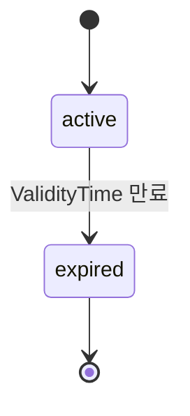

# nf-build 산출물 재설계 — design 산출 = dev implementation plan

## §0. 본 spec 메타

- 목표 — `/nf-build` 산출을 **단일 페이지 → 13 카테고리·하이브리드 분할** 로 재설계. dev agent 가 design 산출만으로 NSSF 코드 시작 가능한 깊이로 격상.
- 적용 시점 — 본 spec 승인 후 **NSSF 단일 NF reference impl** 로 적용. dev 단계까지 한 사이클 완성 목표. 다른 NF (AMF/SMF/UPF/NRF 등) 는 NSSF dev 완료 후 별도 사이클로 진행 — 본 spec 범위 밖.
- 영향 범위 — `/nf-build`, `/nf-init`, `/nf-status` SKILL.md, `design/scripts/` 도구 7종 (4 신규 + 3 확장), `CLAUDE.md` 정책, `design/<nf>/` 디렉터리 레이아웃, `handoff/<nf>/_handoff.yaml` schema (v1 → v2).
- `/nf-reset` SKILL — **폐기** (`/nf-init --reset` 으로 통합).

---

## §1. 목적

현 `/nf-build` 산출 (`design/<nf>/3gpp-{ts|tr}-{n}.md` 단일 파일, 7 H2 섹션) 의 한계 —

1. **페이지 길이** — NSSF 예 812줄 (Data Model 532줄). 한 파일 안에서 dev 가 한 카테고리만 보기 어렵고, 부분 빌드 시 git diff 가 흐려진다.
2. **dev agent 소비 단위 부적합** — dev agent (LLM 코딩 agent) 가 NF 구현 시 카테고리·토픽 단위 navigation 이 필요. 단일 markdown 은 token 비용·정확도 모두 비효율.
3. **design 깊이 부족** — 현재 7 카테고리는 spec 추출에 가깝다. dev 가 코드 시작 시 필요한 *정적 구조 (모듈 분해)*, *동적 행동 (상태 머신, 실패 정책)*, *검증 계약 (테스트 매트릭스)*, *작업 계획 (WBS)* 가 누락. dev 가 design 만 보고 implementation plan 으로 옮길 수 있는 수준이 아니다.

본 spec 은 위 3 가지를 동시에 해결한다.

---

## §2. 카테고리 — 13개 (5 Tier)

7 → 13 으로 확장 + Tier 그룹화. Tier 는 dev agent 의 인지적 흐름과 일치 — Surface (외부 계약) → Structure (정적 분해) → Behavior (동적 행동) → Verify & Plan → Integration.

| Tier | # | 카테고리 | 신규/기존 | PASS 기준 (dev 인계 가능 수준) |
|---|---|---|---|---|
| **A. Surface** | 1 | Interface | 기존 | URI · transport · auth, yaml `info`/`servers`/`security` 어절 인용 |
|  | 2 | API | 기존+확장 | 모든 (path, method) 행 + **idempotency · timeout · scope 컬럼** |
|  | 3 | Data Model (Logical) | 기존 | OpenAPI chain 끝까지 resolve, leaf 0건 또는 `(참조 규격 미등록)` 명시 |
|  | 4 | Error Handling | 기존 | yaml `responses` × ProblemDetails cause 전수 매트릭스 + 권장 처리 |
| **B. Structure** | 5 | **Module Decomposition** | **신설** | 책임 단위 + 내부 인터페이스 (입/출/의존) + dependency graph. 라이브러리 무관 |
|  | 6 | **Persistence Design** | **신설** | 논리 entity → 테이블 매핑 + key/index/uniqueness/retention. DBMS 비종속 |
|  | 7 | Configuration | 기존+확장 | feature flag · default · timeout · 한도 · 관측 키 · audit 정책 매트릭스 |
| **C. Behavior** | 8 | Service Scenarios | 기존 | 절차별 mermaid `sequenceDiagram` (happy + 주요 alt). 화살표 자료형 = spec/yaml 출처 |
|  | 9 | **Behavior & State** | **신설** | 상태 객체별 mermaid `stateDiagram-v2` + transition trigger·precondition·side-effect |
|  | 10 | **Failure Policy** | **신설** | 재시도 · timeout · idempotency · circuit break · degradation 정책 (API 행 또는 시나리오 별) |
| **D. Verify & Plan** | 11 | **Test Matrix** | **신설** | 케이스 표 (id · precondition · input · trigger · expected · negative + 성능 케이스) |
|  | 12 | **Work Plan** | **신설** | WBS — phase · 세부 기능 · 산출 매핑 · dependency. dev 가 sprint 로 직역 가능 |
| **E. Integration** | 13 | **Cross-NF Calls** | 재정의 | 본 NF 외향·내향 호출 계약 (상대 NF · op · trigger · payload · scope · 실패 시 행동). *호출 계약 으로 격상*. 여러 NF 합성 (graph) 은 `design/overviews/` 책임 — 본 카테고리 책임 아님 |

### Q2 미선택 항목 흡수

| 항목 | 흡수 위치 |
|---|---|
| 운영·관측 (로깅 키, 메트릭 이름, trace propagation) | Configuration (관측 매트릭스) + Failure Policy (trace propagation) |
| 성능 budget (latency·throughput·payload 한도) | Configuration (한도) + Test Matrix (성능 케이스) |
| 보안 위협 모델 (OAuth scope·token 검증·replay·audit) | Interface (auth) + Failure Policy (token replay) + Configuration (audit) |
| 데이터 라이프사이클 (TTL·eviction·persistence·replication) | Persistence Design (TTL/persistence/replication) + Behavior & State (eviction/restart) |

별도 카테고리로 신설하지 않은 이유 — 카테고리 수가 13 을 넘으면 dev agent navigation 비용이 가파르게 올라간다. 위 4 영역은 NF 별 cross-cutting 이라 *분산이 자연스럽다*.

### Implementation Notes (선택 subsection)

각 카테고리 H2 끝에 `### Implementation Notes` (선택) — dev 가 코드 작성 시 헷갈릴 함정·결정·spec 어절 인용. **사람이 직접 작성하는 산문 — 도구 산출 아님.**

---

## §3. 분할 단위 — 하이브리드

**NF 한 개 = 디렉터리.** 카테고리 중 *토픽 단위 graph node* 가 의미 있는 5 개는 디렉터리, 나머지 8 개는 단일 파일.

### 디렉터리 카테고리 (5)

| 카테고리 | 토픽 단위 | 토픽 예시 (NSSF) |
|---|---|---|
| `api/` | OpenAPI operation | `NSSelectionGet.md`, `NSSAIAvailabilityPut.md` |
| `data-model/` | root schema | `AuthorizedNetworkSliceInfo.md`, `NssaiAvailabilityInfo.md` |
| `module-decomposition/` | 책임 모듈 | `SelectionEngine.md`, `AvailabilityRegistry.md`, `SubscriptionManager.md`, `AuthAdapter.md` |
| `test-matrix/` | 케이스 그룹 | `conformance.md`, `interop.md`, `negative.md`, `performance.md` |
| `work-plan/` | WBS phase | `01-skeleton.md`, `02-api-implementation.md`, `03-persistence.md`, ... |

각 디렉터리는 `index.md` (카테고리 hub) 보유. hub = 토픽 wikilink 카탈로그 + 카테고리 status pill.

### 단일 파일 카테고리 (8)

`interface.md`, `error-handling.md`, `persistence.md`, `configuration.md`, `service-scenarios.md`, `behavior-state.md`, `failure-policy.md`, `cross-nf.md`.

### NSSF 디렉터리 트리 (예시 — 총 ~50 파일)

```
design/nssf/
├── index.md                          # NF hub
├── _manifest.yaml                    # /nf-init 산출
├── _status.yaml                      # /nf-status 산출
├── interface.md
├── error-handling.md
├── persistence.md
├── configuration.md
├── service-scenarios.md
├── behavior-state.md
├── failure-policy.md
├── cross-nf.md
├── api/
│   ├── index.md
│   ├── NSSelectionGet.md
│   ├── NSSAIAvailabilityPut.md
│   └── ... (op 단위 ~6)
├── data-model/
│   ├── index.md
│   ├── AuthorizedNetworkSliceInfo.md
│   └── ... (root schema 단위 ~18)
├── module-decomposition/
│   ├── index.md
│   ├── SelectionEngine.md
│   └── ... (~4)
├── test-matrix/
│   ├── index.md
│   ├── conformance.md
│   ├── interop.md
│   ├── negative.md
│   └── performance.md
└── work-plan/
    ├── index.md
    ├── 01-skeleton.md
    └── ... (~6-10)
```

### NF hub (`design/<nf>/index.md`)

- 카테고리 wikilink 카탈로그 (Tier 그룹화)
- 카테고리별 status pill (✅ canonical / ✅ handoff_ready / ⚠ draft / 🚫 blocked / ➖ not_applicable)
- 본 NF 의 manifest 의존 spec list 인용
- 본 NF 의 cross-nf.md 단편 (요약)

**mermaid graph 는 hub 에 박지 않는다** — sequence/state/module mermaid 는 *카테고리 본문* 의 산출, NF hub 는 navigation 용 wikilink list 만. ("graph node 형태의 index map" = 시각 mermaid 가 아닌 *데이터 graph* 의미.)

---

## §4. Navigation — handoff-v2 yaml

dev agent (LLM 코딩 agent) 의 single entry point.

### Schema

```yaml
schema_version: handoff-v2
nf: nssf
spec: TS 29.531
profile: stage_3_only           # CLAUDE.md "NF Profile" 표 참조
generated_from: design/nssf/
generated_at: 2026-05-12T00:00:00Z

# (1) 카테고리 메타 — agent 가 카테고리 status 한눈에
categories:
  interface:
    status: handoff_ready
    file: design/nssf/interface.md         # 단일 파일 카테고리
  api:
    status: handoff_ready
    topic_count: 6
    hub: design/nssf/api/index.md          # 디렉터리 카테고리
  data-model:
    status: canonical
    topic_count: 18
    hub: design/nssf/data-model/index.md
  module-decomposition:
    status: draft
    topic_count: 4
    hub: design/nssf/module-decomposition/index.md
  # ... (13 카테고리 전수)

# (2) 토픽 카탈로그 — agent 가 토픽 단위 navigation
topics:
  api/NSSelectionGet:
    title: "NS Selection — registration trigger"
    file: design/nssf/api/NSSelectionGet.md
    status: handoff_ready
    spec_refs: ["TS 29.531 §6.1.3.2.2"]
    depends_on:
      - data-model/SliceInfoForRegistration     # request body
      - data-model/AuthorizedNetworkSliceInfo   # response body
    related:
      - module-decomposition/SelectionEngine
      - service-scenarios#registration
      - failure-policy#timeout-nsselection
    error_refs: [error-handling#403, error-handling#404]

  data-model/AuthorizedNetworkSliceInfo:
    title: "Authorized network slice info"
    file: design/nssf/data-model/AuthorizedNetworkSliceInfo.md
    status: canonical
    schema_complete: true
    used_by: [api/NSSelectionGet, api/NSSelectionPost]
    references: [data-model/Snssai, data-model/Tai]

  module-decomposition/SelectionEngine:
    file: design/nssf/module-decomposition/SelectionEngine.md
    status: handoff_ready
    responsibilities:
      - "S-NSSAI 매칭 알고리즘 실행"
      - "AvailabilityRegistry lookup → AuthorizedNssai 도출"
    uses: [AvailabilityRegistry, AuthAdapter]
    consumes_topics: [api/NSSelectionGet]
  # ... (모든 토픽 + 단일 파일 카테고리도 토픽 1개로 등록)

# (3) spec_index — agent 가 spec ref 로 역방향 lookup
spec_index:
  "TS 29.531 §6.1.3.2.2": [api/NSSelectionGet]
  "TS 29.531 §5.2.2":     [service-scenarios#registration, behavior-state/SubscriptionLifecycle]
  # ...
```

### status enum (정확한 정의)

dev agent 가 status 값을 보고 *행동* 을 결정하므로 enum 의 의미를 명시한다.

| status | 의미 | dev agent 행동 |
|---|---|---|
| `canonical` | spec 1:1 추출, 사람 결정 불필요 (대부분 api / data-model / error-handling) | 그대로 사용 |
| `handoff_ready` | 사람 결정 + 도구 산출 완료, dev 작업 가능 | 그대로 사용 |
| `draft` | 도구 산출 완료, 사람 결정 미완료 | 사람 결정 대기 — dev 시작 금지 |
| `blocked` | chain leaf 미해결 또는 `validate-extraction` FAIL | **dev 작업 불가** — 의존 spec cp 또는 도구 산출 수정 필요 |
| `not_applicable` | NF Profile 에 따라 본 NF 에 적용되지 않는 토픽 | **이 NF 에 없는 토픽** — 무시 |

`blocked` 와 `not_applicable` 의 구분이 중요. 혼동 시 dev agent 가 NSSF 에 SUPI 처리 모듈을 만드는 사고가 발생한다. `blocked` = "여기 채워야 하는데 못 채워졌다", `not_applicable` = "여기는 채울 게 없다".

### Agent traversal 시나리오

```
dev agent: "NSSF 의 NSSelection API 를 구현하겠다"
  1. handoff/nssf/_handoff.yaml 단일 로드 (~3-5K 토큰)
     → 카테고리 status 확인, 전체 토픽 list 확보
  2. topics["api/NSSelectionGet"] 추출
     → file, depends_on, related 획득
  3. 필요한 .md 만 read (NSSelectionGet, SliceInfoForRegistration,
     AuthorizedNetworkSliceInfo, SelectionEngine)
     → 본문 prose + frontmatter spec_refs 로 dev plan 작성
  4. error_refs 따라 error-handling.md 의 해당 section 추가 로드
```

---

## §5. 자동화 원칙

### 사람 자리 / 도구 자리

| 영역 | 진실 출처 | 사람 개입 |
|---|---|---|
| frontmatter (모든 키 — nf, category, topic, title, status, spec_refs, depends_on, related, ...) | **도구 자동** (`build-handoff.py` 추출) | 없음 — 손편집 0 |
| handoff-v2 yaml | **도구 자동** — frontmatter 스캔 산출 | 없음 |
| Service Scenarios mermaid (sequenceDiagram) | **도구 자동** — `extract-service-flow.py` (spec procedure 텍스트 + figure) | review |
| Behavior & State mermaid (stateDiagram-v2) | **도구 자동 (admonition 파서)** — `extract-state-machine.py` v1 | **본문 admonition 작성** (결정적 의도) |
| Module Decomposition graph | **도구 자동** — `extract-module-graph.py` (frontmatter `uses` 스캔) | 모듈 *책임 정의 문장* 만 사람 |
| API matrix | **도구 자동** — yaml `paths` 스캔 | review |
| Data Model 트리 | **도구 자동** — `resolve-yaml-refs.py` | review |
| Error Handling 매트릭스 | **도구 자동** — yaml `responses` + docx §6.x.7 스캔 | review |
| Failure Policy 표 | **도구 보조** — API/Error 매트릭스에서 컬럼 자동 채움, 정책값은 사람 | 정책 *결정* (재시도 횟수 등) |
| Test Matrix | **도구 보조** — API/Service Scenarios 에서 행 자동 생성, negative case 는 사람 | negative case 선정 |
| Work Plan | **사람 주도** — phase 우선순위 등 결정적 의도, 도구는 traceability 검증만 | 전부 |
| Implementation Notes | **사람 산문** | 전부 |

### 사람 개입이 필수인 산출물 (요약)

1. **결정적 의도** — Work Plan phase 순서/우선순위, Module 책임 단어, Failure Policy 정책 값, Test Matrix negative case, Behavior & State 본문 admonition.
2. **Implementation Notes** — 도구가 모르는 함정·휴리스틱.
3. **review/approve** — 도구 산출의 정합성·완성도 확인.

frontmatter·mermaid·yaml — **전부 도구 진실 출처. 사람 손편집 0.**

### 사용자 산문 보존 원칙 (재확인)

`/nf-build` 가 카테고리 재빌드 시 — 기계 산출 영역 (frontmatter, mermaid, API matrix, Data Model 트리, Error 매트릭스, handoff yaml) 만 교체. 사용자 산문 (Summary, Methodology, Implementation Notes, Behavior admonition, Failure Policy 값, Work Plan phase 정의) 은 보존. 이 분리가 흐려지면 사용자는 매 빌드마다 산문을 잃는다.

---

## §6. 검증 — `validate-extraction.py`

도구 산출의 *정합성* 검증. NF 가 10개를 넘어가면 사람 review 만으로는 검수가 무너지므로 자동 검증이 필수.

### 룰 (카테고리별)

| 카테고리 | 룰 |
|---|---|
| **Service Scenarios** | (1a) mermaid `participant`/actor 이름 ∈ {spec docx NF 약어 ∪ yaml `info.title` NF 약어} 정확 일치. (1b) 메시지 op ∈ yaml `operationId` ∪ spec 산문의 `N\w+_\w+_\w+` 패턴 |
| **Behavior & State** | 모든 transition 이 trigger 정의 보유 (admonition `> [!transition]` 안 `trigger:` 행 존재). 모든 state node 가 `> [!state-node]` 블록에서 정의됨. trigger 의 `spec_ref:` 행이 `spec_refs` frontmatter 와 매칭 |
| **Module Decomposition** | `uses` 엣지 cycle 없음. 각 모듈 본문이 frontmatter `uses` 의 모든 대상을 참조 (wikilink 또는 본문 mention) |
| **API** | 모든 (path, method) 행이 yaml `paths.*` 에 실재 매칭. 누락·중복 검출 |
| **Data Model** | 트리의 모든 schema 가 yaml `components/schemas` 에 존재 또는 `(참조 규격 미등록)` leaf 명시 |
| **Error Handling** | 모든 (HTTP code, cause) 가 yaml `responses` + docx §6.x.7 어절에 존재 |
| **Failure Policy** | 모든 정책 행이 API op 또는 service scenario 토픽 wikilink 로 trace |
| **Test Matrix** | 모든 case 의 trigger 가 service-scenarios 또는 api 의 토픽 wikilink 로 trace |
| **Work Plan** | 모든 phase task 가 카테고리·토픽 wikilink 로 trace |
| **handoff-v2** | `topics.*.depends_on` 엣지가 실재 토픽 파일 + cycle 없음 |
| **spec_refs (global)** | frontmatter 의 모든 spec_ref 가 `specs/<spec>/_extracted/` 안 § 파일 anchor 와 매칭 |

### 실행 위치

`/nf-build` 의 마지막 단계 (extract → resolve → build-handoff → **validate-extraction**). FAIL 시 — 해당 토픽의 status 를 `blocked` 로 설정, `_status.yaml` 의 `extraction_consistent` check FAIL. 보고서에 위반 룰 id + 위반 위치 (파일 path:line) 명시.

### `nf-status.py` 와의 책임 분리

- `validate-extraction.py` = **도구 산출 정합성** (도구가 spec 출처와 모순 없는가)
- `nf-status.py` = **완성도** (카테고리 채워졌는가, gate 통과 여부)

둘은 다른 차원. validate FAIL 인 토픽은 어떤 카테고리 완성도 check 도 의미 없으므로, `nf-status.py` 는 `validate-extraction.py` 결과를 선행 조건으로 본다.

---

## §7. Boundary 정의

NSSF 개발 = NSSF manifest 의 spec set boundary 안에서 자급자족.

| 안/밖 | 무엇 | 어디 |
|---|---|---|
| **boundary 안** (NSSF 개발에 필수) | NSSF docx + manifest 등록 spec set 의 모든 yaml/docx (chain leaf 포함). `resolve-yaml-refs.py` 가 chain 추적 → leaf 가 잡히지 않으면 manifest `missing_priority` 에 명시 | `specs/*/` |
| **boundary 밖** (NSSF 개발 무관) | 다른 NF 의 *design 페이지* (`design/<other-nf>/*.md`). cross-nf-graph 합성에만 필요 | `design/<other-nf>/` |

**THE FOUR RULES #4 (chain ends incomplete 면 silent 금지) 와 동일 원칙** — chain leaf 가 풀리지 않으면 `(참조 규격 미등록)` 명시 + `nf-status` FAIL. 다른 NF 의 spec docx/yaml 은 chain 해결을 위해 필수로 cp.

### 다른 NF 의 design 페이지가 필요한 경우 (= boundary 밖)

- `design/overviews/cross-nf-graph.md` 합성 — 여러 NF 의 cross-nf.md 가 모두 있을 때 도구 자동 합성. 본 디자인 범위 밖 (별개 사이클).
- `design/architecture/3gpp-ts-23501.md` (profile=`meta_only`) — 별개 NF 빌드 사이클로 처리.

NF 한 개 빌드는 **다른 NF design 페이지 없이 자급자족 완료**.

---

## §8. SKILL 3종 + 도구 호출 흐름

### `/nf-init` (기존 + `--reset` 옵션 통합 — `/nf-reset` 폐기)

| 호출 | 동작 |
|---|---|
| `/nf-init <nf> --primary <spec>` | 기존 (manifest 보강 모드). 누적 |
| `/nf-init <nf> --primary <spec> --reset` | 산출물 (디렉터리·handoff yaml·_status.yaml) 을 `design/<nf>/_archive/<ts>/` 로 mv 후 manifest 재생성. 실행 전 Y/n 확인. **모든 본문 prose 까지 archive** |
| `/nf-init <nf> --primary <spec> --reset-keep-prose` | frontmatter·mermaid·yaml·table 만 archive (재생성 대상). **사용자 산문 (Summary, Methodology, Implementation Notes, Behavior admonition, Failure Policy 정책값, Work Plan phase 정의) 은 in-place 보존**. 자동 재빌드가 사용자 결정적 의도를 잃지 않도록 |

### `/nf-build` (대대적 재설계)

```
/nf-build <nf> [--<category>]
  ↓
1. 매니페스트 ready 확인 (없으면 /nf-init 안내)
  ↓
2. spec-split.py (캐시) — specs/<spec>/_extracted/*.md
  ↓
3. 카테고리별 산출 (--<category> 부분 빌드 또는 전체):
   - resolve-yaml-refs.py → data-model/<schema>.md
   - extract-service-flow.py → service-scenarios.md (mermaid 자동)
   - extract-state-machine.py v1 → behavior-state.md (admonition 파서)
   - extract-module-graph.py → module-decomposition/index.md (frontmatter `uses` 기반)
   - (API, Error, Interface 등은 yaml 직접 스캔)
   - (Failure Policy, Test Matrix, Work Plan 은 도구 보조 + 사용자 산문 보존)
  ↓
4. build-handoff.py (v2) — frontmatter 자동 추출 + handoff-v2 yaml 산출
  ↓
5. validate-extraction.py — 모든 카테고리 정합성 검증
   FAIL 시 해당 토픽 status=blocked, _status.yaml extraction_consistent FAIL
  ↓
6. 결과 보고 — 카테고리별 산출 + validate report + 다음 액션 안내
```

부분 빌드 인자 — `--interface`, `--api`, `--data-model`, `--error-handling`, `--module-decomposition`, `--persistence`, `--configuration`, `--service-scenarios`, `--behavior-state`, `--failure-policy`, `--test-matrix`, `--work-plan`, `--cross-nf`. 부분 빌드는 다른 카테고리 본문 건드리지 않음 (기존 원칙 유지).

### `/nf-status` (확장)

- 토픽 단위 status 측정 (handoff-v2 status enum 적용)
- 신설 카테고리별 check 추가 — `module_responsibilities_defined`, `state_machine_complete`, `failure_policy_covers_api`, `test_matrix_coverage`, `work_plan_traces_categories`, `persistence_entities_defined`
- `extraction_consistent` check (validate-extraction 결과 흡수)
- acceptance gate 4 종 (`draft`/`review_ready`/`handoff_ready`/`canonical`) 평가 — 카테고리 별 + NF 전체

---

## §9. 도구 — 4 신규 + 3 확장 + 기존

| 도구 | 상태 | 입력 | 산출 | 호출 위치 |
|---|---|---|---|---|
| `spec-split.py` | 기존 | `specs/<spec>/<file>.docx` | `specs/<spec>/_extracted/*.md` | `/nf-build` 빌드 전 |
| `resolve-yaml-refs.py` | 기존 | primary yaml + companion + `--depth` | Data Model 트리 (text block) | `/nf-build --data-model` |
| `extract-service-flow.py` | **신규** | spec docx §5 procedure + figure 라벨 | `service-scenarios.md` 의 mermaid `sequenceDiagram` 블록 | `/nf-build --service-scenarios` |
| `extract-state-machine.py` v1 | **신규 (admonition 파서)** | `behavior-state.md` 본문 `> [!state]` `> [!state-node]` `> [!transition]` admonition | mermaid `stateDiagram-v2` 블록 + transition 표 | `/nf-build --behavior-state` |
| `extract-module-graph.py` | **신규** | `module-decomposition/*.md` frontmatter `uses` | `module-decomposition/index.md` 의 mermaid graph | `/nf-build --module-decomposition` |
| `validate-extraction.py` | **신규** | 모든 카테고리 산출 + handoff-v2 yaml + specs/_extracted/ | validate report (PASS/FAIL per 룰 + 위반 위치) | `/nf-build` 마지막 |
| `build-handoff.py` | **기존 → v2 확장** | `design/<nf>/**/*.md` (frontmatter + 본문) | `handoff/<nf>/_handoff.yaml` (schema_version: handoff-v2, categories + topics + spec_index) | `/nf-build` 마지막 직전 |
| `nf-status.py` | **기존 → 확장** | `design/<nf>/`, handoff-v2 yaml, validate report | `design/<nf>/_status.yaml` + 콘솔 보고 | `/nf-status` |
| `nf-manifest.py` | 기존 | `--primary <spec>` + specs/ | `_manifest.yaml` | `/nf-init` |
| `build-cross-nf-graph.py` | **본 디자인 범위 밖** | 모든 NF handoff yaml 의 cross_nf 섹션 | `design/overviews/cross-nf-graph.md` | overviews 빌드 시 사용자 명시 호출 |

### `extract-state-machine.py` 의 admonition 파서 — 입력 예시

```markdown
> [!state] SubscriptionLifecycle
> NSSAI Availability subscription 의 lifecycle

> [!state-node] active
> 정상 동작 중. notification 수신 가능.

> [!state-node] expired
> ValidityTime 경과. notification 중단, GC 대상.

> [!transition] active → expired
> trigger: ValidityTime 만료
> precondition: 갱신 요청 없음
> side-effect: notification 중단, subscription GC 대상 등록
> spec_ref: TS 29.531 §6.2.3.2.x
```

→ 도구 산출 (자동):



+ transition 표 (markdown table, trigger·precondition·side-effect·spec_ref 컬럼).

**왜 admonition 인가** — spec auto-extraction 은 transition 이 산문에 흩어진 경우 추출 정확도가 낮다. State machine 의 정확한 정의는 *결정적 의도* 의 일부이므로 사람이 admonition 5-10줄 작성하는 것이 정확도·자동화의 균형점. spec auto-extraction 으로의 격상 여부는 NSSF dev 완료 후 다른 NF 사이클 진입 시점에 별도 판단 — 본 spec 범위 밖.

---

## §10. 마이그레이션 — NSSF 단일 사이클

본 spec 의 마이그레이션 범위는 **NSSF 한 NF 의 design → dev 완성** 한 사이클. 다른 NF 는 본 spec 범위 밖 — NSSF dev 완료 시점에 회고 후 별도 spec 으로 진행.

| 단계 | 동작 |
|---|---|
| M.1 | 기존 산출 백업 — `git tag archive/nssf-pre-restructure-20260512` + `/nf-init nssf --primary 29.531 --reset` |
| M.2 | 도구 4 신규 + 3 확장 구현 (`extract-service-flow`, `extract-state-machine` v1, `extract-module-graph`, `validate-extraction`, `build-handoff` v2, `nf-status` 확장) |
| M.3 | SKILL 3종 갱신 (`/nf-init` `--reset`/`--reset-keep-prose` 옵션, `/nf-build` 새 흐름, `/nf-status` 새 check) |
| M.4 | NSSF 새 구조 fresh 빌드 (`/nf-build nssf` → 13 카테고리 산출) |
| M.5 | 기존 prose 일회성 수동 이주 — **5 단락 / 1000 단어 이하**. 초과 시 일회성 `prose-migrate.py` 작성 후 폐기. 이주 단락 frontmatter 에 `migrated_from: 3gpp-ts-29531.md#L123-L145` 박아 trace 유지 |
| M.6 | `/nf-status nssf` → handoff_ready gate 통과 확인 |
| M.7 | `.gitignore` 에 `design/*/_archive/` 추가. archive 는 git tag (M.1) 로 보존, repo 트리에서 제거 |
| M.8 | CLAUDE.md 갱신 (§11) + nf-reset SKILL 삭제 |
| M.9 | NSSF dev 단계 진입 — handoff-v2 yaml 을 단일 entry point 로 dev agent 가 코드 생성. 본 spec 의 *최종 검증* — design 산출만으로 dev 완성 가능했는지 회고. 회고 산출은 `docs/retros/<YYYY-MM-DD>-nssf-design-to-dev-cycle.md` 로 commit — 후속 NF 사이클·후속 spec 의 *공식 입력* |

### archive 정책

- `_archive/<ts>/` 는 `.gitignore` (repo 트리 노이즈 방지)
- archive 보존은 **git tag** — `archive/<nf>-pre-restructure-<YYYYMMDD>` 로 commit 위에 tag. 필요 시 tag 에서 복원
- 같은 NF 를 여러 번 reset 해도 timestamp 다른 tag 생성

---

## §11. CLAUDE.md 갱신 포인트

### 1. Categories 섹션 (7 → 13 + Tier)

§2 의 Tier 표 그대로 이식. 신설 6 (Module Decomposition / Persistence Design / Behavior & State / Failure Policy / Test Matrix / Work Plan) + Cross-NF 재정의 (호출 계약) — 정의 + 분류 규칙.

### 2. Repository Structure 갱신

`design/<nf>/` 가 단일 파일 → 디렉터리 + 5 sub-디렉터리 (api, data-model, module-decomposition, test-matrix, work-plan). `_archive/` 항목 추가 (gitignored).

### 3. NF Profile 카테고리별 NOT_APPLICABLE 매트릭스

`stage_3_only` / `stage_2_only` / `mixed` / `meta_only` × 13 카테고리 → applies_to 매트릭스. `nf-status.py` 의 `applies_to` 정의가 진실 출처. CLAUDE.md 에는 요약만.

### 4. Acceptance Gates — 토픽 단위 status 추가

기존 4 gate (`draft`/`review_ready`/`handoff_ready`/`canonical`) 는 카테고리 + NF 전체 단위. 토픽 단위 status 는 handoff-v2 yaml 의 `topics.*.status` (§4 의 status enum) 가 진실 출처.

### 5. 작업 흐름 — 4 → 3 SKILL

`/nf-reset` 행 삭제. `/nf-init` 행에 `--reset` / `--reset-keep-prose` 옵션 명시.

### 6. design ↔ dev 책임 경계 — 일반 원칙 + 카테고리별 표

**일반 원칙** — design = "무엇을(what) + 왜(why)", dev = "어떻게(how) + 무엇으로(with what)".

| 카테고리 | design (what + why) | dev (how + with what) |
|---|---|---|
| Interface | URI · transport · auth 정의 (spec 어절) | HTTP/2 라이브러리, TLS 구성 |
| API | operation matrix · idempotency · timeout · scope 값 | 라우터/핸들러 코드, async/sync 패턴 |
| Data Model | 논리 schema chain, 자료형 | ORM, 직렬화 라이브러리 |
| Error Handling | ProblemDetails 매트릭스 + 권장 처리 | 예외 클래스 계층, 에러 미들웨어 |
| Module Decomposition | 책임 단위 + 내부 인터페이스 (라이브러리 무관) | 언어/프레임워크 매핑, 패키지 분리 |
| Persistence Design | 논리 entity · key · index · retention · replication 요구 | DBMS 선택 (PostgreSQL/MySQL 등), ORM |
| Configuration | feature flag · default · timeout · 한도 · 관측 키 *값* | flag 시스템 (LaunchDarkly, ConfigMap) |
| Service Scenarios | mermaid sequence (3GPP 절차) | 실제 코드 호출 구조 |
| Behavior & State | mermaid state machine + transition (결정적 의도) | 상태 머신 라이브러리, persistence |
| Failure Policy | 재시도 횟수 · timeout 값 · idempotency 정책 (결정) | retry-go, tenacity 등 라이브러리 |
| Test Matrix | 케이스·기대값 (equivalence class, negative) | 테스트 프레임워크 (pytest, go test) |
| Work Plan | phase 순서 · 세부 기능 · 산출 매핑 | sprint 분배, 인력 할당 |
| Cross-NF Calls | 호출 계약 (상대 NF · op · trigger · scope · 실패 행동) | gRPC/HTTP client 선택, 회로 차단 라이브러리 |

이 원칙 + 표가 들어가면 다른 카테고리에서도 같은 질문 (어디까지 design? 어디부터 dev?) 이 재발하지 않는다.

### 7. THE FOUR RULES 영향

- Rule #1 (No web search) — 변경 없음
- Rule #2 (Answer from design first) — design 단위가 *13 카테고리·토픽* 으로 갱신됨을 반영
- Rule #3 (re-read source) — `/nf-build <nf> --<category>` 의 부분 빌드가 카테고리 13 종으로 확장됨
- Rule #4 (chain ends incomplete) — *handoff-v2 의 status=blocked* 로 표현. silent 금지 원칙 동일

---

## §12. 위험·미해결

| 위험 | 완화 | 재평가 시점 |
|---|---|---|
| `extract-state-machine.py` v1 의 admonition 파서가 NSSF 외 복잡한 NF (5GMM/5GSM 등) 에서 부족할 가능성 | NSSF 는 사람이 admonition 5-10줄 작성으로 충분. spec auto-extraction (v2) 격상 여부는 **본 spec 범위 밖** — NSSF dev 완료 후 다른 NF 사이클에서 별도 판단 | NSSF dev 완료 시점 회고 |
| `extract-service-flow.py` 의 spec procedure 추출 정확도 | `validate-extraction` 룰 #1a/#1b 가 부정확한 산출을 즉시 차단. extract 도구는 spec 어절 인용만 — 추측 금지 | M.6 (NSSF validate 결과 검토) |
| `validate-extraction` 의 룰 자체가 부정확할 가능성 (false positive/negative) | 룰을 grep 가능한 정의로 명시 (§6 표). spec set 의 어절 변형은 *명시적 추가* 만 — 모호한 fuzzy match 금지 | M.6 |
| frontmatter 자동 추출 도구 비용 (LLM 비용) | NSSF reference impl 으로 도구 안정화 + 비용 1회 측정. 다른 NF 추정은 본 spec 범위 밖 | M.4 |
| handoff-v2 schema 변경 — 기존 v1 consumer 영향 | 현재 v1 consumer 없음 (dev 영역 미구현). v1 → v2 마이그레이션 비용 0 | M.2 |
| handoff-v2 yaml 토큰이 NSSF 에서도 예상 초과 시 (~30K) | **토픽 단위 sub-yaml 분할** 옵션 — `_handoff/api.yaml`, `_handoff/modules.yaml`, ..., `_handoff/_index.yaml` (통합 index). agent 가 index 만 먼저 로드 후 필요한 sub-yaml 추가 로드. NSSF 가 임계 넘으면 발동, 안 넘으면 옵션으로 남김 | M.9 (NSSF dev 진입 시 토큰 측정) |
| 13 카테고리가 NSSF 에서 부족·과잉할 가능성 | M.4 빌드 + M.9 dev 회고 시 검증. 본 spec 은 13 으로 fix, NSSF dev 완료 후 회고 결과로 다른 NF 사이클 진입 시 조정 가능 | M.9 |
| M.5 수동 이주가 5 단락 / 1000 단어 한계 초과 | 일회성 `prose-migrate.py` 작성 후 폐기. 이주 추적은 frontmatter `migrated_from` 으로 영구 보존 | M.5 |
| archive 가 repo 트리에 쌓이면 검색 노이즈 | `_archive/` 는 `.gitignore`, git tag 로 보존 | M.7 |
| Implementation Notes 가 길어져 단일 파일 카테고리 (e.g. interface.md) 가 다시 비대해질 가능성 | NF 한 카테고리 단일 파일 한계 800 줄 권장. 초과 시 토픽 디렉터리로 승격 — 후속 정책 (NSSF dev 완료 후 회고) |

---

## §13. 본 디자인의 acceptance criteria

본 spec 이 *완료된 상태* 의 정의 — implementation plan 으로 옮길 준비가 됐다는 의미.

- [x] 13 카테고리 + 5 Tier 가 fix 되었다 (§2)
- [x] 하이브리드 분할 — 디렉터리 5 / 단일 파일 8 — fix 되었다 (§3)
- [x] handoff-v2 yaml schema + status enum 5 종이 정의되었다 (§4)
- [x] 사람 자리 / 도구 자리가 명확히 분리되었다 (§5)
- [x] `validate-extraction.py` 룰이 카테고리별 grep 가능한 정의로 명시되었다 (§6)
- [x] boundary 정의 — manifest 안 spec set vs 다른 NF design 페이지 — 가 fix 되었다 (§7)
- [x] SKILL 3종 (init / build / status) — nf-reset 폐기 — fix 되었다 (§8)
- [x] 도구 7종 (4 신규 + 3 확장) 의 입력·산출·호출 위치가 명시되었다 (§9)
- [x] 마이그레이션 — NSSF 단일 사이클 (M.1~M.9, design → dev 완성까지) — 정량 기준 포함 — fix 되었다 (§10)
- [x] CLAUDE.md 갱신 포인트 7 종이 명시되었다 (§11)
- [x] 위험 11 종 + 완화 + 재평가 시점이 fix 되었다 (§12)
- [x] 토픽 frontmatter 표준 (부록 A) + admonition 어휘 (부록 B) 가 명시되었다

→ implementation plan 작성 가능 상태.

---

## 부록 A — 토픽 frontmatter 표준 (도구 자동 생성)

각 토픽 .md 파일의 frontmatter 는 `build-handoff.py` 가 자동 생성. 사람이 손편집 0.

```yaml
---
nf: nssf
category: api
topic: NSSelectionGet
title: "NS Selection — registration trigger"
status: handoff_ready           # canonical | handoff_ready | draft | blocked | not_applicable
spec_refs:
  - "TS 29.531 §6.1.3.2.2"
depends_on:                     # 토픽 wikilink — yaml $ref + 본문 wikilink 합집합
  - data-model/SliceInfoForRegistration
  - data-model/AuthorizedNetworkSliceInfo
related:                        # 비의존 cross-ref
  - module-decomposition/SelectionEngine
  - service-scenarios#registration
  - failure-policy#timeout-nsselection
error_refs:                     # error-handling.md 의 section anchor
  - error-handling#403
  - error-handling#404
migrated_from: "3gpp-ts-29531.md#L123-L145"   # 키 부재 = 신규 토픽 / 키 존재 = M.5 prose 이주. 표기 (null vs 키 부재) 는 도구 구현 시점 결정
---
```

단일 파일 카테고리 (e.g. `interface.md`) 도 동일 schema, `category: interface` `topic: interface` (카테고리 = 토픽 1개).

---

## 부록 B — `extract-state-machine.py` admonition 어휘 (NSSF)

| Admonition | 필수 행 | 의미 |
|---|---|---|
| `> [!state] <name>` | (블록 본문 — 설명) | state machine 의 이름 + 한 줄 정의 |
| `> [!state-node] <name>` | (블록 본문 — 노드 의미) | state node 정의 |
| `> [!transition] <from> → <to>` | `trigger:`, `precondition:`, `side-effect:`, `spec_ref:` | transition 정의. validate 룰이 4 행 모두 요구 |

NSSF 의 경우 admonition 총 ~10-20줄 (state node 3-5개 + transition 5-10개) 으로 충분. 더 복잡한 NF 에서의 확장·자동화 격상은 본 spec 범위 밖.
