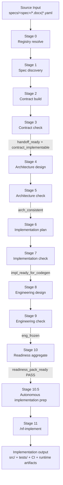
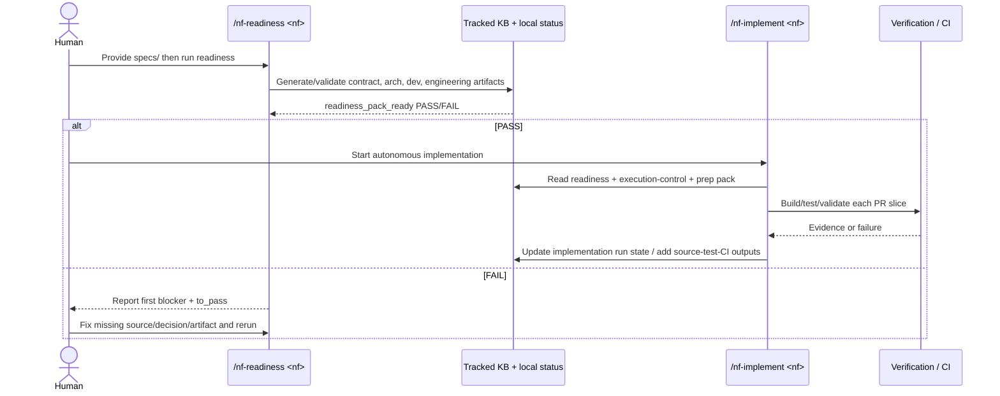
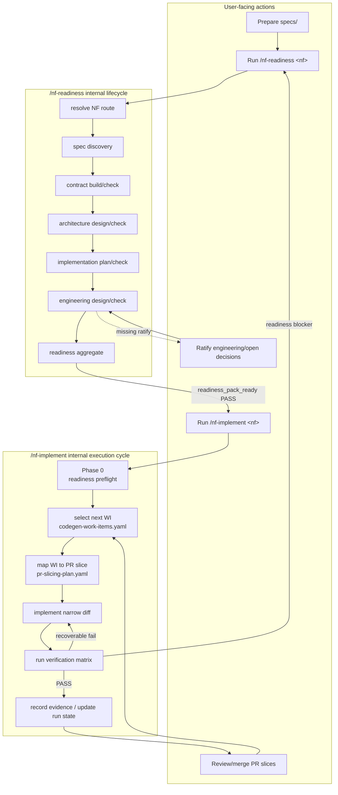
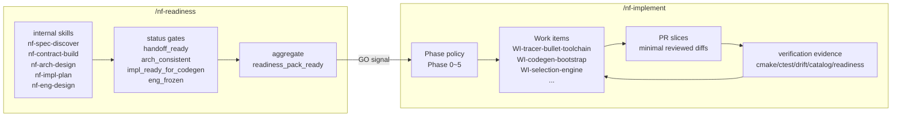
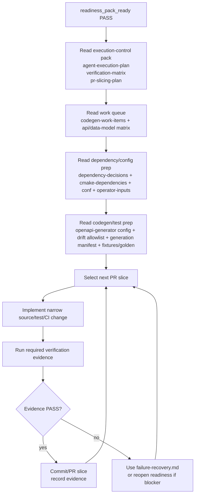
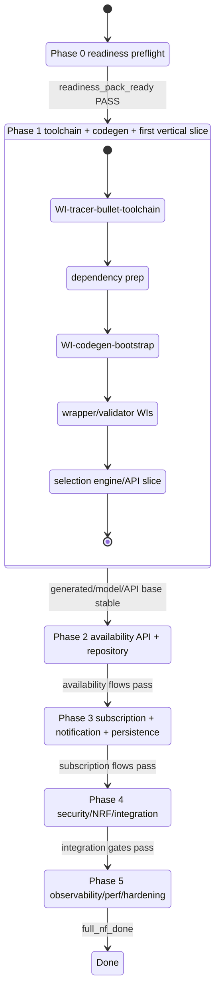
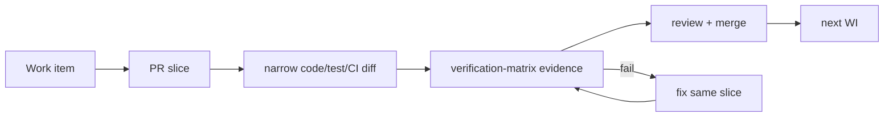
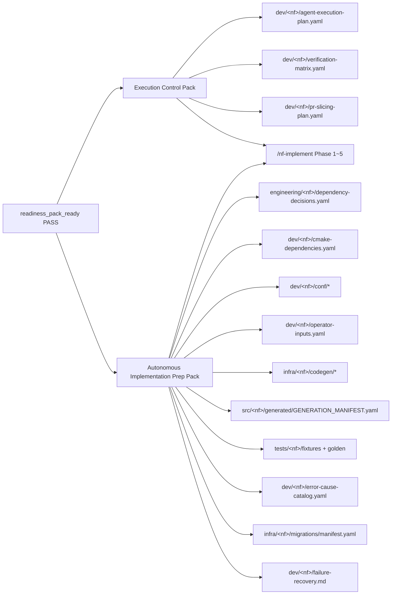

# Workflow diagrams

이 문서는 5gc-impl-kb 의 파일 관계, lifecycle, 자율 구현 workflow 를 Mermaid 로 요약한다. GitHub markdown 에서는 diagram 으로 렌더링되고, offline HTML mirror 에서는 Mermaid source block 으로 확인한다.

관련 상세 문서:

- [`lifecycle-artifacts.md`](./lifecycle-artifacts.md) — 단계별 산출물 catalog.
- [`artifact-management.md`](./artifact-management.md) — 파일 class, git 정책, placement rule.
- [`kb/README.md`](./kb/README.md) — implementation agent / human reviewer 독해 순서.

---

## 1. End-to-end lifecycle

핵심 해석:

- Stage 10 `readiness_pack_ready` 가 `/nf-implement` 의 유일한 GO 신호다.
- Stage 10.5 는 GO 신호가 아니라, 이미 PASS 된 readiness pack 을 실제 장기 자율 코드 작업용으로 좁히는 보강 단계다.
- Stage 11 부터 실제 source/test/CI 산출이 증가한다.

---

## 2. File relationship map

```mermaid
flowchart LR
  subgraph Input["Source input"]
    Specs["specs/&lt;spec&gt;/*.docx|*.yaml"]
    Registry["design/nf-registry.yaml"]
  end

  subgraph LocalCache["Local reproducible cache<br/>(git ignored / regen)"]
    Manifest["design/&lt;nf&gt;/_manifest.yaml"]
    Seed["design/&lt;nf&gt;/_contract_seed.yaml"]
    Contract["design/&lt;nf&gt;/contract/**"]
    Handoff["handoff/&lt;nf&gt;/contract.yaml"]
    Status["_*_status.yaml"]
  end

  subgraph ReviewedKB["Reviewed KB<br/>(git tracked)"]
    Arch["design/&lt;nf&gt;/architecture/**"]
    Modules["design/&lt;nf&gt;/module-decomposition/**"]
    Eng["engineering/&lt;nf&gt;/engineering-design.md"]
    Dep["engineering/&lt;nf&gt;/dependency-decisions.yaml"]
    Dev["dev/&lt;nf&gt;/readiness pack"]
    Exec["dev/&lt;nf&gt;/execution-control pack"]
    Prep["dev/&lt;nf&gt;/autonomous-prep pack"]
  end

  subgraph PrepConfig["Tracked prep/config"]
    CodegenCfg["infra/&lt;nf&gt;/codegen/*.yaml"]
    Migration["infra/&lt;nf&gt;/migrations/manifest.yaml"]
    GenManifest["src/&lt;nf&gt;/generated/GENERATION_MANIFEST.yaml"]
    Fixtures["tests/&lt;nf&gt;/fixtures + golden"]
  end

  subgraph Impl["Implementation output"]
    Src["src/&lt;nf&gt;/**"]
    Tests["tests/&lt;nf&gt;/**"]
    CI[".github/workflows/**"]
    RunState["dev/&lt;nf&gt;/_implementation_run_state.yaml"]
  end

  Specs --> Manifest --> Seed --> Contract --> Handoff
  Registry --> Manifest
  Handoff --> Arch --> Modules --> Dev
  Handoff --> Dev
  Arch --> Eng --> Dep
  Dev --> Exec
  Dev --> Prep
  Dep --> Prep
  Prep --> CodegenCfg
  Prep --> Migration
  Prep --> GenManifest
  Prep --> Fixtures
  Exec --> Impl
  PrepConfig --> Impl
  Dev --> Impl
  Status -. gate evidence .-> Dev
```

핵심 해석:

- `design/<nf>/contract/**`, `handoff/<nf>/contract.yaml`, `_*_status.yaml` 은 중요하지만 source of truth 가 아닌 재생성 cache/status 다.
- `dev/<nf>/` 는 코드 디렉터리가 아니라 구현 KB 디렉터리다.
- `infra/<nf>/codegen/**`, `src/<nf>/generated/GENERATION_MANIFEST.yaml`, `tests/<nf>/fixtures/**`, `tests/<nf>/golden/**` 는 Stage 10.5 이후 `/nf-implement` 가 소비하는 tracked prep/config/test data 다.

---

## 3. Public workflow

핵심 해석:

- 사람의 평상시 public workflow 는 `/nf-readiness <nf>` → `/nf-implement <nf>` 두 단계다.
- 내부 skill 은 새 계약/override/debug 상황이 아니면 직접 호출하지 않는다.
- 구현 중 실패는 readiness 재개가 필요한 blocker 인지, Stage 11 복구 가능한 build/test 실패인지 구분한다.

---

## 4. User action vs internal cycle

해석:

- `/nf-readiness` 는 compiler-like 내부 lifecycle 이다. 내부 skill 이 순차 산출물을 만들고 status gate 로 멈춘다.
- `/nf-implement` 는 execution loop 다. 내부 skill 이름보다 **Phase → WI → PR slice → verification** 이 제어 단위다.
- 사람이 평소 직접 하는 action 은 source input 준비, public skill 실행, ratify/review/merge 다.

---

## 5. `/nf-readiness` vs `/nf-implement` internal structure

| 구분 | `/nf-readiness` | `/nf-implement` |
|---|---|---|
| 사람 호출 | `/nf-readiness <nf>` | `/nf-implement <nf>` |
| 내부 단위 | lifecycle skill + status gate | phase + work item + PR slice + verification matrix |
| 주요 입력 | `specs/`, registry, prior KB | readiness pack + execution-control + prep pack |
| 주요 산출 | contract/design/engineering/dev KB | `src/`, `tests/`, `infra/`, CI/runtime artifacts |
| 실패 처리 | 첫 blocking gate 의 `to_pass` 보고 | recoverable build/test fail 은 같은 WI에서 수정, readiness blocker 는 `/nf-readiness` 재개 |

---

## 6. `/nf-implement` consumption flow

Stop 조건:

- readiness pack 에 `category: blocker` 가 발견됨.
- work item input 이 누락됨.
- 원본 spec 의미 재발견이 필요해짐.
- verification evidence 가 반복 실패하고 `failure-recovery.md` 로도 복구 불가.

---

## 7. `/nf-implement` Phase / WI / PR slice loop

PR slice loop:

해석:

- Phase 는 큰 구현 파도다.
- WI 는 agent 가 실제로 집을 수 있는 작업 단위다.
- PR slice 는 review/merge 가능한 최소 diff 단위다.
- verification matrix 는 각 slice 가 제출해야 하는 증거 목록이다.

---

## 8. Stage 10.5 artifact split

권장 생성 시점:

1. Stage 10 readiness PASS.
2. Phase 1 tracer-bullet 또는 최소 toolchain PR.
3. Stage 10.5 execution-control/prep artifacts.
4. Phase 1 wave 1 codegen bootstrap.
5. Phase 2~5 feature/persistence/security/observability/hardening.
