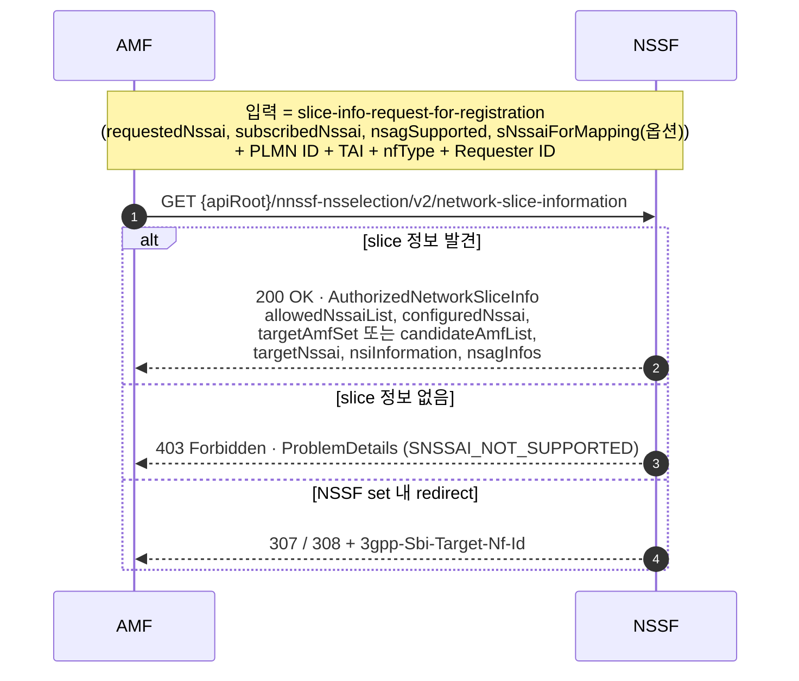
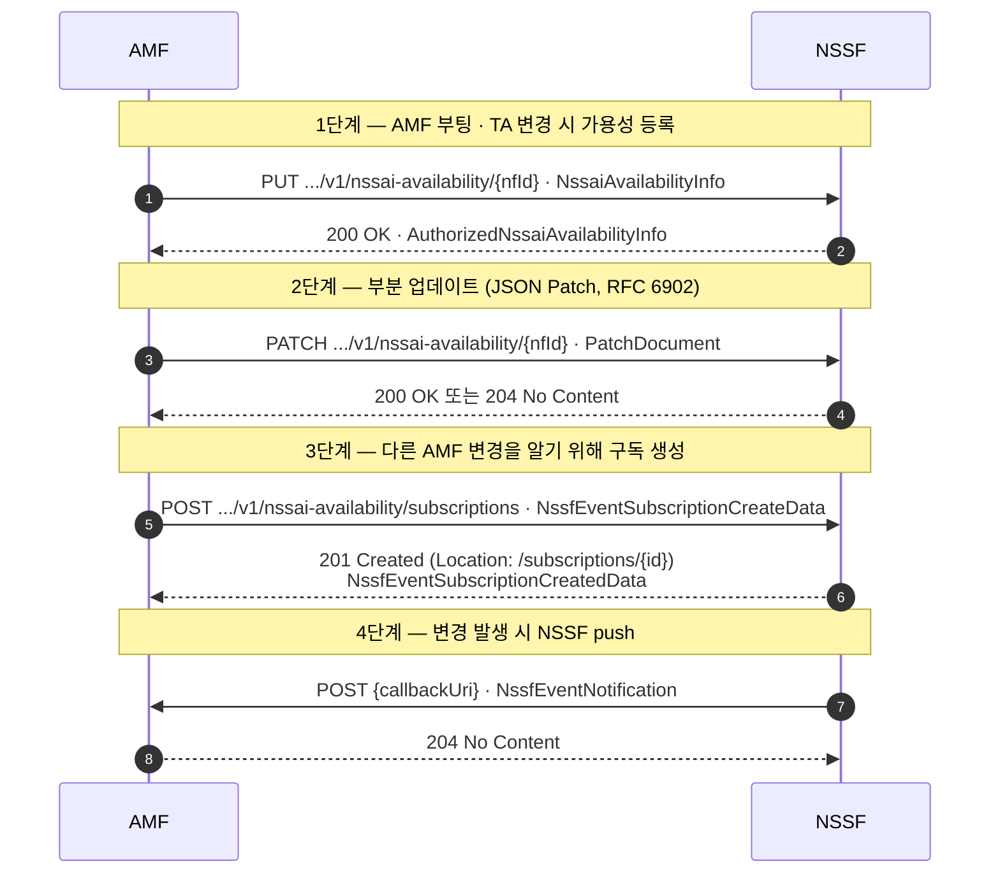
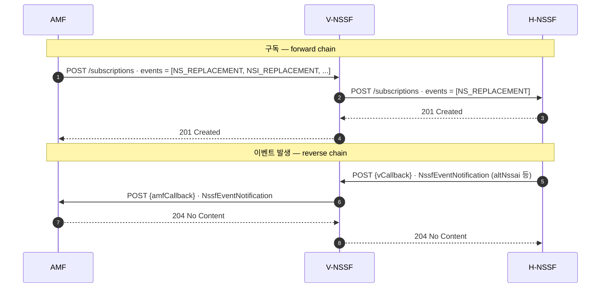

## Summary

NSSF (Network Slice Selection Function) 는 5GC 에서 UE 가 어느 network slice 를 사용할 수 있고, 어느 AMF 가 그 UE 를 처리해야 하는지를 결정하는 NF 다. TS 29.531 은 그 NSSF 가 외부에 노출하는 SBI (Nnssf) 의 stage 3 spec, 즉 HTTP/2·JSON 위에서 실제로 주고받는 메시지·자료형·URI 를 정의한다.

이 spec 은 두 서비스를 정의한다. **Nnssf_NSSelection** 은 AMF·SMF+PGW-C·NWDAF·vNSSF 가 슬라이스 선택 정보(Allowed/Configured NSSAI, target AMF Set, NSI ID, VPLMN↔HPLMN S-NSSAI mapping 등)를 한 번의 GET 으로 가져오는 read 서비스다. **Nnssf_NSSAIAvailability** 는 AMF 가 자신이 지원하는 TA 별 S-NSSAI 를 NSSF 에 등록·갱신하고, 다른 AMF 의 변경이나 Network Slice / Slice Instance Replacement, NSSAI validity time 변화를 구독하는 양방향 서비스다.

Rel-19 (v19.6.0) 시점에서 핵심 기능은 두 종류의 Replacement 통지 (Network Slice / NSI), NSAG 정보 처리, Indirect Network Sharing 의 mapping 지원이다.

## Key Contributions

- Nnssf_NSSelection 의 GET 단일 operation 으로 5GC 의 모든 슬라이스 선택 시나리오 (non-roaming, LBO roaming, home-routed roaming, EPC 호환) 를 통합한다.
- Nnssf_NSSAIAvailability 가 6개 operation (Update / Subscribe / Unsubscribe / Notify / Delete / Options) 으로 TA 단위 S-NSSAI 가용성 동기화 + 이벤트 통지 채널을 제공한다.
- 4종 이벤트(NSSAI 가용성 변경, Network Slice Replacement, Network Slice Instance Replacement, NSSAI validity time 변경) 의 구독·통지를 정의한다.
- NSAG (Network Slice AS Group) 정보를 NSSelection 과 NSSAIAvailability 양쪽에서 일관되게 운반한다.
- Indirect Network Sharing 및 EPS↔5GS 상호운용을 위해 VPLMN ↔ HPLMN S-NSSAI mapping 을 명시적으로 제공한다.
- supportedFeatures 기반 feature negotiation, ProblemDetails (RFC 9457) 에러 모델, JSON Patch (RFC 6902) update, `3gpp-Sbi-Target-Nf-Id` 기반 NSSF set redirection 을 표준화한다.

## Methodology and Architecture

NSSF 는 5GC 의 service based architecture 안에서 Nnssf SBI 한 개로 외부에 노출된다. Consumer 는 AMF, SMF+PGW-C, NWDAF, 그리고 다른 PLMN 의 NSSF (vNSSF/hNSSF) 다. NF discovery 는 NRF 또는 local configuration 으로 이루어지고, 홈 NSSF 주소는 visited NSSF 의 local config 또는 TS 23.003 self-constructed FQDN 으로 결정된다.

API 진입점은 두 개다.

- Nnssf_NSSelection — `{apiRoot}/nnssf-nsselection/v2`
- Nnssf_NSSAIAvailability — `{apiRoot}/nnssf-nssaiavailability/v1`

전송은 HTTP/2 (RFC 9113), 페이로드는 JSON (RFC 8259). 부분 업데이트는 JSON Patch (RFC 6902). 에러는 ProblemDetails (RFC 9457). 보안은 OAuth 2.0 (RFC 6749) 와 TS 33.501 의 5GC 보안 아키텍처를 따른다. 같은 NSSF set 안의 다른 인스턴스로의 redirection 은 307 / 308 응답과 `3gpp-Sbi-Target-Nf-Id` 헤더로 처리한다. OpenAPI 3.0.0 정의는 본 spec 의 Annex A 에 동봉된다.

## Service Flows

### Get during Registration (TS 23.502 §4.2.2.2.2)



### NSSAIAvailability lifecycle (단일 PLMN)



### Roaming Slice Replacement chain (AMF ↔ V-NSSF ↔ H-NSSF)



## Key Procedures

### Nnssf_NSSelection — Get

| 트리거 절차 (TS 23.502 / 23.288 참조) | Consumer | 핵심 입력 | 핵심 출력 |
| --- | --- | --- | --- |
| Registration / Registration with AMF re-allocation | AMF | Requested NSSAI, Subscribed S-NSSAI(s), PLMN ID, TAI, NSAG 지원 여부 | Allowed NSSAI, target AMF Set, Configured NSSAI, NSI ID, Target NSSAI |
| EPS↔5GS handover (N26), EPS to 5GS mobility | AMF | 위와 동일 | 위와 동일 |
| Xn / N2 handover with PLMN change | AMF | 위와 동일 | 위와 동일 |
| UE Configuration Update | AMF | Subscribed S-NSSAI(s), Rejected S-NSSAI(s), PLMN ID, TAI | Allowed NSSAI, Configured NSSAI, Target NSSAI |
| SMF selection (non-roaming, LBO, home-routed) | AMF | S-NSSAI, mapping 정보 (옵션), roaming indication | NRF, NSI ID |
| PDN Connection Establishment (EPC) | SMF+PGW-C | subscribed S-NSSAI list, PLMN ID | VPLMN ↔ HPLMN S-NSSAI mapping (`mappingOfNssai`) |
| Network Slice load analytics | NWDAF | S-NSSAI list | NSI ID |

응답 코드는 성공 시 `200 OK`, 권한 가용성이 비면 `204 No Content` (Update 한정), 슬라이스가 없으면 `403 Forbidden` + ProblemDetails (`SNSSAI_NOT_SUPPORTED`), set 내 redirection 은 `307`/`308`.

### Nnssf_NSSAIAvailability — 6 operation

- **Update (PUT/PATCH)**. AMF 부팅·TA 변경 시 `{apiRoot}/.../v1/nssai-availability/{nfId}` 에 NssaiAvailabilityInfo 를 PUT 하거나 PatchDocument 로 PATCH. 응답은 AuthorizedNssaiAvailabilityData.
- **Subscribe (POST)**. 4종 이벤트(NSSAI 가용성, Network Slice Replacement, NSI Replacement, NSSAI validity) 중 하나 이상에 구독을 만든다. 응답에 Location URI 와 (옵션) expiry time.
- **Subscribe modify (PATCH)**. SUMOD feature 가 협상된 경우, 본인이 만든 subscription 을 PatchDocument 로 부분 수정 (event 자체는 변경 불가).
- **Unsubscribe (DELETE)**. subscription URI 를 삭제 → `204 No Content`.
- **Notify (POST callback)**. NSSF 가 변경을 감지하면 NssaiAvailabilityNotification 을 consumer 에게 push.
- **Delete (DELETE)**. 특정 `{nfId}` 의 NSSAI Availability 자원 자체를 삭제.
- **Options (OPTIONS)**. CORS / capability discovery 용.

Roaming 시 Network Slice Replacement 는 AMF→V-NSSF 구독, V-NSSF→H-NSSF 구독으로 체이닝된다. 트리거 시 H-NSSF→V-NSSF→AMF 의 역방향으로 통지가 전달된다.

## Data Model

본 섹션의 트리는 `specs/29.531/TS29531_Nnssf_*.yaml` 의 OpenAPI schema 를 출발점으로 `$ref` 체인을 끝까지 추적해 만든다. 추적 우선순위는.

1. 같은 파일 안의 `#/components/schemas/X`
2. 같은 spec 폴더 안의 다른 yaml
3. 매핑된 다른 spec 폴더의 yaml (`TS29571_*.yaml` → `specs/29.571/...`)
4. yaml 부재 시 같은 spec 폴더의 `*.docx` Annex A 텍스트에서 schema 추출
5. 그래도 없으면 `[TS XX.YYY] (참조 규격 미등록)` leaf 로 종료

표기 약속.
- `Type[]` = 배열, `map<key, T>` = JSON object 의 free-key map.
- `*required` = OpenAPI `required` 목록에 포함된 필드.
- `[TS NN.NNN]` = 참조된 외부 spec.
- `[…]` = 깊이 한도(`--external-depth`) 에 도달해 자식 펼침 생략 — 같은 자료형이 위에 이미 펼쳐져 있다.
- `(allOf) X` = `allOf` 합성의 한 arm.
- `(extensible)` = 3GPP 의 `anyOf [{enum}, {string}]` extensible enum 패턴.

산출은 `.venv/bin/python3 scripts/resolve-yaml-refs.py specs/29.531/<yaml> <SchemaName>` 으로 재현 가능. 본 페이지의 트리는 `--depth 8 --external-depth 1` 로 추출.

### Nnssf_NSSelection — 진입 자료형

```text
# TS29531_Nnssf_NSSelection.yaml  [TS 29.531]

AuthorizedNetworkSliceInfo
    ├── allowedNssaiList: AllowedNssai[]
    │   ├── allowedSnssaiList: AllowedSnssai[] *required
    │   │   ├── allowedSnssai: Snssai  [TS 29.571] *required
    │   │   │   ├── sst: integer *required
    │   │   │   └── sd: string, pattern='^[A-Fa-f0-9]{6}$'
    │   │   ├── nsiInformationList: NsiInformation[]
    │   │   │   ├── nrfId: Uri  [TS 29.571] *required: string
    │   │   │   ├── nsiId: NsiId: string
    │   │   │   ├── nrfNfMgtUri: Uri  [TS 29.571]: string
    │   │   │   ├── nrfAccessTokenUri: Uri  [TS 29.571]: string
    │   │   │   └── nrfOauth2Required: map<key, boolean>
    │   │   └── mappedHomeSnssai: Snssai  [TS 29.571]
    │   │       ├── sst: integer *required
    │   │       └── sd: string, pattern='^[A-Fa-f0-9]{6}$'
    │   └── accessType: AccessType  [TS 29.571] *required: string, enum=[3GPP_ACCESS | NON_3GPP_ACCESS]
    ├── configuredNssai: ConfiguredSnssai[]
    │   ├── configuredSnssai: Snssai  [TS 29.571] *required
    │   │   ├── sst: integer *required
    │   │   └── sd: string, pattern='^[A-Fa-f0-9]{6}$'
    │   └── mappedHomeSnssai: Snssai  [TS 29.571]
    │       ├── sst: integer *required
    │       └── sd: string, pattern='^[A-Fa-f0-9]{6}$'
    ├── targetAmfSet: string, pattern='^[0-9]{3}-[0-9]{2,3}-[A-Fa-f0-9]{2}-[0-3][A-Fa-f0-9]{2}$'
    ├── candidateAmfList: NfInstanceId[]  [TS 29.571]: string, format=uuid
    ├── rejectedNssaiInPlmn: Snssai[]  [TS 29.571]
    │   ├── sst: integer *required
    │   └── sd: string, pattern='^[A-Fa-f0-9]{6}$'
    ├── rejectedNssaiInTa: Snssai[]  [TS 29.571]
    │   ├── sst: integer *required
    │   └── sd: string, pattern='^[A-Fa-f0-9]{6}$'
    ├── nsiInformation: NsiInformation
    │   ├── nrfId: Uri  [TS 29.571] *required: string
    │   ├── nsiId: NsiId: string
    │   ├── nrfNfMgtUri: Uri  [TS 29.571]: string
    │   ├── nrfAccessTokenUri: Uri  [TS 29.571]: string
    │   └── nrfOauth2Required: map<key, boolean>
    ├── supportedFeatures: SupportedFeatures  [TS 29.571]: string, pattern='^[A-Fa-f0-9]*$'
    ├── nrfAmfSet: Uri  [TS 29.571]: string
    ├── nrfAmfSetNfMgtUri: Uri  [TS 29.571]: string
    ├── nrfAmfSetAccessTokenUri: Uri  [TS 29.571]: string
    ├── nrfOauth2Required: map<key, boolean>
    ├── targetAmfServiceSet: NfServiceSetId  [TS 29.571]: string
    ├── targetNssai: Snssai[]  [TS 29.571]
    │   ├── sst: integer *required
    │   └── sd: string, pattern='^[A-Fa-f0-9]{6}$'
    ├── nsagInfos: NsagInfo[]
    │   ├── nsagIds: NsagId[]  [TS 29.571] *required: integer
    │   ├── snssaiList: Snssai[]  [TS 29.571] *required
    │   │   ├── sst: integer *required
    │   │   └── sd: string, pattern='^[A-Fa-f0-9]{6}$'
    │   ├── taiList: Tai[]  [TS 29.571]
    │   │   ├── plmnId: PlmnId *required
    │   │   │   └── […]
    │   │   ├── tac: Tac *required: string, pattern='(^[A-Fa-f0-9]{4}$)|(^[A-Fa-f0-9]{6}$)'
    │   │   │   └── […]
    │   │   └── nid: Nid: string, pattern='^[A-Fa-f0-9]{11}$'
    │   │       └── […]
    │   └── taiRangeList: TaiRange[]  [TS 29.510]
    │       ├── plmnId: PlmnId  [TS 29.571] *required
    │       │   └── […]
    │       ├── tacRangeList: TacRange[] *required
    │       │   └── […]
    │       └── nid: Nid  [TS 29.571]: string, pattern='^[A-Fa-f0-9]{11}$'
    │           └── […]
    ├── mappingOfNssai: MappingOfSnssai[]
    │   ├── servingSnssai: Snssai  [TS 29.571] *required
    │   │   ├── sst: integer *required
    │   │   └── sd: string, pattern='^[A-Fa-f0-9]{6}$'
    │   └── homeSnssai: Snssai  [TS 29.571] *required
    │       ├── sst: integer *required
    │       └── sd: string, pattern='^[A-Fa-f0-9]{6}$'
    └── snssaiInfoRspData: map<key, SnssaiInfo>

SliceInfoForRegistration
    ├── subscribedNssai: SubscribedSnssai[]
    │   ├── subscribedSnssai: Snssai  [TS 29.571] *required
    │   │   ├── sst: integer *required
    │   │   └── sd: string, pattern='^[A-Fa-f0-9]{6}$'
    │   ├── defaultIndication: boolean
    │   └── subscribedNsSrgList: NsSrg[]  [TS 29.571]: string
    ├── allowedNssaiCurrentAccess: AllowedNssai
    │   ├── allowedSnssaiList: AllowedSnssai[] *required
    │   │   ├── allowedSnssai: Snssai  [TS 29.571] *required
    │   │   │   ├── sst: integer *required
    │   │   │   └── sd: string, pattern='^[A-Fa-f0-9]{6}$'
    │   │   ├── nsiInformationList: NsiInformation[]
    │   │   │   ├── nrfId: Uri  [TS 29.571] *required: string
    │   │   │   ├── nsiId: NsiId: string
    │   │   │   ├── nrfNfMgtUri: Uri  [TS 29.571]: string
    │   │   │   ├── nrfAccessTokenUri: Uri  [TS 29.571]: string
    │   │   │   └── nrfOauth2Required: map<key, boolean>
    │   │   └── mappedHomeSnssai: Snssai  [TS 29.571]
    │   │       ├── sst: integer *required
    │   │       └── sd: string, pattern='^[A-Fa-f0-9]{6}$'
    │   └── accessType: AccessType  [TS 29.571] *required: string, enum=[3GPP_ACCESS | NON_3GPP_ACCESS]
    ├── allowedNssaiOtherAccess: AllowedNssai
    │   ├── allowedSnssaiList: AllowedSnssai[] *required
    │   │   ├── allowedSnssai: Snssai  [TS 29.571] *required
    │   │   │   ├── sst: integer *required
    │   │   │   └── sd: string, pattern='^[A-Fa-f0-9]{6}$'
    │   │   ├── nsiInformationList: NsiInformation[]
    │   │   │   ├── nrfId: Uri  [TS 29.571] *required: string
    │   │   │   ├── nsiId: NsiId: string
    │   │   │   ├── nrfNfMgtUri: Uri  [TS 29.571]: string
    │   │   │   ├── nrfAccessTokenUri: Uri  [TS 29.571]: string
    │   │   │   └── nrfOauth2Required: map<key, boolean>
    │   │   └── mappedHomeSnssai: Snssai  [TS 29.571]
    │   │       ├── sst: integer *required
    │   │       └── sd: string, pattern='^[A-Fa-f0-9]{6}$'
    │   └── accessType: AccessType  [TS 29.571] *required: string, enum=[3GPP_ACCESS | NON_3GPP_ACCESS]
    ├── sNssaiForMapping: Snssai[]  [TS 29.571]
    │   ├── sst: integer *required
    │   └── sd: string, pattern='^[A-Fa-f0-9]{6}$'
    ├── requestedNssai: Snssai[]  [TS 29.571]
    │   ├── sst: integer *required
    │   └── sd: string, pattern='^[A-Fa-f0-9]{6}$'
    ├── defaultConfiguredSnssaiInd: boolean
    ├── mappingOfNssai: MappingOfSnssai[]
    │   ├── servingSnssai: Snssai  [TS 29.571] *required
    │   │   ├── sst: integer *required
    │   │   └── sd: string, pattern='^[A-Fa-f0-9]{6}$'
    │   └── homeSnssai: Snssai  [TS 29.571] *required
    │       ├── sst: integer *required
    │       └── sd: string, pattern='^[A-Fa-f0-9]{6}$'
    ├── requestMapping: boolean
    ├── ueSupNssrgInd: boolean
    ├── suppressNssrgInd: boolean
    └── nsagSupported: boolean

SliceInfoForPDUSession
    ├── sNssai: Snssai  [TS 29.571] *required
    │   ├── sst: integer *required
    │   └── sd: string, pattern='^[A-Fa-f0-9]{6}$'
    ├── roamingIndication: RoamingIndication *required: string, enum=[NON_ROAMING | LOCAL_BREAKOUT | HOME_ROUTED_ROAMING] (extensible)
    └── homeSnssai: Snssai  [TS 29.571]
        ├── sst: integer *required
        └── sd: string, pattern='^[A-Fa-f0-9]{6}$'

SliceInfoForUEConfigurationUpdate
    ├── subscribedNssai: SubscribedSnssai[]
    │   ├── subscribedSnssai: Snssai  [TS 29.571] *required
    │   │   ├── sst: integer *required
    │   │   └── sd: string, pattern='^[A-Fa-f0-9]{6}$'
    │   ├── defaultIndication: boolean
    │   └── subscribedNsSrgList: NsSrg[]  [TS 29.571]: string
    ├── allowedNssaiCurrentAccess: AllowedNssai
    │   ├── allowedSnssaiList: AllowedSnssai[] *required
    │   │   ├── allowedSnssai: Snssai  [TS 29.571] *required
    │   │   │   ├── sst: integer *required
    │   │   │   └── sd: string, pattern='^[A-Fa-f0-9]{6}$'
    │   │   ├── nsiInformationList: NsiInformation[]
    │   │   │   ├── nrfId: Uri  [TS 29.571] *required: string
    │   │   │   ├── nsiId: NsiId: string
    │   │   │   ├── nrfNfMgtUri: Uri  [TS 29.571]: string
    │   │   │   ├── nrfAccessTokenUri: Uri  [TS 29.571]: string
    │   │   │   └── nrfOauth2Required: map<key, boolean>
    │   │   └── mappedHomeSnssai: Snssai  [TS 29.571]
    │   │       ├── sst: integer *required
    │   │       └── sd: string, pattern='^[A-Fa-f0-9]{6}$'
    │   └── accessType: AccessType  [TS 29.571] *required: string, enum=[3GPP_ACCESS | NON_3GPP_ACCESS]
    ├── allowedNssaiOtherAccess: AllowedNssai
    │   ├── allowedSnssaiList: AllowedSnssai[] *required
    │   │   ├── allowedSnssai: Snssai  [TS 29.571] *required
    │   │   │   ├── sst: integer *required
    │   │   │   └── sd: string, pattern='^[A-Fa-f0-9]{6}$'
    │   │   ├── nsiInformationList: NsiInformation[]
    │   │   │   ├── nrfId: Uri  [TS 29.571] *required: string
    │   │   │   ├── nsiId: NsiId: string
    │   │   │   ├── nrfNfMgtUri: Uri  [TS 29.571]: string
    │   │   │   ├── nrfAccessTokenUri: Uri  [TS 29.571]: string
    │   │   │   └── nrfOauth2Required: map<key, boolean>
    │   │   └── mappedHomeSnssai: Snssai  [TS 29.571]
    │   │       ├── sst: integer *required
    │   │       └── sd: string, pattern='^[A-Fa-f0-9]{6}$'
    │   └── accessType: AccessType  [TS 29.571] *required: string, enum=[3GPP_ACCESS | NON_3GPP_ACCESS]
    ├── defaultConfiguredSnssaiInd: boolean
    ├── requestedNssai: Snssai[]  [TS 29.571]
    │   ├── sst: integer *required
    │   └── sd: string, pattern='^[A-Fa-f0-9]{6}$'
    ├── mappingOfNssai: MappingOfSnssai[]
    │   ├── servingSnssai: Snssai  [TS 29.571] *required
    │   │   ├── sst: integer *required
    │   │   └── sd: string, pattern='^[A-Fa-f0-9]{6}$'
    │   └── homeSnssai: Snssai  [TS 29.571] *required
    │       ├── sst: integer *required
    │       └── sd: string, pattern='^[A-Fa-f0-9]{6}$'
    ├── ueSupNssrgInd: boolean
    ├── suppressNssrgInd: boolean
    ├── rejectedNssaiRa: Snssai[]  [TS 29.571]
    │   ├── sst: integer *required
    │   └── sd: string, pattern='^[A-Fa-f0-9]{6}$'
    └── nsagSupported: boolean
```


### Nnssf_NSSAIAvailability — 진입 자료형

```text
# TS29531_Nnssf_NSSAIAvailability.yaml  [TS 29.531]

NssaiAvailabilityInfo
    ├── supportedNssaiAvailabilityData: SupportedNssaiAvailabilityData[] *required
    │   ├── tai: Tai  [TS 29.571] *required
    │   │   ├── plmnId: PlmnId *required
    │   │   │   └── […]
    │   │   ├── tac: Tac *required: string, pattern='(^[A-Fa-f0-9]{4}$)|(^[A-Fa-f0-9]{6}$)'
    │   │   │   └── […]
    │   │   └── nid: Nid: string, pattern='^[A-Fa-f0-9]{11}$'
    │   │       └── […]
    │   ├── supportedSnssaiList: ExtSnssai[]  [TS 29.571] *required: ?
    │   │   └── (allOf) Snssai  [TS 29.571]
    │   │       └── […]
    │   │   └── (allOf) SnssaiExtension  [TS 29.571]
    │   │       └── […]
    │   ├── taiList: Tai[]  [TS 29.571]
    │   │   ├── plmnId: PlmnId *required
    │   │   │   └── […]
    │   │   ├── tac: Tac *required: string, pattern='(^[A-Fa-f0-9]{4}$)|(^[A-Fa-f0-9]{6}$)'
    │   │   │   └── […]
    │   │   └── nid: Nid: string, pattern='^[A-Fa-f0-9]{11}$'
    │   │       └── […]
    │   ├── taiRangeList: TaiRange[]  [TS 29.510]
    │   │   ├── plmnId: PlmnId  [TS 29.571] *required
    │   │   │   └── […]
    │   │   ├── tacRangeList: TacRange[] *required
    │   │   │   └── […]
    │   │   └── nid: Nid  [TS 29.571]: string, pattern='^[A-Fa-f0-9]{11}$'
    │   │       └── […]
    │   └── nsagInfos: NsagInfo[]
    │       ├── nsagIds: NsagId[]  [TS 29.571] *required: integer
    │       │   └── […]
    │       ├── snssaiList: Snssai[]  [TS 29.571] *required
    │       │   └── […]
    │       ├── taiList: Tai[]  [TS 29.571]
    │       │   └── […]
    │       └── taiRangeList: TaiRange[]  [TS 29.510]
    │           └── […]
    ├── supportedFeatures: SupportedFeatures  [TS 29.571]: string, pattern='^[A-Fa-f0-9]*$'
    └── amfSetId: string, pattern='^[0-9]{3}-[0-9]{2,3}-[A-Fa-f0-9]{2}-[0-3][A-Fa-f0-9]{2}$'

AuthorizedNssaiAvailabilityInfo
    ├── authorizedNssaiAvailabilityData: AuthorizedNssaiAvailabilityData[] *required
    │   ├── tai: Tai  [TS 29.571] *required
    │   │   ├── plmnId: PlmnId *required
    │   │   │   └── […]
    │   │   ├── tac: Tac *required: string, pattern='(^[A-Fa-f0-9]{4}$)|(^[A-Fa-f0-9]{6}$)'
    │   │   │   └── […]
    │   │   └── nid: Nid: string, pattern='^[A-Fa-f0-9]{11}$'
    │   │       └── […]
    │   ├── supportedSnssaiList: ExtSnssai[]  [TS 29.571] *required: ?
    │   │   └── (allOf) Snssai  [TS 29.571]
    │   │       └── […]
    │   │   └── (allOf) SnssaiExtension  [TS 29.571]
    │   │       └── […]
    │   ├── restrictedSnssaiList: RestrictedSnssai[]
    │   │   ├── homePlmnId: PlmnId  [TS 29.571] *required
    │   │   │   ├── mcc: Mcc *required: string, pattern='^\d{3}$'
    │   │   │   │   └── […]
    │   │   │   └── mnc: Mnc *required: string, pattern='^\d{2,3}$'
    │   │   │       └── […]
    │   │   ├── sNssaiList: ExtSnssai[]  [TS 29.571] *required: ?
    │   │   │   └── (allOf) Snssai  [TS 29.571]
    │   │   │       └── […]
    │   │   │   └── (allOf) SnssaiExtension  [TS 29.571]
    │   │   │       └── […]
    │   │   ├── homePlmnIdList: PlmnId[]  [TS 29.571]
    │   │   │   ├── mcc: Mcc *required: string, pattern='^\d{3}$'
    │   │   │   │   └── […]
    │   │   │   └── mnc: Mnc *required: string, pattern='^\d{2,3}$'
    │   │   │       └── […]
    │   │   └── roamingRestriction: boolean
    │   ├── taiList: Tai[]  [TS 29.571]
    │   │   ├── plmnId: PlmnId *required
    │   │   │   └── […]
    │   │   ├── tac: Tac *required: string, pattern='(^[A-Fa-f0-9]{4}$)|(^[A-Fa-f0-9]{6}$)'
    │   │   │   └── […]
    │   │   └── nid: Nid: string, pattern='^[A-Fa-f0-9]{11}$'
    │   │       └── […]
    │   ├── taiRangeList: TaiRange[]  [TS 29.510]
    │   │   ├── plmnId: PlmnId  [TS 29.571] *required
    │   │   │   └── […]
    │   │   ├── tacRangeList: TacRange[] *required
    │   │   │   └── […]
    │   │   └── nid: Nid  [TS 29.571]: string, pattern='^[A-Fa-f0-9]{11}$'
    │   │       └── […]
    │   └── nsagInfos: NsagInfo[]
    │       ├── nsagIds: NsagId[]  [TS 29.571] *required: integer
    │       │   └── […]
    │       ├── snssaiList: Snssai[]  [TS 29.571] *required
    │       │   └── […]
    │       ├── taiList: Tai[]  [TS 29.571]
    │       │   └── […]
    │       └── taiRangeList: TaiRange[]  [TS 29.510]
    │           └── […]
    └── supportedFeatures: SupportedFeatures  [TS 29.571]: string, pattern='^[A-Fa-f0-9]*$'

NssfEventSubscriptionCreateData
    ├── nfNssaiAvailabilityUri: Uri  [TS 29.571] *required: string
    ├── taiList: Tai[]  [TS 29.571]
    │   ├── plmnId: PlmnId *required
    │   │   └── […]
    │   ├── tac: Tac *required: string, pattern='(^[A-Fa-f0-9]{4}$)|(^[A-Fa-f0-9]{6}$)'
    │   │   └── […]
    │   └── nid: Nid: string, pattern='^[A-Fa-f0-9]{11}$'
    │       └── […]
    ├── event: NssfEventType *required: string, enum=[SNSSAI_STATUS_CHANGE_REPORT | SNSSAI_REPLACEMENT_REPORT | NSI_UNAVAILABILITY_REPORT | SNSSAI_VALIDITY_TIME_REPORT] (extensible)
    ├── additionalEvents: NssfEventType[]: string, enum=[SNSSAI_STATUS_CHANGE_REPORT | SNSSAI_REPLACEMENT_REPORT | NSI_UNAVAILABILITY_REPORT | SNSSAI_VALIDITY_TIME_REPORT] (extensible)
    ├── expiry: DateTime  [TS 29.571]: string, format=date-time
    ├── amfSetId: string, pattern='^[0-9]{3}-[0-9]{2,3}-[A-Fa-f0-9]{2}-[0-3][A-Fa-f0-9]{2}$'
    ├── taiRangeList: TaiRange[]  [TS 29.510]
    │   ├── plmnId: PlmnId  [TS 29.571] *required
    │   │   └── […]
    │   ├── tacRangeList: TacRange[] *required
    │   │   └── […]
    │   └── nid: Nid  [TS 29.571]: string, pattern='^[A-Fa-f0-9]{11}$'
    │       └── […]
    ├── amfId: NfInstanceId  [TS 29.571]: string, format=uuid
    ├── supportedFeatures: SupportedFeatures  [TS 29.571]: string, pattern='^[A-Fa-f0-9]*$'
    ├── allAmfSetTaiInd: boolean
    ├── nsrpSubscribeInfo: SnssaiReplacementSubscribeInfo
    │   ├── snssaiToSubscribe: Snssai[]  [TS 29.571] *required
    │   │   ├── sst: integer *required
    │   │   └── sd: string, pattern='^[A-Fa-f0-9]{6}$'
    │   ├── nfType: NFType  [TS 29.510] *required: string, enum=[NRF | UDM | AMF | SMF | AUSF | NEF | PCF | SMSF | NSSF | UDR | LMF | GMLC | 5G_EIR | SEPP | UPF | N3IWF | AF | UDSF | BSF | CHF | NWDAF | PCSCF | CBCF | HSS | UCMF | SOR_AF | SPAF | MME | SCSAS | SCEF | SCP | NSSAAF | ICSCF | SCSCF | DRA | IMS_AS | AANF | 5G_DDNMF | NSACF | MFAF | EASDF | DCCF | MB_SMF | TSCTSF | ADRF | GBA_BSF | CEF | MB_UPF | NSWOF | PKMF | MNPF | SMS_GMSC | SMS_IWMSC | MBSF | MBSTF | PANF | IP_SM_GW | SMS_ROUTER | DCSF | MRF | MRFP | MF | SLPKMF | RH | EIF | AIOTF | ADM] (extensible)
    │   ├── nfId: NfInstanceId  [TS 29.571] *required: string, format=uuid
    │   └── plmnId: PlmnId  [TS 29.571]
    │       ├── mcc: Mcc *required: string, pattern='^\d{3}$'
    │       │   └── […]
    │       └── mnc: Mnc *required: string, pattern='^\d{2,3}$'
    │           └── […]
    ├── nsiunSubscribeInfo: NsiUnavailabilitySubscribeInfo
    │   ├── nsiToSubscribe: NsiId[]: string
    │   └── snssaiToSubscribe: Snssai[]  [TS 29.571]
    │       ├── sst: integer *required
    │       └── sd: string, pattern='^[A-Fa-f0-9]{6}$'
    └── validityTimeSubList: Snssai[]  [TS 29.571]
        ├── sst: integer *required
        └── sd: string, pattern='^[A-Fa-f0-9]{6}$'

NssfEventSubscriptionCreatedData
    ├── subscriptionId: string *required
    ├── expiry: DateTime  [TS 29.571]: string, format=date-time
    ├── authorizedNssaiAvailabilityData: AuthorizedNssaiAvailabilityData[]
    │   ├── tai: Tai  [TS 29.571] *required
    │   │   ├── plmnId: PlmnId *required
    │   │   │   └── […]
    │   │   ├── tac: Tac *required: string, pattern='(^[A-Fa-f0-9]{4}$)|(^[A-Fa-f0-9]{6}$)'
    │   │   │   └── […]
    │   │   └── nid: Nid: string, pattern='^[A-Fa-f0-9]{11}$'
    │   │       └── […]
    │   ├── supportedSnssaiList: ExtSnssai[]  [TS 29.571] *required: ?
    │   │   └── (allOf) Snssai  [TS 29.571]
    │   │       └── […]
    │   │   └── (allOf) SnssaiExtension  [TS 29.571]
    │   │       └── […]
    │   ├── restrictedSnssaiList: RestrictedSnssai[]
    │   │   ├── homePlmnId: PlmnId  [TS 29.571] *required
    │   │   │   ├── mcc: Mcc *required: string, pattern='^\d{3}$'
    │   │   │   │   └── […]
    │   │   │   └── mnc: Mnc *required: string, pattern='^\d{2,3}$'
    │   │   │       └── […]
    │   │   ├── sNssaiList: ExtSnssai[]  [TS 29.571] *required: ?
    │   │   │   └── (allOf) Snssai  [TS 29.571]
    │   │   │       └── […]
    │   │   │   └── (allOf) SnssaiExtension  [TS 29.571]
    │   │   │       └── […]
    │   │   ├── homePlmnIdList: PlmnId[]  [TS 29.571]
    │   │   │   ├── mcc: Mcc *required: string, pattern='^\d{3}$'
    │   │   │   │   └── […]
    │   │   │   └── mnc: Mnc *required: string, pattern='^\d{2,3}$'
    │   │   │       └── […]
    │   │   └── roamingRestriction: boolean
    │   ├── taiList: Tai[]  [TS 29.571]
    │   │   ├── plmnId: PlmnId *required
    │   │   │   └── […]
    │   │   ├── tac: Tac *required: string, pattern='(^[A-Fa-f0-9]{4}$)|(^[A-Fa-f0-9]{6}$)'
    │   │   │   └── […]
    │   │   └── nid: Nid: string, pattern='^[A-Fa-f0-9]{11}$'
    │   │       └── […]
    │   ├── taiRangeList: TaiRange[]  [TS 29.510]
    │   │   ├── plmnId: PlmnId  [TS 29.571] *required
    │   │   │   └── […]
    │   │   ├── tacRangeList: TacRange[] *required
    │   │   │   └── […]
    │   │   └── nid: Nid  [TS 29.571]: string, pattern='^[A-Fa-f0-9]{11}$'
    │   │       └── […]
    │   └── nsagInfos: NsagInfo[]
    │       ├── nsagIds: NsagId[]  [TS 29.571] *required: integer
    │       │   └── […]
    │       ├── snssaiList: Snssai[]  [TS 29.571] *required
    │       │   └── […]
    │       ├── taiList: Tai[]  [TS 29.571]
    │       │   └── […]
    │       └── taiRangeList: TaiRange[]  [TS 29.510]
    │           └── […]
    ├── supportedFeatures: SupportedFeatures  [TS 29.571]: string, pattern='^[A-Fa-f0-9]*$'
    └── acceptedEvents: NssfEventType[]: string, enum=[SNSSAI_STATUS_CHANGE_REPORT | SNSSAI_REPLACEMENT_REPORT | NSI_UNAVAILABILITY_REPORT | SNSSAI_VALIDITY_TIME_REPORT] (extensible)

NssfEventNotification
    ├── subscriptionId: string *required
    ├── authorizedNssaiAvailabilityData: AuthorizedNssaiAvailabilityData[]
    │   ├── tai: Tai  [TS 29.571] *required
    │   │   ├── plmnId: PlmnId *required
    │   │   │   └── […]
    │   │   ├── tac: Tac *required: string, pattern='(^[A-Fa-f0-9]{4}$)|(^[A-Fa-f0-9]{6}$)'
    │   │   │   └── […]
    │   │   └── nid: Nid: string, pattern='^[A-Fa-f0-9]{11}$'
    │   │       └── […]
    │   ├── supportedSnssaiList: ExtSnssai[]  [TS 29.571] *required: ?
    │   │   └── (allOf) Snssai  [TS 29.571]
    │   │       └── […]
    │   │   └── (allOf) SnssaiExtension  [TS 29.571]
    │   │       └── […]
    │   ├── restrictedSnssaiList: RestrictedSnssai[]
    │   │   ├── homePlmnId: PlmnId  [TS 29.571] *required
    │   │   │   ├── mcc: Mcc *required: string, pattern='^\d{3}$'
    │   │   │   │   └── […]
    │   │   │   └── mnc: Mnc *required: string, pattern='^\d{2,3}$'
    │   │   │       └── […]
    │   │   ├── sNssaiList: ExtSnssai[]  [TS 29.571] *required: ?
    │   │   │   └── (allOf) Snssai  [TS 29.571]
    │   │   │       └── […]
    │   │   │   └── (allOf) SnssaiExtension  [TS 29.571]
    │   │   │       └── […]
    │   │   ├── homePlmnIdList: PlmnId[]  [TS 29.571]
    │   │   │   ├── mcc: Mcc *required: string, pattern='^\d{3}$'
    │   │   │   │   └── […]
    │   │   │   └── mnc: Mnc *required: string, pattern='^\d{2,3}$'
    │   │   │       └── […]
    │   │   └── roamingRestriction: boolean
    │   ├── taiList: Tai[]  [TS 29.571]
    │   │   ├── plmnId: PlmnId *required
    │   │   │   └── […]
    │   │   ├── tac: Tac *required: string, pattern='(^[A-Fa-f0-9]{4}$)|(^[A-Fa-f0-9]{6}$)'
    │   │   │   └── […]
    │   │   └── nid: Nid: string, pattern='^[A-Fa-f0-9]{11}$'
    │   │       └── […]
    │   ├── taiRangeList: TaiRange[]  [TS 29.510]
    │   │   ├── plmnId: PlmnId  [TS 29.571] *required
    │   │   │   └── […]
    │   │   ├── tacRangeList: TacRange[] *required
    │   │   │   └── […]
    │   │   └── nid: Nid  [TS 29.571]: string, pattern='^[A-Fa-f0-9]{11}$'
    │   │       └── […]
    │   └── nsagInfos: NsagInfo[]
    │       ├── nsagIds: NsagId[]  [TS 29.571] *required: integer
    │       │   └── […]
    │       ├── snssaiList: Snssai[]  [TS 29.571] *required
    │       │   └── […]
    │       ├── taiList: Tai[]  [TS 29.571]
    │       │   └── […]
    │       └── taiRangeList: TaiRange[]  [TS 29.510]
    │           └── […]
    ├── altNssai: SnssaiReplaceInfo[]  [TS 29.571]
    │   ├── snssai: Snssai *required
    │   │   └── […]
    │   ├── status: SnssaiStatus: string, enum=[AVAILABLE | UNAVAILABLE] (extensible)
    │   │   └── […]
    │   ├── altSnssai: Snssai
    │   │   └── […]
    │   ├── nsReplTerminInd: TerminationIndication: string, enum=[NEW_UES_TERMINATION | ALL_UES_TERMINATION] (extensible)
    │   │   └── […]
    │   ├── plmnId: PlmnId
    │   │   └── […]
    │   └── mitigationInfo: MitigationInfo
    │       └── […]
    ├── unavailableNsiList: NsiId[]: string
    ├── nssaiValidityTimeInfo: map<key, DateTime>  [TS 29.571]
    └── nssaiValidityTimeInfoList: map<key, RecurTime[]>  [TS 29.503]  (참조 규격 미등록)
```

### 미등록 reference (체인 종료 지점)

본 페이지를 만든 시점에 `specs/` 에 *없어서* 체인이 종료된 외부 spec.

- **TS 29.503** — `RecurTime` (Nudm_SDM 의 시간 표현). `specs/29.503/` 폴더가 추가되면 `nssaiValidityTimeInfoList` 의 map 값이 더 펼쳐진다.

체인이 끝까지 풀린 외부 spec.

- TS 29.571 — `Snssai`, `Tai`, `PlmnId`, `Uri`, `DateTime`, `NfInstanceId`, `NfServiceSetId`, `SupportedFeatures`, `Mcc`, `Mnc`, `Tac`, `Nid`, `NsSrg`, `NsagId`, `AccessType`, `ExtSnssai`, `SnssaiExtension`, `SnssaiReplaceInfo`, `SnssaiStatus`, `TerminationIndication`, `MitigationInfo` 등.
- TS 29.510 — `TaiRange`, `TacRange`, `NFType`.

## Version History

- v19.6.0 (Rel-19, 2026-03) — 초기 등록. Network Slice Replacement / NSI Replacement 통지, NSAG 처리, Indirect Network Sharing mapping, NSSAI validity time 통지, supportedFeatures 협상 등 본 페이지의 모든 항목이 이 시점 기준이다. Annex B (informative change history) 가 release 간 변경의 권위 출처다.

## Related Pages

_(아직 연결할 wiki 내부 페이지 없음 — 추후 TS 23.501·TS 33.501·TS 29.500·TS 29.510 등이 wiki 에 등록되면 이 섹션을 갱신.)_
