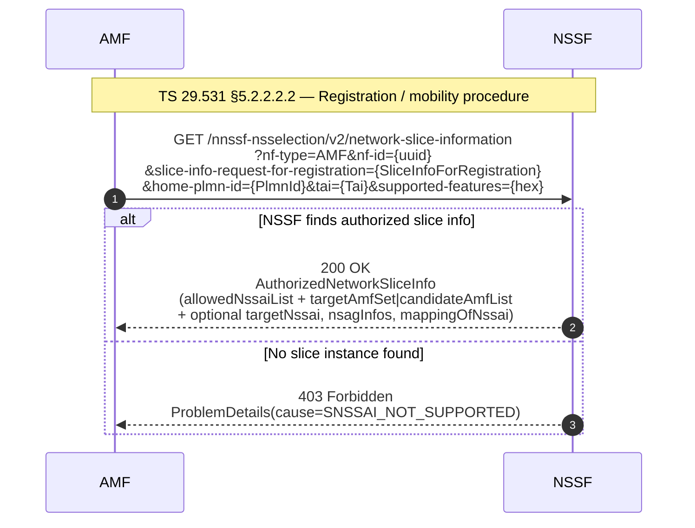
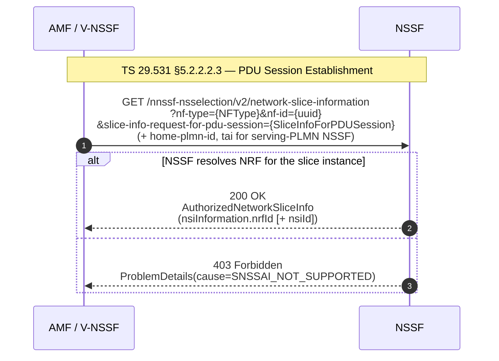
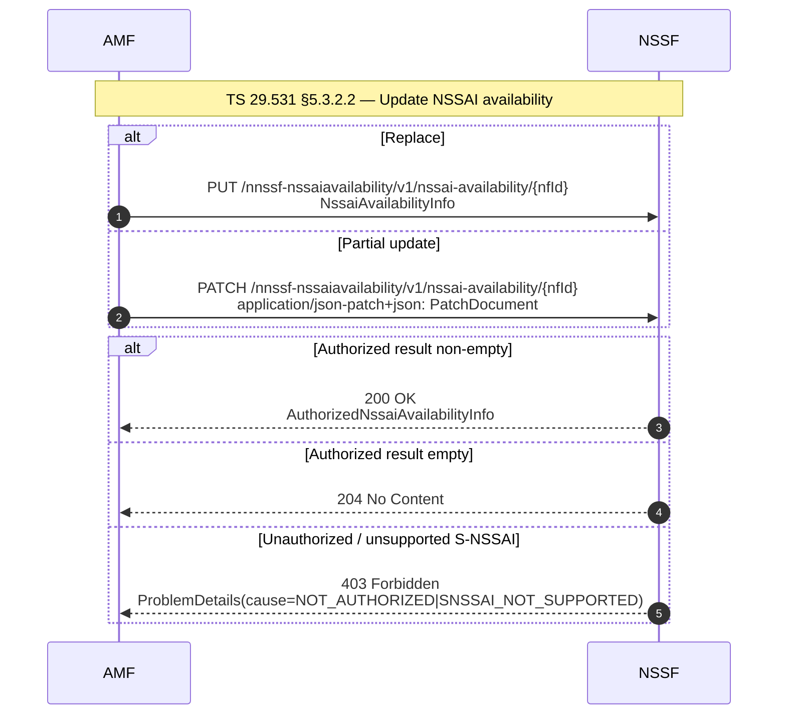
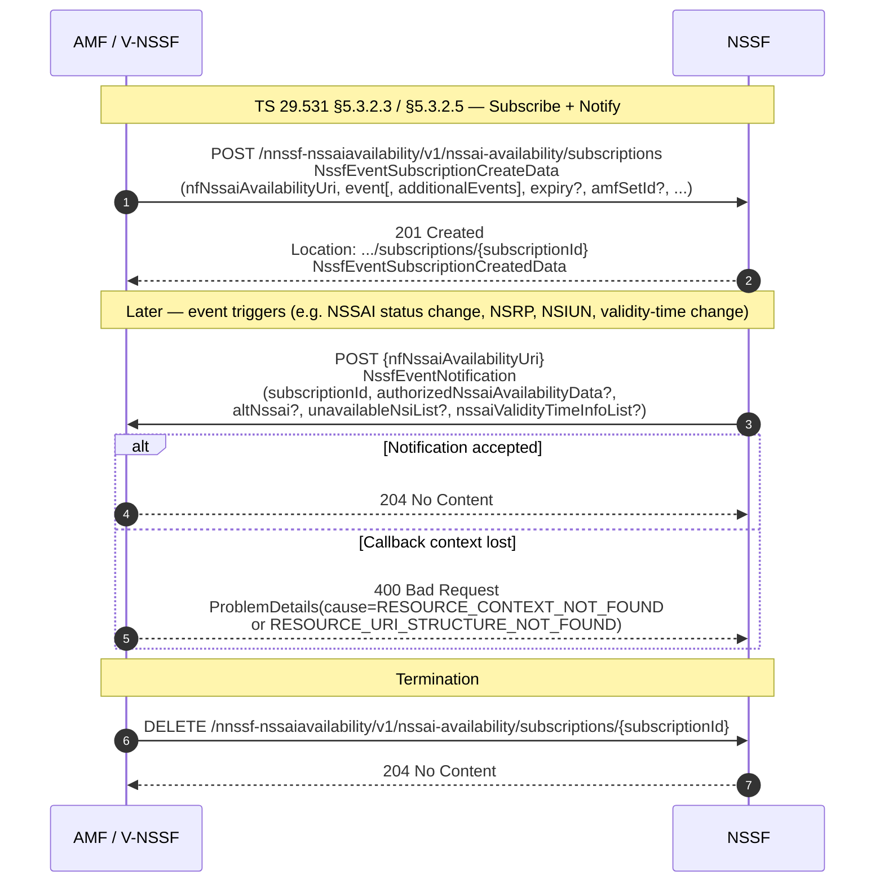

> docx V19.6.0 기준. yaml 별 버전 — `Nnssf_NSSelection` 2.4.0, `Nnssf_NSSAIAvailability` 1.4.0. 자세한 변경점은 §Version History.


# TS 29.531 — Network Slice Selection Services (NSSF)

## Summary

NSSF (Network Slice Selection Function) 는 5GC 안에서 *AMF, SMF, NWDAF, 그리고 다른 PLMN 의 NSSF* 에게 슬라이스 관련 서비스를 제공하는 NF 다. 본 spec (3GPP TS 29.531) 은 NSSF 의 stage 3 — 즉 SBI (Service Based Interface) 위에서 동작하는 두 서비스의 프로토콜·자료형·에러 처리를 정의한다.

> *§4.1 — "Within the 5GC, the NSSF offers services to the AMF, SMF, NWDAF and NSSF in a different PLMN via the Nnssf service based interface (see 3GPP TS 23.501 [2] and 3GPP TS 23.502 [3])."*

본 spec 이 정의하는 두 서비스는 다음과 같다.

- **Nnssf_NSSelection** (api `nnssf-nsselection`, v2). NF 서비스 소비자 (e.g. AMF, V-NSSF, SMF+PGW-C, NWDAF) 가 *허가된 슬라이스 선택 정보* (Allowed NSSAI, Configured NSSAI, target AMF set 또는 candidate AMF list, NRF ID, NSI ID, target NSSAI, NSAG 정보, VPLMN-HPLMN S-NSSAI 매핑 등) 를 조회하기 위해 호출한다. 5G 시스템의 *Registration / AMF re-allocation / EPS↔5GS handover / UE Configuration Update / SMF 선택 / PDU Session Establishment / PDN Connection Establishment / NWDAF 슬라이스 부하 분석* 절차에서 트리거된다.
- **Nnssf_NSSAIAvailability** (api `nnssf-nssaiavailability`, v1). NF 소비자 (주로 AMF) 가 *TA 단위로 자신이 지원하는 S-NSSAI 집합* 을 NSSF 에 등록·갱신·삭제하고, 가용성 변경·Network Slice Replacement·Network Slice Instance Replacement·NSSAI 유효시간 변경 알림을 *구독·통지* 받는다. 본 서비스의 callback (notification) 은 NSSF → NF 소비자 방향의 POST 다.

stage 2 아키텍처·절차의 진실 출처는 TS 23.501·TS 23.502 다. 보안 (OAuth 2.0 / TLS) 의 진실 출처는 TS 33.501 인데, 본 KB 의 NSSF 구현 범위에서 33.501 은 `_manifest.yaml` 의 `manual_overrides.exclude` 로 *optional* 처리되어 있으며 본 페이지에서는 32.531 본문이 명시한 한도까지만 다룬다.

## Interface

| 항목 | Nnssf_NSSelection | Nnssf_NSSAIAvailability |
|---|---|---|
| API name | `nnssf-nsselection` | `nnssf-nssaiavailability` |
| API version | `v2` | `v1` |
| Base URL | `{apiRoot}/nnssf-nsselection/v2` | `{apiRoot}/nnssf-nssaiavailability/v1` |
| Resource URI 구조 | `{apiRoot}/<apiName>/<apiVersion>/<apiSpecificResourceUriPart>` (TS 29.501 §4.4.1) | 동일 |
| OpenAPI 파일 | `TS29531_Nnssf_NSSelection.yaml` | `TS29531_Nnssf_NSSAIAvailability.yaml` |

**Transport** — HTTP/2 (IETF RFC 9113 [10]) 위에서 SBI 운반 규칙은 TS 29.500 §5 가 정의한다.

**Content type**
- `application/json` (IETF RFC 8259 [14]) — 일반 본문.
- `application/problem+json` (IETF RFC 9457 [15]) — ProblemDetails 응답.
- `application/json-patch+json` (IETF RFC 6902 [8]) — NSSAIAvailability 의 PATCH 본문 한정.

**Compression** — NSSAIAvailability 는 gzip (IETF RFC 1952 [16]) 을 권장. `Accept-Encoding` 헤더로 지시 (TS 29.500 §6.9).

**3gpp-Sbi-* custom headers** — 본 spec 자체는 NSSF-고유 custom 헤더를 정의하지 않는다 (§6.1.2.3.1, §6.2.2.3.1). 다만 SBA 공통 헤더는 그대로 사용한다.
- `3gpp-Sbi-Producer-Id` — SCP 가 NSSF 인스턴스를 재선택했을 때 새 producer 의 NF Instance ID 를 응답에 실어 보낸다 (TS 29.500 §6.10.3.4).
- `3gpp-Sbi-Target-Nf-Id` — 307/308 redirect 시 새 NSSF 의 ID 를 응답 헤더로 전달 (TS 29.500 §6.10.9.1).
- HTTP 표준 헤더 `Content-Encoding`, `Accept-Encoding`, `Location` (POST subscribe 응답에서 새로 만든 subscription 의 URI 를 가리킴).

**Security** — OAuth 2.0 *Client Credentials* grant (IETF RFC 6749 [12]) 가 *허용* 된다. 인가 서버 역할은 NRF (TS 29.510 [13]) 가 수행하며, NF 소비자는 서비스 호출 전에 NRF 의 Access Token Request 서비스 (TS 29.510 §5.4.2.2) 로 token 을 받는다. 본 spec 자체는 OAuth2 scope 를 정의하지 않는다 (§6.1.9, §6.2.9). 두 yaml 의 `security` 절은 각각 `nnssf-nsselection` / `nnssf-nssaiavailability` scope 를 노출하지만 본문 §6.x.9 는 "does not define any scopes" 로 명시한다 — yaml 의 scope 명은 NRF 토큰 발급용 기본 식별자로만 의미가 있다. **TS 33.501 (5GC 보안) 연동은 본 KB 의 NSSF 구현 범위에서 manifest `manual_overrides.exclude` 로 optional 처리되어, 본 페이지는 명시된 OAuth2/TLS 호출 흐름까지만 다룬다.**

**HTTP redirection** — 두 서비스 모두 `307 Temporary Redirect` / `308 Permanent Redirect` 를 NSSF set 안의 다른 인스턴스로 재라우팅하는 데 사용. 본 spec 의 `ES3XX` 기능 (Mandatory) 이 이를 강제한다.

## API

| operationId | method | path | request body type | response body type | error responses |
|---|---|---|---|---|---|
| `NSSelectionGet` | GET | `/network-slice-information` | (none — query parameters only; `slice-info-request-for-registration` → SliceInfoForRegistration, `slice-info-request-for-pdu-session` → SliceInfoForPDUSession, `slice-info-request-for-ue-cu` → SliceInfoForUEConfigurationUpdate, 그 외 query 는 Snssai/PlmnId/Tai 등) | `200` AuthorizedNetworkSliceInfo | 307, 308, 400, 401, 403, 404, 406, 414, 429, 500, 502, 503, default |
| `NSSAIAvailabilityPut` | PUT | `/nssai-availability/{nfId}` | NssaiAvailabilityInfo | `200` AuthorizedNssaiAvailabilityInfo · `204` (empty) | 307, 308, 400, 401, 403, 404, 411, 413, 415, 429, 500, 502, 503, default |
| `NSSAIAvailabilityPatch` | PATCH | `/nssai-availability/{nfId}` | PatchDocument (`application/json-patch+json`) | `200` AuthorizedNssaiAvailabilityInfo · `204` (empty) | 307, 308, 400, 401, 403, 404, 411, 413, 415, 429, 500, 502, 503, default |
| `NSSAIAvailabilityDelete` | DELETE | `/nssai-availability/{nfId}` | (none) | `204` (no content) | 307, 308, 400, 401, 403, 404, 429, 500, 502, 503, default |
| `NSSAIAvailabilityPost` | POST | `/nssai-availability/subscriptions` | NssfEventSubscriptionCreateData | `201` NssfEventSubscriptionCreatedData (+ `Location` header) | 307, 308, 400, 401, 403, 404, 411, 413, 415, 429, 500, 501, 502, 503, default |
| `NSSAIAvailabilityUnsubscribe` | DELETE | `/nssai-availability/subscriptions/{subscriptionId}` | (none) | `204` | 307, 308, 400, 401, 403, 404, 429, 500, 502, 503, default |
| `NSSAIAvailabilitySubModifyPatch` | PATCH | `/nssai-availability/subscriptions/{subscriptionId}` | PatchDocument (`application/json-patch+json`) | `200` NssfEventSubscriptionCreatedData | 307, 308, 400, 401, 403, 404, 411, 413, 415, 429, 500, 502, 503, default |
| `NSSAIAvailabilityOptions` | OPTIONS | `/nssai-availability` | (none) | `200` (no body, `Accept-Encoding` header) | 307, 308, 400, 401, 403, 404, 405, 429, 500, 501, 502, 503, default |

callback (notification, NSSF → NF consumer) — `POST {nfNssaiAvailabilityUri}`, request body `NssfEventNotification`, success `204 No Content`.

## Data Model

NSSelection 과 NSSAIAvailability 의 두 yaml 에서 *path 의 request body / 성공 응답 body* 의 schema 와, NSSelection 의 query parameter 가 가리키는 stage-3 입력 schema (`SliceInfoFor*`) 를 root 로 잡고, 각 root 를 `scripts/resolve-yaml-refs.py --depth 8 --external-depth 1` 로 끝까지 펼쳤다. 모든 leaf 는 본 KB 에 등록된 spec (29.531, 29.510, 29.571, 29.503) 안에서 해소된다 — `(참조 규격 미등록)` leaf 0 개.

### AuthorizedNetworkSliceInfo (Nnssf_NSSelection 200 응답)

```text
# TS29531_Nnssf_NSSelection.yaml  [TS 29.531]

AuthorizedNetworkSliceInfo
    ├── allowedNssaiList: AllowedNssai[]
    │   ├── allowedSnssaiList: AllowedSnssai[] *required
    │   │   ├── allowedSnssai: Snssai  [TS 29.571] *required
    │   │   │   ├── sst: integer *required
    │   │   │   └── sd: string, pattern='^[A-Fa-f0-9]{6}$'
    │   │   ├── nsiInformationList: NsiInformation[]
    │   │   │   ├── nrfId: Uri  [TS 29.571] *required: string
    │   │   │   ├── nsiId: NsiId: string
    │   │   │   ├── nrfNfMgtUri: Uri  [TS 29.571]: string
    │   │   │   ├── nrfAccessTokenUri: Uri  [TS 29.571]: string
    │   │   │   └── nrfOauth2Required: map<key, boolean>
    │   │   └── mappedHomeSnssai: Snssai  [TS 29.571]
    │   │       ├── sst: integer *required
    │   │       └── sd: string, pattern='^[A-Fa-f0-9]{6}$'
    │   └── accessType: AccessType  [TS 29.571] *required: string, enum=[3GPP_ACCESS | NON_3GPP_ACCESS]
    ├── configuredNssai: ConfiguredSnssai[]
    │   ├── configuredSnssai: Snssai  [TS 29.571] *required
    │   │   ├── sst: integer *required
    │   │   └── sd: string, pattern='^[A-Fa-f0-9]{6}$'
    │   └── mappedHomeSnssai: Snssai  [TS 29.571]
    │       ├── sst: integer *required
    │       └── sd: string, pattern='^[A-Fa-f0-9]{6}$'
    ├── targetAmfSet: string, pattern='^[0-9]{3}-[0-9]{2,3}-[A-Fa-f0-9]{2}-[0-3][A-Fa-f0-9]{2}$'
    ├── candidateAmfList: NfInstanceId[]  [TS 29.571]: string, format=uuid
    ├── rejectedNssaiInPlmn: Snssai[]  [TS 29.571]
    │   ├── sst: integer *required
    │   └── sd: string, pattern='^[A-Fa-f0-9]{6}$'
    ├── rejectedNssaiInTa: Snssai[]  [TS 29.571]
    │   ├── sst: integer *required
    │   └── sd: string, pattern='^[A-Fa-f0-9]{6}$'
    ├── nsiInformation: NsiInformation
    │   ├── nrfId: Uri  [TS 29.571] *required: string
    │   ├── nsiId: NsiId: string
    │   ├── nrfNfMgtUri: Uri  [TS 29.571]: string
    │   ├── nrfAccessTokenUri: Uri  [TS 29.571]: string
    │   └── nrfOauth2Required: map<key, boolean>
    ├── supportedFeatures: SupportedFeatures  [TS 29.571]: string, pattern='^[A-Fa-f0-9]*$'
    ├── nrfAmfSet: Uri  [TS 29.571]: string
    ├── nrfAmfSetNfMgtUri: Uri  [TS 29.571]: string
    ├── nrfAmfSetAccessTokenUri: Uri  [TS 29.571]: string
    ├── nrfOauth2Required: map<key, boolean>
    ├── targetAmfServiceSet: NfServiceSetId  [TS 29.571]: string
    ├── targetNssai: Snssai[]  [TS 29.571]
    │   ├── sst: integer *required
    │   └── sd: string, pattern='^[A-Fa-f0-9]{6}$'
    ├── nsagInfos: NsagInfo[]
    │   ├── nsagIds: NsagId[]  [TS 29.571] *required: integer
    │   ├── snssaiList: Snssai[]  [TS 29.571] *required
    │   │   ├── sst: integer *required
    │   │   └── sd: string, pattern='^[A-Fa-f0-9]{6}$'
    │   ├── taiList: Tai[]  [TS 29.571]
    │   │   ├── plmnId: PlmnId *required
    │   │   │   └── […]
    │   │   ├── tac: Tac *required: string, pattern='(^[A-Fa-f0-9]{4}$)|(^[A-Fa-f0-9]{6}$)'
    │   │   │   └── […]
    │   │   └── nid: Nid: string, pattern='^[A-Fa-f0-9]{11}$'
    │   │       └── […]
    │   └── taiRangeList: TaiRange[]  [TS 29.510]
    │       ├── plmnId: PlmnId  [TS 29.571] *required
    │       │   └── […]
    │       ├── tacRangeList: TacRange[] *required
    │       │   └── […]
    │       └── nid: Nid  [TS 29.571]: string, pattern='^[A-Fa-f0-9]{11}$'
    │           └── […]
    ├── mappingOfNssai: MappingOfSnssai[]
    │   ├── servingSnssai: Snssai  [TS 29.571] *required
    │   │   ├── sst: integer *required
    │   │   └── sd: string, pattern='^[A-Fa-f0-9]{6}$'
    │   └── homeSnssai: Snssai  [TS 29.571] *required
    │       ├── sst: integer *required
    │       └── sd: string, pattern='^[A-Fa-f0-9]{6}$'
    └── snssaiInfoRspData: map<key, SnssaiInfo>
```

### SliceInfoForRegistration (Nnssf_NSSelection query)

```text
# TS29531_Nnssf_NSSelection.yaml  [TS 29.531]

SliceInfoForRegistration
    ├── subscribedNssai: SubscribedSnssai[]
    │   ├── subscribedSnssai: Snssai  [TS 29.571] *required
    │   │   ├── sst: integer *required
    │   │   └── sd: string, pattern='^[A-Fa-f0-9]{6}$'
    │   ├── defaultIndication: boolean
    │   └── subscribedNsSrgList: NsSrg[]  [TS 29.571]: string
    ├── allowedNssaiCurrentAccess: AllowedNssai
    │   ├── allowedSnssaiList: AllowedSnssai[] *required
    │   │   ├── allowedSnssai: Snssai  [TS 29.571] *required
    │   │   │   ├── sst: integer *required
    │   │   │   └── sd: string, pattern='^[A-Fa-f0-9]{6}$'
    │   │   ├── nsiInformationList: NsiInformation[]
    │   │   │   ├── nrfId: Uri  [TS 29.571] *required: string
    │   │   │   ├── nsiId: NsiId: string
    │   │   │   ├── nrfNfMgtUri: Uri  [TS 29.571]: string
    │   │   │   ├── nrfAccessTokenUri: Uri  [TS 29.571]: string
    │   │   │   └── nrfOauth2Required: map<key, boolean>
    │   │   └── mappedHomeSnssai: Snssai  [TS 29.571]
    │   │       ├── sst: integer *required
    │   │       └── sd: string, pattern='^[A-Fa-f0-9]{6}$'
    │   └── accessType: AccessType  [TS 29.571] *required: string, enum=[3GPP_ACCESS | NON_3GPP_ACCESS]
    ├── allowedNssaiOtherAccess: AllowedNssai
    │   ├── allowedSnssaiList: AllowedSnssai[] *required
    │   │   ├── allowedSnssai: Snssai  [TS 29.571] *required
    │   │   │   ├── sst: integer *required
    │   │   │   └── sd: string, pattern='^[A-Fa-f0-9]{6}$'
    │   │   ├── nsiInformationList: NsiInformation[]
    │   │   │   ├── nrfId: Uri  [TS 29.571] *required: string
    │   │   │   ├── nsiId: NsiId: string
    │   │   │   ├── nrfNfMgtUri: Uri  [TS 29.571]: string
    │   │   │   ├── nrfAccessTokenUri: Uri  [TS 29.571]: string
    │   │   │   └── nrfOauth2Required: map<key, boolean>
    │   │   └── mappedHomeSnssai: Snssai  [TS 29.571]
    │   │       ├── sst: integer *required
    │   │       └── sd: string, pattern='^[A-Fa-f0-9]{6}$'
    │   └── accessType: AccessType  [TS 29.571] *required: string, enum=[3GPP_ACCESS | NON_3GPP_ACCESS]
    ├── sNssaiForMapping: Snssai[]  [TS 29.571]
    │   ├── sst: integer *required
    │   └── sd: string, pattern='^[A-Fa-f0-9]{6}$'
    ├── requestedNssai: Snssai[]  [TS 29.571]
    │   ├── sst: integer *required
    │   └── sd: string, pattern='^[A-Fa-f0-9]{6}$'
    ├── defaultConfiguredSnssaiInd: boolean
    ├── mappingOfNssai: MappingOfSnssai[]
    │   ├── servingSnssai: Snssai  [TS 29.571] *required
    │   │   ├── sst: integer *required
    │   │   └── sd: string, pattern='^[A-Fa-f0-9]{6}$'
    │   └── homeSnssai: Snssai  [TS 29.571] *required
    │       ├── sst: integer *required
    │       └── sd: string, pattern='^[A-Fa-f0-9]{6}$'
    ├── requestMapping: boolean
    ├── ueSupNssrgInd: boolean
    ├── suppressNssrgInd: boolean
    └── nsagSupported: boolean
```

### SliceInfoForPDUSession (Nnssf_NSSelection query)

```text
# TS29531_Nnssf_NSSelection.yaml  [TS 29.531]

SliceInfoForPDUSession
    ├── sNssai: Snssai  [TS 29.571] *required
    │   ├── sst: integer *required
    │   └── sd: string, pattern='^[A-Fa-f0-9]{6}$'
    ├── roamingIndication: RoamingIndication *required: string, enum=[NON_ROAMING | LOCAL_BREAKOUT | HOME_ROUTED_ROAMING] (extensible)
    └── homeSnssai: Snssai  [TS 29.571]
        ├── sst: integer *required
        └── sd: string, pattern='^[A-Fa-f0-9]{6}$'
```

### SliceInfoForUEConfigurationUpdate (Nnssf_NSSelection query)

```text
# TS29531_Nnssf_NSSelection.yaml  [TS 29.531]

SliceInfoForUEConfigurationUpdate
    ├── subscribedNssai: SubscribedSnssai[]
    │   ├── subscribedSnssai: Snssai  [TS 29.571] *required
    │   │   ├── sst: integer *required
    │   │   └── sd: string, pattern='^[A-Fa-f0-9]{6}$'
    │   ├── defaultIndication: boolean
    │   └── subscribedNsSrgList: NsSrg[]  [TS 29.571]: string
    ├── allowedNssaiCurrentAccess: AllowedNssai
    │   ├── allowedSnssaiList: AllowedSnssai[] *required
    │   │   ├── allowedSnssai: Snssai  [TS 29.571] *required
    │   │   │   ├── sst: integer *required
    │   │   │   └── sd: string, pattern='^[A-Fa-f0-9]{6}$'
    │   │   ├── nsiInformationList: NsiInformation[]
    │   │   │   ├── nrfId: Uri  [TS 29.571] *required: string
    │   │   │   ├── nsiId: NsiId: string
    │   │   │   ├── nrfNfMgtUri: Uri  [TS 29.571]: string
    │   │   │   ├── nrfAccessTokenUri: Uri  [TS 29.571]: string
    │   │   │   └── nrfOauth2Required: map<key, boolean>
    │   │   └── mappedHomeSnssai: Snssai  [TS 29.571]
    │   │       ├── sst: integer *required
    │   │       └── sd: string, pattern='^[A-Fa-f0-9]{6}$'
    │   └── accessType: AccessType  [TS 29.571] *required: string, enum=[3GPP_ACCESS | NON_3GPP_ACCESS]
    ├── allowedNssaiOtherAccess: AllowedNssai
    │   ├── allowedSnssaiList: AllowedSnssai[] *required
    │   │   ├── allowedSnssai: Snssai  [TS 29.571] *required
    │   │   │   ├── sst: integer *required
    │   │   │   └── sd: string, pattern='^[A-Fa-f0-9]{6}$'
    │   │   ├── nsiInformationList: NsiInformation[]
    │   │   │   ├── nrfId: Uri  [TS 29.571] *required: string
    │   │   │   ├── nsiId: NsiId: string
    │   │   │   ├── nrfNfMgtUri: Uri  [TS 29.571]: string
    │   │   │   ├── nrfAccessTokenUri: Uri  [TS 29.571]: string
    │   │   │   └── nrfOauth2Required: map<key, boolean>
    │   │   └── mappedHomeSnssai: Snssai  [TS 29.571]
    │   │       ├── sst: integer *required
    │   │       └── sd: string, pattern='^[A-Fa-f0-9]{6}$'
    │   └── accessType: AccessType  [TS 29.571] *required: string, enum=[3GPP_ACCESS | NON_3GPP_ACCESS]
    ├── defaultConfiguredSnssaiInd: boolean
    ├── requestedNssai: Snssai[]  [TS 29.571]
    │   ├── sst: integer *required
    │   └── sd: string, pattern='^[A-Fa-f0-9]{6}$'
    ├── mappingOfNssai: MappingOfSnssai[]
    │   ├── servingSnssai: Snssai  [TS 29.571] *required
    │   │   ├── sst: integer *required
    │   │   └── sd: string, pattern='^[A-Fa-f0-9]{6}$'
    │   └── homeSnssai: Snssai  [TS 29.571] *required
    │       ├── sst: integer *required
    │       └── sd: string, pattern='^[A-Fa-f0-9]{6}$'
    ├── ueSupNssrgInd: boolean
    ├── suppressNssrgInd: boolean
    ├── rejectedNssaiRa: Snssai[]  [TS 29.571]
    │   ├── sst: integer *required
    │   └── sd: string, pattern='^[A-Fa-f0-9]{6}$'
    └── nsagSupported: boolean
```

### NssaiAvailabilityInfo (Nnssf_NSSAIAvailability PUT request)

```text
# TS29531_Nnssf_NSSAIAvailability.yaml  [TS 29.531]

NssaiAvailabilityInfo
    ├── supportedNssaiAvailabilityData: SupportedNssaiAvailabilityData[] *required
    │   ├── tai: Tai  [TS 29.571] *required
    │   │   ├── plmnId: PlmnId *required
    │   │   │   └── […]
    │   │   ├── tac: Tac *required: string, pattern='(^[A-Fa-f0-9]{4}$)|(^[A-Fa-f0-9]{6}$)'
    │   │   │   └── […]
    │   │   └── nid: Nid: string, pattern='^[A-Fa-f0-9]{11}$'
    │   │       └── […]
    │   ├── supportedSnssaiList: ExtSnssai[]  [TS 29.571] *required: ?
    │   │   └── (allOf) Snssai  [TS 29.571]
    │   │       └── […]
    │   │   └── (allOf) SnssaiExtension  [TS 29.571]
    │   │       └── […]
    │   ├── taiList: Tai[]  [TS 29.571]
    │   │   ├── plmnId: PlmnId *required
    │   │   │   └── […]
    │   │   ├── tac: Tac *required: string, pattern='(^[A-Fa-f0-9]{4}$)|(^[A-Fa-f0-9]{6}$)'
    │   │   │   └── […]
    │   │   └── nid: Nid: string, pattern='^[A-Fa-f0-9]{11}$'
    │   │       └── […]
    │   ├── taiRangeList: TaiRange[]  [TS 29.510]
    │   │   ├── plmnId: PlmnId  [TS 29.571] *required
    │   │   │   └── […]
    │   │   ├── tacRangeList: TacRange[] *required
    │   │   │   └── […]
    │   │   └── nid: Nid  [TS 29.571]: string, pattern='^[A-Fa-f0-9]{11}$'
    │   │       └── […]
    │   └── nsagInfos: NsagInfo[]
    │       ├── nsagIds: NsagId[]  [TS 29.571] *required: integer
    │       │   └── […]
    │       ├── snssaiList: Snssai[]  [TS 29.571] *required
    │       │   └── […]
    │       ├── taiList: Tai[]  [TS 29.571]
    │       │   └── […]
    │       └── taiRangeList: TaiRange[]  [TS 29.510]
    │           └── […]
    ├── supportedFeatures: SupportedFeatures  [TS 29.571]: string, pattern='^[A-Fa-f0-9]*$'
    └── amfSetId: string, pattern='^[0-9]{3}-[0-9]{2,3}-[A-Fa-f0-9]{2}-[0-3][A-Fa-f0-9]{2}$'
```

### AuthorizedNssaiAvailabilityInfo (Nnssf_NSSAIAvailability PUT/PATCH 200 응답)

```text
# TS29531_Nnssf_NSSAIAvailability.yaml  [TS 29.531]

AuthorizedNssaiAvailabilityInfo
    ├── authorizedNssaiAvailabilityData: AuthorizedNssaiAvailabilityData[] *required
    │   ├── tai: Tai  [TS 29.571] *required
    │   │   ├── plmnId: PlmnId *required
    │   │   │   └── […]
    │   │   ├── tac: Tac *required: string, pattern='(^[A-Fa-f0-9]{4}$)|(^[A-Fa-f0-9]{6}$)'
    │   │   │   └── […]
    │   │   └── nid: Nid: string, pattern='^[A-Fa-f0-9]{11}$'
    │   │       └── […]
    │   ├── supportedSnssaiList: ExtSnssai[]  [TS 29.571] *required: ?
    │   │   └── (allOf) Snssai  [TS 29.571]
    │   │       └── […]
    │   │   └── (allOf) SnssaiExtension  [TS 29.571]
    │   │       └── […]
    │   ├── restrictedSnssaiList: RestrictedSnssai[]
    │   │   ├── homePlmnId: PlmnId  [TS 29.571] *required
    │   │   │   ├── mcc: Mcc *required: string, pattern='^\d{3}$'
    │   │   │   │   └── […]
    │   │   │   └── mnc: Mnc *required: string, pattern='^\d{2,3}$'
    │   │   │       └── […]
    │   │   ├── sNssaiList: ExtSnssai[]  [TS 29.571] *required: ?
    │   │   │   └── (allOf) Snssai  [TS 29.571]
    │   │   │       └── […]
    │   │   │   └── (allOf) SnssaiExtension  [TS 29.571]
    │   │   │       └── […]
    │   │   ├── homePlmnIdList: PlmnId[]  [TS 29.571]
    │   │   │   ├── mcc: Mcc *required: string, pattern='^\d{3}$'
    │   │   │   │   └── […]
    │   │   │   └── mnc: Mnc *required: string, pattern='^\d{2,3}$'
    │   │   │       └── […]
    │   │   └── roamingRestriction: boolean
    │   ├── taiList: Tai[]  [TS 29.571]
    │   │   ├── plmnId: PlmnId *required
    │   │   │   └── […]
    │   │   ├── tac: Tac *required: string, pattern='(^[A-Fa-f0-9]{4}$)|(^[A-Fa-f0-9]{6}$)'
    │   │   │   └── […]
    │   │   └── nid: Nid: string, pattern='^[A-Fa-f0-9]{11}$'
    │   │       └── […]
    │   ├── taiRangeList: TaiRange[]  [TS 29.510]
    │   │   ├── plmnId: PlmnId  [TS 29.571] *required
    │   │   │   └── […]
    │   │   ├── tacRangeList: TacRange[] *required
    │   │   │   └── […]
    │   │   └── nid: Nid  [TS 29.571]: string, pattern='^[A-Fa-f0-9]{11}$'
    │   │       └── […]
    │   └── nsagInfos: NsagInfo[]
    │       ├── nsagIds: NsagId[]  [TS 29.571] *required: integer
    │       │   └── […]
    │       ├── snssaiList: Snssai[]  [TS 29.571] *required
    │       │   └── […]
    │       ├── taiList: Tai[]  [TS 29.571]
    │       │   └── […]
    │       └── taiRangeList: TaiRange[]  [TS 29.510]
    │           └── […]
    └── supportedFeatures: SupportedFeatures  [TS 29.571]: string, pattern='^[A-Fa-f0-9]*$'
```

### PatchDocument (Nnssf_NSSAIAvailability PATCH request)

```text
# TS29531_Nnssf_NSSAIAvailability.yaml  [TS 29.531]

PatchDocument: PatchItem[]
```

JSON Patch (IETF RFC 6902 [8]) 의 patch operation 배열. 각 `PatchItem` 의 구조는 TS 29.571 의 `PatchItem` 정의에 따른다 (`op`, `path`, `value`, `from`).

### NssfEventSubscriptionCreateData (subscriptions POST request)

```text
# TS29531_Nnssf_NSSAIAvailability.yaml  [TS 29.531]

NssfEventSubscriptionCreateData
    ├── nfNssaiAvailabilityUri: Uri  [TS 29.571] *required: string
    ├── taiList: Tai[]  [TS 29.571]
    │   ├── plmnId: PlmnId *required
    │   │   └── […]
    │   ├── tac: Tac *required: string, pattern='(^[A-Fa-f0-9]{4}$)|(^[A-Fa-f0-9]{6}$)'
    │   │   └── […]
    │   └── nid: Nid: string, pattern='^[A-Fa-f0-9]{11}$'
    │       └── […]
    ├── event: NssfEventType *required: string, enum=[SNSSAI_STATUS_CHANGE_REPORT | SNSSAI_REPLACEMENT_REPORT | NSI_UNAVAILABILITY_REPORT | SNSSAI_VALIDITY_TIME_REPORT] (extensible)
    ├── additionalEvents: NssfEventType[]: string, enum=[SNSSAI_STATUS_CHANGE_REPORT | SNSSAI_REPLACEMENT_REPORT | NSI_UNAVAILABILITY_REPORT | SNSSAI_VALIDITY_TIME_REPORT] (extensible)
    ├── expiry: DateTime  [TS 29.571]: string, format=date-time
    ├── amfSetId: string, pattern='^[0-9]{3}-[0-9]{2,3}-[A-Fa-f0-9]{2}-[0-3][A-Fa-f0-9]{2}$'
    ├── taiRangeList: TaiRange[]  [TS 29.510]
    │   ├── plmnId: PlmnId  [TS 29.571] *required
    │   │   └── […]
    │   ├── tacRangeList: TacRange[] *required
    │   │   └── […]
    │   └── nid: Nid  [TS 29.571]: string, pattern='^[A-Fa-f0-9]{11}$'
    │       └── […]
    ├── amfId: NfInstanceId  [TS 29.571]: string, format=uuid
    ├── supportedFeatures: SupportedFeatures  [TS 29.571]: string, pattern='^[A-Fa-f0-9]*$'
    ├── allAmfSetTaiInd: boolean
    ├── nsrpSubscribeInfo: SnssaiReplacementSubscribeInfo
    │   ├── snssaiToSubscribe: Snssai[]  [TS 29.571] *required
    │   │   ├── sst: integer *required
    │   │   └── sd: string, pattern='^[A-Fa-f0-9]{6}$'
    │   ├── nfType: NFType  [TS 29.510] *required: string, enum=[NRF | UDM | AMF | SMF | AUSF | NEF | PCF | SMSF | NSSF | UDR | LMF | GMLC | 5G_EIR | SEPP | UPF | N3IWF | AF | UDSF | BSF | CHF | NWDAF | PCSCF | CBCF | HSS | UCMF | SOR_AF | SPAF | MME | SCSAS | SCEF | SCP | NSSAAF | ICSCF | SCSCF | DRA | IMS_AS | AANF | 5G_DDNMF | NSACF | MFAF | EASDF | DCCF | MB_SMF | TSCTSF | ADRF | GBA_BSF | CEF | MB_UPF | NSWOF | PKMF | MNPF | SMS_GMSC | SMS_IWMSC | MBSF | MBSTF | PANF | IP_SM_GW | SMS_ROUTER | DCSF | MRF | MRFP | MF | SLPKMF | RH | EIF | AIOTF | ADM] (extensible)
    │   ├── nfId: NfInstanceId  [TS 29.571] *required: string, format=uuid
    │   └── plmnId: PlmnId  [TS 29.571]
    │       ├── mcc: Mcc *required: string, pattern='^\d{3}$'
    │       │   └── […]
    │       └── mnc: Mnc *required: string, pattern='^\d{2,3}$'
    │           └── […]
    ├── nsiunSubscribeInfo: NsiUnavailabilitySubscribeInfo
    │   ├── nsiToSubscribe: NsiId[]: string
    │   └── snssaiToSubscribe: Snssai[]  [TS 29.571]
    │       ├── sst: integer *required
    │       └── sd: string, pattern='^[A-Fa-f0-9]{6}$'
    └── validityTimeSubList: Snssai[]  [TS 29.571]
        ├── sst: integer *required
        └── sd: string, pattern='^[A-Fa-f0-9]{6}$'
```

### NssfEventSubscriptionCreatedData (subscriptions POST 201 응답 / PATCH 200 응답)

```text
# TS29531_Nnssf_NSSAIAvailability.yaml  [TS 29.531]

NssfEventSubscriptionCreatedData
    ├── subscriptionId: string *required
    ├── expiry: DateTime  [TS 29.571]: string, format=date-time
    ├── authorizedNssaiAvailabilityData: AuthorizedNssaiAvailabilityData[]
    │   ├── tai: Tai  [TS 29.571] *required
    │   │   ├── plmnId: PlmnId *required
    │   │   │   └── […]
    │   │   ├── tac: Tac *required: string, pattern='(^[A-Fa-f0-9]{4}$)|(^[A-Fa-f0-9]{6}$)'
    │   │   │   └── […]
    │   │   └── nid: Nid: string, pattern='^[A-Fa-f0-9]{11}$'
    │   │       └── […]
    │   ├── supportedSnssaiList: ExtSnssai[]  [TS 29.571] *required: ?
    │   │   └── (allOf) Snssai  [TS 29.571]
    │   │       └── […]
    │   │   └── (allOf) SnssaiExtension  [TS 29.571]
    │   │       └── […]
    │   ├── restrictedSnssaiList: RestrictedSnssai[]
    │   │   ├── homePlmnId: PlmnId  [TS 29.571] *required
    │   │   │   ├── mcc: Mcc *required: string, pattern='^\d{3}$'
    │   │   │   │   └── […]
    │   │   │   └── mnc: Mnc *required: string, pattern='^\d{2,3}$'
    │   │   │       └── […]
    │   │   ├── sNssaiList: ExtSnssai[]  [TS 29.571] *required: ?
    │   │   │   └── (allOf) Snssai  [TS 29.571]
    │   │   │       └── […]
    │   │   │   └── (allOf) SnssaiExtension  [TS 29.571]
    │   │   │       └── […]
    │   │   ├── homePlmnIdList: PlmnId[]  [TS 29.571]
    │   │   │   ├── mcc: Mcc *required: string, pattern='^\d{3}$'
    │   │   │   │   └── […]
    │   │   │   └── mnc: Mnc *required: string, pattern='^\d{2,3}$'
    │   │   │       └── […]
    │   │   └── roamingRestriction: boolean
    │   ├── taiList: Tai[]  [TS 29.571]
    │   │   ├── plmnId: PlmnId *required
    │   │   │   └── […]
    │   │   ├── tac: Tac *required: string, pattern='(^[A-Fa-f0-9]{4}$)|(^[A-Fa-f0-9]{6}$)'
    │   │   │   └── […]
    │   │   └── nid: Nid: string, pattern='^[A-Fa-f0-9]{11}$'
    │   │       └── […]
    │   ├── taiRangeList: TaiRange[]  [TS 29.510]
    │   │   ├── plmnId: PlmnId  [TS 29.571] *required
    │   │   │   └── […]
    │   │   ├── tacRangeList: TacRange[] *required
    │   │   │   └── […]
    │   │   └── nid: Nid  [TS 29.571]: string, pattern='^[A-Fa-f0-9]{11}$'
    │   │       └── […]
    │   └── nsagInfos: NsagInfo[]
    │       ├── nsagIds: NsagId[]  [TS 29.571] *required: integer
    │       │   └── […]
    │       ├── snssaiList: Snssai[]  [TS 29.571] *required
    │       │   └── […]
    │       ├── taiList: Tai[]  [TS 29.571]
    │       │   └── […]
    │       └── taiRangeList: TaiRange[]  [TS 29.510]
    │           └── […]
    ├── supportedFeatures: SupportedFeatures  [TS 29.571]: string, pattern='^[A-Fa-f0-9]*$'
    └── acceptedEvents: NssfEventType[]: string, enum=[SNSSAI_STATUS_CHANGE_REPORT | SNSSAI_REPLACEMENT_REPORT | NSI_UNAVAILABILITY_REPORT | SNSSAI_VALIDITY_TIME_REPORT] (extensible)
```

### NssfEventNotification (callback POST request)

```text
# TS29531_Nnssf_NSSAIAvailability.yaml  [TS 29.531]

NssfEventNotification
    ├── subscriptionId: string *required
    ├── authorizedNssaiAvailabilityData: AuthorizedNssaiAvailabilityData[]
    │   ├── tai: Tai  [TS 29.571] *required
    │   │   ├── plmnId: PlmnId *required
    │   │   │   └── […]
    │   │   ├── tac: Tac *required: string, pattern='(^[A-Fa-f0-9]{4}$)|(^[A-Fa-f0-9]{6}$)'
    │   │   │   └── […]
    │   │   └── nid: Nid: string, pattern='^[A-Fa-f0-9]{11}$'
    │   │       └── […]
    │   ├── supportedSnssaiList: ExtSnssai[]  [TS 29.571] *required: ?
    │   │   └── (allOf) Snssai  [TS 29.571]
    │   │       └── […]
    │   │   └── (allOf) SnssaiExtension  [TS 29.571]
    │   │       └── […]
    │   ├── restrictedSnssaiList: RestrictedSnssai[]
    │   │   ├── homePlmnId: PlmnId  [TS 29.571] *required
    │   │   │   ├── mcc: Mcc *required: string, pattern='^\d{3}$'
    │   │   │   │   └── […]
    │   │   │   └── mnc: Mnc *required: string, pattern='^\d{2,3}$'
    │   │   │       └── […]
    │   │   ├── sNssaiList: ExtSnssai[]  [TS 29.571] *required: ?
    │   │   │   └── (allOf) Snssai  [TS 29.571]
    │   │   │       └── […]
    │   │   │   └── (allOf) SnssaiExtension  [TS 29.571]
    │   │   │       └── […]
    │   │   ├── homePlmnIdList: PlmnId[]  [TS 29.571]
    │   │   │   ├── mcc: Mcc *required: string, pattern='^\d{3}$'
    │   │   │   │   └── […]
    │   │   │   └── mnc: Mnc *required: string, pattern='^\d{2,3}$'
    │   │   │       └── […]
    │   │   └── roamingRestriction: boolean
    │   ├── taiList: Tai[]  [TS 29.571]
    │   │   ├── plmnId: PlmnId *required
    │   │   │   └── […]
    │   │   ├── tac: Tac *required: string, pattern='(^[A-Fa-f0-9]{4}$)|(^[A-Fa-f0-9]{6}$)'
    │   │   │   └── […]
    │   │   └── nid: Nid: string, pattern='^[A-Fa-f0-9]{11}$'
    │   │       └── […]
    │   ├── taiRangeList: TaiRange[]  [TS 29.510]
    │   │   ├── plmnId: PlmnId  [TS 29.571] *required
    │   │   │   └── […]
    │   │   ├── tacRangeList: TacRange[] *required
    │   │   │   └── […]
    │   │   └── nid: Nid  [TS 29.571]: string, pattern='^[A-Fa-f0-9]{11}$'
    │   │       └── […]
    │   └── nsagInfos: NsagInfo[]
    │       ├── nsagIds: NsagId[]  [TS 29.571] *required: integer
    │       │   └── […]
    │       ├── snssaiList: Snssai[]  [TS 29.571] *required
    │       │   └── […]
    │       ├── taiList: Tai[]  [TS 29.571]
    │       │   └── […]
    │       └── taiRangeList: TaiRange[]  [TS 29.510]
    │           └── […]
    ├── altNssai: SnssaiReplaceInfo[]  [TS 29.571]
    │   ├── snssai: Snssai *required
    │   │   └── […]
    │   ├── status: SnssaiStatus: string, enum=[AVAILABLE | UNAVAILABLE] (extensible)
    │   │   └── […]
    │   ├── altSnssai: Snssai
    │   │   └── […]
    │   ├── nsReplTerminInd: TerminationIndication: string, enum=[NEW_UES_TERMINATION | ALL_UES_TERMINATION] (extensible)
    │   │   └── […]
    │   ├── plmnId: PlmnId
    │   │   └── […]
    │   └── mitigationInfo: MitigationInfo
    │       └── […]
    ├── unavailableNsiList: NsiId[]: string
    ├── nssaiValidityTimeInfo: map<key, DateTime>  [TS 29.571]
    └── nssaiValidityTimeInfoList: map<key, RecurTime[]>  [TS 29.503]
```

## Service Scenarios

### Nnssf_NSSelection — Get

본 서비스의 단일 operation 은 `GET /network-slice-information` 이다. docx §5.2.2.2 는 5 개의 사용 시나리오를 명시한다.

1. **Registration / mobility 절차에서 슬라이스 선택 정보 조회** (§5.2.2.2.2). AMF 가 GET 으로 *Allowed NSSAI, Configured NSSAI, target AMF set / candidate AMF list, target AMF Service Set, Target NSSAI* 를 받아 등록·재배치를 수행한다. 호출 컨텍스트는 TS 23.502 §4.2.2.2.2 (Registration), §4.2.2.2.3 (Registration with AMF re-allocation), §4.11.1.2.2 (EPS↔5GS handover via N26), §4.11.1.3.x / §4.23.12 (EPS↔5GS mobility registration), §4.9.1 / §4.23.7 / §4.23.11 (Xn/N2 handover with PLMN change).
2. **PDU Session Establishment 시 슬라이스 선택** (§5.2.2.2.3). AMF (또는 다른 PLMN 의 NSSF) 가 S-NSSAI · roaming indication · HPLMN S-NSSAI 매핑을 query 로 보내고, NSSF 는 NRF URI + 선택적 NSI ID 를 응답. TS 23.502 §4.3.2.2.3.2 / §4.3.2.2.3.3.
3. **UE Configuration Update 시 슬라이스 정보 조회** (§5.2.2.2.4). TS 23.502 §4.2.4.2.
4. **PDN Connection Establishment (EPC interworking) 시 매핑 조회** (§5.2.2.2.5). SMF+PGW-C 가 VPLMN-HPLMN S-NSSAI 매핑을 받는다. `RSIPCE` feature 필요. TS 23.502 §4.11.0a.5.
5. **NWDAF 의 슬라이스 부하 분석 등을 위한 NSI ID 조회** (§5.2.2.2.6). `SIOP` feature 필요. TS 23.288 §6.3.4.

stage 2 절차의 본문 (TS 23.502) 은 `specs/23.502/` 에 등록되어 있으나, NSSF 본 페이지에서는 *호출 진입·결과 메시지* 까지만 다룬다 — Registration 등 23.502 절차의 단계별 상세는 23.502 페이지가 진실 출처다 *(23.502 페이지 미생성 — 추후 architecture/ 카테고리에서 보강)*.





### Nnssf_NSSAIAvailability — Update

AMF 가 자신이 TA 단위로 지원하는 S-NSSAI 집합을 NSSF 에 등록·갱신한다 (§5.3.2.2). PUT 은 *대체 (replace)*, PATCH 는 *부분 수정*. 응답은 NSSF 가 인가한 결과 (`AuthorizedNssaiAvailabilityInfo`). 인가 결과가 비면 `204 No Content`, 비지 않으면 `200 OK`.



### Nnssf_NSSAIAvailability — Subscribe + Notify

NF 소비자 (AMF, V-NSSF) 가 NSSAI 가용성·Slice Replacement·Slice Instance Replacement·NSSAI 유효시간 변경 이벤트를 구독한다 (§5.3.2.3.1). 이벤트 발생 시 NSSF 는 callback URI 로 통지한다 (§5.3.2.5.1). `SUMOD` feature 가 있으면 PATCH 로 구독을 변경할 수 있다 (§5.3.2.3.2). DELETE 로 해지 (§5.3.2.4.1).



## Cross-NF Dependencies

본 항목은 *NSSF 가 다른 NF 와 어떤 SBI 호출을 주고받는지* 를 docx · yaml 에 *명시된 범위만* 정리한다. 본 표는 NSSF docx 단독으로 채워지며 다른 NF 빌드에 의존하지 않는다 — *NSSF 관점에서 완성된 단편*.

| 상대 NF | 방향 | 트리거 | 출처 |
|---|---|---|---|
| AMF | AMF → NSSF | Registration / handover / UE CU 시 NSSelection GET; TA-단위 supported S-NSSAI 등록 NSSAIAvailability PUT/PATCH/DELETE; 가용성 변경 구독 POST /subscriptions | docx §5.2.2.2.2, §5.3.2.2, §5.3.2.3.1 |
| AMF | NSSF → AMF | NSSAI 가용성·NSRP·NSIUN·validity-time 변경 callback (POST `{nfNssaiAvailabilityUri}` → NssfEventNotification) | docx §5.3.2.5.1 |
| SMF / SMF+PGW-C | SMF → NSSF | SMF 선택 (5GC 비/로밍·HR), PDN Connection Establishment (EPC interworking, RSIPCE feature) 시 NSSelection GET | docx §5.2.2.1·§5.2.2.2.3·§5.2.2.2.5 |
| V-NSSF | V-NSSF ↔ NSSF (HPLMN 의 H-NSSF) | 로밍 시 V-NSSF 가 H-NSSF 에 NSSelection GET / 구독 cascade. Network Slice Replacement 도 V-NSSF 가 H-NSSF 의 통지를 받아 AMF 에 cascade | docx §5.2.1·§5.3.1·§5.3.2.5.1 |
| NWDAF | NWDAF → NSSF | 슬라이스 부하 분석 시 NSI ID 조회 NSSelection GET (`SIOP` feature). cross-NF 카테고리 — manifest deps `cross-nf: 23.288 (NWDAF)` | docx §5.2.2.2.6, manifest |
| NRF | NSSF → NRF | OAuth2 token 발급 (Access Token Request, TS 29.510 §5.4.2.2). NSSF 자체가 target AMF set 등을 결정할 때 NRF discovery 사용 가능 | docx §5.2.2.2.2 본문, §6.x.9 |
| NG-RAN | (out of scope) | NSSF 는 NG-RAN 과 직접 SBI 호출 없음 — AMF 가 NGAP REROUTE NAS REQUEST (TS 38.413 §8.6.5) 로 매개. manifest 의 38.413 은 `manual_overrides.exclude` | docx §5.2.2.2.2, manifest |
| 33.501 (security) | optional | OAuth2 / TLS 의 정의 출처. 본 KB 의 NSSF 구현 범위에서는 manifest exclude — 본 페이지는 §6.x.9 명시 한도까지만 다룸 | manifest |

여러 NF 를 가로지르는 *호출 그래프* (mermaid + 절차 매핑) 는 본 섹션의 책임이 아니라 별도 산출물 (`kb/overviews/cross-nf-graph.md` 가칭) 이다. NSSF·AMF·SMF·UDM 등 여러 NF 의 본 섹션이 모인 후 합성된다.

## Configuration

### supportedFeatures — Nnssf_NSSelection (docx Table 6.1.8-1)

| # | Feature | M/O | 설명 |
|---|---|---|---|
| 1 | `ES3XX` | M | Extended Support of HTTP 307/308 redirection. NSSelection 의 모든 service operation 에서 307/308 redirect 처리를 강제 (Rel-15 한정 동작 → Rel-16+ 전구간). |
| 2 | `TargetNssai` | O | Target NSSAI 처리 (TS 23.501 §5.3.4.3.3, §5.15.5.2.1). |
| 3 | `RSIPCE` | O | Retrieval of Slice Information during PDN Connection Establishment. SMF+PGW-C 가 EPC interworking 의 PDN Connection Establishment 시 매핑 조회 (TS 23.502 §4.11.0a.5). |
| 4 | `SIOP` | O | Slice Information for Other Purpose. NWDAF 의 슬라이스 부하 분석 등 (TS 23.288 §6.3.4). |

### supportedFeatures — Nnssf_NSSAIAvailability (docx Table 6.2.8-1)

| # | Feature | M/O | 설명 |
|---|---|---|---|
| 1 | `ONSSAI` | O | Optimized NSSAI Availability Data encoding — TAI list/range, RestrictedSnssai 의 PLMN list, event 구독의 TAI range list 등을 압축 표현. |
| 2 | `SUMOD` | O | Subscription Modification — 기존 subscription 을 PATCH 로 수정. |
| 3 | `EANAN` | O | Empty Authorized NSSAI Availability Notification — 인가된 데이터가 *전 TA 모두* 비었을 때 빈 배열 통지를 허용. |
| 4 | `ES3XX` | M | NSSelection 과 동일 — 307/308 강제. |
| 5 | `SATAS` | O | Subscribe ALL TAIs for AMF Set — AMF set 전체 TAI 를 한 번에 구독. |
| 6 | `NSIUN` | O | Network Slice Instance Unavailability Notification — NSI 가용성 통지 (TS 23.501 §5.15.5.3). |
| 7 | `NSRP` | O | Network Slice Replacement (TS 23.501 §5.15.19) — S-NSSAI 가 unavailable 이 되면 alternative S-NSSAI 통지. |

`supportedFeatures` 의 비트 위치·문법은 TS 29.571 §5.2.2 정의에 따른다 (hex 문자열, `^[A-Fa-f0-9]*$`).

### Resource overview

**Nnssf_NSSelection** (docx Table 6.1.3.1-1)
- `Network Slice Information` — `/network-slice-information`, GET — 슬라이스 선택 정보 조회.

**Nnssf_NSSAIAvailability** (docx Table 6.2.3.1-1)
- `NSSAI Availability Store` — `/nssai-availability`, OPTIONS.
- `NSSAI Availability Document` — `/nssai-availability/{nfId}`, PUT / PATCH / DELETE.
- `NSSAI Availability Notification Subscriptions Collection` — `/nssai-availability/subscriptions`, POST.
- `Individual NSSAI Availability Notification Subscriptions` — `/nssai-availability/subscriptions/{subscriptionId}`, DELETE / PATCH.

### Defaults / timeouts / expiry

- **subscription expiry** — POST request 의 `expiry` 는 NF 소비자의 *권고* 시각 (max 유효 기간). NSSF 는 operator 정책과 권고를 모두 고려해 응답에 자체 결정한 `expiry` 를 반환하며, 동시 만료 폭주를 막기 위해 *동일한 expiry 를 다수 subscription 에 부여하지 않는다* (§5.3.2.3.1). 응답에 `expiry` 가 없으면 무기한으로 본다.
- **gzip Accept-Encoding** — NSSAIAvailability 만 권장 (NSSelection 본문은 명시 없음). NSSF 는 gzip 지원 시 `Accept-Encoding: gzip` 으로 표시 (TS 29.500 §6.9).
- **API version 동결** — `nnssf-nsselection` v2, `nnssf-nssaiavailability` v1 (Rel-19 시점, 본 spec V19.6.0).

본 spec 자체는 default·timeout 의 구체 수치는 정의하지 않는다 — 운영자 정책에 위임된다.

## Error Handling

### Common HTTP responses (yaml paths)

두 yaml 의 `responses` 절은 모두 TS 29.571 의 공통 response (`#/components/responses/...`) 를 참조한다. 본 spec 고유 ProblemDetails cause 는 그 다음 표.

| HTTP code | 의미 | 권장 복구 |
|---|---|---|
| `200 OK` | 정상 응답 본문 포함 | — |
| `201 Created` | subscription 생성 성공. `Location` 헤더로 자원 URI 반환 | 클라이언트는 Location 을 저장 |
| `204 No Content` | 정상 처리, 본문 없음 (DELETE 또는 인가 결과 빈 PUT/PATCH 결과) | — |
| `307 Temporary Redirect` / `308 Permanent Redirect` | NSSF set 의 다른 인스턴스로 재라우팅. `Location` + `3gpp-Sbi-Target-Nf-Id` | `ES3XX` feature 보유 시 자동 재요청. 308 은 캐시 가능 |
| `400 Bad Request` | 요청 문법/필수 IE 결손 | 요청 재구성 후 재시도 금지 (4xx 는 client 책임) |
| `401 Unauthorized` | OAuth2 token 부재·만료 | NRF 의 Access Token Request 로 재발급 후 재시도 |
| `403 Forbidden` | 인가 거부 — 아래 application error 참조 | cause 별 분기 |
| `404 Not Found` | 자원 없음 — 아래 application error 참조 | cause 별 분기 |
| `405 Method Not Allowed` | OPTIONS 외 method 가 store 자원에 사용됨 | method 수정 |
| `406 Not Acceptable` | Accept 헤더 불일치 | `application/json` 으로 재시도 |
| `411 Length Required` | `Content-Length` 부재 | 헤더 추가 |
| `413 Payload Too Large` | 본문 과대 | 분할·요약 |
| `414 URI Too Long` | URI 과대 | query 분리 또는 본문 transfer 검토 |
| `415 Unsupported Media Type` | content type 불일치 (e.g. PATCH 가 `application/json-patch+json` 아님) | content type 정정 |
| `429 Too Many Requests` | rate limit | 백오프 후 재시도 |
| `500 Internal Server Error` | NSSF 내부 오류 | 재시도 (지수 백오프). 로그 수집 |
| `501 Not Implemented` | NSSF 미지원 (e.g. POST 의 `UNSUPPORTED_EVENT_TYPE`) | feature 협상 결과 점검 |
| `502 Bad Gateway` | upstream 오류 (e.g. SCP 경유) | 재시도 |
| `503 Service Unavailable` | 일시 불가 | `Retry-After` 따라 재시도 |
| `default` | 위에 안 잡히는 예외 | yaml 미정의 — 4xx 처럼 처리 |

### Application Errors — Nnssf_NSSelection (docx Table 6.1.7.3-1)

| HTTP | ProblemDetails cause | 의미 | 권장 복구 |
|---|---|---|---|
| `403` | `SNSSAI_NOT_SUPPORTED` | 요청한 슬라이스 선택 정보가 미지원 S-NSSAI 에 대한 것 | UE 의 Configured/Subscribed NSSAI 재조회. 잘못된 S-NSSAI 제거 후 재시도 금지 |
| `403` | `NOT_AUTHORIZED` | NF 서비스 소비자가 슬라이스 선택 정보를 받을 권한이 없음 | OAuth2 token / NF 등록 상태 확인. operator policy 점검 |

### Application Errors — Nnssf_NSSAIAvailability (docx Table 6.2.7.3-1)

| HTTP | ProblemDetails cause | 의미 | 권장 복구 |
|---|---|---|---|
| `400` | `RESOURCE_CONTEXT_NOT_FOUND` | NSSF 의 통지가 존재하는 callback URI 로 도달했으나 NF 소비자 측 컨텍스트는 없음 | 소비자가 구독을 재생성. NSSF 는 stale subscription 정리 |
| `403` | `SNSSAI_NOT_SUPPORTED` | 요청 S-NSSAI 가 PLMN 에서 미지원 | S-NSSAI 집합 재구성 |
| `403` | `NOT_AUTHORIZED` | 가용성 갱신·구독 권한 없음 | OAuth2 token / NF profile 확인 |
| `404` | `RESOURCE_NOT_FOUND` | `nfId` 자원이 NSSF 에 없음 (가용성 갱신·삭제 시) | 먼저 PUT 으로 자원 생성 |
| `404` | `SUBSCRIPTION_NOT_FOUND` | PATCH/DELETE 대상 subscription 부재 | subscriptionId 재확인. 필요 시 재생성 |
| `404` | `RESOURCE_URI_STRUCTURE_NOT_FOUND` | 통지가 NF 소비자 측 미등록 callback URI 로 도달 | NSSF 가 stale URI 정리 |
| `501` | `UNSUPPORTED_EVENT_TYPE` | 구독 생성 시 어떤 event 도 NSSF 가 지원하지 않음 | feature negotiation 재확인. 지원 event 만 요청 |

TS 29.500 §5.2.7.2 Table 5.2.7.2-1 의 *공통 application error* (e.g. `MANDATORY_IE_INCORRECT`, `OPTIONAL_IE_INCORRECT` 등) 도 함께 사용 가능 (docx §6.1.7.3 / §6.2.7.3).

## Version History

본 페이지는 시리즈 단위 canonical 페이지다. 본 빌드의 자료원 버전 — docx **TS 29.531 V19.6.0** (2026-03, CT#111, Release 19), yaml `Nnssf_NSSelection` v2.4.0, yaml `Nnssf_NSSAIAvailability` v1.4.0.

| spec 버전 | 일자 | 회의 | 주요 변경 (Annex B) |
|---|---|---|---|
| V19.4.0 | 2025-09 | CT#109 | text correction (NSSAIAvailability), `NssfEventType` clarification, Rel-19 API version + external doc update |
| V19.5.0 | 2025-12 | CT#110 | attribute presence correction, Rel-19 API version + external doc update |
| V19.6.0 | 2026-03 | CT#111 | Configured NSSAI mapping 및 Rejected NSSAI 처리 명확화 (CR 0256) |

이전 release 변경 이력 전체는 docx Annex B (189 행) 가 진실 출처.
